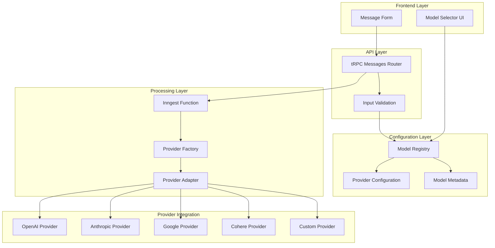
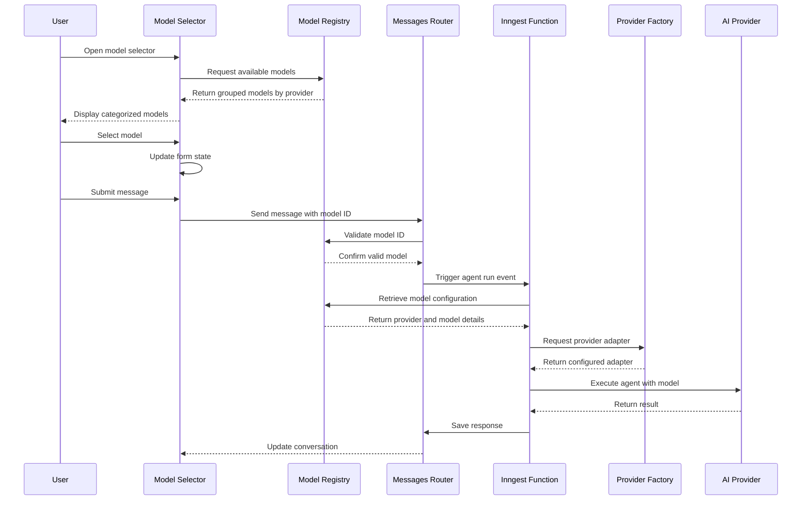
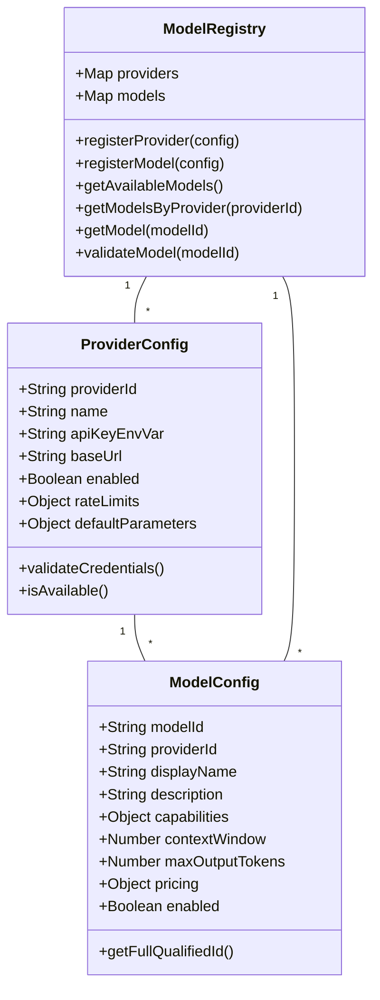
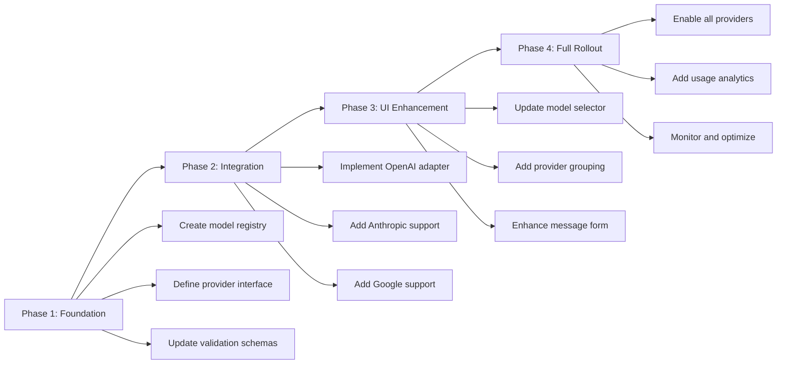

# Multi-Model Support Design

## Overview

This design document outlines the architecture and implementation strategy for extending the QAI platform to support multiple AI model providers beyond OpenAI, allowing users to select from models offered by different companies such as Anthropic, Google, Cohere, and others.

## Background

Currently, the QAI platform is tightly coupled to OpenAI's models. The system hardcodes model identifiers, uses OpenAI-specific API endpoints, and assumes a single provider architecture. Users can only select between different OpenAI model variants such as GPT-4.1, GPT-4.1 Mini, and GPT-4o Mini.

The existing model selection flow:

- User selects a model from the message form dropdown
- Model identifier is sent with the message to the backend
- Inngest function validates the model against a hardcoded OpenAI model list
- Agent is created with the selected OpenAI model
- Conversation proceeds using OpenAI's API

## Objectives

1. Enable users to choose AI models from multiple providers including OpenAI, Anthropic, Google, Cohere, and others
2. Maintain backward compatibility with existing projects and conversations
3. Provide a seamless user experience with clear model capabilities and pricing information
4. Support provider-specific features and capabilities while maintaining a consistent interface
5. Ensure flexible configuration for adding new providers without major architectural changes

## Design Principles

- **Provider Abstraction**: Decouple model selection from provider-specific implementation details
- **Extensibility**: Design the system to easily accommodate new providers and models
- **Consistency**: Maintain a unified interface for all models regardless of provider
- **Transparency**: Clearly communicate model capabilities, limitations, and costs to users
- **Graceful Degradation**: Handle provider unavailability without breaking the system

## Proposed Architecture

### High-Level Architecture

### Data Flow

## Component Design

### Model Registry

The Model Registry serves as the central source of truth for all available models and their configurations.

#### Structure

| Field           | Type    | Description                                                   |
| --------------- | ------- | ------------------------------------------------------------- |
| modelId         | String  | Unique identifier for the model across all providers          |
| provider        | String  | Provider identifier (openai, anthropic, google, cohere, etc.) |
| label           | String  | Human-readable display name                                   |
| description     | String  | Brief description of model capabilities                       |
| capabilities    | Object  | Supported features (tools, vision, function calling, etc.)    |
| contextWindow   | Number  | Maximum context window size in tokens                         |
| maxOutputTokens | Number  | Maximum output tokens supported                               |
| pricing         | Object  | Cost information per token for input and output               |
| deprecated      | Boolean | Whether the model is deprecated                               |
| enabled         | Boolean | Whether the model is currently available for use              |
| metadata        | Object  | Provider-specific additional information                      |

#### Model Categorization

Models will be organized by provider and tier to improve user experience:

| Category             | Purpose                                                              |
| -------------------- | -------------------------------------------------------------------- |
| Provider Grouping    | Group models by company (OpenAI, Anthropic, Google, etc.)            |
| Tier Classification  | Classify models as Flagship, Standard, or Economy                    |
| Capability Filtering | Filter by features like vision, function calling, or code generation |

### Provider Adapter Interface

Each provider requires an adapter that translates the platform's generic agent interface to provider-specific API calls.

#### Adapter Responsibilities

| Responsibility         | Description                                              |
| ---------------------- | -------------------------------------------------------- |
| Authentication         | Handle API key management and authentication             |
| Request Transformation | Convert platform requests to provider-specific format    |
| Response Normalization | Standardize provider responses to platform format        |
| Error Handling         | Translate provider errors to consistent error types      |
| Streaming Support      | Handle streaming responses if supported                  |
| Tool Integration       | Adapt tool calling mechanisms to provider specifications |

#### Standard Interface

All provider adapters must implement a common interface:

| Method          | Purpose                                      | Input                          | Output              |
| --------------- | -------------------------------------------- | ------------------------------ | ------------------- |
| createAgent     | Instantiate an agent with the selected model | model ID, system prompt, tools | Agent instance      |
| validateModel   | Verify model availability                    | model ID                       | Boolean             |
| getCapabilities | Retrieve model capabilities                  | model ID                       | Capabilities object |
| estimateCost    | Calculate approximate cost                   | tokens, model ID               | Cost estimate       |

### Configuration Management

Provider credentials and settings are managed through environment variables and a centralized configuration system.

#### Environment Variables

| Variable                   | Description                              | Required               |
| -------------------------- | ---------------------------------------- | ---------------------- |
| OPENAI_API_KEY             | OpenAI API key                           | Yes (default provider) |
| ANTHROPIC_API_KEY          | Anthropic API key                        | Optional               |
| GOOGLE_AI_API_KEY          | Google AI API key                        | Optional               |
| COHERE_API_KEY             | Cohere API key                           | Optional               |
| MODEL_PROVIDER_FALLBACK    | Default provider if selected unavailable | Optional               |
| ENABLE_EXPERIMENTAL_MODELS | Enable beta/experimental models          | Optional               |

#### Provider Configuration Schema

### User Interface Updates

The model selection interface requires updates to accommodate multiple providers.

#### Model Selector Component

The current model selector displays a flat list of OpenAI models. The enhanced version will organize models hierarchically.

**Visual Structure:**

| Element           | Description                                                     |
| ----------------- | --------------------------------------------------------------- |
| Provider Header   | Collapsible section for each provider with logo and name        |
| Model Card        | Individual model with name, description, and key metrics        |
| Capability Badges | Visual indicators for features (vision, code, function calling) |
| Pricing Indicator | Cost tier indicator (Economy, Standard, Premium)                |
| Recommended Badge | Highlight default or recommended models                         |

**Interaction Patterns:**

| Action             | Behavior                                            |
| ------------------ | --------------------------------------------------- |
| Provider Selection | Expand/collapse provider section                    |
| Model Hover        | Show detailed tooltip with capabilities and pricing |
| Model Click        | Select model and update form state                  |
| Search/Filter      | Filter models by name, capability, or price         |

#### Enhanced Message Form

The message form will include additional context about the selected model.

**New Elements:**

| Element             | Purpose                                                    |
| ------------------- | ---------------------------------------------------------- |
| Provider Badge      | Display selected provider logo next to model name          |
| Model Info Tooltip  | Quick access to model details on hover                     |
| Cost Estimate       | Real-time estimation of message cost based on input length |
| Capability Warnings | Notify user if selected model lacks required features      |

### Database Schema Updates

The database schema requires minimal changes to support multi-provider functionality.

#### Message Model Enhancement

No changes required. The existing message schema already stores all necessary information.

#### Project Model Enhancement

Add optional fields to track model preferences per project:

| Field             | Type   | Description                                |
| ----------------- | ------ | ------------------------------------------ |
| preferredModel    | String | User's preferred model for this project    |
| preferredProvider | String | User's preferred provider for this project |

#### New Model: ModelUsageTracking

Track usage statistics for analytics and cost management:

| Field         | Type     | Description                       |
| ------------- | -------- | --------------------------------- |
| id            | UUID     | Primary key                       |
| companyId     | UUID     | Foreign key to Company            |
| projectId     | UUID     | Foreign key to Project (nullable) |
| modelId       | String   | Model identifier                  |
| provider      | String   | Provider identifier               |
| inputTokens   | Number   | Tokens in input                   |
| outputTokens  | Number   | Tokens in output                  |
| estimatedCost | Number   | Calculated cost                   |
| timestamp     | DateTime | When usage occurred               |

### Validation and Error Handling

Robust validation ensures system reliability when dealing with multiple providers.

#### Validation Rules

| Stage            | Validation                     | Error Response             |
| ---------------- | ------------------------------ | -------------------------- |
| Frontend         | Model ID exists in registry    | Show error toast           |
| API Layer        | Model ID is valid enum value   | Return validation error    |
| Inngest Function | Model is enabled and available | Fall back to default model |
| Provider Adapter | API credentials are configured | Log error and notify user  |

#### Error Scenarios

| Scenario            | Detection                           | Recovery Strategy                                                  |
| ------------------- | ----------------------------------- | ------------------------------------------------------------------ |
| Provider API Down   | HTTP error or timeout               | Retry with exponential backoff, then fall back to default provider |
| Invalid API Key     | Authentication failure              | Disable provider and notify administrators                         |
| Model Deprecated    | Model marked deprecated in registry | Suggest alternative model to user                                  |
| Rate Limit Exceeded | 429 response from provider          | Queue request and retry after backoff period                       |
| Unsupported Feature | Model lacks required capability     | Gracefully degrade or show warning to user                         |

### Migration Strategy

Existing projects and conversations must continue functioning without disruption.

#### Backward Compatibility

| Aspect                    | Strategy                                              |
| ------------------------- | ----------------------------------------------------- |
| Existing Model References | Map old model IDs to new unified identifiers          |
| Message History           | Preserve original model used for each message         |
| Default Model             | Maintain current default (gpt-4.1) as fallback        |
| API Contracts             | Version API to support both old and new model formats |

#### Migration Phases

## Implementation Considerations

### Performance Implications

| Area                  | Impact                                          | Mitigation                                |
| --------------------- | ----------------------------------------------- | ----------------------------------------- |
| Model Registry Lookup | Minimal overhead for model validation           | Cache registry in memory                  |
| Provider Selection    | Additional logic for routing requests           | Pre-compute provider mappings             |
| UI Rendering          | Larger model list affects render time           | Implement virtualization and lazy loading |
| Network Latency       | Different providers have varying response times | Set appropriate timeouts per provider     |

### Security Considerations

| Risk              | Mitigation                                                  |
| ----------------- | ----------------------------------------------------------- |
| API Key Exposure  | Store keys in environment variables, never in client code   |
| Request Tampering | Validate model IDs server-side, never trust client input    |
| Cost Abuse        | Implement rate limiting and budget caps per company         |
| Data Leakage      | Ensure each provider's data handling complies with policies |

### Cost Management

| Strategy              | Implementation                                           |
| --------------------- | -------------------------------------------------------- |
| Budget Tracking       | Track usage per model and provider                       |
| Cost Estimation       | Show estimated cost before message submission            |
| Provider Optimization | Recommend cost-effective models for similar capabilities |
| Usage Alerts          | Notify when approaching budget thresholds                |

### Monitoring and Observability

| Metric                   | Purpose                                      |
| ------------------------ | -------------------------------------------- |
| Provider Availability    | Track uptime and response times per provider |
| Model Usage Distribution | Understand which models are most popular     |
| Error Rates              | Identify problematic providers or models     |
| Cost Trends              | Monitor spending across providers            |
| Token Usage              | Track input/output token consumption         |

## Testing Strategy

### Unit Testing

| Component          | Test Coverage                                     |
| ------------------ | ------------------------------------------------- |
| Model Registry     | Model lookup, validation, and filtering logic     |
| Provider Adapters  | Request transformation and response normalization |
| Validation Schemas | Ensure proper input validation                    |
| Cost Calculation   | Verify accurate cost estimation                   |

### Integration Testing

| Scenario           | Validation                                            |
| ------------------ | ----------------------------------------------------- |
| Provider Selection | End-to-end flow from UI to API execution              |
| Fallback Behavior  | Verify graceful degradation when provider unavailable |
| Model Switching    | Test switching models mid-conversation                |
| Error Handling     | Confirm appropriate error messages and recovery       |

### User Acceptance Testing

| Test Case               | Expected Outcome                          |
| ----------------------- | ----------------------------------------- |
| Select Anthropic Model  | Message processed using Anthropic API     |
| Invalid Model Selection | User sees clear error message             |
| Provider Downtime       | System falls back to alternative provider |
| Cost Display            | User sees accurate cost estimate          |

## Future Enhancements

### Potential Extensions

| Enhancement                  | Description                                       | Priority |
| ---------------------------- | ------------------------------------------------- | -------- |
| Custom Model Endpoints       | Allow users to configure custom model endpoints   | Medium   |
| Model Fine-tuning            | Support provider-specific fine-tuned models       | Low      |
| Multi-Model Conversations    | Use different models for different turns          | Low      |
| Model Performance Comparison | A/B testing framework for model quality           | Medium   |
| Smart Model Selection        | AI-powered recommendation of best model for task  | Medium   |
| Provider Failover            | Automatic switching to backup provider on failure | High     |

### Scalability Considerations

As the platform grows, consider:

- **Model Registry as Service**: Extract registry to separate microservice for better scalability
- **Provider SDK Abstraction**: Use provider SDKs through unified interface layer
- **Caching Strategy**: Implement Redis caching for model metadata and provider status
- **Load Balancing**: Distribute requests across multiple provider accounts for higher throughput

## Success Criteria

| Criterion          | Measurement                                                           |
| ------------------ | --------------------------------------------------------------------- |
| Feature Adoption   | At least 30% of users try non-OpenAI models within first month        |
| System Reliability | No increase in error rates after multi-model rollout                  |
| Performance        | Model selection adds less than 100ms to request processing            |
| User Satisfaction  | Positive feedback on model variety and selection interface            |
| Cost Efficiency    | Average cost per message decreases by 15% due to provider competition |

## Risks and Mitigation

| Risk                     | Impact | Likelihood | Mitigation                                               |
| ------------------------ | ------ | ---------- | -------------------------------------------------------- |
| Provider API Changes     | High   | Medium     | Implement versioned adapters with backward compatibility |
| Cost Overruns            | High   | Low        | Enforce strict budget limits and monitoring              |
| Performance Degradation  | Medium | Low        | Comprehensive load testing before rollout                |
| User Confusion           | Medium | Medium     | Clear documentation and intuitive UI design              |
| Security Vulnerabilities | High   | Low        | Regular security audits and key rotation                 |

## Conclusion

This design provides a comprehensive framework for extending the QAI platform to support multiple AI model providers while maintaining system integrity, performance, and user experience. The modular architecture allows for incremental implementation and easy addition of new providers as they become available. By abstracting provider-specific details behind a common interface, the system remains flexible and maintainable as the AI landscape continues to evolve.

- **Load Balancing**: Distribute requests across multiple provider accounts for higher throughput

## Success Criteria

| Criterion          | Measurement                                                           |
| ------------------ | --------------------------------------------------------------------- |
| Feature Adoption   | At least 30% of users try non-OpenAI models within first month        |
| System Reliability | No increase in error rates after multi-model rollout                  |
| Performance        | Model selection adds less than 100ms to request processing            |
| User Satisfaction  | Positive feedback on model variety and selection interface            |
| Cost Efficiency    | Average cost per message decreases by 15% due to provider competition |

## Risks and Mitigation

| Risk                     | Impact | Likelihood | Mitigation                                               |
| ------------------------ | ------ | ---------- | -------------------------------------------------------- |
| Provider API Changes     | High   | Medium     | Implement versioned adapters with backward compatibility |
| Cost Overruns            | High   | Low        | Enforce strict budget limits and monitoring              |
| Performance Degradation  | Medium | Low        | Comprehensive load testing before rollout                |
| User Confusion           | Medium | Medium     | Clear documentation and intuitive UI design              |
| Security Vulnerabilities | High   | Low        | Regular security audits and key rotation                 |

## Conclusion

This design provides a comprehensive framework for extending the QAI platform to support multiple AI model providers while maintaining system integrity, performance, and user experience. The modular architecture allows for incremental implementation and easy addition of new providers as they become available. By abstracting provider-specific details behind a common interface, the system remains flexible and maintainable as the AI landscape continues to evolve.
