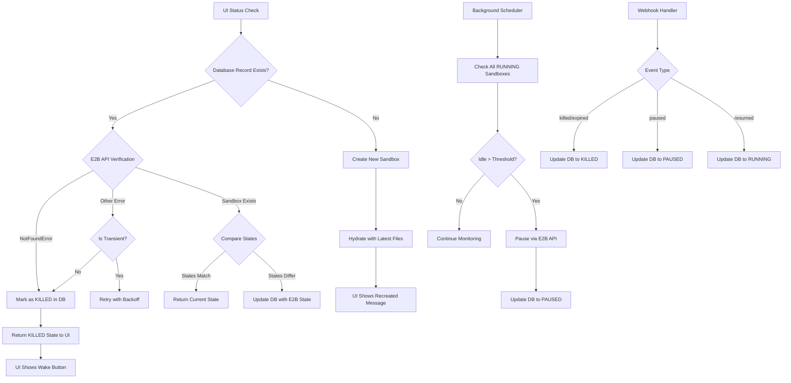
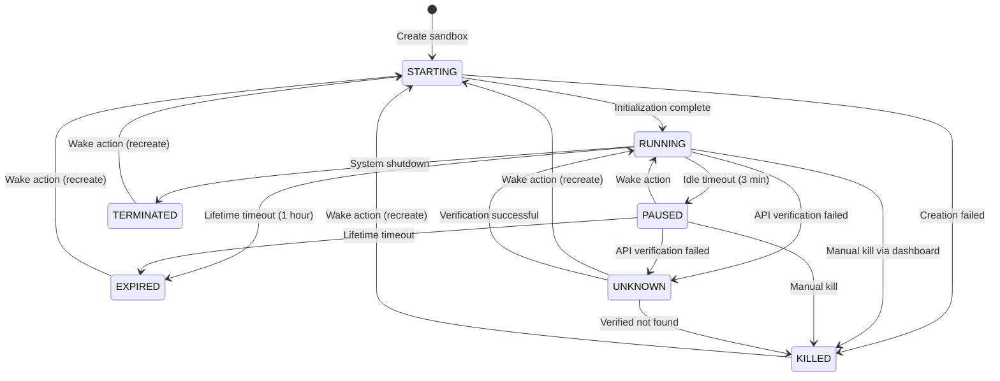

# Sandbox State Management Issue - Design Document

## Problem Statement

The system is displaying misleading UI states when a sandbox is killed or expires. Specifically:

- When a sandbox lifecycle ends (through E2B dashboard manual kill, timeout expiration, or lifecycle termination), the UI shows "Live preview ready" even though the sandbox no longer exists
- Users see no actionable button to recreate the sandbox with their project files
- The database may contain stale sandbox records that no longer correspond to actual E2B sandbox instances
- Without webhook functionality during local development, the system relies solely on polling and lacks real-time state updates when sandboxes are externally killed

### Root Causes Identified

1. **Incomplete State Coverage**: The database schema only supports three states (STARTING, RUNNING, PAUSED) but E2B sandboxes can be in additional states including killed, expired, and terminated
2. **Stale Database Records**: When a sandbox is killed externally (via E2B dashboard), the database record persists with outdated status
3. **Webhook Dependency During Development**: Webhooks cannot receive events on localhost without a public URL, creating a gap in state synchronization during local development
4. **Optimistic Status Logic**: The UI assumes if a sandbox record exists with RUNNING status, the preview is ready, without verifying the sandbox actually exists
5. **Missing Error State Handling**: The status checking logic catches NotFoundError and auto-recreates, but doesn't provide visible feedback to users about what happened

## Current State Analysis

### Existing Sandbox States in Database

The `SandboxStatus` enum currently supports:

- STARTING: Sandbox is being initialized
- RUNNING: Sandbox is actively running
- PAUSED: Sandbox was auto-paused after idle timeout

### E2B Lifecycle States Not Captured

E2B platform supports additional lifecycle states:

- **Killed**: Sandbox forcibly terminated (manual kill via dashboard, API call, or system intervention)
- **Expired**: Sandbox reached its maximum lifetime timeout and was automatically shut down
- **Terminated**: Sandbox intentionally stopped by user or system

### State Update Mechanisms

Database state is updated through three pathways:

1. **Service Layer Operations** (service.ts):

   - ensureConnectedSandbox: Sets STARTING on creation, RUNNING on successful connection
   - recordSandboxActivity: Updates to RUNNING during active operations
   - getProjectSandboxStatus: Checks E2B API, auto-recreates if NotFoundError occurs

2. **Webhook Events** (route.ts):

   - sandbox.lifecycle.created → STARTING
   - sandbox.lifecycle.paused → PAUSED
   - sandbox.lifecycle.resumed → RUNNING
   - sandbox.lifecycle.killed → Deletes database record
   - sandbox.lifecycle.updated → No state change

3. **Background Scheduler** (functions.ts):
   - sandboxIdleEnforcerFunction: Transitions RUNNING → PAUSED after idle timeout
   - Runs every 20 minutes

### Current State Gaps

| Scenario                                  | E2B Reality      | Database State  | UI Display           | Expected Behavior                       |
| ----------------------------------------- | ---------------- | --------------- | -------------------- | --------------------------------------- |
| Sandbox manually killed via dashboard     | No longer exists | RUNNING (stale) | "Live preview ready" | Show "Sandbox killed" + Wake button     |
| Sandbox expired (lifetime timeout)        | No longer exists | RUNNING (stale) | "Live preview ready" | Show "Sandbox expired" + Wake button    |
| Sandbox terminated by system              | No longer exists | RUNNING (stale) | "Live preview ready" | Show "Sandbox terminated" + Wake button |
| Sandbox paused via webhook                | Paused           | PAUSED          | "Sandbox asleep"     | Correct                                 |
| No webhook during local dev + manual kill | No longer exists | RUNNING (stale) | "Live preview ready" | Show actionable state                   |

## Strategic Design

### Objective

Ensure the UI accurately reflects the true state of E2B sandboxes at all times, providing users with correct information and actionable options, regardless of whether webhooks are available or how the sandbox lifecycle ended.

### Design Principles

1. **Truth Through Verification**: Database status should be treated as a cache; E2B API is the source of truth
2. **Graceful Degradation**: System must function correctly both with and without webhooks
3. **User Transparency**: Always inform users about actual sandbox state and what actions are available
4. **Automatic Recovery**: When a sandbox is missing, auto-recreate with file hydration but inform the user
5. **State Completeness**: Track all E2B lifecycle states to provide accurate status information

### Solution Architecture

## Detailed Solution Design

### 1. Database Schema Enhancement

Expand the SandboxStatus enum to capture all E2B lifecycle states:

| Status     | Description                              | Transition From  | User Action Available |
| ---------- | ---------------------------------------- | ---------------- | --------------------- |
| STARTING   | Sandbox is initializing                  | New creation     | Wait                  |
| RUNNING    | Sandbox is actively running              | STARTING, PAUSED | Preview, Refresh      |
| PAUSED     | Auto-paused after idle timeout           | RUNNING          | Wake                  |
| KILLED     | Manually terminated via dashboard or API | RUNNING, PAUSED  | Wake/Recreate         |
| EXPIRED    | Reached maximum lifetime timeout         | RUNNING          | Wake/Recreate         |
| TERMINATED | System or user intentional shutdown      | RUNNING, PAUSED  | Wake/Recreate         |
| UNKNOWN    | Cannot verify state (API errors)         | Any              | Retry, Wake           |

### 2. Enhanced Status Verification Flow

Modify `getProjectSandboxStatus` to implement verification-first approach:

**Current Behavior**:

- Query database for sandbox record
- If exists, call E2B getFullInfo
- If NotFoundError, auto-recreate immediately
- Return database status as-is

**Proposed Behavior**:

- Query database for sandbox record
- If exists, call E2B getFullInfo with error classification
- If NotFoundError: Update database to KILLED, return KILLED state to UI
- If timeout/network error: Return UNKNOWN state to UI with retry option
- If success: Compare E2B state with database state
  - If E2B shows paused but DB shows RUNNING: Update DB to PAUSED
  - If E2B shows running but DB shows PAUSED: Update DB to RUNNING
  - If E2B shows killed/expired: Update DB accordingly
- Return verified state to UI

**Auto-Recreation Policy**:

- Auto-recreate only when explicitly triggered by user action (wake button)
- Never auto-recreate silently during status checks
- Always inform user when recreation occurs (recreated flag)

### 3. UI State Rendering Logic

Update fragment-web.tsx status labels and actions:

| Database Status | Status Label         | Status Caption                                                       | Available Actions       | Badge Style    |
| --------------- | -------------------- | -------------------------------------------------------------------- | ----------------------- | -------------- |
| RUNNING         | "Live preview ready" | "Sandboxes stay active for 1 hour with smart auto-pause."            | Refresh, Copy URL, Open | Green          |
| STARTING        | "Preparing sandbox…" | "Setting up your development environment…"                           | Refresh                 | Blue (pulsing) |
| PAUSED          | "Sandbox asleep"     | "Auto-paused after 3 minutes of inactivity. Wake it to continue."    | Wake, Refresh           | Amber          |
| KILLED          | "Sandbox not found"  | "Sandbox was terminated. Wake to create a new one with your files."  | Wake, Refresh           | Red            |
| EXPIRED         | "Sandbox expired"    | "Reached 1-hour lifetime limit. Wake to create a fresh sandbox."     | Wake, Refresh           | Orange         |
| TERMINATED      | "Sandbox stopped"    | "Sandbox was shut down. Wake to restart with your project files."    | Wake, Refresh           | Gray           |
| UNKNOWN         | "Connection issue"   | "Cannot verify sandbox status. Check your connection and try again." | Retry, Wake             | Yellow         |

**Wake Button Visibility**:

- Show when status is: PAUSED, KILLED, EXPIRED, TERMINATED, UNKNOWN
- Hide when status is: RUNNING, STARTING

**Preview Iframe Behavior**:

- Render iframe only when status is RUNNING and sandboxUrl exists
- Show state-specific overlay for all other states:
  - Custom branded error message matching the status
  - Icon representing the state (sleep icon, error icon, etc.)
  - Action button (Wake/Retry)
  - Modern glass-effect styling consistent with app design

### 4. Webhook Event Handling Enhancement

Update E2B webhook handler to map all lifecycle events to database states:

| E2B Event                 | Current Handling   | Proposed Handling                     |
| ------------------------- | ------------------ | ------------------------------------- |
| sandbox.lifecycle.created | Update to STARTING | Update to STARTING                    |
| sandbox.lifecycle.paused  | Update to PAUSED   | Update to PAUSED                      |
| sandbox.lifecycle.resumed | Update to RUNNING  | Update to RUNNING                     |
| sandbox.lifecycle.killed  | Delete record      | Update to KILLED (preserve record)    |
| sandbox.lifecycle.updated | No action          | Check for state changes in event_data |

**Rationale for Preserving KILLED Records**:

- Maintain audit trail of sandbox lifecycle
- Enable UI to show appropriate messaging
- Allow background cleanup job to purge old records
- Prevent immediate auto-recreation without user intent

### 5. Background Scheduler Enhancement

Expand sandboxIdleEnforcerFunction responsibilities:

**Current Responsibilities**:

- Check RUNNING sandboxes for idle timeout
- Pause via E2B API
- Update database to PAUSED

**Proposed Responsibilities**:

- Check RUNNING and PAUSED sandboxes for existence via E2B API
- Identify orphaned database records (sandbox no longer exists in E2B)
- Update orphaned records to KILLED state
- Continue existing idle timeout enforcement
- Generate metrics about state corrections performed

**Execution Flow**:

1. Query all sandboxes with status RUNNING or PAUSED
2. For each sandbox:
   - Check idle timeout → pause if needed
   - Verify existence via E2B API
   - If NotFoundError: Update to KILLED
   - If exists but state differs: Synchronize state
3. Log reconciliation results for observability

### 6. Error Handling Strategy

Classify errors from E2B API calls:

| Error Type      | Classification | Handling Strategy                           |
| --------------- | -------------- | ------------------------------------------- |
| NotFoundError   | Definitive     | Update DB to KILLED immediately             |
| Timeout/Network | Transient      | Retry with exponential backoff (3 attempts) |
| Authentication  | Configuration  | Log error, return UNKNOWN to UI             |
| Rate Limit      | Transient      | Back off and retry                          |
| Unknown         | Ambiguous      | Log for investigation, return UNKNOWN to UI |

**Retry Configuration**:

- Max attempts: 3
- Backoff: 1s, 2s, 4s
- Circuit breaker: After 5 consecutive failures, return UNKNOWN for 30 seconds

### 7. UI Feedback Mechanism

Implement state-specific iframe overlays for non-running states:

**Overlay Component Structure**:

- Container: Full-size overlay covering iframe area
- Background: Subtle gradient matching status severity
- Icon: State-specific visual indicator
- Title: Clear status message
- Description: Explanation and next steps
- Action Button: Primary action for user (Wake/Retry)
- Branding: Consistent with app design language

**Design Specifications**:

- Glass-morphism effect for modern aesthetic
- Responsive layout for mobile and desktop
- Smooth transitions when state changes
- Accessibility: Proper ARIA labels and keyboard navigation

## State Transition Diagram

## Data Model Changes

### ProjectSandbox Model Enhancement

Add new fields to support enhanced state management:

| Field Name           | Type          | Description                                          | Default  |
| -------------------- | ------------- | ---------------------------------------------------- | -------- |
| status               | SandboxStatus | Current lifecycle state                              | STARTING |
| lastVerifiedAt       | DateTime      | Last successful E2B API verification                 | null     |
| verificationFailures | Int           | Consecutive verification failures                    | 0        |
| killedAt             | DateTime      | Timestamp when marked as KILLED                      | null     |
| killedReason         | String        | Why sandbox was killed (manual, expired, terminated) | null     |

**Migration Considerations**:

- Add new enum values to SandboxStatus
- Add new optional fields with defaults
- No breaking changes to existing records
- Backfill lastVerifiedAt with updatedAt for existing records

## Implementation Phases

### Phase 1: Database Schema and Core Logic

- Add new SandboxStatus enum values
- Add new fields to ProjectSandbox model
- Create database migration
- Update service.ts getProjectSandboxStatus with verification logic

### Phase 2: Webhook and Scheduler Updates

- Enhance webhook handler to map all E2B events
- Prevent deletion of killed sandboxes
- Extend background scheduler with state reconciliation
- Add logging and metrics

### Phase 3: UI State Handling

- Update statusLabel and statusCaption logic
- Implement state-specific button visibility
- Add retry mechanism for UNKNOWN state
- Update styling for new states

### Phase 4: Overlay Components

- Design and implement state-specific overlays
- Replace iframe with overlay for non-running states
- Add smooth transitions and animations
- Ensure accessibility compliance

### Phase 5: Testing and Validation

- Test all state transitions manually
- Verify webhook event handling
- Validate background scheduler reconciliation
- Test local development without webhooks
- Verify auto-recreation flow

## Testing Strategy

### Test Scenarios

| Scenario                   | Setup                             | Expected Outcome                                                                   |
| -------------------------- | --------------------------------- | ---------------------------------------------------------------------------------- |
| Normal operation           | Sandbox running, webhooks working | UI shows "Live preview ready", iframe loads                                        |
| Manual kill via dashboard  | Kill sandbox in E2B dashboard     | Next status check updates DB to KILLED, UI shows "Sandbox not found" + Wake button |
| Lifetime expiration        | Wait for 1-hour timeout           | Webhook or scheduler marks EXPIRED, UI updates accordingly                         |
| Local dev without webhooks | Disable webhook, kill sandbox     | Polling detects missing sandbox, updates to KILLED, UI updates                     |
| Idle timeout               | No activity for 3 minutes         | Scheduler pauses sandbox, UI shows "Sandbox asleep"                                |
| Wake from PAUSED           | Click Wake button                 | Sandbox resumes, UI shows "Live preview ready"                                     |
| Wake from KILLED           | Click Wake button                 | New sandbox created, files hydrated, UI shows "Recreated" badge                    |
| Network error during check | Simulate network failure          | UI shows "Connection issue" with Retry button                                      |
| Auto-recreation disabled   | Status check on missing sandbox   | DB updated to KILLED, no auto-recreation, Wake button shown                        |

### Validation Criteria

- All E2B lifecycle states are accurately reflected in UI
- No misleading "Live preview ready" when sandbox doesn't exist
- Wake button always available when sandbox needs recreation
- State updates occur within 30 seconds of lifecycle change (with webhooks)
- State updates occur within 20 minutes without webhooks (scheduler interval)
- No data loss when sandbox is recreated
- Error states provide clear user guidance

## Observability and Monitoring

### Logging Strategy

Add structured logging for state transitions:

- Log every state change with timestamp, old state, new state, reason
- Log verification failures with error details
- Log auto-recreation events with user visibility flag
- Log webhook events with delivery metadata

### Metrics to Track

- State distribution: Count of sandboxes in each state
- State transition frequency: How often sandboxes move between states
- Verification failure rate: Percentage of API calls that fail
- Auto-recreation events: Count and reasons
- Webhook delivery latency: Time from E2B event to database update
- Scheduler reconciliation: Number of state corrections per run

## Risk Assessment

| Risk                               | Impact | Mitigation                                                    |
| ---------------------------------- | ------ | ------------------------------------------------------------- |
| Webhook unavailable in local dev   | Medium | Background scheduler provides fallback reconciliation         |
| E2B API rate limiting              | Low    | Implement exponential backoff and circuit breaker             |
| Database migration failure         | High   | Test migration on staging, implement rollback plan            |
| UI state flicker during updates    | Low    | Use fragmentKey refresh only when state actually changes      |
| Incorrect state classification     | Medium | Comprehensive testing of all E2B error types                  |
| Performance impact of verification | Low    | Verification only happens during user-initiated status checks |

## Success Criteria

1. Zero instances of "Live preview ready" shown when sandbox doesn't exist
2. Users always have actionable UI (Wake button) when sandbox needs recreation
3. State updates reflect E2B reality within defined SLAs (30s with webhooks, 20min without)
4. System functions correctly both with and without webhooks
5. All E2B lifecycle states are captured and displayed appropriately
6. User trust increased through accurate, transparent state information
