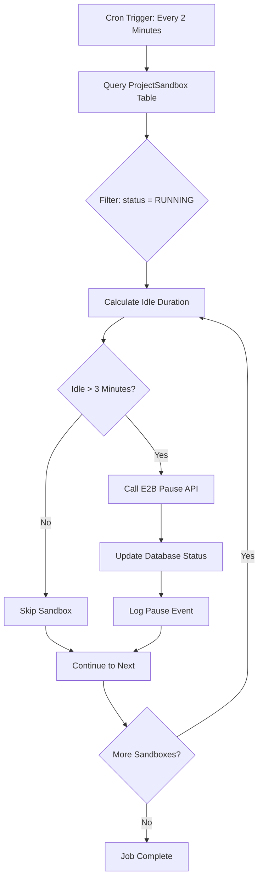
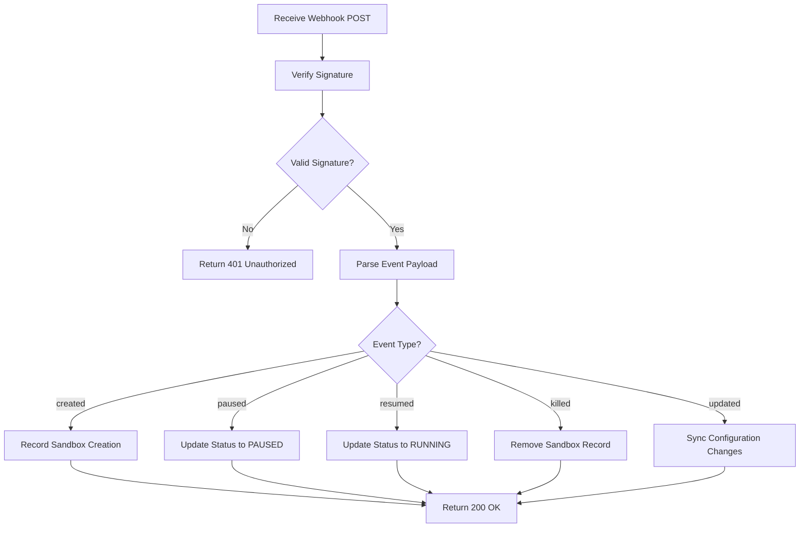
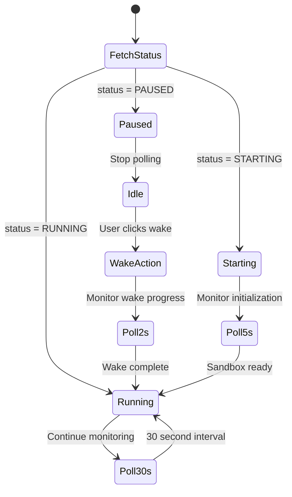
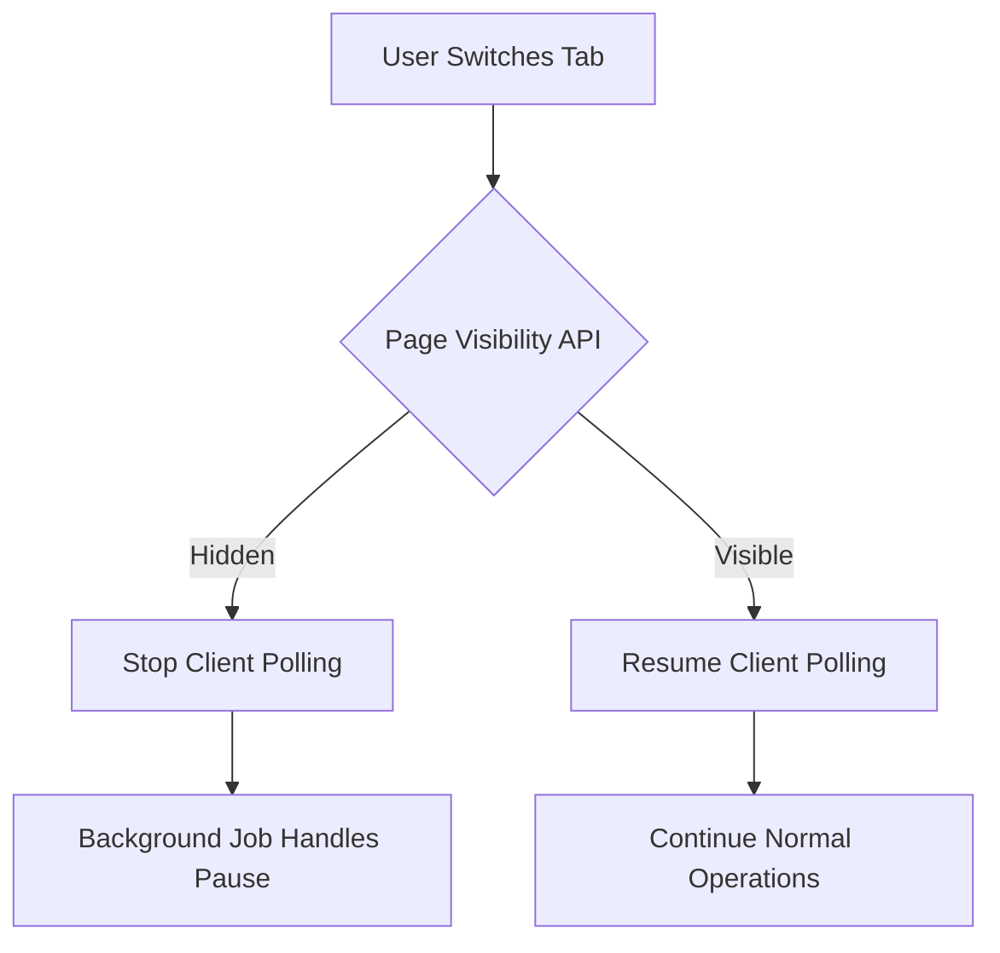

# E2B Sandbox Management System Redesign

## Overview

This design addresses critical inefficiencies in the current E2B sandbox management system by eliminating aggressive polling, implementing event-driven status updates, and ensuring proper sandbox lifecycle management regardless of user navigation state.

## Current Implementation Analysis

### Architecture

The current system operates with the following components:

- Frontend component that polls sandbox status every 5 seconds via tRPC query
- Backend tRPC procedure that fetches E2B sandbox state on each request
- Server-side logic that checks idle time and pauses sandboxes when idle threshold exceeds 3 minutes
- Polling mechanism strictly tied to project page visibility

### Critical Issues

**Issue 1: Aggressive Polling Pattern**

- Client executes API request every 5 seconds per active user session
- Creates unnecessary server load and E2B API consumption
- Displays "Checking sandbox..." message repeatedly, degrading user experience
- Wastes network bandwidth with redundant status checks

**Issue 2: Page-Dependent Lifecycle Management**

- Sandbox management only functions while user remains on project page
- Navigation away from project page stops all idle monitoring
- Sandboxes remain active indefinitely when user leaves page, wasting resources
- No background process to enforce 3-minute idle timeout globally

**Issue 3: Tight Coupling**

- Sandbox status checking and idle timeout enforcement occur in same request handler
- Mixes status reporting with lifecycle management concerns
- Difficult to scale or modify independently

## E2B Platform Capabilities Research

### Webhook Support

E2B provides webhook infrastructure for real-time lifecycle event notifications:

**Available Events:**

- `sandbox.lifecycle.created` - Sandbox initialization complete
- `sandbox.lifecycle.paused` - Sandbox enters paused state
- `sandbox.lifecycle.resumed` - Sandbox returns to active state
- `sandbox.lifecycle.updated` - Configuration changes applied
- `sandbox.lifecycle.killed` - Sandbox terminated

**Webhook Delivery:**

- POST requests to registered endpoint with JSON payload
- Includes signature verification via `e2b-signature` header
- Delivery tracking with unique `e2b-delivery-id` per attempt
- Team-scoped registration using API key authentication

**Limitations:**

- E2B webhooks notify of state changes but do not proactively manage idle timeouts
- Application must still implement custom idle detection and pause logic
- Webhooks complement but do not replace application-controlled lifecycle management

### Lifecycle Events API

E2B offers REST endpoints for polling recent events when webhooks are not suitable:

**Capabilities:**

- Query events for specific sandbox or all team sandboxes
- Pagination with offset, limit, and ordering controls
- Event history with timestamps and metadata

**Trade-offs:**

- Still requires polling but at lower frequency than current implementation
- More efficient than individual sandbox status checks
- Suitable for batch processing or monitoring dashboards

## Proposed Architecture

### Design Principles

1. **Event-Driven State Management**: React to changes rather than constantly checking
2. **Separation of Concerns**: Decouple status reporting from lifecycle enforcement
3. **Background Resilience**: Lifecycle management must function independent of user presence
4. **Graceful Degradation**: System should handle webhook delivery failures elegantly

### Component Overview

The redesigned system comprises four primary components working in concert:

| Component             | Responsibility                                    | Trigger Mechanism                                     |
| --------------------- | ------------------------------------------------- | ----------------------------------------------------- |
| Background Scheduler  | Enforces idle timeout policy across all sandboxes | Scheduled interval (every 2 minutes)                  |
| Webhook Receiver      | Processes E2B lifecycle events in real-time       | HTTP POST from E2B platform                           |
| Status Query Endpoint | Provides current sandbox state to clients         | Client request when needed                            |
| Client Status Manager | Updates UI based on server state changes          | Polling at extended intervals or event-driven updates |

### Background Scheduler Design

**Purpose**: Ensures all sandboxes comply with idle timeout policy regardless of user activity

**Implementation Approach**:

- Leverage existing Inngest infrastructure for scheduled background jobs
- Execute periodic sweep of all active sandboxes
- Check `lastActiveAt` timestamp against `SANDBOX_IDLE_TIMEOUT_MS` threshold
- Issue pause commands to E2B for sandboxes exceeding idle limit

**Inngest Function Specification**:

| Property        | Value                                                                                   |
| --------------- | --------------------------------------------------------------------------------------- |
| Function ID     | `sandbox-idle-enforcer`                                                                 |
| Trigger         | Cron expression: `*/2 * * * *` (every 2 minutes)                                        |
| Execution Logic | Query database for active sandboxes, evaluate idle duration, pause qualifying sandboxes |

**Process Flow**:

**Data Model Interaction**:

- Read `ProjectSandbox.lastActiveAt` to determine idle duration
- Update `ProjectSandbox.status` to `PAUSED` upon successful pause
- Maintain audit trail of automatic pause actions

**Error Handling**:

- Gracefully handle E2B API failures without blocking other sandboxes
- Log errors for monitoring and alerting
- Retry logic with exponential backoff for transient failures

### Webhook Receiver Design

**Purpose**: Process real-time lifecycle events from E2B platform to maintain accurate sandbox state

**API Endpoint Specification**:

| Property       | Value                      |
| -------------- | -------------------------- |
| Route          | `/api/webhooks/e2b`        |
| Method         | POST                       |
| Authentication | E2B signature verification |
| Content Type   | application/json           |

**Request Validation**:

The receiver must verify webhook authenticity before processing:

1. Extract `e2b-signature` header from request
2. Compute expected signature using registered secret and raw request body
3. Compare computed signature with received signature using constant-time comparison
4. Reject requests with invalid signatures (HTTP 401)

**Signature Verification Algorithm**:

- Concatenate webhook secret with raw JSON payload string
- Compute SHA-256 hash of concatenated value
- Encode hash as URL-safe Base64 (replace `+` with `-`, `/` with `_`, remove `=`)
- Compare with header value

**Event Processing Logic**:

**Event-Specific Handling**:

| Event Type                  | Database Operation                     | Additional Logic                                    |
| --------------------------- | -------------------------------------- | --------------------------------------------------- |
| `sandbox.lifecycle.created` | Insert or update ProjectSandbox record | Initialize lastActiveAt timestamp                   |
| `sandbox.lifecycle.paused`  | Set status = PAUSED                    | No action needed, state already correct             |
| `sandbox.lifecycle.resumed` | Set status = RUNNING                   | Update lastActiveAt to current time                 |
| `sandbox.lifecycle.killed`  | Delete ProjectSandbox record           | Clean up related resources if needed                |
| `sandbox.lifecycle.updated` | Sync metadata changes                  | Handle timeout adjustments or configuration updates |

**Idempotency Considerations**:

- Use `sandboxId` as unique identifier for upsert operations
- Handle duplicate webhook deliveries gracefully
- Timestamp-based conflict resolution if events arrive out of order

**Webhook Registration**:

Registration occurs once during deployment or application initialization:

| Parameter       | Value                                               |
| --------------- | --------------------------------------------------- |
| name            | "QAI Sandbox Lifecycle Monitor"                     |
| url             | `https://[production-domain]/api/webhooks/e2b`      |
| enabled         | true                                                |
| events          | All lifecycle events array                          |
| signatureSecret | Secure random string stored in environment variable |

### Status Query Endpoint Design

**Purpose**: Provide current sandbox state to clients without polling overhead

**Optimized Query Strategy**:

- Return cached database state immediately
- Optionally trigger background refresh for stale data
- Avoid synchronous E2B API calls in request path

**Response Contract**:

The endpoint returns comprehensive status information:

| Field              | Type      | Description                               |
| ------------------ | --------- | ----------------------------------------- |
| status             | enum      | Current state: RUNNING, PAUSED, STARTING  |
| sandboxUrl         | string    | Live preview URL when available           |
| lastActiveAt       | timestamp | Most recent activity timestamp            |
| idleTimeoutMs      | number    | Configured idle threshold (180000)        |
| lifecycleTimeoutMs | number    | Total sandbox lifetime (3600000)          |
| expiresAt          | timestamp | Absolute termination time if available    |
| recreated          | boolean   | Indicates if sandbox was recently rebuilt |

**Client Polling Adjustment**:

Reduce polling frequency dramatically since background job handles lifecycle:

| Scenario         | Polling Interval | Rationale                                          |
| ---------------- | ---------------- | -------------------------------------------------- |
| Sandbox RUNNING  | 30 seconds       | Infrequent status checks for display purposes only |
| Sandbox PAUSED   | No polling       | Wait for user wake action                          |
| Wake in progress | 2 seconds        | Short-term polling during state transition         |

**Staleness Detection**:

If database record timestamp significantly lags current time, consider background refresh:

- Compare database `updatedAt` with current server time
- If delta exceeds threshold (e.g., 5 minutes), queue async status sync
- Return cached data immediately without blocking request

### Client Status Manager Design

**Purpose**: Update UI efficiently based on server-provided sandbox state

**State Management Approach**:

- Maintain local state synchronized with server response
- Trigger re-fetches only when necessary (user actions, wake operations)
- Display stable status indicators without rapid flickering

**Polling Configuration**:

The client adjusts polling behavior based on sandbox state:

**UI Feedback Requirements**:

Eliminate confusing "Checking sandbox..." messages during routine polling:

| Condition                      | Display Label        | Visual Indicator       | User Action Available   |
| ------------------------------ | -------------------- | ---------------------- | ----------------------- |
| status = RUNNING, not fetching | "Live preview ready" | Green dot (solid)      | Refresh, Copy URL       |
| status = PAUSED                | "Sandbox asleep"     | Amber dot (solid)      | Wake sandbox            |
| Wake in progress               | "Waking sandbox..."  | Spinner animation      | None (disabled buttons) |
| Background refresh             | "Live preview ready" | Green dot (no flicker) | All actions available   |

**Key Behavioral Change**:

Background polling at 30-second intervals must NOT show loading states or status change messages. The UI should remain stable, only updating when actual state changes occur (RUNNING → PAUSED or vice versa).

### Page Navigation Handling

**Challenge**: Ensure sandboxes pause correctly when users navigate away from project page

**Solution Strategy**:

Since the background scheduler now handles idle enforcement globally, no special navigation logic is required. The system operates as follows:

1. User navigates away from project page
2. Client polling stops naturally (component unmounts)
3. No new activity updates sent to `recordSandboxActivity`
4. Background scheduler detects idle time exceeding 3 minutes on next execution cycle
5. Scheduler pauses sandbox via E2B API
6. Webhook receiver updates database status to PAUSED

**Optional Enhancement: Page Visibility API**:

For more responsive behavior, detect tab visibility changes:

Implementation notes:

- Listen to `visibilitychange` event on document
- Pause/resume query refetch intervals based on `document.hidden` state
- Do not send explicit pause commands (background job owns lifecycle)

**Cross-Tab Coordination**:

If users open multiple tabs with same project:

- Each tab polls independently at 30-second intervals
- Activity tracking updates `lastActiveAt` from any tab
- Sandbox remains active as long as ANY tab shows activity
- When all tabs close or go idle, background job pauses sandbox

## Database Schema Considerations

### Existing Schema

The current `ProjectSandbox` model already contains necessary fields:

| Field        | Type          | Purpose                        |
| ------------ | ------------- | ------------------------------ |
| sandboxId    | String        | E2B sandbox unique identifier  |
| sandboxUrl   | String        | Live preview URL               |
| status       | SandboxStatus | Current state enum             |
| lastActiveAt | DateTime      | Most recent activity timestamp |

### Proposed Additions

Enhance the model to support audit trail and debugging:

| New Field             | Type                | Purpose                                |
| --------------------- | ------------------- | -------------------------------------- |
| lastWebhookReceivedAt | DateTime (optional) | Track webhook delivery for diagnostics |
| pausedByScheduler     | Boolean (optional)  | Distinguish automatic vs manual pause  |
| lifecycleExpiresAt    | DateTime (optional) | Cache E2B timeout for quick reference  |

These additions are optional but valuable for monitoring and troubleshooting.

## Implementation Sequence

### Phase 1: Background Scheduler

**Objective**: Establish reliable idle timeout enforcement independent of client polling

**Tasks**:

1. Create new Inngest function for sandbox idle monitoring
2. Implement database query for active sandboxes
3. Add idle duration calculation logic
4. Integrate E2B pause API calls
5. Update database records post-pause
6. Add comprehensive logging and error handling
7. Register cron trigger for 2-minute intervals
8. Test with various idle scenarios

**Validation**:

- Verify sandboxes pause after 3 minutes of no activity
- Confirm enforcement works when user navigates away from page
- Validate error handling with simulated E2B API failures

### Phase 2: Webhook Receiver

**Objective**: Receive and process real-time E2B lifecycle events

**Tasks**:

1. Create API route at `/api/webhooks/e2b`
2. Implement signature verification logic
3. Add event parsing and validation
4. Build event-type-specific handlers
5. Update database based on event data
6. Add idempotency safeguards
7. Configure error responses and logging
8. Register webhook with E2B platform
9. Test with E2B webhook testing tools

**Validation**:

- Verify signature validation rejects tampered requests
- Confirm database updates occur for each event type
- Test idempotency with duplicate deliveries
- Validate webhook continues receiving events after deployment

### Phase 3: Client Polling Optimization

**Objective**: Reduce polling frequency and eliminate confusing UI flicker

**Tasks**:

1. Adjust `refetchInterval` from 5 seconds to 30 seconds for RUNNING state
2. Disable polling when status is PAUSED
3. Remove "Checking sandbox..." message during background refreshes
4. Implement conditional polling during wake operations (2 seconds)
5. Update UI components to show stable status indicators
6. Add Page Visibility API integration (optional enhancement)
7. Test user experience across various navigation patterns

**Validation**:

- Confirm UI no longer flickers every 5 seconds
- Verify polling stops when sandbox is paused
- Test smooth wake operation with temporary fast polling
- Validate acceptable delay before pause status appears in UI

### Phase 4: Status Query Optimization

**Objective**: Streamline status endpoint to avoid redundant E2B API calls

**Tasks**:

1. Modify `getProjectSandboxStatus` to prioritize database reads
2. Remove synchronous idle-checking logic (delegated to background job)
3. Implement staleness detection for optional async refresh
4. Return cached state immediately without blocking
5. Add background refresh queue for stale records (if needed)
6. Update response contract with new fields if schema enhanced

**Validation**:

- Measure response time improvement (should be <50ms for cached reads)
- Confirm endpoint no longer calls E2B API synchronously
- Verify clients receive accurate status from database

### Phase 5: Monitoring and Observability

**Objective**: Ensure visibility into new distributed lifecycle management system

**Tasks**:

1. Add structured logging for scheduler executions (sandboxes checked, paused count)
2. Log webhook receipt with event type and processing outcome
3. Create metrics for pause action frequency and latency
4. Set up alerts for webhook delivery failures
5. Build dashboard showing sandbox state distribution (running vs paused)
6. Track idle enforcement lag (time between idle threshold and actual pause)

**Validation**:

- Confirm logs provide sufficient detail for debugging
- Verify alerts trigger during simulated failures
- Validate metrics accurately reflect system behavior

## Rollback and Migration Strategy

### Incremental Deployment

Deploy changes in phases to minimize risk:

1. Deploy background scheduler alongside existing polling (both active temporarily)
2. Monitor scheduler behavior for 24-48 hours
3. Deploy webhook receiver and register with E2B
4. Verify webhooks processing correctly for 24-48 hours
5. Reduce client polling interval gradually (15s → 30s → 60s)
6. Monitor for issues after each adjustment
7. Finalize optimizations once stable

### Rollback Plan

If issues arise, rollback sequence:

1. Restore original client polling interval (5 seconds)
2. Disable background scheduler via Inngest dashboard
3. Unregister webhook from E2B platform if causing problems
4. Revert status query endpoint to original synchronous logic
5. Investigate root cause before retrying deployment

### Data Migration

No schema migration required if optional fields not added. If schema enhancements implemented:

1. Add new fields as nullable columns
2. Backfill existing records with default values if needed
3. Deploy application code that populates new fields
4. Monitor for data consistency issues

## Risk Assessment and Mitigation

### Risk 1: Webhook Delivery Failures

**Scenario**: E2B webhook endpoint unreachable or application bug prevents processing

**Impact**: Database status becomes stale, UI shows incorrect state

**Mitigation**:

- Background scheduler provides fallback enforcement of idle timeout
- Status query endpoint can trigger manual sync on staleness detection
- Monitor webhook delivery success rate and alert on failures
- E2B likely retries webhook delivery with exponential backoff

### Risk 2: Background Scheduler Overload

**Scenario**: Thousands of active sandboxes cause scheduler execution to exceed 2-minute window

**Impact**: Idle enforcement lags, sandboxes remain active longer than intended

**Mitigation**:

- Implement pagination for sandbox queries (process in batches)
- Optimize database query with proper indexing on status and lastActiveAt
- Scale scheduler horizontally if needed (Inngest supports concurrency)
- Monitor execution duration and adjust cron frequency if necessary

### Risk 3: Race Conditions Between Components

**Scenario**: Webhook and scheduler both attempt to pause same sandbox simultaneously

**Impact**: Duplicate pause calls, potential state inconsistency

**Mitigation**:

- Use database transactions for status updates with optimistic locking
- E2B pause API idempotent (pausing already-paused sandbox is safe)
- Add unique constraint on sandboxId to prevent duplicate records
- Log concurrent operations for debugging

### Risk 4: Client Polling Lag After State Change

**Scenario**: Sandbox pauses but client doesn't poll for 30 seconds, showing stale "running" state

**Impact**: User sees incorrect status temporarily, may attempt unnecessary wake actions

**Mitigation**:

- Acceptable trade-off for reduced API load (30s lag vs constant polling)
- Webhook-driven server-sent events could eliminate lag (future enhancement)
- Wake action endpoint validates current state before attempting resume
- User education: status reflects last known state, wake button handles transitions gracefully

## Future Enhancements

### Server-Sent Events for Real-Time Updates

Replace client polling entirely with SSE:

- Client establishes persistent connection to `/api/sandboxes/[projectId]/events`
- Server pushes status changes immediately when webhooks received
- Eliminates all polling delay and overhead
- Requires SSE infrastructure and connection management

### Proactive Sandbox Warm-Up

Predict user intent and pre-warm sandboxes:

- Detect user landing on project page
- Pre-emptively resume paused sandbox before user notices
- Reduce perceived wait time for wake operations
- Balance resource cost vs user experience improvement

### Adaptive Idle Timeout

Adjust idle threshold based on usage patterns:

- Track user session duration and activity frequency
- Increase timeout for power users with long sessions
- Decrease timeout for sporadic users
- Machine learning model to optimize per-project or per-user

### Multi-Region Sandbox Management

Optimize sandbox placement for global users:

- Route sandbox creation to nearest E2B region
- Reduce latency for international users
- Implement geo-aware sandbox URL routing
- Coordinate lifecycle management across regions

## Success Metrics

### Performance Indicators

| Metric                                  | Current Baseline          | Target                   | Measurement Method                 |
| --------------------------------------- | ------------------------- | ------------------------ | ---------------------------------- |
| API requests per active user per minute | 12 (5s polling)           | 2 (30s polling)          | Application performance monitoring |
| Average sandbox idle time before pause  | Varies (page-dependent)   | 3 minutes ±30s           | Scheduler execution logs           |
| Status query response time              | 200-500ms (E2B API call)  | <50ms (database read)    | API latency monitoring             |
| Client status accuracy lag              | 0-5s (aggressive polling) | 0-30s (extended polling) | User testing and feedback          |

### User Experience Improvements

| Aspect                  | Before                            | After                                 |
| ----------------------- | --------------------------------- | ------------------------------------- |
| Status message flicker  | "Checking sandbox..." every 5s    | Stable status, updates only on change |
| Background tab behavior | Sandbox stays active indefinitely | Auto-pause after 3 min idle           |
| Wake operation UX       | Same polling rate during wake     | Faster polling (2s) during transition |
| Network efficiency      | Constant overhead                 | 83% reduction in status requests      |

### Operational Health

| Monitor                           | Threshold         | Action if Exceeded                           |
| --------------------------------- | ----------------- | -------------------------------------------- |
| Webhook delivery failure rate     | >5% over 1 hour   | Alert DevOps, investigate endpoint health    |
| Scheduler execution duration      | >90 seconds       | Optimize query, increase concurrency         |
| Stale database records (>10 min)  | >10% of sandboxes | Check webhook registration, scheduler status |
| Client-reported status mismatches | >2% of page views | Audit state synchronization logic            |

## Conclusion

This redesign fundamentally transforms the E2B sandbox management system from a reactive, client-driven polling architecture to a proactive, event-driven lifecycle management system. The background scheduler ensures reliable idle timeout enforcement regardless of user presence, while webhooks provide real-time state synchronization. Client polling is reduced by 83%, eliminating UI flicker and improving perceived performance.

The phased implementation approach allows for incremental validation and easy rollback if issues arise. The architecture separates concerns cleanly, making future enhancements like server-sent events or adaptive timeouts straightforward to implement.

By addressing both immediate pain points (aggressive polling, page-dependent lifecycle) and establishing scalable foundations, this design positions the application for robust, efficient sandbox management as usage grows.
