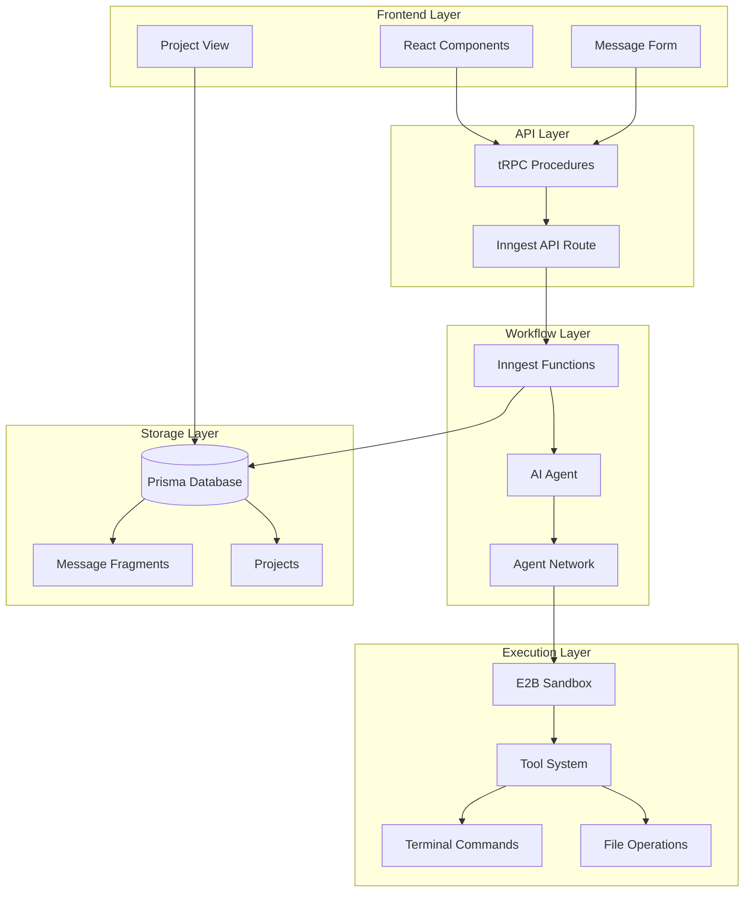
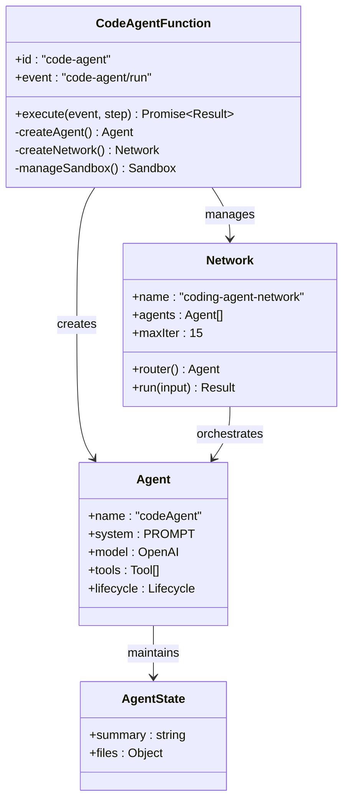
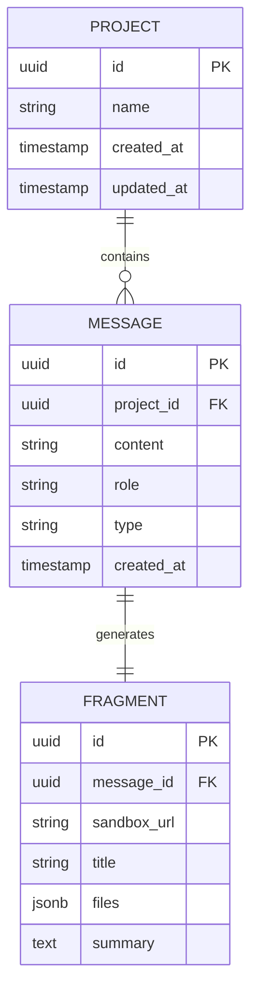
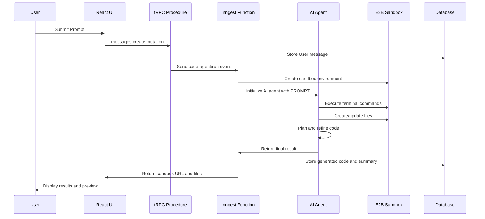
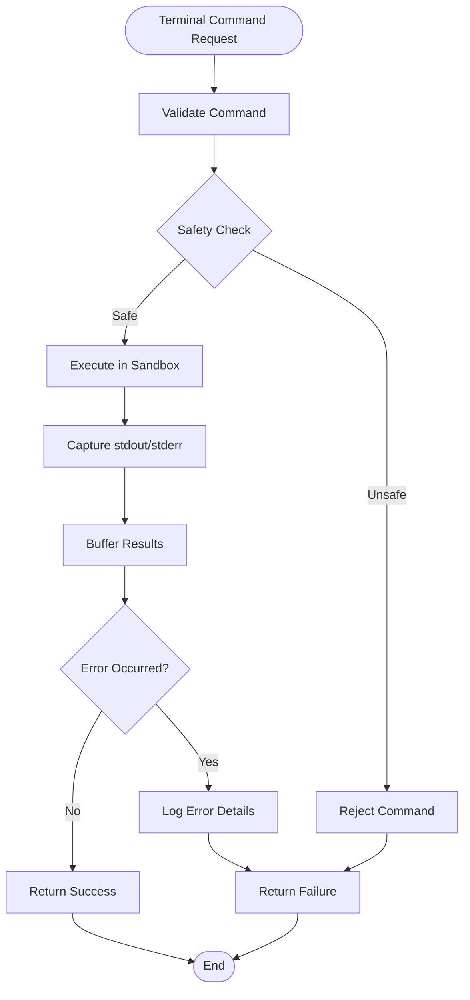
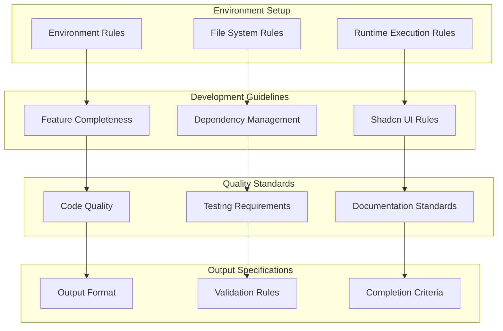
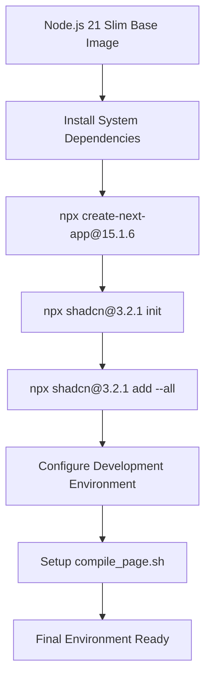
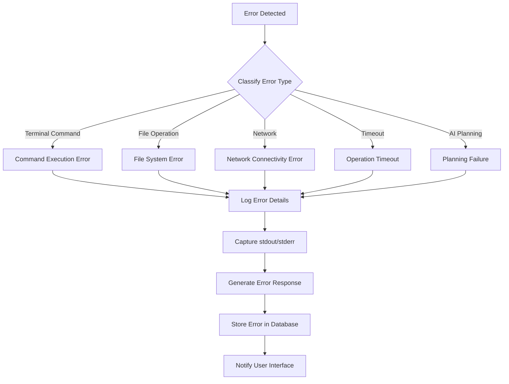
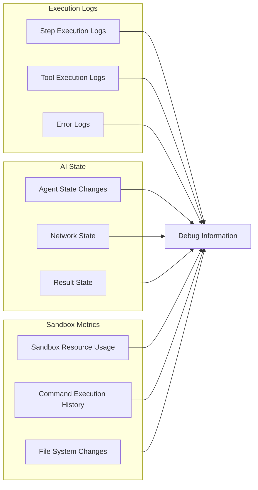

# AI Agent Workflow

<cite>
**Referenced Files in This Document**
- [src/inngest/functions.ts](file://src/inngest/functions.ts)
- [src/inngest/client.ts](file://src/inngest/client.ts)
- [src/inngest/utils.ts](file://src/inngest/utils.ts)
- [src/prompt.ts](file://src/prompt.ts)
- [src/app/api/inngest/route.ts](file://src/app/api/inngest/route.ts)
- [src/modules/messages/server/procedures.ts](file://src/modules/messages/server/procedures.ts)
- [src/modules/projects/server/procedures.ts](file://src/modules/projects/server/procedures.ts)
- [src/trpc/routers/_app.ts](file://src/trpc/routers/_app.ts)
- [src/lib/db.ts](file://src/lib/db.ts)
- [sandbox-templates/nextjs/e2b.Dockerfile](file://sandbox-templates/nextjs/e2b.Dockerfile)
- [sandbox-templates/nextjs/e2b.toml](file://sandbox-templates/nextjs/e2b.toml)
- [sandbox-templates/nextjs/compile_page.sh](file://sandbox-templates/nextjs/compile_page.sh)
- [src/modules/projects/ui/views/project-view.tsx](file://src/modules/projects/ui/views/project-view.tsx)
- [src/modules/projects/ui/components/message-form.tsx](file://src/modules/projects/ui/components/message-form.tsx)
</cite>

## Table of Contents
1. [Introduction](#introduction)
2. [System Architecture Overview](#system-architecture-overview)
3. [Core Components](#core-components)
4. [AI Agent Workflow Lifecycle](#ai-agent-workflow-lifecycle)
5. [Tool System and Sandbox Environment](#tool-system-and-sandbox-environment)
6. [Prompt Engineering and Template System](#prompt-engineering-and-template-system)
7. [Sandbox Configuration and Security](#sandbox-configuration-and-security)
8. [Error Handling and Timeout Management](#error-handling-and-timeout-management)
9. [Debugging and Monitoring Strategies](#debugging-and-monitoring-strategies)
10. [Performance Considerations](#performance-considerations)
11. [Security Constraints](#security-constraints)
12. [Troubleshooting Guide](#troubleshooting-guide)

## Introduction

QAI's AI agent workflow represents a sophisticated code generation system that combines OpenAI's language models with E2B's sandboxed execution environment. The system processes user prompts through an Inngest-powered workflow that orchestrates AI planning, code generation, and execution within secure sandbox environments. This comprehensive system enables users to describe desired functionality in natural language, which is then transformed into fully functional Next.js applications with Shadcn UI components and Tailwind CSS styling.

The workflow operates through a multi-stage pipeline: user input via tRPC mutations triggers Inngest events, which activate AI agents capable of executing terminal commands, manipulating files, and interacting with network resources within controlled sandbox environments. The system maintains strict security boundaries while providing powerful development capabilities through its tool system and sandbox architecture.

## System Architecture Overview

The QAI AI agent workflow follows a distributed architecture pattern with clear separation of concerns across multiple layers:

**Diagram sources**
- [src/trpc/routers/_app.ts](file://src/trpc/routers/_app.ts#L1-L9)
- [src/app/api/inngest/route.ts](file://src/app/api/inngest/route.ts#L1-L11)
- [src/inngest/functions.ts](file://src/inngest/functions.ts#L13-L211)

The architecture demonstrates a clear separation between presentation (frontend), business logic (tRPC procedures), workflow orchestration (Inngest functions), and execution (sandbox environment). Each layer communicates through well-defined interfaces, enabling scalability and maintainability.

**Section sources**
- [src/trpc/routers/_app.ts](file://src/trpc/routers/_app.ts#L1-L9)
- [src/app/api/inngest/route.ts](file://src/app/api/inngest/route.ts#L1-L11)
- [src/inngest/functions.ts](file://src/inngest/functions.ts#L1-L211)

## Core Components

### Inngest Function Orchestrator

The heart of the AI workflow lies in the `codeAgentFunction`, which serves as the primary orchestrator for the entire code generation process. This function creates and manages an AI agent network that can execute multiple iterations of code generation and refinement.

**Diagram sources**
- [src/inngest/functions.ts](file://src/inngest/functions.ts#L13-L211)

### Database Integration

The system integrates with a PostgreSQL database through Prisma ORM, managing project and message data with specialized fragment storage for AI-generated code outputs.

**Diagram sources**
- [src/lib/db.ts](file://src/lib/db.ts#L1-L9)
- [src/modules/messages/server/procedures.ts](file://src/modules/messages/server/procedures.ts#L1-L55)

**Section sources**
- [src/inngest/functions.ts](file://src/inngest/functions.ts#L13-L211)
- [src/lib/db.ts](file://src/lib/db.ts#L1-L9)
- [src/modules/messages/server/procedures.ts](file://src/modules/messages/server/procedures.ts#L1-L55)

## AI Agent Workflow Lifecycle

The AI agent workflow follows a structured lifecycle from user prompt submission to final code generation and storage:

**Diagram sources**
- [src/modules/messages/server/procedures.ts](file://src/modules/messages/server/procedures.ts#L25-L45)
- [src/inngest/functions.ts](file://src/inngest/functions.ts#L13-L211)

### Step-by-Step Workflow Process

1. **Prompt Submission**: Users submit code generation requests through the React form interface
2. **Event Triggering**: tRPC procedures handle input validation and trigger Inngest events
3. **Sandbox Creation**: New sandbox instances are created for each code generation session
4. **AI Planning**: The AI agent analyzes the prompt and develops a code generation strategy
5. **Tool Execution**: The agent executes terminal commands, file operations, and network requests
6. **Result Compilation**: Generated code and summaries are collected and validated
7. **Database Storage**: Results are stored with associated metadata and sandbox URLs
8. **Frontend Updates**: Users receive real-time updates and can preview generated code

**Section sources**
- [src/modules/messages/server/procedures.ts](file://src/modules/messages/server/procedures.ts#L25-L45)
- [src/inngest/functions.ts](file://src/inngest/functions.ts#L13-L211)

## Tool System and Sandbox Environment

The AI agent workflow relies on a sophisticated tool system that provides controlled access to various execution capabilities within the E2B sandbox environment.

### Terminal Execution Tool

The terminal tool enables the AI agent to execute shell commands within the sandbox environment, providing essential functionality for package installation, build processes, and development server management.

**Diagram sources**
- [src/inngest/functions.ts](file://src/inngest/functions.ts#L30-L60)

### File Operation Tools

The system provides three primary file operation tools for comprehensive file system manipulation:

#### Create/Update Files Tool
Enables the AI agent to create new files or update existing ones with specified content, maintaining a synchronized state of all managed files.

#### Read Files Tool  
Allows the agent to inspect existing files and understand the current project structure before making modifications.

#### File State Management
The system maintains a centralized state of all files managed by the AI agent, enabling intelligent file operations and preventing conflicts.

### Network State Checking

While primarily focused on file and terminal operations, the system includes mechanisms for monitoring network connectivity and service availability within the sandbox environment.

**Section sources**
- [src/inngest/functions.ts](file://src/inngest/functions.ts#L62-L140)
- [src/inngest/utils.ts](file://src/inngest/utils.ts#L1-L20)

## Prompt Engineering and Template System

The AI agent's effectiveness depends heavily on the carefully crafted system prompt that guides its behavior and ensures adherence to project requirements.

### System Prompt Architecture

The `PROMPT` constant defines comprehensive guidelines for the AI agent's behavior, covering environment constraints, coding standards, and operational rules.

**Diagram sources**
- [src/prompt.ts](file://src/prompt.ts#L1-L113)

### Key Prompt Categories

#### Environment Constraints
- Writable file system access via `createOrUpdateFiles` tool
- Command execution capability via terminal tool
- Read-only file access via `readFiles` tool
- Pre-configured Next.js environment with Shadcn UI components

#### Development Standards
- Production-quality code implementation
- Proper package installation before usage
- Strict Shadcn UI component usage following official APIs
- Tailwind CSS styling exclusively (no plain CSS)

#### Quality Assurance
- Realistic, functional features rather than placeholders
- Complete React component implementations with proper state management
- Semantic HTML and accessibility compliance
- Modular component architecture with reusable logic

**Section sources**
- [src/prompt.ts](file://src/prompt.ts#L1-L113)

## Sandbox Configuration and Security

The sandbox environment provides a secure, isolated execution context for AI-generated code through E2B's containerized infrastructure.

### Docker Environment Setup

The sandbox is configured using a specialized Dockerfile that establishes a pre-configured Next.js development environment with all necessary dependencies.

**Diagram sources**
- [sandbox-templates/nextjs/e2b.Dockerfile](file://sandbox-templates/nextjs/e2b.Dockerfile#L1-L19)

### Template Configuration

The sandbox template is defined through an `e2b.toml` configuration file that specifies deployment parameters and startup procedures.

### Development Server Management

The system includes automated server startup and health checking through a specialized compilation script that ensures the Next.js development server is available before AI operations begin.

**Section sources**
- [sandbox-templates/nextjs/e2b.Dockerfile](file://sandbox-templates/nextjs/e2b.Dockerfile#L1-L19)
- [sandbox-templates/nextjs/e2b.toml](file://sandbox-templates/nextjs/e2b.toml#L1-L17)
- [sandbox-templates/nextjs/compile_page.sh](file://sandbox-templates/nextjs/compile_page.sh#L1-L19)

## Error Handling and Timeout Management

The AI agent workflow implements comprehensive error handling and timeout management to ensure reliable operation and graceful failure recovery.

### Error Classification and Handling

**Diagram sources**
- [src/inngest/functions.ts](file://src/inngest/functions.ts#L50-L60)
- [src/inngest/functions.ts](file://src/inngest/functions.ts#L175-L185)

### Timeout Management Strategies

#### Operation-Level Timeouts
Each tool execution includes built-in timeout mechanisms to prevent indefinite hanging of operations.

#### Network Iteration Limits
The agent network limits maximum iterations to 15, preventing infinite loops in AI planning cycles.

#### Sandbox Resource Management
Sandbox instances are automatically cleaned up after completion or timeout, ensuring resource efficiency.

### Error Recovery Mechanisms

#### Graceful Degradation
When critical operations fail, the system attempts partial recovery and continues with available functionality.

#### User Notification
Errors are communicated to users through the interface with actionable feedback and retry options.

**Section sources**
- [src/inngest/functions.ts](file://src/inngest/functions.ts#L50-L60)
- [src/inngest/functions.ts](file://src/inngest/functions.ts#L137-L145)
- [src/inngest/functions.ts](file://src/inngest/functions.ts#L175-L185)

## Debugging and Monitoring Strategies

The system provides comprehensive debugging and monitoring capabilities to facilitate development, troubleshooting, and performance optimization.

### Execution Tracing

#### Step-by-Step Logging
Each major operation within the Inngest function includes detailed logging with contextual information about the executed actions.

#### AI Decision Tracking
The system tracks AI agent decisions and tool selections to understand the reasoning behind code generation choices.

#### Sandbox Interaction Monitoring
All interactions with the E2B sandbox are logged with timestamps and execution contexts for audit purposes.

### Debug Information Collection

### Monitoring Dashboard Features

#### Real-Time Status Tracking
Users can monitor the progress of AI operations through the project view interface.

#### Execution Statistics
The system tracks successful completions, failures, and performance metrics for optimization insights.

#### Error Pattern Analysis
Historical error data helps identify common failure modes and improve system reliability.

**Section sources**
- [src/inngest/functions.ts](file://src/inngest/functions.ts#L50-L60)
- [src/inngest/utils.ts](file://src/inngest/utils.ts#L10-L20)

## Performance Considerations

The AI agent workflow is designed with several performance optimization strategies to ensure efficient operation and responsive user experience.

### Resource Management

#### Sandbox Pooling
The system efficiently manages sandbox instances, reusing environments when possible and cleaning up unused resources promptly.

#### Memory Optimization
File operations and buffer management are optimized to minimize memory usage during code generation processes.

#### Concurrent Processing
Multiple AI operations can run concurrently within separate sandbox environments, maximizing throughput.

### Caching Strategies

#### Prompt Caching
Frequently used system prompts and templates are cached to reduce initialization overhead.

#### File Content Caching
Commonly accessed file contents are cached to avoid redundant read operations.

#### Result Caching
Generated code fragments are cached and reused when appropriate to avoid redundant processing.

### Scalability Architecture

The distributed architecture allows for horizontal scaling of Inngest functions and sandbox environments to handle increased load.

## Security Constraints

The sandboxed execution environment provides multiple layers of security to protect both the system and user data.

### Sandboxing Mechanisms

#### Container Isolation
All AI operations occur within isolated Docker containers with restricted network access.

#### File System Boundaries
File operations are confined to designated sandbox directories with no access to host system files.

#### Network Restrictions
Network access is limited to internal sandbox communication and controlled external connections.

### Access Control

#### Authentication Layers
Multiple authentication checkpoints ensure only authorized users can trigger AI operations.

#### Rate Limiting
API rate limiting prevents abuse and ensures fair resource allocation among users.

#### Input Validation
Comprehensive input validation prevents malicious payloads and ensures data integrity.

### Audit and Compliance

#### Operation Logging
All AI operations are logged with timestamps and user context for audit trails.

#### Security Monitoring
Continuous monitoring detects and responds to potential security threats.

**Section sources**
- [sandbox-templates/nextjs/e2b.Dockerfile](file://sandbox-templates/nextjs/e2b.Dockerfile#L1-L19)
- [src/inngest/functions.ts](file://src/inngest/functions.ts#L15-L25)

## Troubleshooting Guide

### Common Issues and Solutions

#### Sandbox Creation Failures
- **Symptoms**: "Failed to create sandbox" errors
- **Causes**: Resource constraints, template issues, network problems
- **Solutions**: Check system resources, verify template configuration, review network connectivity

#### AI Planning Errors
- **Symptoms**: Agent fails to generate code or produces incomplete results
- **Causes**: Insufficient prompt clarity, tool limitations, timeout issues
- **Solutions**: Improve prompt specificity, check tool availability, adjust timeout settings

#### File Operation Failures
- **Symptoms**: "Failed to create or update files" errors
- **Causes**: Path restrictions, permission issues, disk space limitations
- **Solutions**: Verify file paths, check sandbox permissions, monitor disk usage

#### Terminal Command Failures
- **Symptoms**: Command execution errors with specific error messages
- **Causes**: Invalid commands, missing dependencies, execution timeouts
- **Solutions**: Validate command syntax, ensure dependencies are installed, increase timeout limits

### Diagnostic Procedures

#### Log Analysis
Review system logs for specific error patterns and timing information.

#### Sandbox Inspection
Examine sandbox environment state and file system contents for debugging.

#### Network Connectivity
Verify network connectivity between components and external services.

#### Performance Monitoring
Monitor resource usage and identify bottlenecks in the workflow.

**Section sources**
- [src/inngest/functions.ts](file://src/inngest/functions.ts#L50-L60)
- [src/inngest/functions.ts](file://src/inngest/functions.ts#L175-L185)