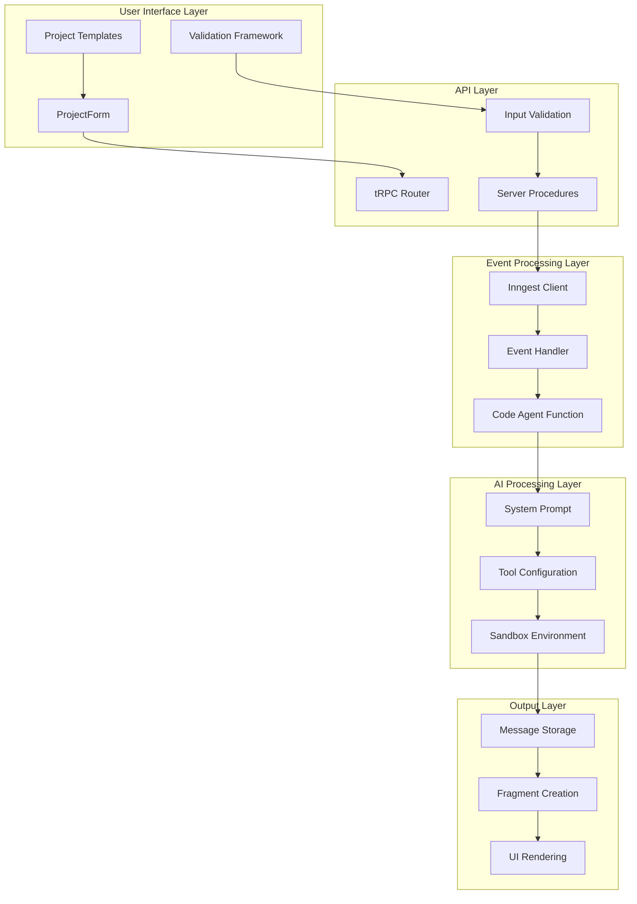
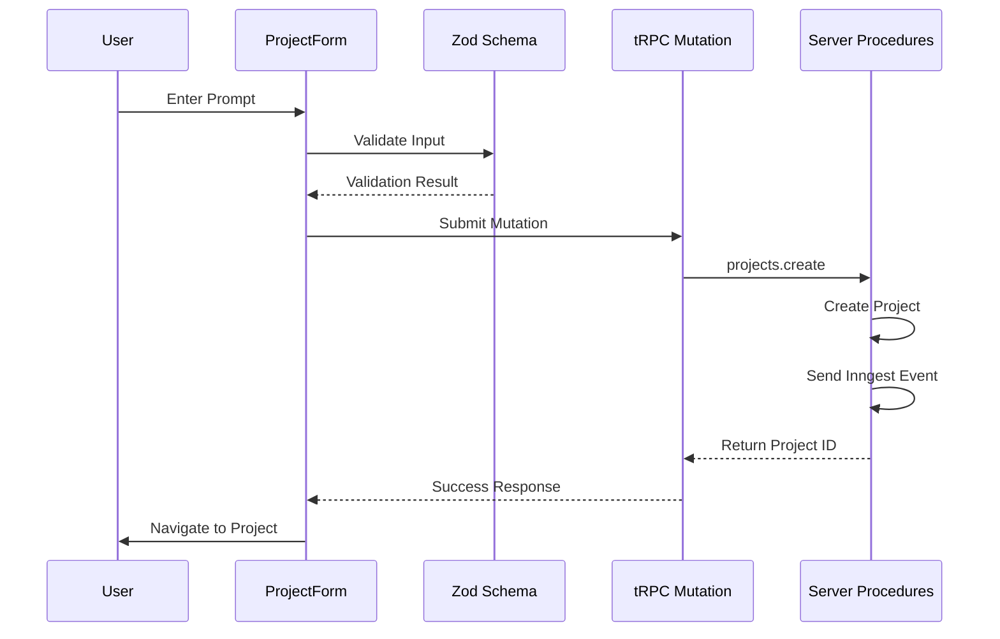
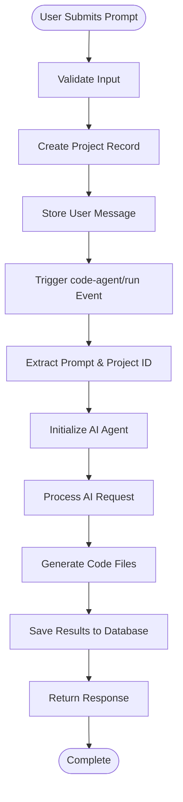
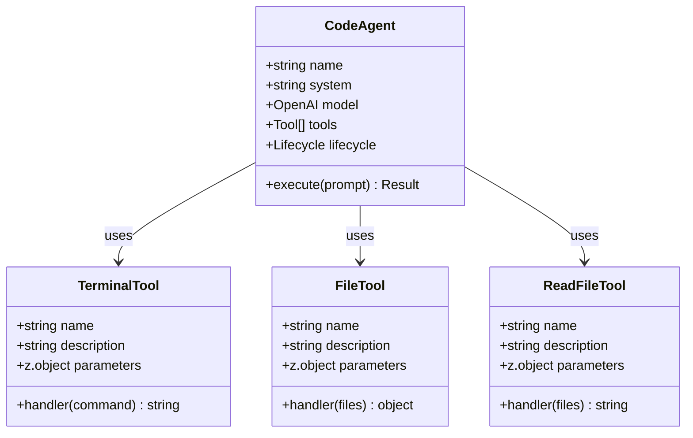
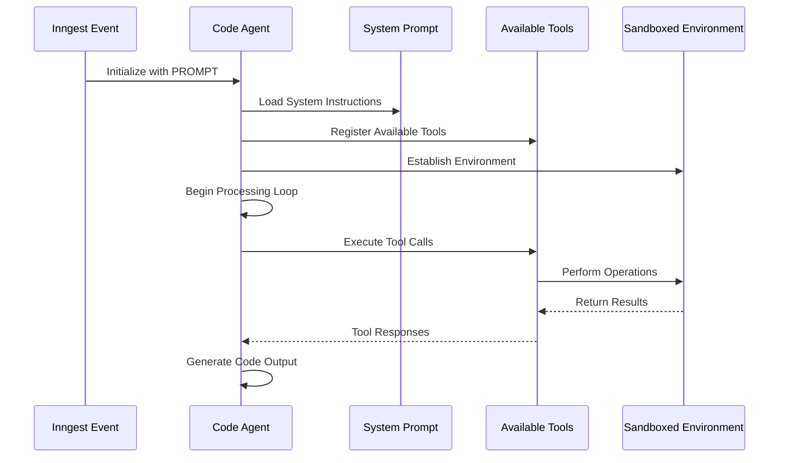
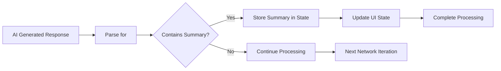
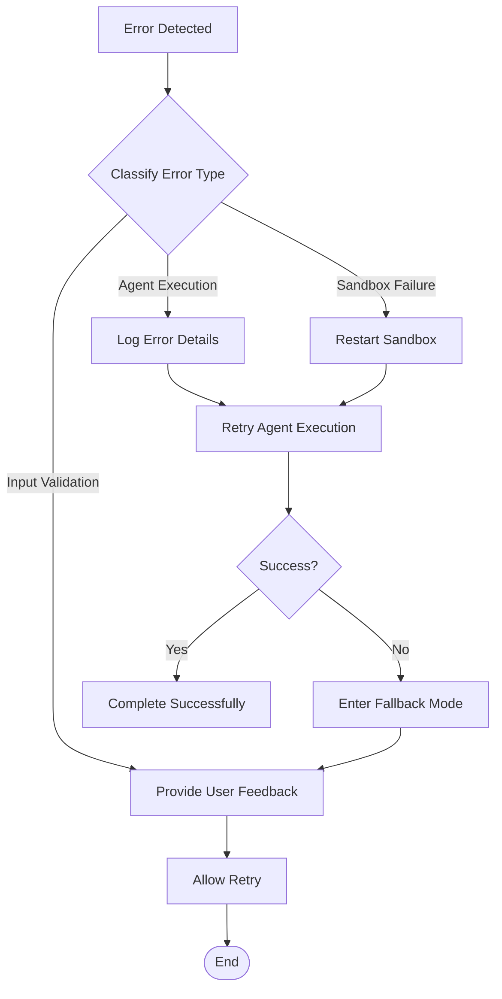

# Prompt Processing System

<cite>
**Referenced Files in This Document**
- [src/prompt.ts](file://src/prompt.ts)
- [src/modules/home/ui/components/project-form.tsx](file://src/modules/home/ui/components/project-form.tsx)
- [src/modules/projects/server/procedures.ts](file://src/modules/projects/server/procedures.ts)
- [src/inngest/functions.ts](file://src/inngest/functions.ts)
- [src/inngest/client.ts](file://src/inngest/client.ts)
- [src/inngest/utils.ts](file://src/inngest/utils.ts)
- [src/modules/home/constants.ts](file://src/modules/home/constants.ts)
- [src/modules/projects/ui/components/message-card.tsx](file://src/modules/projects/ui/components/message-card.tsx)
- [src/modules/projects/ui/components/messages-container.tsx](file://src/modules/projects/ui/components/messages-container.tsx)
</cite>

## Table of Contents
1. [Introduction](#introduction)
2. [System Architecture Overview](#system-architecture-overview)
3. [Prompt Definition and Configuration](#prompt-definition-and-configuration)
4. [User Input Processing Pipeline](#user-input-processing-pipeline)
5. [tRPC Integration and Validation](#trpc-integration-and-validation)
6. [Inngest Event Triggering](#inngest-event-triggering)
7. [Agent Configuration and Tool System](#agent-configuration-and-tool-system)
8. [Prompt Injection and AI Decision-Making](#prompt-injection-and-ai-decision-making)
9. [Structured Response Format](#structured-response-format)
10. [Best Practices and Constraints](#best-practices-and-constraints)
11. [Customization Guidelines](#customization-guidelines)
12. [Error Handling and Validation](#error-handling-and-validation)
13. [Troubleshooting Guide](#troubleshooting-guide)
14. [Conclusion](#conclusion)

## Introduction

The QAI prompt processing system is a sophisticated pipeline that transforms user input from the ProjectForm into structured AI-generated code. This system orchestrates multiple components including user interface validation, tRPC API communication, Inngest event processing, and AI agent configuration to deliver production-ready Next.js applications within a secure sandboxed environment.

The system operates on a multi-stage architecture where user prompts are validated, processed through a robust tRPC endpoint, triggered as Inngest events, and executed by an AI agent configured with strict constraints and guidelines. This ensures both code quality and sandbox safety while enabling rapid prototyping and development.

## System Architecture Overview

The prompt processing system follows a layered architecture that separates concerns between user interface, API communication, event processing, and AI execution:

**Diagram sources**
- [src/modules/home/ui/components/project-form.tsx](file://src/modules/home/ui/components/project-form.tsx#L1-L143)
- [src/modules/projects/server/procedures.ts](file://src/modules/projects/server/procedures.ts#L1-L72)
- [src/inngest/functions.ts](file://src/inngest/functions.ts#L13-L212)

## Prompt Definition and Configuration

The system's foundation lies in the carefully crafted system prompt defined in [`src/prompt.ts`](file://src/prompt.ts#L1-L114). This prompt serves as the authoritative guide for the AI agent's behavior and constrains its actions within the sandboxed environment.

### System Prompt Structure

The prompt is organized into distinct sections that define the AI's operating environment, constraints, and behavioral guidelines:

**Environment Specifications**: Establishes the Next.js 15+ environment with pre-configured tools and limitations.
**File System Rules**: Defines safe file manipulation practices and path restrictions.
**Styling Constraints**: Mandates Tailwind CSS usage exclusively and prohibits direct CSS file modifications.
**Execution Guidelines**: Prevents unauthorized command execution and ensures proper development workflow adherence.
**Development Standards**: Specifies production-quality code requirements and component usage patterns.

### Key Constraint Definitions

The prompt establishes several critical constraints that govern AI behavior:

- **Package Management**: Direct package.json modification is prohibited; all installations must occur via terminal commands
- **File Path Restrictions**: Absolute paths are forbidden; all operations must use relative paths within the `/home/user` directory
- **Import Patterns**: The `@` alias is reserved for imports only, not for file system operations
- **Styling Requirements**: All styling must use Tailwind CSS classes exclusively
- **Component Usage**: Shadcn UI components must be used according to their documented APIs

**Section sources**
- [src/prompt.ts](file://src/prompt.ts#L1-L114)

## User Input Processing Pipeline

The user input processing begins with the ProjectForm component, which captures and validates user requests before transmission to the backend system.

### Form Validation and Submission

The ProjectForm implements comprehensive validation using Zod schemas and React Hook Form for optimal user experience:

**Diagram sources**
- [src/modules/home/ui/components/project-form.tsx](file://src/modules/home/ui/components/project-form.tsx#L25-L50)
- [src/modules/projects/server/procedures.ts](file://src/modules/projects/server/procedures.ts#L35-L71)

### Template Integration

The system includes predefined project templates that demonstrate prompt effectiveness and provide users with ready-to-use examples. These templates showcase various UI patterns and component combinations.

**Section sources**
- [src/modules/home/ui/components/project-form.tsx](file://src/modules/home/ui/components/project-form.tsx#L1-L143)
- [src/modules/home/constants.ts](file://src/modules/home/constants.ts#L1-L50)

## tRPC Integration and Validation

The tRPC integration provides type-safe API communication between the frontend and backend, ensuring input validation occurs at the boundary level.

### Input Validation Schema

The server-side validation enforces strict constraints on user input:

- **Required Field**: The prompt value must be present and non-empty
- **Length Limitation**: Maximum 1000 characters to prevent excessive processing
- **Sanitization**: Input is automatically sanitized and prepared for AI processing

### Mutation Implementation

The `projects.create` mutation handles the complete workflow from input validation to event triggering:

1. **Project Creation**: A new project record is created with generated slug-based naming
2. **Message Recording**: The user's prompt is stored as a message associated with the project
3. **Event Dispatch**: An Inngest event is triggered with the prompt and project context
4. **Response Generation**: The mutation returns the newly created project identifier

**Section sources**
- [src/modules/projects/server/procedures.ts](file://src/modules/projects/server/procedures.ts#L35-L71)

## Inngest Event Triggering

Inngest serves as the orchestration engine that bridges the tRPC API layer with the AI processing system.

### Event Structure and Data Flow

The Inngest event carries essential context information that enables the AI agent to process the request effectively:

**Diagram sources**
- [src/modules/projects/server/procedures.ts](file://src/modules/projects/server/procedures.ts#L55-L65)
- [src/inngest/functions.ts](file://src/inngest/functions.ts#L13-L50)

### Event Data Composition

The event payload includes:
- **Value**: The user's prompt text
- **Project ID**: Reference to the associated project for result storage
- **Context**: Additional metadata for agent configuration

**Section sources**
- [src/modules/projects/server/procedures.ts](file://src/modules/projects/server/procedures.ts#L55-L65)

## Agent Configuration and Tool System

The AI agent configuration defines the capabilities and limitations of the code generation process through a comprehensive tool system.

### Agent Architecture

The agent operates within a controlled environment with predefined capabilities:

**Diagram sources**
- [src/inngest/functions.ts](file://src/inngest/functions.ts#L25-L135)

### Tool Capabilities

Each tool provides specific functionality within the sandboxed environment:

**Terminal Tool**: Executes shell commands for package installations and development tasks
**File Operations Tool**: Creates, updates, and manages files within the sandbox
**File Reading Tool**: Retrieves file contents for analysis and modification

### Agent State Management

The agent maintains state through a structured interface that tracks:
- **Summary**: Generated task summaries and completion indicators
- **Files**: Current state of managed files and their contents

**Section sources**
- [src/inngest/functions.ts](file://src/inngest/functions.ts#L13-L212)

## Prompt Injection and AI Decision-Making

The system prompt injection occurs during agent initialization, where the PROMPT constant becomes the foundation for AI decision-making.

### Injection Process

The prompt injection happens at agent creation time, establishing the AI's operational framework:

**Diagram sources**
- [src/inngest/functions.ts](file://src/inngest/functions.ts#L25-L50)

### Decision-Making Constraints

The injected prompt guides the AI through several decision-making phases:

1. **Environment Assessment**: Evaluates available tools and constraints
2. **Task Analysis**: Interprets user requirements within system limitations
3. **Implementation Planning**: Develops step-by-step execution strategy
4. **Code Generation**: Produces TypeScript/JSX code compliant with guidelines
5. **Quality Assurance**: Validates output against system standards

**Section sources**
- [src/inngest/functions.ts](file://src/inngest/functions.ts#L25-L50)

## Structured Response Format

The AI agent generates responses using a structured format that enables reliable parsing and display in the user interface.

### Task Summary Format

Responses must include a `<task_summary>` tag that contains:
- **Completion Status**: Indication of successful task completion
- **Implementation Details**: Description of generated components and features
- **Technical Specifications**: Information about used technologies and patterns

### Response Lifecycle

The system processes AI responses through several stages:

**Diagram sources**
- [src/inngest/functions.ts](file://src/inngest/functions.ts#L137-L145)

### State Management

The agent maintains response state through the network lifecycle, ensuring that task summaries are captured and preserved for user display.

**Section sources**
- [src/inngest/functions.ts](file://src/inngest/functions.ts#L137-L145)

## Best Practices and Constraints

The system enforces numerous best practices to ensure code quality, security, and maintainability.

### File System Safety

**Path Restrictions**: All file operations must use relative paths within the sandbox environment
**Absolute Path Prevention**: Absolute paths like `/home/user/...` are prohibited and will cause critical errors
**Alias Usage**: The `@` symbol is reserved for imports only, not for file system operations

### Styling Conventions

**Tailwind CSS Only**: All styling must use Tailwind CSS classes exclusively
**No External Stylesheets**: Plain CSS, SCSS, or external stylesheets are forbidden
**Component Styling**: Shadcn UI components must be styled using Tailwind classes

### Package Management

**Installation Protocol**: All npm packages must be installed via terminal commands
**Direct Modification Prohibition**: Package.json and lock files cannot be modified directly
**Dependency Verification**: The system assumes Shadcn UI components are pre-installed

### Component Usage Guidelines

**API Compliance**: Shadcn UI components must be used according to their documented APIs
**Prop Validation**: All component props must match the component's TypeScript definitions
**Import Patterns**: Components must be imported from their specific paths (e.g., `@/components/ui/button`)

**Section sources**
- [src/prompt.ts](file://src/prompt.ts#L15-L50)

## Customization Guidelines

While the system provides robust defaults, customization options exist for specific use cases while maintaining sandbox safety.

### Prompt Modification Strategies

**Environment Adaptation**: Modify environment specifications for different frameworks or versions
**Tool Extension**: Add custom tools while maintaining security constraints
**Constraint Relaxation**: Adjust validation rules for specialized use cases

### Safety Considerations

**Sandbox Integrity**: Customizations must not compromise the sandboxed execution environment
**Security Boundaries**: Modifications must preserve the isolation guarantees
**Validation Maintenance**: Input validation must remain robust against malicious inputs

### Development Workflow Integration

**Local Testing**: Custom prompts can be tested locally before deployment
**Version Control**: Changes should be tracked and reviewed systematically
**Documentation**: Customizations should be well-documented for team collaboration

## Error Handling and Validation

The system implements comprehensive error handling at multiple levels to ensure reliability and user feedback.

### Input Validation Layers

**Frontend Validation**: Real-time form validation prevents invalid submissions
**Backend Validation**: Server-side validation ensures data integrity
**Runtime Validation**: Agent-level validation catches execution errors

### Error Recovery Mechanisms

**Diagram sources**
- [src/modules/projects/server/procedures.ts](file://src/modules/projects/server/procedures.ts#L50-L55)
- [src/inngest/functions.ts](file://src/inngest/functions.ts#L175-L185)

### Error Reporting

The system provides detailed error reporting through multiple channels:
- **Console Logging**: Development-time error details
- **Database Storage**: Persistent error records for debugging
- **User Notifications**: Graceful degradation with user-friendly messages

**Section sources**
- [src/modules/projects/server/procedures.ts](file://src/modules/projects/server/procedures.ts#L50-L55)
- [src/inngest/functions.ts](file://src/inngest/functions.ts#L175-L185)

## Troubleshooting Guide

Common issues and their resolutions help maintain system reliability and user productivity.

### Input-Related Issues

**Invalid Prompts**: Ensure prompts meet length requirements and contain meaningful content
**Template Conflicts**: Verify template usage doesn't conflict with custom modifications
**Character Encoding**: Check for special characters that might interfere with processing

### Agent Execution Problems

**Tool Failures**: Monitor tool execution logs for specific failure reasons
**Memory Constraints**: Large prompts may require memory optimization
**Timeout Issues**: Long-running operations may need timeout adjustments

### Sandbox Environment Issues

**File Access Errors**: Verify file paths are relative and within sandbox boundaries
**Permission Problems**: Ensure proper file permissions within the sandbox
**Resource Limits**: Monitor resource consumption to prevent system overload

### Performance Optimization

**Response Time**: Optimize agent configuration for faster response times
**Concurrent Processing**: Manage concurrent agent executions efficiently
**Caching Strategies**: Implement caching for frequently accessed resources

## Conclusion

The QAI prompt processing system represents a sophisticated approach to AI-assisted code generation that balances power with safety. Through careful constraint definition, multi-layered validation, and robust error handling, the system enables developers to rapidly prototype and develop production-quality Next.js applications.

The system's strength lies in its comprehensive approach to prompt processing, from user input validation through AI agent execution to result storage and presentation. The structured response format, enforced constraints, and extensive tooling provide both flexibility and safety, ensuring that generated code meets professional standards while remaining within the confines of a secure sandboxed environment.

Future enhancements could include expanded template libraries, additional tool integrations, and enhanced customization options while maintaining the system's core principles of safety, reliability, and code quality.