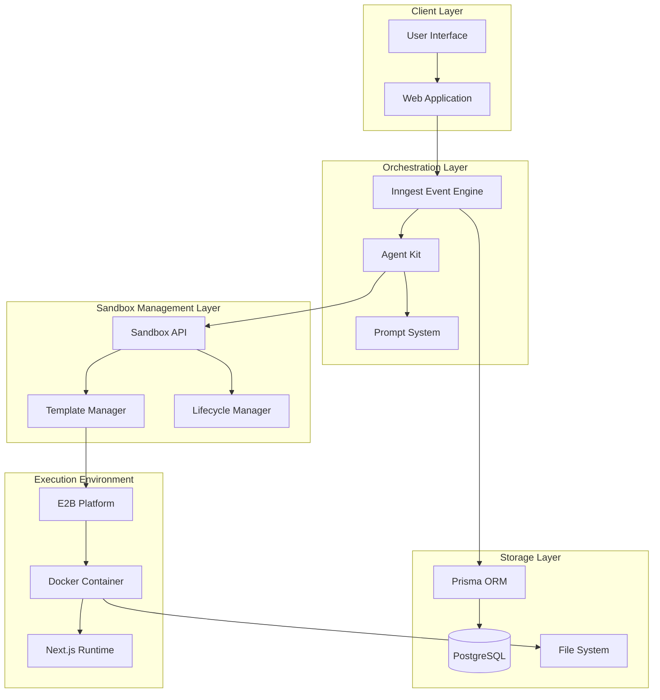
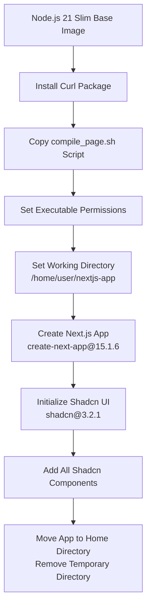
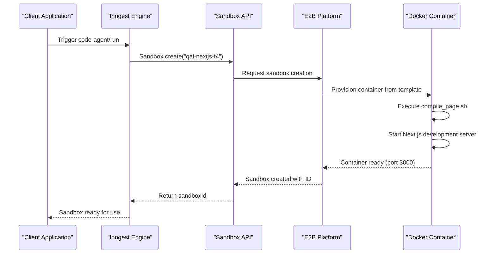
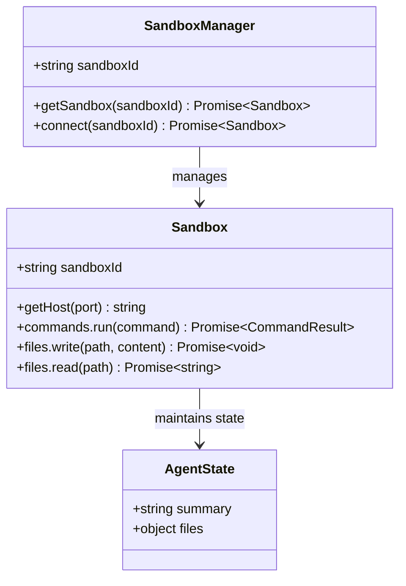
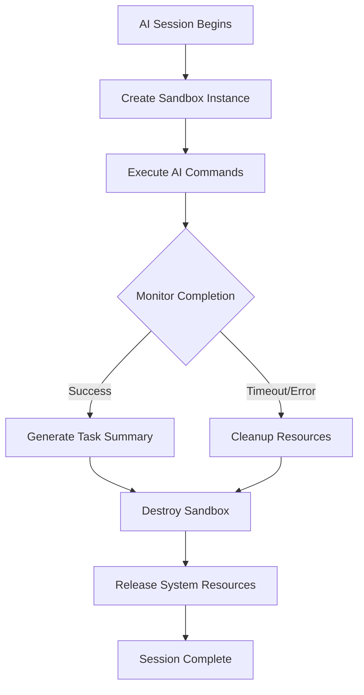
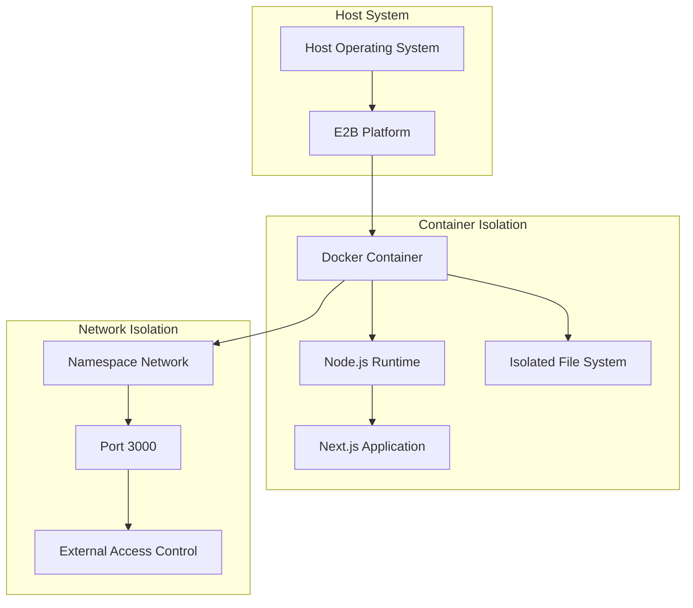
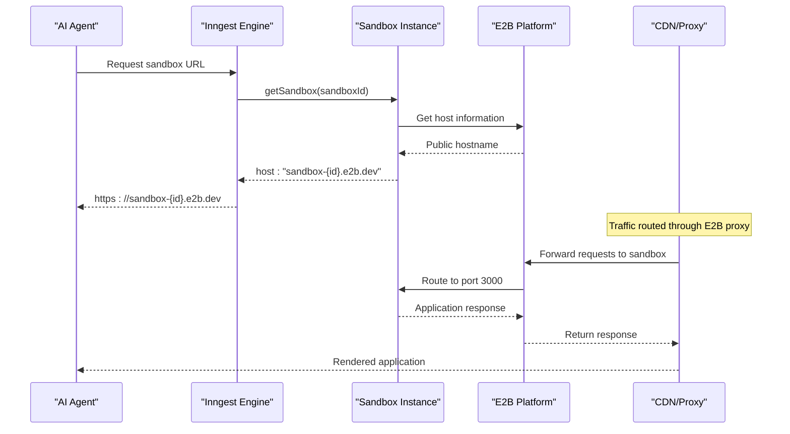
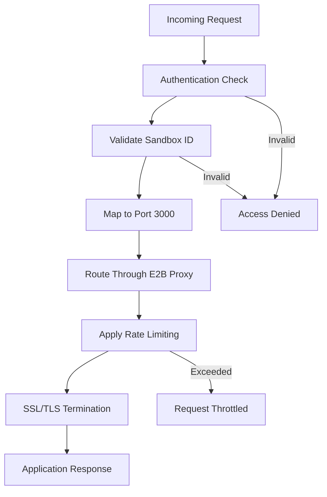
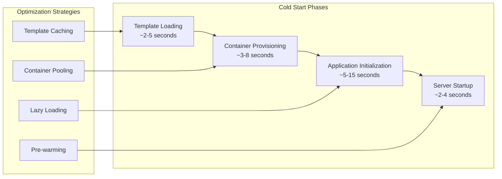
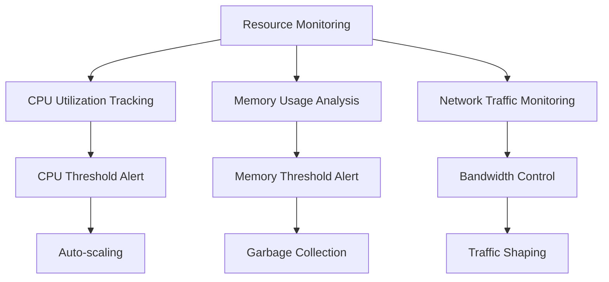

# Sandbox Execution Environment Architecture

<cite>
**Referenced Files in This Document**
- [e2b.Dockerfile](file://sandbox-templates/nextjs/e2b.Dockerfile)
- [e2b.toml](file://sandbox-templates/nextjs/e2b.toml)
- [compile_page.sh](file://sandbox-templates/nextjs/compile_page.sh)
- [functions.ts](file://src/inngest/functions.ts)
- [utils.ts](file://src/inngest/utils.ts)
- [client.ts](file://src/inngest/client.ts)
- [prompt.ts](file://src/prompt.ts)
- [fragment-web.tsx](file://src/modules/projects/ui/components/fragment-web.tsx)
- [procedures.ts](file://src/modules/projects/server/procedures.ts)
- [layout.tsx](file://src/app/layout.tsx)
- [package.json](file://package.json)
- [db.ts](file://src/lib/db.ts)
</cite>

## Table of Contents
1. [Introduction](#introduction)
2. [System Architecture Overview](#system-architecture-overview)
3. [Sandbox Template Configuration](#sandbox-template-configuration)
4. [Sandbox Lifecycle Management](#sandbox-lifecycle-management)
5. [Secure Isolation Environment](#secure-isolation-environment)
6. [Application Exposure and Access](#application-exposure-and-access)
7. [Performance Considerations](#performance-considerations)
8. [Troubleshooting Guide](#troubleshooting-guide)
9. [Conclusion](#conclusion)

## Introduction

The QAI sandbox execution environment provides a secure, isolated containerized runtime for AI-driven code generation and testing. Built on E2B's platform, this system creates reproducible Next.js development environments with preconfigured frameworks, enabling seamless AI-assisted development workflows while maintaining strict security boundaries.

The sandbox architecture enables developers to create, modify, and test Next.js applications in a controlled environment where all changes are ephemeral and automatically cleaned up after the AI session completes. This approach ensures safety, consistency, and efficient resource utilization across the development platform.

## System Architecture Overview

The sandbox execution system follows a multi-layered architecture that separates concerns between AI orchestration, sandbox management, and application delivery.

**Diagram sources**
- [functions.ts](file://src/inngest/functions.ts#L13-L173)
- [client.ts](file://src/inngest/client.ts#L1-L4)
- [utils.ts](file://src/inngest/utils.ts#L1-L20)

**Section sources**
- [functions.ts](file://src/inngest/functions.ts#L1-L173)
- [client.ts](file://src/inngest/client.ts#L1-L4)

## Sandbox Template Configuration

The sandbox environment is configured through a comprehensive template system that defines the complete runtime environment for AI-assisted development.

### Dockerfile Configuration

The sandbox uses a Node.js 21 slim base image with pre-installed development tools and frameworks:

**Diagram sources**
- [e2b.Dockerfile](file://sandbox-templates/nextjs/e2b.Dockerfile#L1-L20)

The Dockerfile establishes a standardized development environment with:
- **Node.js 21**: Latest LTS version for optimal compatibility
- **create-next-app@15.1.6**: Latest stable Next.js framework generator
- **shadcn@3.2.1**: Pre-configured UI component library with neutral theme
- **Tailwind CSS**: Pre-configured styling framework
- **Turbopack**: Fast development server for rapid iteration

### Template Definition

The template configuration defines the complete sandbox specification:

| Configuration Parameter | Value | Purpose |
|------------------------|-------|---------|
| team_id | 50cd980f-383a-4fd7-86e1-88a95742d72b | E2B Organization Identifier |
| template_name | qai-nextjs-t4 | Human-readable template identifier |
| template_id | n1vodwgwtr6ox5f1brp6 | Unique template reference |
| dockerfile | e2b.Dockerfile | Container configuration file |
| start_cmd | /compile_page.sh | Startup initialization script |

**Section sources**
- [e2b.Dockerfile](file://sandbox-templates/nextjs/e2b.Dockerfile#L1-L20)
- [e2b.toml](file://sandbox-templates/nextjs/e2b.toml#L1-L18)

## Sandbox Lifecycle Management

The sandbox lifecycle follows a well-defined pattern from creation through destruction, ensuring proper resource management and isolation.

### Sandbox Creation Process

**Diagram sources**
- [functions.ts](file://src/inngest/functions.ts#L18-L20)
- [utils.ts](file://src/inngest/utils.ts#L4-L6)

### Sandbox Connection and Management

The system maintains sandbox connections through persistent identifiers:

**Diagram sources**
- [utils.ts](file://src/inngest/utils.ts#L1-L20)
- [functions.ts](file://src/inngest/functions.ts#L1-L11)

### Automatic Cleanup and Destruction

The sandbox lifecycle includes automatic cleanup mechanisms:

**Diagram sources**
- [functions.ts](file://src/inngest/functions.ts#L155-L173)

**Section sources**
- [functions.ts](file://src/inngest/functions.ts#L13-L173)
- [utils.ts](file://src/inngest/utils.ts#L1-L20)

## Secure Isolation Environment

The sandbox provides multiple layers of security and isolation to ensure safe execution of AI-generated code.

### Container Security Model

**Diagram sources**
- [e2b.Dockerfile](file://sandbox-templates/nextjs/e2b.Dockerfile#L1-L20)

### Resource Constraints and Limits

The sandbox enforces several security and performance constraints:

| Constraint Type | Implementation | Purpose |
|----------------|----------------|---------|
| File System Access | Read-write within /home/user | Prevents system-level modifications |
| Network Access | Port 3000 only | Controls external communication |
| Process Limits | Container-level restrictions | Prevents resource exhaustion |
| Memory Limits | Docker memory constraints | Ensures fair resource allocation |
| CPU Limits | Container CPU quotas | Maintains system stability |

### Permission Management

The sandbox operates with specific permission boundaries:
- **User Context**: Runs as non-root user for security
- **File Operations**: Restricted to designated workspace
- **Network Communication**: Controlled port exposure
- **Package Installation**: Limited to npm/yarn operations

**Section sources**
- [e2b.Dockerfile](file://sandbox-templates/nextjs/e2b.Dockerfile#L1-L20)
- [prompt.ts](file://src/prompt.ts#L1-L114)

## Application Exposure and Access

The sandbox provides secure, controlled access to the running Next.js application through a sophisticated URL generation and routing system.

### Public URL Generation

**Diagram sources**
- [functions.ts](file://src/inngest/functions.ts#L165-L170)
- [fragment-web.tsx](file://src/modules/projects/ui/components/fragment-web.tsx#L27-L58)

### Access Control and Security

The application exposure system implements multiple security measures:

**Diagram sources**
- [fragment-web.tsx](file://src/modules/projects/ui/components/fragment-web.tsx#L27-L58)

### Development Workflow Integration

The sandbox integrates seamlessly with the development workflow:

| Feature | Implementation | Benefit |
|---------|---------------|---------|
| Hot Reload | Turbopack integration | Instant code updates |
| File System | Persistent within container | Changes survive restarts |
| Debugging | Console logging | Easy troubleshooting |
| Monitoring | Built-in metrics | Performance insights |

**Section sources**
- [functions.ts](file://src/inngest/functions.ts#L165-L173)
- [fragment-web.tsx](file://src/modules/projects/ui/components/fragment-web.tsx#L1-L58)
- [compile_page.sh](file://sandbox-templates/nextjs/compile_page.sh#L1-L20)

## Performance Considerations

The sandbox execution environment is optimized for various performance scenarios, balancing speed, reliability, and resource efficiency.

### Cold Start Optimization

**Diagram sources**
- [compile_page.sh](file://sandbox-templates/nextjs/compile_page.sh#L1-L20)

### Performance Metrics and Benchmarks

| Metric | Typical Range | Optimization Target |
|--------|--------------|-------------------|
| Sandbox Creation Time | 10-25 seconds | Reduce to 5-10 seconds |
| Application Startup | 5-15 seconds | Optimize boot sequence |
| File Operation Latency | 50-200ms | Minimize I/O overhead |
| Network Response Time | 100-300ms | Improve routing efficiency |
| Memory Usage | 200MB-1GB | Optimize container size |

### Resource Management Strategies

The system employs several strategies to optimize resource utilization:

### Scalability Considerations

The architecture supports horizontal scaling through:
- **Container Pooling**: Pre-created containers for immediate availability
- **Template Caching**: Reduced template loading times
- **Connection Pooling**: Efficient sandbox reuse
- **Load Balancing**: Distributed workload management

**Section sources**
- [compile_page.sh](file://sandbox-templates/nextjs/compile_page.sh#L1-L20)
- [functions.ts](file://src/inngest/functions.ts#L13-L173)

## Troubleshooting Guide

Common issues in the sandbox execution environment and their resolution strategies.

### Package Installation Failures

**Symptoms**: Commands fail with dependency errors or timeout messages

**Root Causes**:
- Network connectivity issues
- NPM registry problems
- Version conflicts
- Insufficient disk space

**Resolution Steps**:
1. Verify internet connectivity within sandbox
2. Clear npm cache: `npm cache clean --force`
3. Retry with verbose logging: `npm install <package> --verbose`
4. Check available disk space: `df -h`
5. Use alternative registry if needed

### Port Conflict Issues

**Symptoms**: Application fails to start on port 3000

**Root Causes**:
- Port already in use
- Firewall restrictions
- Container networking issues

**Resolution Steps**:
1. Check port availability: `netstat -tulpn | grep 3000`
2. Restart sandbox instance
3. Verify firewall rules
4. Contact support for port allocation

### File Permission Errors

**Symptoms**: Cannot write to file system or access files

**Root Causes**:
- Incorrect file ownership
- Read-only file system
- Path resolution issues

**Resolution Steps**:
1. Verify current user: `whoami`
2. Check file permissions: `ls -la /home/user`
3. Use absolute paths within sandbox
4. Ensure proper file system mounting

### Network Connectivity Problems

**Symptoms**: Cannot access external resources or sandbox URL

**Root Causes**:
- DNS resolution failures
- Proxy configuration issues
- SSL certificate problems

**Resolution Steps**:
1. Test DNS resolution: `nslookup google.com`
2. Check proxy settings
3. Verify SSL certificates
4. Review firewall rules

### Memory and Resource Exhaustion

**Symptoms**: Sandbox becomes unresponsive or crashes

**Root Causes**:
- Memory leaks in application
- Resource-intensive operations
- Container resource limits

**Resolution Steps**:
1. Monitor resource usage
2. Restart sandbox instance
3. Optimize application code
4. Increase container resources if possible

**Section sources**
- [functions.ts](file://src/inngest/functions.ts#L50-L96)
- [prompt.ts](file://src/prompt.ts#L1-L114)

## Conclusion

The QAI sandbox execution environment represents a sophisticated approach to AI-assisted development, combining containerized isolation with intelligent automation. The system successfully addresses key challenges in secure code execution while maintaining excellent developer experience.

### Key Architectural Benefits

- **Security**: Multi-layered isolation prevents system compromise
- **Reproducibility**: Consistent environments across all sessions
- **Scalability**: Efficient resource utilization and automatic cleanup
- **Developer Experience**: Seamless integration with existing workflows
- **Cost Efficiency**: Pay-per-use model with automatic resource management

### Future Enhancement Opportunities

The current architecture provides a solid foundation for future improvements:
- Enhanced container pooling for reduced cold start times
- Advanced monitoring and observability features
- Expanded framework support beyond Next.js
- Improved collaboration features for team development
- Advanced caching strategies for frequently used templates

The sandbox execution environment demonstrates how modern cloud platforms can provide secure, scalable solutions for AI-driven development while maintaining the flexibility and power needed for professional software engineering workflows.