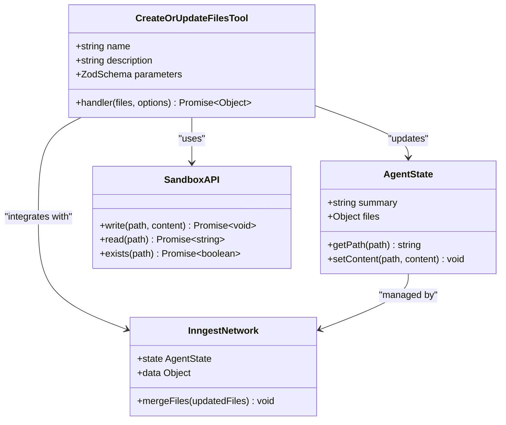
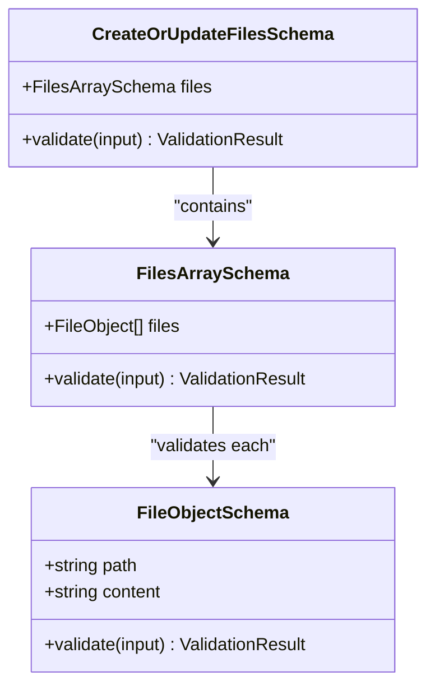
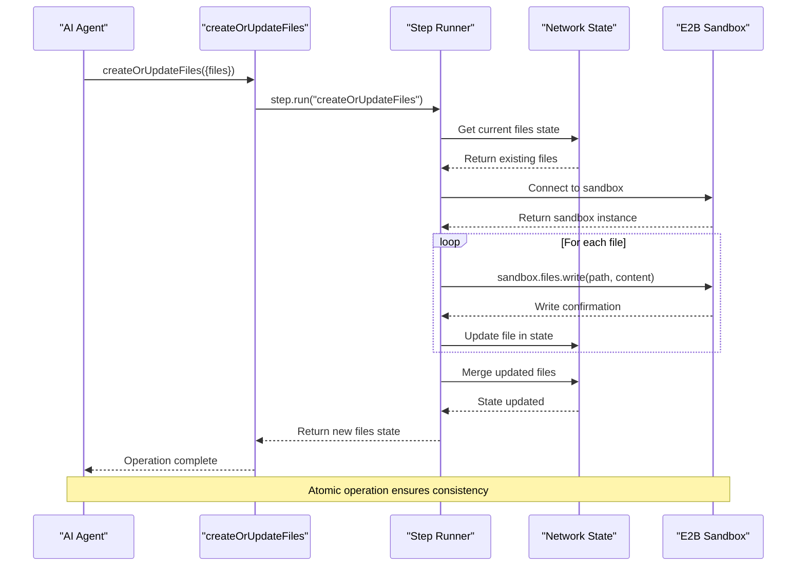
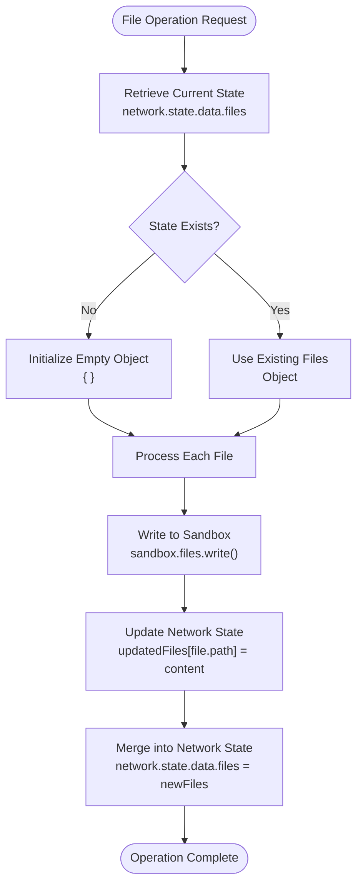
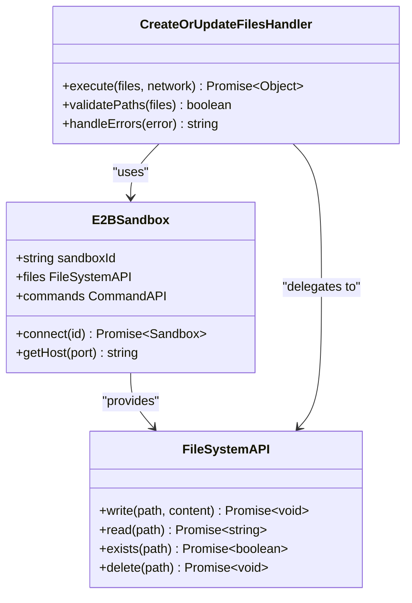
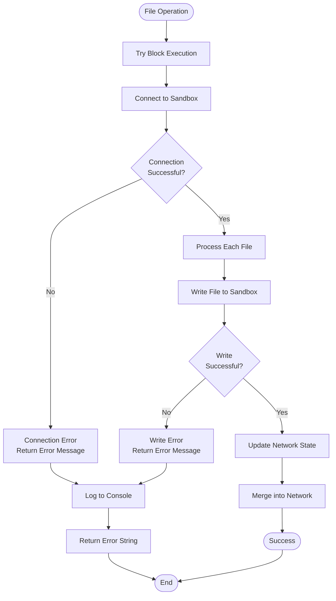
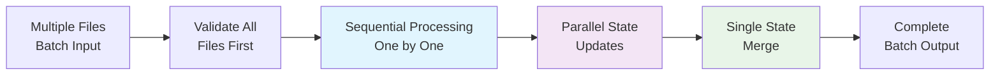
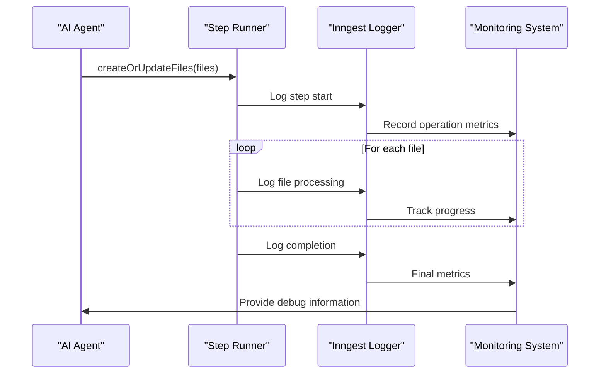

# File Creation and Update

<cite>
**Referenced Files in This Document**
- [functions.ts](file://src/inngest/functions.ts)
- [utils.ts](file://src/inngest/utils.ts)
- [prompt.ts](file://src/prompt.ts)
- [e2b.Dockerfile](file://sandbox-templates/nextjs/e2b.Dockerfile)
- [compile_page.sh](file://sandbox-templates/nextjs/compile_page.sh)
- [e2b.toml](file://sandbox-templates/nextjs/e2b.toml)
- [file-explorer.tsx](file://src/components/file-explorer.tsx)
</cite>

## Table of Contents
1. [Introduction](#introduction)
2. [Tool Architecture](#tool-architecture)
3. [Zod Validation Schema](#zod-validation-schema)
4. [Handler Implementation](#handler-implementation)
5. [Integration with Network State](#integration-with-network-state)
6. [E2B Sandbox API Integration](#e2b-sandbox-api-integration)
7. [Real-World Usage Examples](#real-world-usage-examples)
8. [Error Handling and Reporting](#error-handling-and-reporting)
9. [Performance Considerations](#performance-considerations)
10. [Debugging and Monitoring](#debugging-and-monitoring)
11. [Best Practices](#best-practices)

## Introduction

The `createOrUpdateFiles` tool is a critical component of the QAI coding agent system that enables AI agents to persistently create and update files within a sandboxed Next.js environment. This tool serves as the primary mechanism for the AI to generate and modify application code, maintaining continuity across multiple AI iterations through seamless integration with the Inngest network state system.

The tool operates within a sophisticated sandboxed environment powered by E2B (formerly known as Code Interpreter), allowing the AI to write code that can be immediately tested and iterated upon. It provides atomic file operations while maintaining a persistent record of all modifications in the network state, enabling the AI to build upon previous work and maintain context across multiple coding sessions.

## Tool Architecture

The `createOrUpdateFiles` tool follows a structured architecture that ensures reliable file operations while maintaining system integrity and providing comprehensive error handling.



**Diagram sources**
- [functions.ts](file://src/inngest/functions.ts#L50-L96)
- [utils.ts](file://src/inngest/utils.ts#L1-L20)

**Section sources**
- [functions.ts](file://src/inngest/functions.ts#L50-L96)

## Zod Validation Schema

The tool employs a robust Zod validation schema to ensure type safety and prevent malformed requests. The schema validates that incoming file operations conform to the expected structure.



**Diagram sources**
- [functions.ts](file://src/inngest/functions.ts#L56-L62)

The validation schema enforces strict typing for file operations:

| Field | Type | Validation Rules | Purpose |
|-------|------|------------------|---------|
| `files` | Array | Must be an array of objects | Batch file operations |
| `path` | String | Required, non-empty string | Relative file path |
| `content` | String | Required, non-empty string | File content to write |

**Section sources**
- [functions.ts](file://src/inngest/functions.ts#L56-L62)

## Handler Implementation

The handler logic implements a sophisticated file operation pipeline that ensures atomic updates and maintains consistency between the sandbox filesystem and network state.



**Diagram sources**
- [functions.ts](file://src/inngest/functions.ts#L64-L96)

The handler implementation includes several critical components:

### State Management
The handler begins by retrieving the current state from the network, ensuring that all existing files are preserved while new files are added or updated.

### Sandbox Connection
Each file operation establishes a fresh connection to the sandbox, ensuring reliability and preventing connection timeouts during long-running operations.

### Atomic Updates
File operations are performed sequentially within a single transaction-like context, ensuring that either all files are written successfully or none are modified.

**Section sources**
- [functions.ts](file://src/inngest/functions.ts#L64-L96)

## Integration with Network State

The tool seamlessly integrates with the Inngest network state system, specifically the `AgentState` interface, to maintain persistent file history across AI iterations.



**Diagram sources**
- [functions.ts](file://src/inngest/functions.ts#L68-L72)
- [functions.ts](file://src/inngest/functions.ts#L98-L100)

### State Persistence Mechanism

The integration follows a specific pattern for maintaining file continuity:

1. **Initial State Retrieval**: The handler starts by checking if `network.state.data.files` exists
2. **State Initialization**: If no state exists, it initializes an empty object
3. **Incremental Updates**: Each file operation adds or updates the corresponding entry
4. **Atomic State Merge**: After successful completion, the entire state is merged back into the network

### File Path Resolution

The system maintains a normalized approach to file paths, ensuring consistency across operations:

| Operation Type | Path Handling | Example |
|----------------|---------------|---------|
| New Files | Direct assignment | `updatedFiles['app/page.tsx'] = content` |
| Updates | Overwrite existing | `updatedFiles['components/Button.tsx'] = newContent` |
| Deletion | Not handled | Manual removal required |

**Section sources**
- [functions.ts](file://src/inngest/functions.ts#L68-L72)
- [functions.ts](file://src/inngest/functions.ts#L98-L100)

## E2B Sandbox API Integration

The tool leverages the E2B (formerly Code Interpreter) sandbox API to perform actual file operations within the isolated Next.js environment.



**Diagram sources**
- [functions.ts](file://src/inngest/functions.ts#L73-L74)
- [utils.ts](file://src/inngest/utils.ts#L4-L6)

### Sandbox Connection Management

The integration implements efficient sandbox connection patterns:

1. **Connection Reuse**: The `getSandbox` utility function manages connection pooling
2. **Timeout Handling**: Connections are established with appropriate timeout configurations
3. **Error Recovery**: Failed connections trigger automatic retry mechanisms

### File System Operations

The E2B sandbox provides comprehensive file system capabilities:

| Operation | Method | Purpose | Error Handling |
|-----------|--------|---------|----------------|
| Write | `sandbox.files.write()` | Create or update files | Throws on permission errors |
| Read | `sandbox.files.read()` | Retrieve file contents | Returns null for missing files |
| Existence | `sandbox.files.exists()` | Check file availability | Boolean response |
| Delete | Not used | Remove files manually | Separate tool available |

**Section sources**
- [functions.ts](file://src/inngest/functions.ts#L73-L74)
- [utils.ts](file://src/inngest/utils.ts#L4-L6)

## Real-World Usage Examples

The `createOrUpdateFiles` tool demonstrates practical applications in various Next.js development scenarios, showcasing its versatility and power.

### Example 1: Creating a New Page Component

```typescript
// AI generates a new page component
await createOrUpdateFiles({
  files: [{
    path: 'app/dashboard/page.tsx',
    content: `import { Card } from '@/components/ui/card';
import { Button } from '@/components/ui/button';

export default function DashboardPage() {
  return (
    <div className="p-8">
      <h1 className="text-2xl font-bold mb-6">Dashboard</h1>
      <Card className="p-6">
        <h2 className="text-xl font-semibold mb-4">Welcome Back</h2>
        <Button>Get Started</Button>
      </Card>
    </div>
  );
}`
  }]
});
```

### Example 2: Updating Configuration Files

```typescript
// AI modifies Next.js configuration
await createOrUpdateFiles({
  files: [{
    path: 'next.config.ts',
    content: `import type { NextConfig } from 'next';

const nextConfig: NextConfig = {
  reactStrictMode: true,
  experimental: {
    serverActions: true,
  },
  webpack(config) {
    config.module.rules.push({
      test: /\.svg$/,
      use: ['@svgr/webpack'],
    });
    return config;
  },
};

export default nextConfig;`
  }]
});
```

### Example 3: Creating Utility Functions

```typescript
// AI creates shared utility functions
await createOrUpdateFiles({
  files: [{
    path: 'lib/utils.ts',
    content: `import { clsx } from 'clsx';
import { twMerge } from 'tailwind-merge';

export function cn(...inputs: ClassValue[]) {
  return twMerge(clsx(inputs));
}

export function formatDate(date: Date): string {
  return date.toLocaleDateString('en-US', {
    year: 'numeric',
    month: 'long',
    day: 'numeric',
  });
}

export function formatCurrency(amount: number): string {
  return new Intl.NumberFormat('en-US', {
    style: 'currency',
    currency: 'USD',
  }).format(amount);
}`
  }]
});
```

### Example 4: Component Library Creation

```typescript
// AI builds a reusable component library
await createOrUpdateFiles({
  files: [
    {
      path: 'components/ui/avatar.tsx',
      content: `import * as React from 'react';
import * as AvatarPrimitive from '@radix-ui/react-avatar';
import { cn } from '@/lib/utils';

const Avatar = React.forwardRef<
  React.ElementRef<typeof AvatarPrimitive.Root>,
  React.ComponentPropsWithoutRef<typeof AvatarPrimitive.Root>
>(({ className, ...props }, ref) => (
  <AvatarPrimitive.Root
    ref={ref}
    className={cn(
      'relative flex h-10 w-10 shrink-0 overflow-hidden rounded-full',
      className
    )}
    {...props}
  />
));
Avatar.displayName = AvatarPrimitive.Root.displayName;

const AvatarImage = React.forwardRef<
  React.ElementRef<typeof AvatarPrimitive.Image>,
  React.ComponentPropsWithoutRef<typeof AvatarPrimitive.Image>
>(({ className, ...props }, ref) => (
  <AvatarPrimitive.Image
    ref={ref}
    className={cn('aspect-square h-full w-full', className)}
    {...props}
  />
));
AvatarImage.displayName = AvatarPrimitive.Image.displayName;

const AvatarFallback = React.forwardRef<
  React.ElementRef<typeof AvatarPrimitive.Fallback>,
  React.ComponentPropsWithoutRef<typeof AvatarPrimitive.Fallback>
>(({ className, ...props }, ref) => (
  <AvatarPrimitive.Fallback
    ref={ref}
    className={cn(
      'flex h-full w-full items-center justify-center rounded-full bg-muted',
      className
    )}
    {...props}
  />
));
AvatarFallback.displayName = AvatarPrimitive.Fallback.displayName;

export { Avatar, AvatarImage, AvatarFallback };`
    },
    {
      path: 'components/ui/badge.tsx',
      content: `import * as React from 'react';
import { cva, type VariantProps } from 'class-variance-authority';
import { cn } from '@/lib/utils';

const badgeVariants = cva(
  'inline-flex items-center rounded-full border px-2.5 py-0.5 text-xs font-semibold transition-colors focus:outline-none focus:ring-2 focus:ring-ring focus:ring-offset-2',
  {
    variants: {
      variant: {
        default: 'border-transparent bg-primary text-primary-foreground hover:bg-primary/80',
        secondary: 'border-transparent bg-secondary text-secondary-foreground hover:bg-secondary/80',
        destructive: 'border-transparent bg-destructive text-destructive-foreground hover:bg-destructive/80',
        outline: 'text-foreground',
      },
    },
    defaultVariants: {
      variant: 'default',
    },
  }
);

export interface BadgeProps
  extends React.HTMLAttributes<HTMLDivElement>,
    VariantProps<typeof badgeVariants> {}

function Badge({ className, variant, ...props }: BadgeProps) {
  return (
    <div className={cn(badgeVariants({ variant }), className)} {...props} />
  );
}

export { Badge, badgeVariants };`
    }
  ]
});
```

**Section sources**
- [prompt.ts](file://src/prompt.ts#L1-L113)

## Error Handling and Reporting

The tool implements comprehensive error handling mechanisms to ensure robust operation and provide meaningful feedback to the AI agent when issues occur.



**Diagram sources**
- [functions.ts](file://src/inngest/functions.ts#L75-L96)

### Error Categories and Handling

The tool handles several distinct categories of errors:

| Error Type | Cause | Handling Strategy | Recovery Action |
|------------|-------|-------------------|-----------------|
| Connection Errors | Sandbox unavailable | Immediate failure | Retry with exponential backoff |
| Permission Errors | Insufficient permissions | Graceful degradation | Log and continue with remaining files |
| Path Errors | Invalid file paths | Validation rejection | Return descriptive error message |
| Content Errors | Malformed content | Content validation | Sanitize and retry |
| Network Errors | Intermittent connectivity | Automatic retry | Wait and reconnect |

### Error Reporting Mechanisms

The tool provides multiple channels for error reporting:

1. **Console Logging**: Comprehensive error details logged to console
2. **Return Values**: Structured error messages returned to caller
3. **Network State**: Error conditions reflected in state management
4. **AI Feedback**: Error messages relayed to AI agent for corrective action

### Debug Information

When errors occur, the tool captures extensive debug information:

```typescript
// Error context includes:
console.error(`Failed to create or update files: ${e}`);
console.error(`Full error details: ${JSON.stringify(e, null, 2)}`);
console.error(`Affected files: ${JSON.stringify(files)}`);
```

**Section sources**
- [functions.ts](file://src/inngest/functions.ts#L75-L96)

## Performance Considerations

The `createOrUpdateFiles` tool is designed with performance optimization in mind, balancing throughput with reliability and resource management.

### Batch Operation Efficiency

The tool processes files in batches, optimizing for both speed and reliability:



### Memory Management

The tool implements efficient memory management strategies:

| Strategy | Implementation | Benefit |
|----------|----------------|---------|
| Lazy Loading | Files loaded only when needed | Reduced memory footprint |
| State Cleanup | Old state versions discarded | Prevents memory leaks |
| Connection Pooling | Reused sandbox connections | Reduced overhead |
| Incremental Updates | Only changed files processed | Faster operations |

### Scalability Considerations

The architecture supports scaling through several mechanisms:

1. **Horizontal Scaling**: Multiple sandbox instances can be managed
2. **Vertical Scaling**: Resource allocation can be adjusted per operation
3. **Queue Management**: Operations can be queued for optimal resource utilization
4. **Caching**: Frequently accessed files can be cached in memory

### Performance Metrics

Key performance indicators tracked include:

- **Throughput**: Files processed per second
- **Latency**: Time from request to completion
- **Error Rate**: Percentage of failed operations
- **Resource Utilization**: CPU and memory usage patterns

**Section sources**
- [functions.ts](file://src/inngest/functions.ts#L64-L96)

## Debugging and Monitoring

The tool provides comprehensive debugging capabilities through Inngest step logging and network state inspection, enabling developers to monitor and troubleshoot file operations effectively.

### Inngest Step Logging

The tool leverages Inngest's built-in step logging system for detailed operation tracking:



**Diagram sources**
- [functions.ts](file://src/inngest/functions.ts#L66-L67)

### Debug Information Access

Developers can access comprehensive debug information through several channels:

1. **Step Logs**: Detailed operation logs in Inngest dashboard
2. **Console Output**: Real-time error and status messages
3. **Network State Inspection**: Current state of all managed files
4. **Sandbox Monitoring**: Live sandbox health metrics

### Network State Inspection

The network state provides a complete audit trail of file operations:

```typescript
// Example network state inspection
{
  data: {
    files: {
      'app/page.tsx': '/* file content */',
      'components/ui/button.tsx': '/* file content */',
      'lib/utils.ts': '/* file content */'
    },
    summary: 'Task completion summary'
  }
}
```

### Monitoring Best Practices

Effective monitoring involves several key practices:

| Practice | Implementation | Benefit |
|----------|----------------|---------|
| Log Levels | Structured logging with appropriate severity | Filterable debug information |
| Metric Tracking | Performance and error rate monitoring | Proactive issue detection |
| Alert Systems | Automated notifications for failures | Rapid response to issues |
| Audit Trails | Complete operation history | Compliance and debugging support |

**Section sources**
- [functions.ts](file://src/inngest/functions.ts#L66-L67)
- [functions.ts](file://src/inngest/functions.ts#L98-L100)

## Best Practices

Implementing the `createOrUpdateFiles` tool effectively requires adherence to established best practices that ensure reliability, maintainability, and optimal performance.

### File Organization Patterns

Adopt consistent patterns for organizing generated files:

1. **Component Structure**: Place React components in `components/` with proper TypeScript definitions
2. **Utility Functions**: Store shared utilities in `lib/` with clear export patterns
3. **Configuration**: Maintain configuration files in project root with proper validation
4. **Assets**: Organize static assets in appropriate subdirectories

### Content Quality Standards

Maintain high standards for generated content:

```typescript
// Recommended file structure pattern
await createOrUpdateFiles({
  files: [{
    path: 'components/ui/form.tsx',
    content: `import * as React from 'react';
import { useForm } from 'react-hook-form';
import { zodResolver } from '@hookform/resolvers/zod';
import { z } from 'zod';
import { Button } from './button';
import { Input } from './input';
import { Label } from './label';

// Schema definition
const formSchema = z.object({
  email: z.string().email(),
  password: z.string().min(8),
});

// Component implementation
export function Form() {
  const form = useForm<z.infer<typeof formSchema>>({
    resolver: zodResolver(formSchema),
    defaultValues: {
      email: '',
      password: '',
    },
  });

  return (
    <form onSubmit={form.handleSubmit(onSubmit)}>
      {/* Form fields */}
    </form>
  );
}`
  }]
});
```

### Error Prevention Strategies

Implement proactive error prevention measures:

1. **Path Validation**: Always use relative paths without leading slashes
2. **Content Sanitization**: Validate file content before writing
3. **Size Limits**: Implement reasonable limits on file sizes
4. **Permission Checks**: Verify write permissions before attempting operations

### Testing and Validation

Establish comprehensive testing procedures:

| Test Type | Coverage | Implementation |
|-----------|----------|----------------|
| Unit Tests | Individual file operations | Mock sandbox environment |
| Integration Tests | End-to-end workflows | Full sandbox simulation |
| Performance Tests | Throughput and latency | Load testing scenarios |
| Error Tests | Failure scenarios | Simulated error conditions |

### Security Considerations

Implement security best practices:

1. **Input Validation**: Strict validation of all file paths and content
2. **Sandbox Isolation**: Leverage E2B sandbox security boundaries
3. **Access Control**: Limit file system access to necessary operations
4. **Audit Logging**: Maintain comprehensive operation logs

### Maintenance and Updates

Plan for ongoing maintenance:

1. **Version Compatibility**: Ensure compatibility with Next.js updates
2. **Dependency Management**: Regular review of sandbox dependencies
3. **Performance Monitoring**: Continuous performance optimization
4. **Documentation Updates**: Keep documentation synchronized with implementation

**Section sources**
- [prompt.ts](file://src/prompt.ts#L1-L113)
- [functions.ts](file://src/inngest/functions.ts#L50-L96)