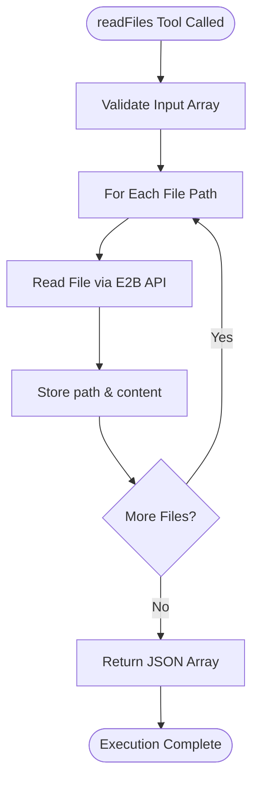
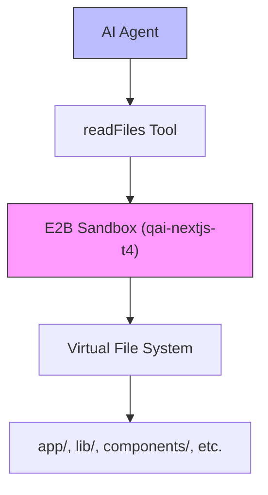
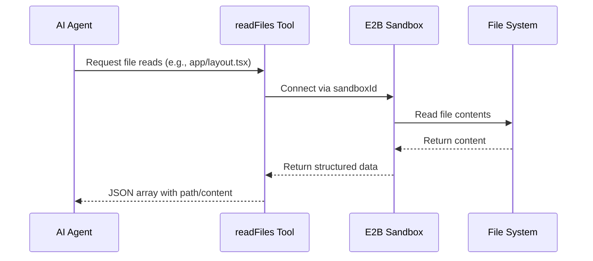

# File Reading

<cite>
**Referenced Files in This Document**   
- [functions.ts](file://src/inngest/functions.ts)
- [utils.ts](file://src/inngest/utils.ts)
- [prompt.ts](file://src/prompt.ts)
- [package.json](file://package.json)
- [layout.tsx](file://src/app/layout.tsx)
- [e2b.Dockerfile](file://sandbox-templates/nextjs/e2b.Dockerfile)
- [e2b.toml](file://sandbox-templates/nextjs/e2b.toml)
</cite>

## Table of Contents
1. [Introduction](#introduction)
2. [Tool Purpose and Context-Aware Development](#tool-purpose-and-context-aware-development)
3. [Input Schema and Validation](#input-schema-and-validation)
4. [Handler Logic and Execution Flow](#handler-logic-and-execution-flow)
5. [Error Handling and Safety](#error-handling-and-safety)
6. [Real-World Usage Examples](#real-world-usage-examples)
7. [Security and Sandboxing](#security-and-sandboxing)
8. [Debugging and Logging](#debugging-and-logging)
9. [Integration with AI Workflows](#integration-with-ai-workflows)
10. [Conclusion](#conclusion)

## Introduction
The `readFiles` tool is a critical component in the AI agent's toolkit, enabling safe, read-only access to the file system within an isolated E2B sandbox environment. It allows the agent to inspect existing code before making modifications, ensuring context-aware development and preventing destructive changes. This documentation details its implementation, usage patterns, security model, and integration within automated coding workflows.

**Section sources**
- [functions.ts](file://src/inngest/functions.ts#L98-L135)

## Tool Purpose and Context-Aware Development
The `readFiles` tool enables the AI agent to inspect the current state of the codebase before performing any modifications. This capability supports non-destructive, incremental development by allowing the agent to understand file contents, structure, and dependencies prior to writing new code. For example, reading `app/layout.tsx` before adding a new route ensures compatibility with existing layout structures and prevents duplication or conflicts.

By inspecting files such as `package.json`, the agent can determine installed dependencies and avoid redundant installations. Similarly, checking component files under `@/components/ui/` allows accurate usage of Shadcn UI components without guessing prop names or variants. This contextual awareness is essential for generating production-quality code that integrates seamlessly with the existing codebase.

**Section sources**
- [functions.ts](file://src/inngest/functions.ts#L98-L135)
- [prompt.ts](file://src/prompt.ts#L1-L114)
- [layout.tsx](file://src/app/layout.tsx#L1-L43)

## Input Schema and Validation
The `readFiles` tool accepts an array of file paths through a Zod-validated input schema. The schema is defined as:

```ts
z.object({
  files: z.array(z.string()),
})
```

This ensures that only valid string arrays are processed, preventing malformed inputs from reaching the handler. Each path in the array must be a relative path from the root of the sandbox environment (e.g., `app/page.tsx`, `lib/utils.ts`). Absolute paths or paths containing `/home/user` prefixes are not allowed, as they violate the sandbox's path resolution rules.

The use of Zod provides compile-time type safety and runtime validation, ensuring robust error handling and predictable behavior across different usage scenarios.

**Section sources**
- [functions.ts](file://src/inngest/functions.ts#L101-L103)

## Handler Logic and Execution Flow
The handler logic for `readFiles` executes within an Inngest step function, ensuring traceability and observability via Inngest's logging infrastructure. When invoked, the handler:

1. Retrieves the active sandbox instance using the shared `sandboxId`.
2. Iterates over each requested file path.
3. Uses the E2B `sandbox.files.read()` method to retrieve file contents.
4. Constructs a structured JSON response containing both the file path and content.
5. Returns the aggregated results as a JSON string.

Each file read operation is performed synchronously within the loop to ensure ordering and simplify error tracking. The final output is a JSON array of objects with `path` and `content` fields, enabling downstream processing by the AI agent.



**Diagram sources**
- [functions.ts](file://src/inngest/functions.ts#L105-L135)

**Section sources**
- [functions.ts](file://src/inngest/functions.ts#L105-L135)
- [utils.ts](file://src/inngest/utils.ts#L1-L20)

## Error Handling and Safety
The `readFiles` tool implements robust error handling to manage scenarios where files are missing, unreadable, or inaccessible. All file operations are wrapped in try-catch blocks that capture exceptions and return meaningful error messages without crashing the agent.

If a file cannot be read (e.g., due to incorrect path or permissions), the error is logged to the console and returned as a descriptive string prefixed with `Failed to read files:`. This allows the AI agent to interpret the failure and potentially adjust its strategy, such as verifying the correct path or checking if the file needs to be created first.

The tool does not halt execution on individual file failures but continues processing remaining files in the array, maximizing information retrieval even in partially failed scenarios.

**Section sources**
- [functions.ts](file://src/inngest/functions.ts#L118-L135)

## Real-World Usage Examples
In practical AI workflows, the `readFiles` tool is used extensively to support informed decision-making. For instance:

- Before modifying `app/layout.tsx`, the agent reads it to understand existing layout wrappers, theme providers, and script injections.
- When implementing a new feature requiring UI components, the agent reads relevant files from `@/components/ui/` to verify component APIs and usage patterns.
- To ensure compatibility with project dependencies, the agent reads `package.json` to check installed versions of libraries like React, Next.js, or Tailwind CSS.

These inspections prevent common errors such as incorrect imports, incompatible API usage, or redundant package installations, significantly improving code quality and reducing debugging cycles.

**Section sources**
- [functions.ts](file://src/inngest/functions.ts#L98-L135)
- [prompt.ts](file://src/prompt.ts#L1-L114)
- [package.json](file://package.json#L1-L92)

## Security and Sandboxing
The `readFiles` tool operates within a fully isolated E2B sandbox environment, ensuring read-only access to the file system. The sandbox is created using a predefined Docker template (`qai-nextjs-t4`) that includes a minimal Node.js setup with Next.js and Shadcn UI preconfigured.

All file operations are restricted to the sandbox's virtual file system, which is ephemeral and destroyed after each session. This isolation prevents any permanent changes or access to host system resources. Additionally, the agent cannot traverse outside the designated workspace directory or access sensitive system files.

The use of relative paths and strict path validation further enhances security by preventing directory traversal attacks or unauthorized file access.



**Diagram sources**
- [e2b.Dockerfile](file://sandbox-templates/nextjs/e2b.Dockerfile#L1-L20)
- [e2b.toml](file://sandbox-templates/nextjs/e2b.toml#L1-L18)

**Section sources**
- [functions.ts](file://src/inngest/functions.ts#L98-L135)
- [utils.ts](file://src/inngest/utils.ts#L1-L20)

## Debugging and Logging
The `readFiles` tool integrates with Inngest's observability platform, enabling detailed tracing of file access patterns through function logs. Each invocation is recorded as a step in the Inngest dashboard, showing input parameters, execution duration, and output results.

Developers can use these logs to:
- Verify which files were accessed during a session
- Diagnose path resolution issues
- Validate content accuracy after reads
- Audit agent behavior for compliance and safety

Additionally, console.error outputs are captured for any read failures, providing immediate feedback during development and testing phases.

**Section sources**
- [functions.ts](file://src/inngest/functions.ts#L118-L135)

## Integration with AI Workflows
The `readFiles` tool is a foundational element in the AI agent's autonomous coding workflow. It enables context-aware generation by allowing the agent to:
- Inspect existing code before proposing changes
- Avoid assumptions about file contents
- Dynamically adapt to project structure
- Ensure consistency with architectural patterns

This capability is especially valuable when working with complex UI components or framework-specific configurations, where incorrect assumptions can lead to runtime errors or visual inconsistencies.

By combining `readFiles` with other tools like `createOrUpdateFiles` and `terminal`, the agent forms a complete development loop: read → analyze → modify → test → repeat.



**Diagram sources**
- [functions.ts](file://src/inngest/functions.ts#L98-L135)

**Section sources**
- [functions.ts](file://src/inngest/functions.ts#L98-L135)
- [prompt.ts](file://src/prompt.ts#L1-L114)

## Conclusion
The `readFiles` tool plays a vital role in enabling safe, intelligent, and context-aware code generation within the AI agent system. By providing reliable read-only access to the sandboxed file system, it empowers the agent to make informed decisions, avoid destructive changes, and produce high-quality, integrated code. Its robust validation, error handling, and integration with observability tools make it a cornerstone of the automated development workflow.