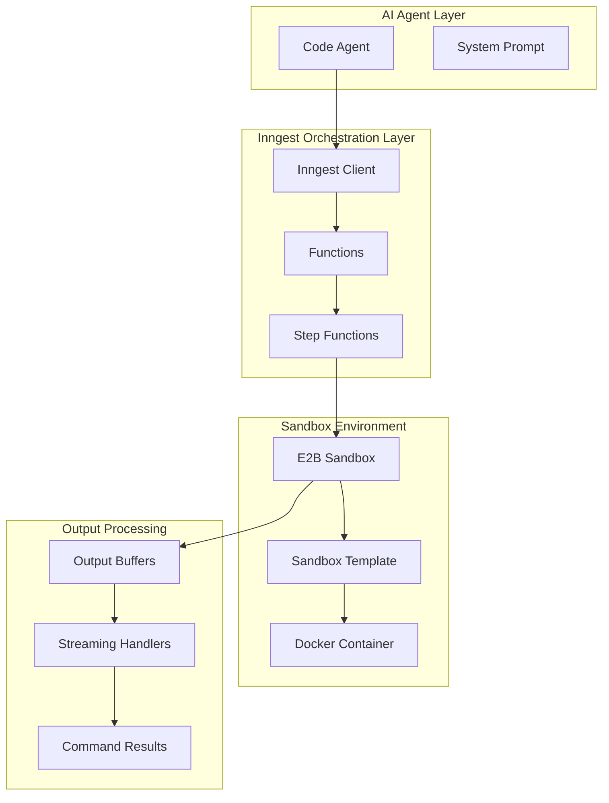
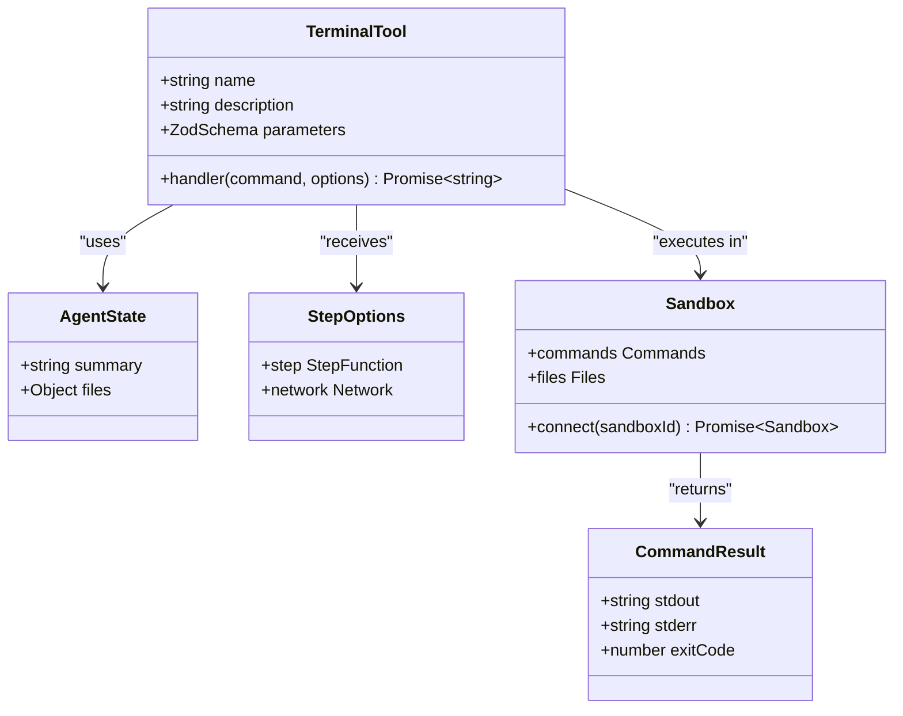
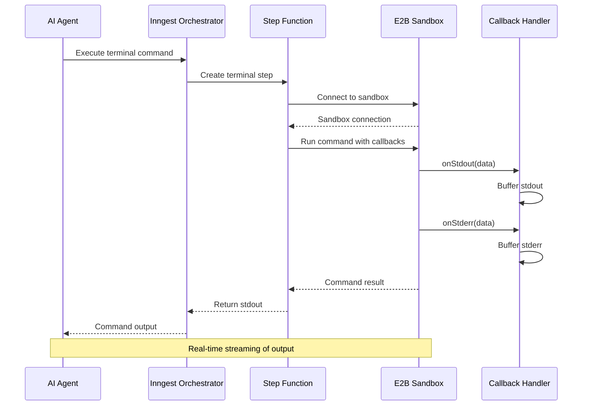
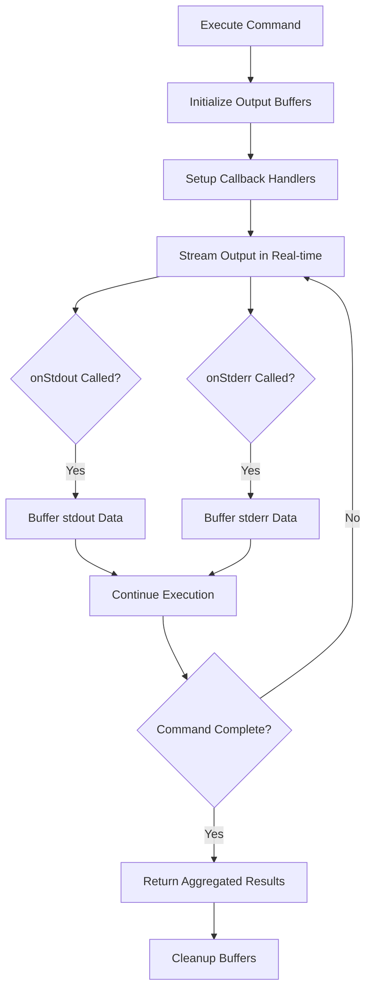
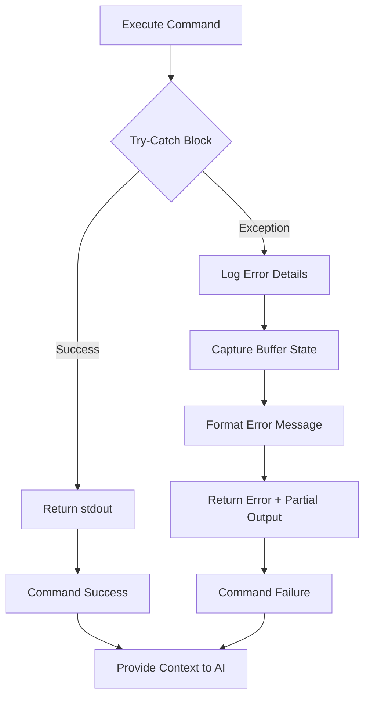
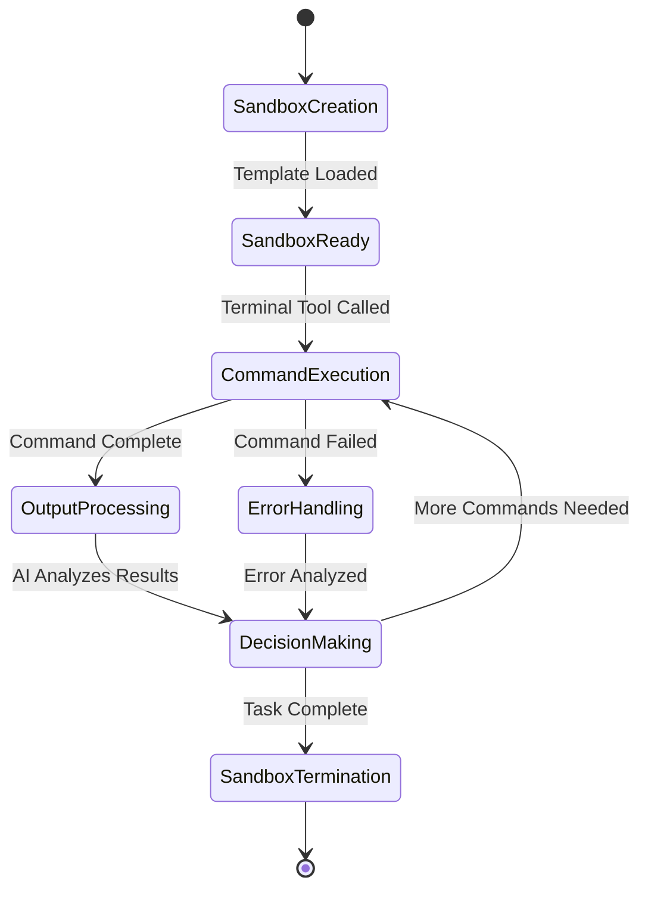

# Terminal Execution

<cite>
**Referenced Files in This Document**
- [functions.ts](file://src/inngest/functions.ts)
- [utils.ts](file://src/inngest/utils.ts)
- [client.ts](file://src/inngest/client.ts)
- [route.ts](file://src/app/api/inngest/route.ts)
- [prompt.ts](file://src/prompt.ts)
- [e2b.toml](file://sandbox-templates/nextjs/e2b.toml)
- [compile_page.sh](file://sandbox-templates/nextjs/compile_page.sh)
- [package-lock.json](file://package-lock.json)
</cite>

## Table of Contents
1. [Introduction](#introduction)
2. [System Architecture](#system-architecture)
3. [Terminal Tool Implementation](#terminal-tool-implementation)
4. [Zod Parameter Schema](#zod-parameter-schema)
5. [Execution Flow with Inngest](#execution-flow-with-inngest)
6. [Real-time Output Streaming](#real-time-output-streaming)
7. [Error Handling and Recovery](#error-handling-and-recovery)
8. [Security Considerations](#security-considerations)
9. [Integration with Sandbox Lifecycle](#integration-with-sandbox-lifecycle)
10. [Debugging and Monitoring](#debugging-and-monitoring)
11. [Practical Examples](#practical-examples)
12. [Best Practices](#best-practices)

## Introduction

The terminal tool within the AI agent's toolset serves as a critical component for executing shell commands in a secure, isolated E2B sandbox environment. This tool enables the AI agent to perform essential development tasks such as installing dependencies, inspecting project structures, and managing file systems while maintaining strict security boundaries through sandbox isolation.

The terminal tool operates as part of a sophisticated AI-driven development pipeline, where it receives command requests from the AI agent, executes them in a controlled environment, and returns structured output for further processing. This capability is fundamental to the AI agent's ability to autonomously build and modify Next.js applications within the QAI platform.

## System Architecture

The terminal execution system is built on a multi-layered architecture that ensures security, reliability, and observability:



**Diagram sources**
- [functions.ts](file://src/inngest/functions.ts#L13-L53)
- [utils.ts](file://src/inngest/utils.ts#L1-L20)
- [e2b.toml](file://sandbox-templates/nextjs/e2b.toml#L1-L17)

**Section sources**
- [functions.ts](file://src/inngest/functions.ts#L1-L212)
- [utils.ts](file://src/inngest/utils.ts#L1-L21)

## Terminal Tool Implementation

The terminal tool is implemented as a specialized function within the AI agent's toolkit, utilizing the Inngest framework for orchestration and the E2B sandbox for execution. The tool definition demonstrates a clean separation of concerns between validation, execution, and error handling.



**Diagram sources**
- [functions.ts](file://src/inngest/functions.ts#L25-L53)
- [utils.ts](file://src/inngest/utils.ts#L1-L20)

The terminal tool accepts a single parameter containing the command string to execute. The implementation leverages Inngest's step function capabilities to provide observability and ensure reliable execution within the sandbox environment.

**Section sources**
- [functions.ts](file://src/inngest/functions.ts#L25-L53)

## Zod Parameter Schema

The terminal tool employs a robust Zod schema for parameter validation, ensuring type safety and preventing malformed command execution attempts. The schema definition demonstrates the principle of minimal yet effective validation.

The parameter schema accepts a single `command` property of type `string`, which undergoes runtime validation before execution. This design choice prioritizes flexibility while maintaining security through sandbox isolation rather than input sanitization.

**Section sources**
- [functions.ts](file://src/inngest/functions.ts#L28-L31)

## Execution Flow with Inngest

The terminal tool execution follows a structured flow orchestrated by Inngest step functions, providing observability and fault tolerance. The execution process involves several key phases:



**Diagram sources**
- [functions.ts](file://src/inngest/functions.ts#L32-L53)
- [utils.ts](file://src/inngest/utils.ts#L4-L7)

The Inngest step function provides several benefits:
- **Observability**: Each step execution is tracked and logged
- **Fault Tolerance**: Automatic retry mechanisms for transient failures
- **State Management**: Persistent state across step executions
- **Monitoring**: Built-in metrics and tracing capabilities

**Section sources**
- [functions.ts](file://src/inngest/functions.ts#L32-L53)

## Real-time Output Streaming

The terminal tool implements sophisticated real-time output streaming through callback handlers that aggregate stdout and stderr data. This streaming mechanism enables immediate feedback and allows the AI agent to monitor long-running operations.



**Diagram sources**
- [functions.ts](file://src/inngest/functions.ts#L38-L50)

The callback handlers maintain separate buffers for stdout and stderr, allowing the AI agent to distinguish between informational output and error conditions. This separation is crucial for intelligent decision-making based on command execution results.

**Section sources**
- [functions.ts](file://src/inngest/functions.ts#L38-L50)

## Error Handling and Recovery

The terminal tool implements comprehensive error handling that captures both command failures and partial output for AI context. The error handling strategy ensures that the AI agent receives sufficient information to make informed decisions about subsequent actions.



**Diagram sources**
- [functions.ts](file://src/inngest/functions.ts#L44-L53)

The error handling mechanism captures:
- **Exception Details**: Full error information from the command execution
- **Partial Output**: Any stdout/stderr data accumulated before failure
- **Context Preservation**: Complete buffer state for AI analysis

This approach enables the AI agent to understand partial results and potentially recover from failures by adjusting subsequent commands.

**Section sources**
- [functions.ts](file://src/inngest/functions.ts#L44-L53)

## Security Considerations

The terminal tool operates within a secure E2B sandbox environment that provides multiple layers of isolation and protection against malicious commands. Security is achieved through several mechanisms:

### Sandbox Isolation
- **Containerized Environment**: Commands execute in isolated Docker containers
- **Resource Limits**: CPU, memory, and disk quotas prevent resource exhaustion
- **Network Restrictions**: Controlled network access prevents unauthorized communication
- **File System Boundaries**: Restricted file system access prevents system compromise

### Command Injection Prevention
While the terminal tool validates input types using Zod, the primary defense against command injection comes from the sandbox environment itself. The E2B sandbox isolates commands from the host system and other sandboxes.

### Access Control
- **Template-Based Sandboxes**: Pre-configured templates limit available system resources
- **User Permissions**: Commands execute with restricted user privileges
- **Audit Logging**: All command executions are logged for security monitoring

**Section sources**
- [e2b.toml](file://sandbox-templates/nextjs/e2b.toml#L1-L17)
- [compile_page.sh](file://sandbox-templates/nextjs/compile_page.sh#L1-L19)

## Integration with Sandbox Lifecycle

The terminal tool integrates seamlessly with the sandbox lifecycle, participating in the broader orchestration of AI-driven development tasks. The integration ensures that commands execute within the appropriate sandbox context and that results influence subsequent AI decisions.



**Diagram sources**
- [functions.ts](file://src/inngest/functions.ts#L15-L23)
- [utils.ts](file://src/inngest/utils.ts#L4-L7)

The sandbox lifecycle integration provides:
- **Automatic Resource Management**: Sandboxes are created and destroyed automatically
- **Persistent State**: File system changes persist across command executions
- **Environment Consistency**: Consistent Next.js development environment for each session

**Section sources**
- [functions.ts](file://src/inngest/functions.ts#L15-L23)
- [utils.ts](file://src/inngest/utils.ts#L4-L7)

## Debugging and Monitoring

The terminal tool provides comprehensive debugging capabilities through Inngest's built-in observability features and custom logging mechanisms. Debugging is facilitated through multiple channels:

### Inngest Function Logs
Inngest automatically captures detailed logs for each step execution, including:
- **Execution Traces**: Complete execution history with timing information
- **Parameter Validation**: Input parameter validation results
- **Error Context**: Full error stack traces with context
- **Performance Metrics**: Execution duration and resource utilization

### Custom Error Logging
The terminal tool implements custom error logging that captures:
- **Command Failures**: Detailed error messages with buffer state
- **Partial Output**: Accumulated stdout/stderr for context
- **Execution Context**: Sandbox ID and environment information

### Monitoring Dashboard
The system provides visibility through:
- **Function Execution Status**: Real-time monitoring of function execution
- **Error Rate Tracking**: Monitoring of command failure rates
- **Performance Analytics**: Command execution time analysis
- **Resource Utilization**: Sandbox resource consumption tracking

**Section sources**
- [functions.ts](file://src/inngest/functions.ts#L44-L53)
- [route.ts](file://src/app/api/inngest/route.ts#L1-L11)

## Practical Examples

The terminal tool supports various practical scenarios commonly encountered in AI-driven development tasks:

### Dependency Installation
```bash
# Install a new npm package
npm install axios --yes

# Install with specific version
npm install lodash@4.17.21 --yes

# Install development dependencies
npm install jest --save-dev --yes
```

### Project Inspection
```bash
# List directory contents
ls -la

# Check package.json
cat package.json

# Inspect installed packages
npm list --depth=0

# Check Node.js version
node --version
```

### File System Operations
```bash
# Create directories
mkdir -p src/components/ui

# Move files
mv old-file.ts new-file.ts

# Remove files
rm -rf temp-directory

# Search for files
find . -name "*.ts" | head -10
```

### Build and Development Tasks
```bash
# Compile TypeScript
npx tsc --noEmit

# Run linting
npx eslint .

# Check TypeScript types
npx tsc --noEmit --skipLibCheck

# Start development server (automatically running)
# Note: This command is not executed as the server is already running
```

**Section sources**
- [prompt.ts](file://src/prompt.ts#L41-L43)

## Best Practices

### Command Design
- **Atomic Operations**: Structure commands to perform single, focused tasks
- **Error Handling**: Design commands to handle edge cases gracefully
- **Idempotency**: Ensure commands can be safely executed multiple times
- **Resource Awareness**: Consider resource limitations in command design

### Output Management
- **Structured Output**: Use structured formats for machine-readable output
- **Progress Reporting**: Implement progress indicators for long-running operations
- **Error Communication**: Provide clear error messages with actionable guidance
- **Log Level Management**: Use appropriate log levels for different types of output

### Security Guidelines
- **Minimal Privileges**: Execute commands with the least necessary permissions
- **Input Validation**: Validate all inputs before constructing command strings
- **Resource Limits**: Respect sandbox resource constraints
- **Audit Trails**: Maintain comprehensive audit trails for security monitoring

### Performance Optimization
- **Parallel Execution**: Leverage parallelism where appropriate
- **Caching Strategies**: Implement caching for repeated operations
- **Resource Efficiency**: Optimize commands for minimal resource usage
- **Timeout Management**: Implement appropriate timeouts for all operations

**Section sources**
- [functions.ts](file://src/inngest/functions.ts#L1-L212)
- [prompt.ts](file://src/prompt.ts#L1-L113)