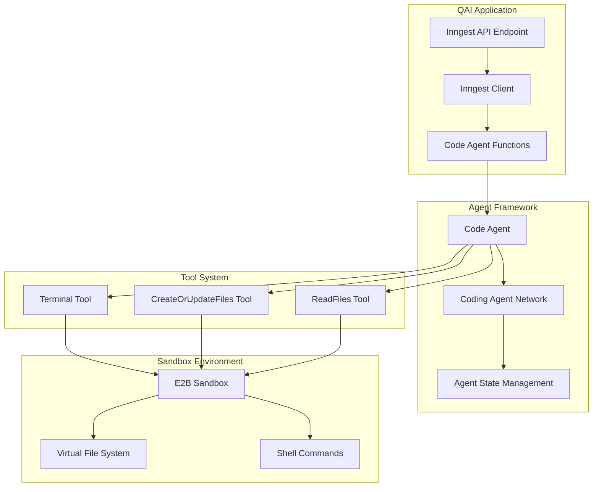
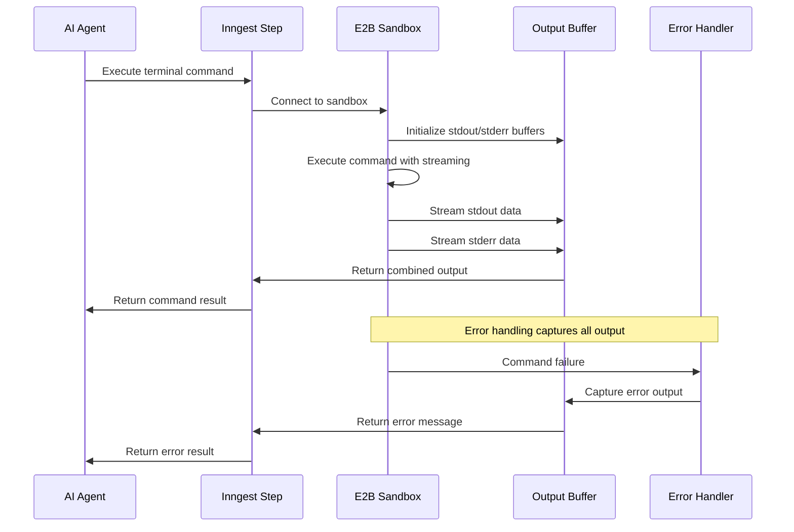
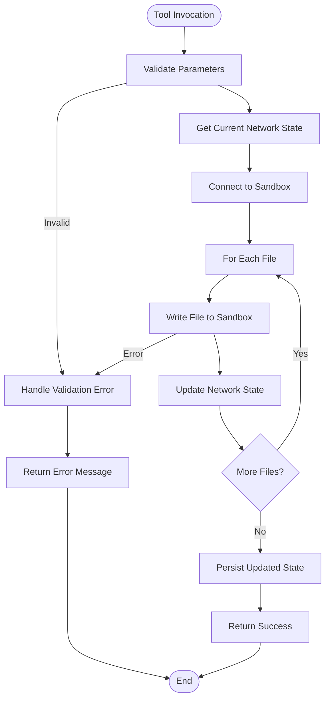
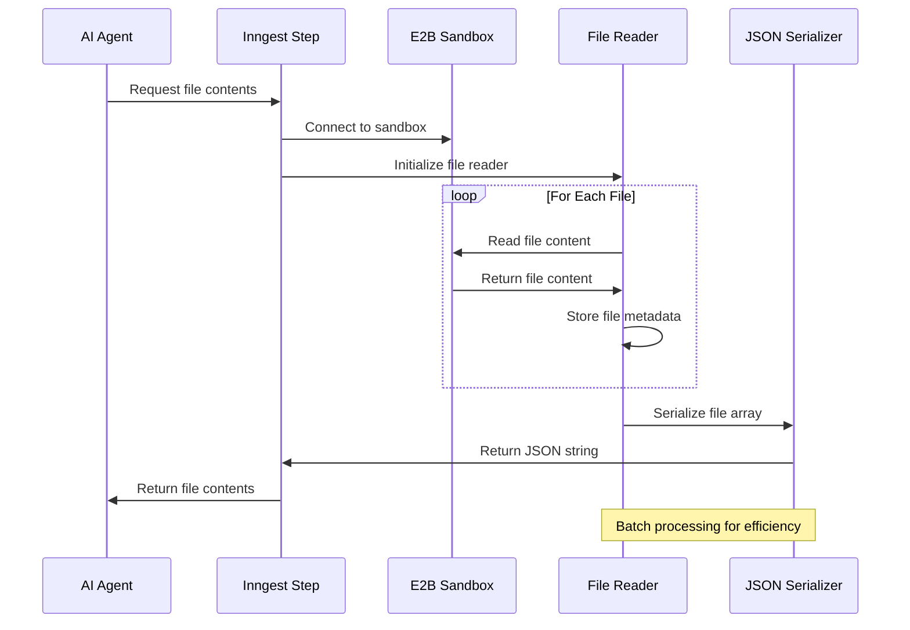
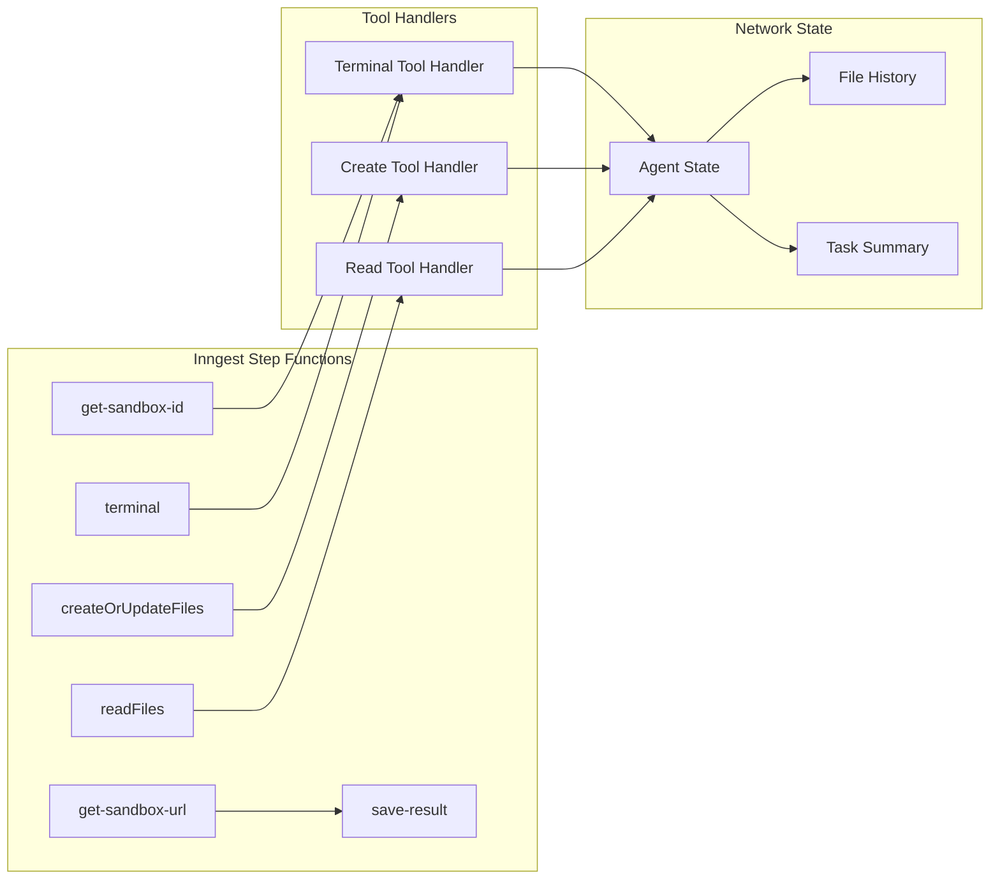
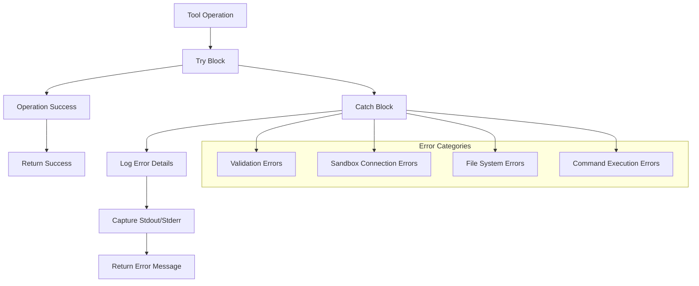
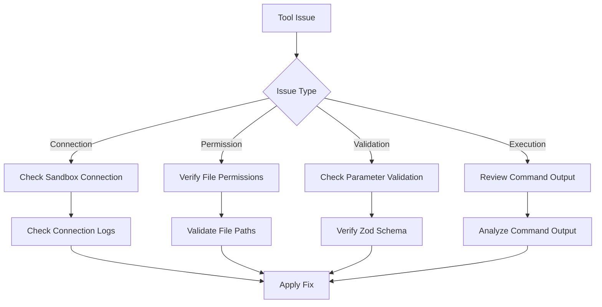

# Tool Usage

<cite>
**Referenced Files in This Document**
- [functions.ts](file://src/inngest/functions.ts)
- [prompt.ts](file://src/prompt.ts)
- [utils.ts](file://src/inngest/utils.ts)
- [client.ts](file://src/inngest/client.ts)
- [route.ts](file://src/app/api/inngest/route.ts)
- [e2b.toml](file://sandbox-templates/nextjs/e2b.toml)
- [e2b.Dockerfile](file://sandbox-templates/nextjs/e2b.Dockerfile)
- [compile_page.sh](file://sandbox-templates/nextjs/compile_page.sh)
- [package.json](file://package.json)
</cite>

## Table of Contents
1. [Introduction](#introduction)
2. [System Architecture](#system-architecture)
3. [Core Tools Overview](#core-tools-overview)
4. [Terminal Tool](#terminal-tool)
5. [Create or Update Files Tool](#create-or-update-files-tool)
6. [Read Files Tool](#read-files-tool)
7. [Integration with Inngest](#integration-with-inngest)
8. [Security and Error Handling](#security-and-error-handling)
9. [Debugging and Observability](#debugging-and-observability)
10. [Best Practices](#best-practices)
11. [Troubleshooting Guide](#troubleshooting-guide)

## Introduction

The QAI AI agent's tool usage system provides a secure, sandboxed environment for AI agents to interact with codebases through three core tools: Terminal, CreateOrUpdateFiles, and ReadFiles. This system enables AI agents to execute shell commands, modify files, and inspect code while maintaining strict security boundaries and providing comprehensive observability through Inngest step functions.

The tool system operates within a controlled sandbox environment powered by E2B code interpreter, ensuring that AI-generated code can be executed safely without compromising the host system. Each tool follows a standardized pattern of parameter validation using Zod schemas, robust error handling, and real-time streaming capabilities for optimal user experience.

## System Architecture

The tool usage system is built around a centralized agent framework that orchestrates multiple specialized tools within a sandboxed execution environment.

**Diagram sources**
- [functions.ts](file://src/inngest/functions.ts#L13-L211)
- [client.ts](file://src/inngest/client.ts#L1-L3)
- [route.ts](file://src/app/api/inngest/route.ts#L1-L11)

**Section sources**
- [functions.ts](file://src/inngest/functions.ts#L1-L211)
- [client.ts](file://src/inngest/client.ts#L1-L3)

## Core Tools Overview

The QAI tool system consists of three primary tools, each serving distinct purposes in the AI agent's workflow:

| Tool | Purpose | Parameter Schema | Execution Environment |
|------|---------|------------------|---------------------|
| Terminal | Execute shell commands | `{ command: string }` | Real-time streaming with stdout/stderr capture |
| CreateOrUpdateFiles | Write/update files in sandbox | `{ files: Array<{ path: string, content: string }> }` | File system write with network state persistence |
| ReadFiles | Inspect existing code | `{ files: Array<string> }` | File system read with JSON serialization |

Each tool integrates seamlessly with the Inngest step function system, providing automatic observability, retry logic, and comprehensive logging for debugging and monitoring purposes.

**Section sources**
- [functions.ts](file://src/inngest/functions.ts#L30-L135)

## Terminal Tool

The Terminal tool enables AI agents to execute shell commands within the sandbox environment, providing real-time feedback through stdout and stderr streaming.

### Parameter Schema

The Terminal tool accepts a single parameter defined by the Zod schema:
- **command** (string): The shell command to execute

### Execution Logic

The terminal tool implements sophisticated command execution with real-time streaming:

**Diagram sources**
- [functions.ts](file://src/inngest/functions.ts#L30-L58)

### Real-time Streaming and Error Handling

The Terminal tool implements comprehensive streaming and error handling mechanisms:

- **Streaming Implementation**: Uses callback functions (`onStdout` and `onStderr`) to capture real-time output
- **Buffer Management**: Maintains separate buffers for stdout and stderr to preserve command output
- **Error Recovery**: Captures both successful and failed command outputs for debugging
- **Timeout Protection**: Prevents infinite command execution through sandbox timeouts

### Security Implications

The Terminal tool operates within strict security boundaries:
- Commands execute in a sandboxed environment with limited system access
- No direct file system modification capabilities
- Output streaming provides transparency without exposing internal system details
- Error messages include captured output for debugging while maintaining security isolation

**Section sources**
- [functions.ts](file://src/inngest/functions.ts#L30-L58)

## Create or Update Files Tool

The CreateOrUpdateFiles tool manages file operations within the sandbox file system, enabling AI agents to create new files and update existing ones while maintaining persistent state across iterations.

### Parameter Schema

The tool accepts an array of file objects:
- **files** (Array): Collection of file operations
  - **path** (string): Relative file path within sandbox
  - **content** (string): File content to write

### Execution Logic

The file creation process follows a structured workflow:

**Diagram sources**
- [functions.ts](file://src/inngest/functions.ts#L60-L105)

### File System Operations

The tool performs atomic file operations with state synchronization:

1. **Parameter Validation**: Ensures all file paths and content are properly formatted
2. **State Retrieval**: Fetches current network state to maintain file history
3. **Sandbox Connection**: Establishes connection to the sandbox environment
4. **Atomic Writes**: Writes each file individually while preserving previous state
5. **State Persistence**: Updates network state atomically to prevent corruption

### Network State Integration

The CreateOrUpdateFiles tool maintains persistent file state across agent iterations:

- **State Tracking**: Stores all file contents in network state for history
- **Incremental Updates**: Adds new files to existing state without losing previous content
- **Consistency Guarantees**: Atomic updates prevent partial state corruption
- **History Preservation**: Maintains complete file history for debugging and rollback

**Section sources**
- [functions.ts](file://src/inngest/functions.ts#L60-L105)

## Read Files Tool

The ReadFiles tool enables AI agents to inspect existing code and understand the current state of the sandbox file system before making modifications.

### Parameter Schema

The tool accepts an array of file paths:
- **files** (Array): Collection of file paths to read
  - **path** (string): Relative file path within sandbox

### Execution Logic

The file reading process implements efficient batch operations:

**Diagram sources**
- [functions.ts](file://src/inngest/functions.ts#L107-L135)

### Batch Processing and Serialization

The ReadFiles tool optimizes performance through batch operations:

- **Batch Reading**: Processes multiple files in a single operation
- **Metadata Preservation**: Maintains file paths alongside content
- **JSON Serialization**: Converts file arrays to JSON for easy parsing
- **Error Handling**: Continues processing remaining files on individual failures

### Security Considerations

The ReadFiles tool implements several security measures:
- **Path Validation**: Ensures only authorized file paths are accessed
- **Content Sanitization**: Prevents sensitive information exposure
- **Access Control**: Restricts reading to sandboxed file system
- **Rate Limiting**: Prevents excessive file system access

**Section sources**
- [functions.ts](file://src/inngest/functions.ts#L107-L135)

## Integration with Inngest

The tool system leverages Inngest's step function architecture for observability, reliability, and debugging capabilities.

### Step Function Architecture

Each tool operation is wrapped in Inngest step functions:

**Diagram sources**
- [functions.ts](file://src/inngest/functions.ts#L13-L211)

### Observability Features

Inngest provides comprehensive observability for tool operations:

- **Automatic Tracing**: Each step function creates distributed traces
- **Retry Logic**: Automatic retries for transient failures
- **Metrics Collection**: Performance metrics for optimization
- **Error Reporting**: Detailed error information with stack traces
- **Execution Monitoring**: Real-time monitoring of tool execution

### Lifecycle Management

The tool system integrates with the agent lifecycle for comprehensive state management:

- **Initialization**: Sandbox creation and agent setup
- **Execution**: Tool invocation with state preservation
- **Monitoring**: Continuous state tracking and validation
- **Termination**: Result persistence and cleanup

**Section sources**
- [functions.ts](file://src/inngest/functions.ts#L13-L211)

## Security and Error Handling

The tool system implements multiple layers of security and error handling to ensure safe operation within the sandbox environment.

### Sandboxing Security

The E2B sandbox provides comprehensive isolation:

- **Process Isolation**: Complete separation from host system
- **File System Boundaries**: Restricted access to sandboxed environment
- **Network Restrictions**: Controlled network access policies
- **Resource Limits**: CPU and memory constraints prevent abuse

### Error Handling Strategies

Each tool implements robust error handling:

**Diagram sources**
- [functions.ts](file://src/inngest/functions.ts#L30-L58)
- [functions.ts](file://src/inngest/functions.ts#L60-L105)
- [functions.ts](file://src/inngest/functions.ts#L107-L135)

### Preventing Sandbox Corruption

Several mechanisms prevent sandbox corruption:

- **Atomic Operations**: File operations complete entirely or not at all
- **State Validation**: Network state consistency checks
- **Resource Cleanup**: Automatic resource deallocation
- **Timeout Mechanisms**: Prevents hanging operations

### Security Best Practices

The system enforces security through multiple controls:

- **Input Validation**: Strict parameter validation using Zod schemas
- **Path Sanitization**: Prevention of path traversal attacks
- **Output Filtering**: Removal of sensitive information from error messages
- **Access Logging**: Comprehensive audit trails for security monitoring

**Section sources**
- [functions.ts](file://src/inngest/functions.ts#L30-L135)
- [utils.ts](file://src/inngest/utils.ts#L1-L20)

## Debugging and Observability

The tool system provides extensive debugging capabilities through Inngest's observability features and comprehensive logging infrastructure.

### Inngest Function Logs

Each tool operation generates detailed logs:

- **Execution Traces**: Complete execution history with timestamps
- **Parameter Logging**: Tool parameters for debugging
- **Output Capture**: Full stdout/stderr for command tools
- **Error Context**: Detailed error information with stack traces

### Debugging Tips

Effective debugging strategies for tool execution:

1. **Enable Debug Logging**: Set appropriate log levels for detailed output
2. **Monitor Step Functions**: Use Inngest dashboard to track function execution
3. **Inspect Network State**: Examine agent state for debugging state-related issues
4. **Validate Parameters**: Ensure tool parameters conform to Zod schemas
5. **Check Sandbox Status**: Verify sandbox connectivity and health

### Monitoring Dashboard

The Inngest dashboard provides comprehensive monitoring:

- **Function Performance**: Execution time and success rates
- **Error Rates**: Failure patterns and trends
- **Resource Usage**: Memory and CPU utilization
- **Custom Metrics**: Application-specific monitoring

### Troubleshooting Workflows

Common troubleshooting scenarios:

**Section sources**
- [functions.ts](file://src/inngest/functions.ts#L13-L211)

## Best Practices

Effective use of the tool system requires adherence to established patterns and security guidelines.

### Tool Usage Patterns

Recommended approaches for each tool:

**Terminal Tool**:
- Use for package installations and build processes
- Avoid long-running commands that may timeout
- Include appropriate error handling in prompts
- Test commands in development environment first

**CreateOrUpdateFiles Tool**:
- Use for all file modifications to maintain state history
- Implement atomic operations when modifying multiple files
- Validate file paths before attempting writes
- Use relative paths to avoid sandbox escape attempts

**ReadFiles Tool**:
- Use before making modifications to understand current state
- Read multiple files in single operations for efficiency
- Validate file existence before reading
- Implement fallbacks for missing files

### Security Guidelines

Essential security practices:

- **Never use absolute paths** - Always use relative paths
- **Validate all inputs** using Zod schemas
- **Avoid sandbox escape attempts** - Never attempt to access parent directories
- **Sanitize error messages** to prevent information disclosure
- **Implement proper error handling** for all tool operations

### Performance Optimization

Best practices for optimal performance:

- **Batch operations** when possible to reduce overhead
- **Minimize file reads** by caching frequently accessed files
- **Use appropriate timeouts** for long-running operations
- **Implement retry logic** for transient failures
- **Monitor resource usage** to prevent exhaustion

## Troubleshooting Guide

Common issues and their solutions when working with the tool system.

### Connection Issues

**Problem**: Sandbox connection failures
**Symptoms**: "Failed to connect to sandbox" errors
**Solution**: 
- Verify sandbox template availability
- Check network connectivity
- Review sandbox limits and quotas
- Restart sandbox if unresponsive

### File System Errors

**Problem**: File write/read failures
**Symptoms**: "Failed to create or update files" errors
**Solution**:
- Validate file paths are relative and within sandbox
- Check file permissions and ownership
- Verify sufficient disk space
- Ensure file paths don't contain invalid characters

### Command Execution Failures

**Problem**: Terminal command failures
**Symptoms**: Command timeout or exit code errors
**Solution**:
- Review command syntax and dependencies
- Check available packages and installations
- Verify command doesn't exceed resource limits
- Test commands manually in sandbox

### State Synchronization Issues

**Problem**: Network state inconsistencies
**Symptoms**: Missing files or incorrect state
**Solution**:
- Force state refresh after major changes
- Verify atomic operation completion
- Check for concurrent modification conflicts
- Reset state if corruption detected

### Performance Problems

**Problem**: Slow tool execution
**Symptoms**: Long wait times for tool responses
**Solution**:
- Optimize batch operations
- Reduce file sizes when possible
- Implement caching for repeated operations
- Monitor resource usage and optimize accordingly

**Section sources**
- [functions.ts](file://src/inngest/functions.ts#L30-L135)
- [utils.ts](file://src/inngest/utils.ts#L1-L20)