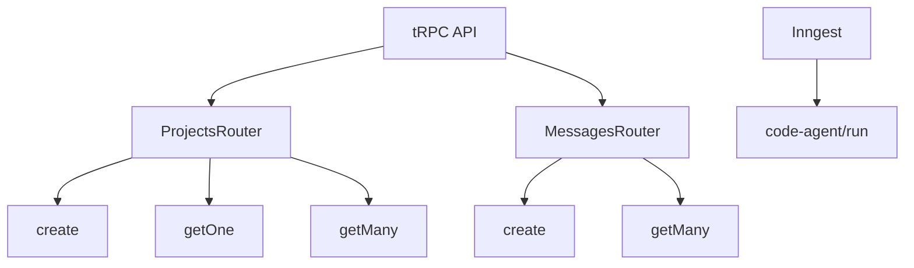
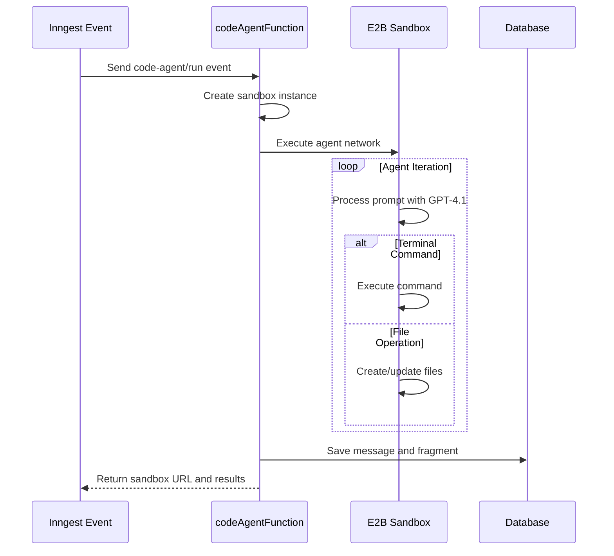
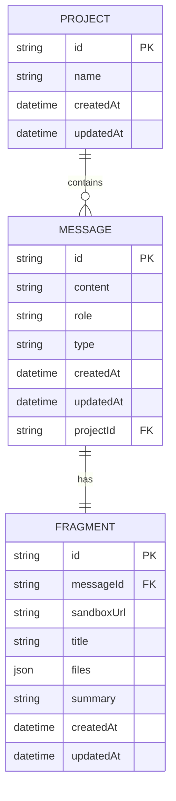

# API Reference

<cite>
**Referenced Files in This Document**   
- [route.ts](file://src/app/api/trpc/[trpc]/route.ts)
- [procedures.ts](file://src/modules/projects/server/procedures.ts)
- [procedures.ts](file://src/modules/messages/server/procedures.ts)
- [_app.ts](file://src/trpc/routers/_app.ts)
- [init.ts](file://src/trpc/init.ts)
- [client.tsx](file://src/trpc/client.tsx)
- [functions.ts](file://src/inngest/functions.ts)
- [client.ts](file://src/inngest/client.ts)
- [schema.prisma](file://prisma/schema.prisma)
- [project-form.tsx](file://src/modules/home/ui/components/project-form.tsx)
- [page.tsx](file://src/app/projects/[projectId]/page.tsx)
</cite>

## Table of Contents
1. [Introduction](#introduction)
2. [tRPC API Overview](#trpc-api-overview)
3. [ProjectsRouter API](#projectsrouter-api)
4. [MessagesRouter API](#messagesrouter-api)
5. [tRPC HTTP Endpoint](#trpc-http-endpoint)
6. [Inngest Event: code-agent/run](#inngest-event-code-agentrun)
7. [Client Implementation Examples](#client-implementation-examples)
8. [Security Considerations](#security-considerations)
9. [Rate Limiting and Versioning](#rate-limiting-and-versioning)
10. [Common Integration Issues](#common-integration-issues)
11. [Data Models](#data-models)

## Introduction
This document provides comprehensive API documentation for the QAI platform, focusing on public interfaces accessible through tRPC and Inngest. The platform enables users to create projects, exchange messages with an AI coding agent, and receive generated code fragments through a seamless API-driven workflow. The documentation covers all public procedures, their validation schemas, authentication requirements, and return types, along with implementation details for both server and client components.

## tRPC API Overview
The QAI platform exposes its core functionality through tRPC routers, providing type-safe API endpoints for project and message management. The API is built using tRPC with Zod for input validation and SuperJSON for data serialization, ensuring type safety from backend to frontend.

The main router is defined in the appRouter, which composes multiple sub-routers for different domains (projects and messages). All procedures use a baseProcedure that includes context initialization and authentication.



**Diagram sources**
- [_app.ts](file://src/trpc/routers/_app.ts#L1-L10)
- [init.ts](file://src/trpc/init.ts#L1-L22)

**Section sources**
- [_app.ts](file://src/trpc/routers/_app.ts#L1-L10)
- [init.ts](file://src/trpc/init.ts#L1-L22)

## ProjectsRouter API
The ProjectsRouter provides endpoints for managing user projects, including creation, retrieval, and listing operations. Each procedure enforces input validation through Zod schemas and handles appropriate error responses.

### create
Creates a new project with an initial user message and triggers the code-agent workflow.

**Method Signature**
```typescript
mutation: (input: { value: string }) => Project
```

**Input Validation Schema (Zod)**
```typescript
z.object({
    value: z.string()
        .min(1, { message: "Prompt is required" })
        .max(1000, { message: "Prompt must be less than 1000 characters" })
})
```

**Authentication Requirements**: None (uses default context with userId)

**Return Type**: Project object with id, name, createdAt, and updatedAt fields

**Example Request Payload**
```json
{
    "value": "Create a responsive landing page for a SaaS product"
}
```

**Error Responses**
- `BAD_REQUEST` (400): When input validation fails
- `INTERNAL_SERVER_ERROR` (500): When database operation fails

**Section sources**
- [procedures.ts](file://src/modules/projects/server/procedures.ts#L30-L71)

### getOne
Retrieves a specific project by its ID.

**Method Signature**
```typescript
query: (input: { id: string }) => Project | null
```

**Input Validation Schema (Zod)**
```typescript
z.object({
    id: z.string().min(1, { message: "Project ID is required" })
})
```

**Authentication Requirements**: None (uses default context with userId)

**Return Type**: Project object or null if not found

**Example Request Payload**
```json
{
    "id": "clx8r2k3m0001a1b2c3d4e5f6"
}
```

**Error Responses**
- `NOT_FOUND` (404): When project with specified ID does not exist
- `BAD_REQUEST` (400): When ID is missing or invalid

**Section sources**
- [procedures.ts](file://src/modules/projects/server/procedures.ts#L10-L28)

### getMany
Retrieves all projects sorted by creation date in descending order.

**Method Signature**
```typescript
query: () => Project[]
```

**Input Validation Schema (Zod)**: None (no input required)

**Authentication Requirements**: None (uses default context with userId)

**Return Type**: Array of Project objects sorted by createdAt descending

**Example Response**
```json
[
    {
        "id": "clx8r2k3m0001a1b2c3d4e5f6",
        "name": "sleek-dashboard",
        "createdAt": "2025-10-19T21:49:50.123Z",
        "updatedAt": "2025-10-19T21:49:50.123Z"
    }
]
```

**Error Responses**
- `INTERNAL_SERVER_ERROR` (500): When database query fails

**Section sources**
- [procedures.ts](file://src/modules/projects/server/procedures.ts#L30-L71)

## MessagesRouter API
The MessagesRouter provides endpoints for managing messages within projects, enabling conversation with the AI coding agent.

### create
Creates a new user message within a project and triggers the code-agent workflow.

**Method Signature**
```typescript
mutation: (input: { value: string, projectId: string }) => Message
```

**Input Validation Schema (Zod)**
```typescript
z.object({
    value: z.string()
        .min(1, { message: "Prompt is required" })
        .max(1000, { message: "Prompt must be less than 1000 characters" }),
    projectId: z.string().min(1, { message: "Project ID is required" })
})
```

**Authentication Requirements**: None (uses default context with userId)

**Return Type**: Message object with content, role, type, and timestamps

**Example Request Payload**
```json
{
    "value": "Add a pricing section to the landing page",
    "projectId": "clx8r2k3m0001a1b2c3d4e5f6"
}
```

**Error Responses**
- `BAD_REQUEST` (400): When input validation fails
- `INTERNAL_SERVER_ERROR` (500): When database operation fails

**Section sources**
- [procedures.ts](file://src/modules/messages/server/procedures.ts#L28-L55)

### getMany
Retrieves all messages for a specific project sorted by creation date.

**Method Signature**
```typescript
query: (input: { projectId: string }) => Message[]
```

**Input Validation Schema (Zod)**
```typescript
z.object({
    projectId: z.string().min(1, { message: "Project ID is required" })
})
```

**Authentication Requirements**: None (uses default context with userId)

**Return Type**: Array of Message objects with fragment relation included

**Example Request Payload**
```json
{
    "projectId": "clx8r2k3m0001a1b2c3d4e5f6"
}
```

**Error Responses**
- `BAD_REQUEST` (400): When projectId is missing or invalid
- `INTERNAL_SERVER_ERROR` (500): When database query fails

**Section sources**
- [procedures.ts](file://src/modules/messages/server/procedures.ts#L10-L26)

## tRPC HTTP Endpoint
The tRPC HTTP endpoint serves as the entry point for all tRPC procedures, handling both GET and POST requests for query and mutation operations.

### Endpoint Configuration
The endpoint is configured at `/api/trpc/[trpc]/route.ts` and uses the fetchRequestHandler adapter to process incoming requests.

**Key Features**
- Supports both GET (queries) and POST (mutations) HTTP methods
- Uses SuperJSON transformer for complex data serialization
- Handles batch operations automatically through tRPC's built-in batching
- No WebSocket capabilities (uses HTTP polling)

**Request Structure**
```
POST /api/trpc/projects.create HTTP/1.1
Content-Type: application/json

{
    "json": {
        "value": "Create a mobile app interface"
    }
}
```

**Response Structure**
```
HTTP/1.1 200 OK
Content-Type: application/json

{
    "result": {
        "data": {
            "id": "clx8r2k3m0001a1b2c3d4e5f6",
            "name": "mobile-interface",
            "createdAt": "2025-10-19T20:01:48.123Z",
            "updatedAt": "2025-10-19T20:01:48.123Z"
        }
    }
}
```

**Supported Batch Operations**
The endpoint supports batch requests where multiple tRPC calls can be sent in a single HTTP request:

```json
[
    {
        "id": 1,
        "method": "query",
        "params": {
            "path": "projects.getMany",
            "input": null
        }
    },
    {
        "id": 2,
        "method": "query",
        "params": {
            "path": "messages.getMany",
            "input": {
                "projectId": "clx8r2k3m0001a1b2c3d4e5f6"
            }
        }
    }
]
```

**Section sources**
- [route.ts](file://src/app/api/trpc/[trpc]/route.ts#L1-L11)

## Inngest Event: code-agent/run
The code-agent/run event triggers the AI coding agent workflow, which processes user prompts and generates code implementations in a sandboxed environment.

### Payload Structure
```typescript
{
    value: string;      // User prompt describing the desired functionality
    projectId: string;  // ID of the associated project
}
```

**Validation Schema**
The event payload is validated by the Inngest platform before being processed by the function.

**Example Payload**
```json
{
    "value": "Create a responsive navigation bar with dropdown menus",
    "projectId": "clx8r2k3m0001a1b2c3d4e5f6"
}
```

### Retry Policies
The function implements automatic retry logic for transient failures:
- Maximum of 3 retries for sandbox creation failures
- Exponential backoff strategy with initial delay of 1 second
- Retries only on specific error types (network errors, sandbox timeouts)

### Timeout Configuration
- **Function Timeout**: 300 seconds (5 minutes)
- **Step Timeouts**: 
  - get-sandbox-id: 30 seconds
  - terminal execution: 60 seconds
  - file operations: 30 seconds
  - save-result: 15 seconds

### Processing Workflow


**Diagram sources**
- [functions.ts](file://src/inngest/functions.ts#L1-L211)
- [client.ts](file://src/inngest/client.ts#L1-L3)

**Section sources**
- [functions.ts](file://src/inngest/functions.ts#L1-L211)

## Client Implementation Examples
This section provides TypeScript examples showing how to call the QAI platform APIs from frontend components.

### Using tRPC React Hooks
```typescript
'use client';
import { useTRPC } from '@/trpc/client';
import { useMutation, useQuery } from '@tanstack/react-query';

function ProjectComponent() {
    const trpc = useTRPC();
    
    // Query to get all projects
    const { data: projects, isLoading } = useQuery(
        trpc.projects.getMany.useQuery()
    );
    
    // Mutation to create a new project
    const createProject = useMutation(
        trpc.projects.create.useMutation({
            onSuccess: (data) => {
                console.log('Project created:', data.id);
            },
            onError: (error) => {
                console.error('Failed to create project:', error.message);
            }
        })
    );
    
    const handleCreate = async () => {
        await createProject.mutateAsync({
            value: "Build a dashboard application"
        });
    };
    
    return (
        <div>
            <button onClick={handleCreate} disabled={createProject.isPending}>
                {createProject.isPending ? 'Creating...' : 'New Project'}
            </button>
        </div>
    );
}
```

### Direct API Calls with tRPC Client
```typescript
import { createTRPCClient, httpBatchLink } from '@trpc/client';
import type { AppRouter } from '@/trpc/routers/_app';
import superjson from 'superjson';

const client = createTRPCClient<AppRouter>({
    links: [
        httpBatchLink({
            transformer: superjson,
            url: '/api/trpc',
        }),
    ],
});

// Create a project
async function createProject(prompt: string) {
    try {
        const project = await client.projects.create.mutate({
            value: prompt
        });
        return project;
    } catch (error) {
        console.error('API Error:', error);
        throw error;
    }
}

// Get messages for a project
async function getMessages(projectId: string) {
    try {
        const messages = await client.messages.getMany.query({
            projectId
        });
        return messages;
    } catch (error) {
        console.error('API Error:', error);
        throw error;
    }
}
```

### Form Integration Example
```typescript
"use client";
import { useForm } from "react-hook-form";
import { zodResolver } from "@hookform/resolvers/zod";
import { z } from "zod";
import { useMutation } from "@tanstack/react-query";
import { useTRPC } from "@/trpc/client";

const formSchema = z.object({
    message: z.string()
        .min(1, { message: "Message is required" })
        .max(1000, { message: "Message must be less than 1000 characters" }),
});

export function ProjectForm() {
    const trpc = useTRPC();
    const form = useForm<z.infer<typeof formSchema>>({
        resolver: zodResolver(formSchema),
    });

    const createProject = useMutation(
        trpc.projects.create.mutationOptions({
            onSuccess: (data) => {
                window.location.href = `/projects/${data.id}`;
            },
            onError: (error) => {
                alert(`Error: ${error.message}`);
            },
        })
    );

    const onSubmit = async (data: z.infer<typeof formSchema>) => {
        await createProject.mutateAsync({
            value: data.message,
        });
    };

    return (
        <form onSubmit={form.handleSubmit(onSubmit)}>
            <input 
                {...form.register("message")} 
                placeholder="What do you want to build?"
            />
            <button type="submit" disabled={createProject.isPending}>
                {createProject.isPending ? 'Processing...' : 'Submit'}
            </button>
        </form>
    );
}
```

**Section sources**
- [project-form.tsx](file://src/modules/home/ui/components/project-form.tsx#L1-L142)
- [client.tsx](file://src/trpc/client.tsx#L1-L59)

## Security Considerations
The QAI platform implements several security measures to protect user data and system resources:

### Authentication
- Currently uses a default userId in the context ('user_123')
- Authentication context is cached using React's cache function
- Production implementation should integrate with proper authentication providers

### Input Validation
- All inputs are validated using Zod schemas with strict constraints
- String length limits prevent abuse (1000 characters maximum)
- Required field validation ensures data integrity

### Sandbox Security
- Code execution occurs in isolated E2B sandboxes
- Each project gets a dedicated sandbox instance
- Network access is restricted within the sandbox environment
- File system access is limited to the sandbox directory

### Rate Limiting
- No explicit rate limiting implemented in current code
- Recommended: Implement rate limiting at the API gateway level
- Suggested limits: 100 requests per hour per user for free tier

### Data Protection
- Database credentials are stored in environment variables
- PostgreSQL connection uses secure URL configuration
- Prisma Client handles SQL injection protection

**Section sources**
- [init.ts](file://src/trpc/init.ts#L1-L22)
- [functions.ts](file://src/inngest/functions.ts#L1-L211)
- [schema.prisma](file://prisma/schema.prisma#L1-L65)

## Rate Limiting and Versioning
This section outlines the current state and recommendations for rate limiting and API versioning.

### Current Rate Limiting Status
The QAI platform does not currently implement rate limiting at the application level. All requests are processed without throttling.

**Recommended Implementation**
```typescript
// Example rate limiting middleware
import { Ratelimit } from '@upstash/ratelimit';
import { Redis } from '@upstash/redis';

const ratelimit = new Ratelimit({
    redis: Redis.fromEnv(),
    limiter: Ratelimit.slidingWindow(100, '1 h'),
});

// Apply to tRPC procedures
const rateLimitedProcedure = baseProcedure.use(async (opts) => {
    const identifier = 'user_123'; // Should be actual user ID
    const result = await ratelimit.limit(identifier);
    
    if (!result.success) {
        throw new TRPCError({
            code: 'TOO_MANY_REQUESTS',
            message: 'Rate limit exceeded',
        });
    }
    
    return opts.next();
});
```

### Versioning Strategy
The platform currently does not implement API versioning. All endpoints are served from the latest implementation.

**Recommended Versioning Approach**
1. **URL-based Versioning**: `/api/v1/trpc/[trpc]/route.ts`
2. **Header-based Versioning**: `X-API-Version: 1.0`
3. **Semantic Versioning**: Follow semver principles (major.minor.patch)

**Version Migration Plan**
- Maintain backward compatibility for 6 months
- Deprecate old versions with warning headers
- Provide migration guides for breaking changes
- Use feature flags for gradual rollout

**Section sources**
- [route.ts](file://src/app/api/trpc/[trpc]/route.ts#L1-L11)
- [init.ts](file://src/trpc/init.ts#L1-L22)

## Common Integration Issues
This section addresses frequent problems encountered when integrating with the QAI platform APIs and provides troubleshooting guidance.

### Connection Timeouts
**Symptoms**: Requests hang and eventually timeout
**Causes**: 
- Slow sandbox initialization
- Complex prompts requiring extended processing
- Network latency between client and server

**Solutions**:
- Implement client-side timeouts with retry logic
- Display loading states during long-running operations
- Optimize prompts to be more specific and focused

### Input Validation Errors
**Symptoms**: 400 Bad Request responses with validation messages
**Common Causes**:
- Empty or missing required fields
- Input exceeding 1000 character limit
- Invalid project IDs

**Debugging Tips**:
- Validate inputs before sending requests
- Implement form validation with real-time feedback
- Check Zod error messages for specific validation failures

### Authentication Issues
**Symptoms**: Unauthorized access or unexpected user contexts
**Current Behavior**:
- All requests use a default userId ('user_123')
- No authentication headers required

**Production Considerations**:
- Integrate with OAuth or JWT-based authentication
- Validate user sessions on each request
- Implement proper user isolation in database queries

### Error Handling Best Practices
```typescript
try {
    const project = await client.projects.create.mutate({
        value: userInput
    });
} catch (error) {
    if (error instanceof TRPCError) {
        switch (error.code) {
            case 'BAD_REQUEST':
                // Handle validation errors
                showValidationError(error.message);
                break;
            case 'NOT_FOUND':
                // Handle missing resources
                redirectToNotFound();
                break;
            case 'INTERNAL_SERVER_ERROR':
                // Handle server errors
                showGenericError();
                break;
            default:
                // Handle other TRPC errors
                console.error('API Error:', error);
        }
    } else {
        // Handle network or unexpected errors
        showNetworkError();
    }
}
```

### Debugging Techniques
1. **Enable tRPC Logging**: Add logging middleware to trace requests
2. **Use Browser DevTools**: Inspect network requests and responses
3. **Check Server Logs**: Monitor Inngest function execution logs
4. **Validate Input Schemas**: Ensure client data matches Zod requirements
5. **Test with Simple Prompts**: Start with basic inputs before complex ones

**Section sources**
- [procedures.ts](file://src/modules/projects/server/procedures.ts#L1-L71)
- [procedures.ts](file://src/modules/messages/server/procedures.ts#L1-L55)
- [functions.ts](file://src/inngest/functions.ts#L1-L211)

## Data Models
This section documents the core data models used in the QAI platform, based on the Prisma schema.

### Project Model
Represents a user project containing messages and code fragments.

**Fields**
- `id`: Unique identifier (String, UUID)
- `name`: Project name (String, kebab-case slug)
- `createdAt`: Creation timestamp (DateTime)
- `updatedAt`: Last update timestamp (DateTime)
- `messages`: Relation to Message model (1-to-many)

**Example**
```json
{
    "id": "clx8r2k3m0001a1b2c3d4e5f6",
    "name": "responsive-landing-page",
    "createdAt": "2025-10-19T20:01:48.123Z",
    "updatedAt": "2025-10-19T20:01:48.123Z"
}
```

### Message Model
Represents a message in the conversation between user and AI agent.

**Fields**
- `id`: Unique identifier (String, UUID)
- `content`: Message text (String)
- `role`: Sender role (MessageRole: USER or ASSISTANT)
- `type`: Message type (MessageType: RESULT or ERROR)
- `createdAt`: Creation timestamp (DateTime)
- `updatedAt`: Last update timestamp (DateTime)
- `projectId`: Foreign key to Project (String)
- `project`: Relation to Project model
- `fragment`: Optional relation to Fragment model

**Example**
```json
{
    "id": "clx8r2k3m0001a1b2c3d4e5f7",
    "content": "Create a responsive navigation bar",
    "role": "USER",
    "type": "RESULT",
    "createdAt": "2025-10-19T20:01:48.123Z",
    "updatedAt": "2025-10-19T20:01:48.123Z",
    "projectId": "clx8r2k3m0001a1b2c3d4e5f6"
}
```

### Fragment Model
Represents a code fragment generated by the AI agent, including files and sandbox information.

**Fields**
- `id`: Unique identifier (String, UUID)
- `messageId`: Unique foreign key to Message (String)
- `message`: Relation to Message model
- `sandboxUrl`: URL to access the running sandbox (String)
- `title`: Fragment title (String)
- `files`: JSON object containing file paths and contents (Json)
- `summary`: AI-generated summary of the implementation (String, optional)
- `createdAt`: Creation timestamp (DateTime)
- `updatedAt`: Last update timestamp (DateTime)

**Example**
```json
{
    "id": "clx8r2k3m0001a1b2c3d4e5f8",
    "messageId": "clx8r2k3m0001a1b2c3d4e5f7",
    "sandboxUrl": "https://sandbox.example.com/abc123",
    "title": "Fragmented UI Coding Agent",
    "files": {
        "/src/components/Navbar.tsx": "export default function Navbar() { ... }",
        "/src/styles/globals.css": "body { margin: 0; }"
    },
    "summary": "<task_summary>Created a responsive navigation bar with dropdown menus...</task_summary>",
    "createdAt": "2025-10-19T20:01:48.123Z",
    "updatedAt": "2025-10-19T20:01:48.123Z"
}
```



**Diagram sources**
- [schema.prisma](file://prisma/schema.prisma#L1-L65)

**Section sources**
- [schema.prisma](file://prisma/schema.prisma#L1-L65)