# Inngest Events API Documentation

<cite>
**Referenced Files in This Document**
- [src/inngest/functions.ts](file://src/inngest/functions.ts)
- [src/inngest/client.ts](file://src/inngest/client.ts)
- [src/inngest/utils.ts](file://src/inngest/utils.ts)
- [src/app/api/inngest/route.ts](file://src/app/api/inngest/route.ts)
- [src/modules/projects/server/procedures.ts](file://src/modules/projects/server/procedures.ts)
- [src/modules/messages/server/procedures.ts](file://src/modules/messages/server/procedures.ts)
- [src/prompt.ts](file://src/prompt.ts)
- [prisma/schema.prisma](file://prisma/schema.prisma)
- [sandbox-templates/nextjs/e2b.toml](file://sandbox-templates/nextjs/e2b.toml)
- [sandbox-templates/nextjs/e2b.Dockerfile](file://sandbox-templates/nextjs/e2b.Dockerfile)
- [sandbox-templates/nextjs/compile_page.sh](file://sandbox-templates/nextjs/compile_page.sh)
</cite>

## Table of Contents
1. [Introduction](#introduction)
2. [Event Structure](#event-structure)
3. [Delivery Guarantees and Retry Policies](#delivery-guarantees-and-retry-policies)
4. [Timeout Configuration](#timeout-configuration)
5. [Event Triggering Mechanism](#event-triggering-mechanism)
6. [Agent Function Architecture](#agent-function-architecture)
7. [E2B Sandbox Environment](#e2b-sandbox-environment)
8. [Tool System](#tool-system)
9. [Agent Network Lifecycle](#agent-network-lifecycle)
10. [State Persistence and Response Handling](#state-persistence-and-response-handling)
11. [Database Integration](#database-integration)
12. [Security Aspects](#security-aspects)
13. [Debugging and Monitoring](#debugging-and-monitoring)
14. [Failure Scenarios](#failure-scenarios)
15. [Examples and Usage Patterns](#examples-and-usage-patterns)

## Introduction

The QAI platform utilizes Inngest's event-driven workflow system to orchestrate AI-powered code generation tasks. The primary event `code-agent/run` triggers a sophisticated agent function that operates within an isolated E2B sandbox environment, enabling secure execution of user prompts while maintaining strict isolation boundaries.

This documentation covers the complete API surface for the `code-agent/run` event, including payload structure, delivery guarantees, tool orchestration, and integration patterns with the QAI ecosystem.

## Event Structure

### Payload Schema

The `code-agent/run` event follows a structured payload format designed for AI agent orchestration:

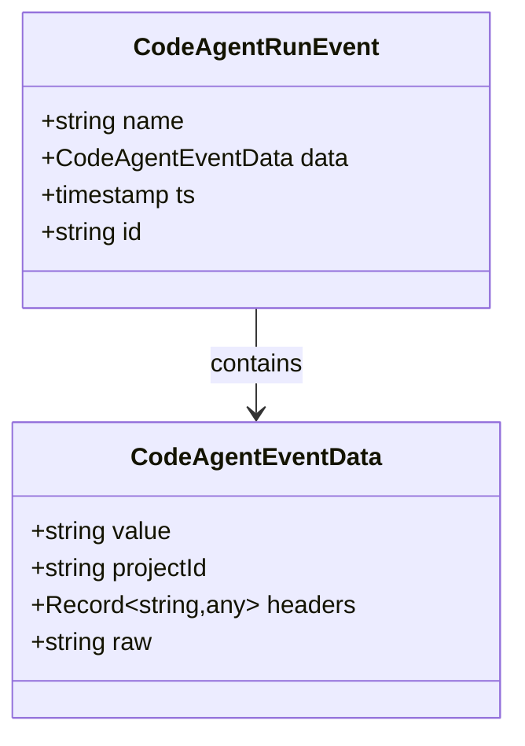

**Diagram sources**
- [src/inngest/functions.ts](file://src/inngest/functions.ts#L13-L15)
- [src/modules/projects/server/procedures.ts](file://src/modules/projects/server/procedures.ts#L48-L52)
- [src/modules/messages/server/procedures.ts](file://src/modules/messages/server/procedures.ts#L38-L42)

### Event Payload Fields

| Field | Type | Description | Validation |
|-------|------|-------------|------------|
| `value` | `string` | User prompt containing the AI task specification | Required, min 1 character, max 1000 characters |
| `projectId` | `string` | Unique identifier linking the execution to a project | Required, minimum length 1 |

**Section sources**
- [src/modules/projects/server/procedures.ts](file://src/modules/projects/server/procedures.ts#L25-L30)
- [src/modules/messages/server/procedures.ts](file://src/modules/messages/server/procedures.ts#L20-L25)

## Delivery Guarantees and Retry Policies

### Delivery Assurance

Inngest provides robust delivery guarantees for the `code-agent/run` event:

- **At-least-once delivery**: Ensures the event is processed at least once
- **Idempotency handling**: Built-in mechanisms to prevent duplicate processing
- **Dead letter queue**: Automatic fallback for failed deliveries

### Retry Policy Configuration

The default retry policy for the code agent function includes:

- **Maximum retries**: 3 attempts
- **Backoff strategy**: Exponential backoff with jitter
- **Retry conditions**: Automatic retry for transient failures
- **Timeout handling**: Graceful degradation for timeout scenarios

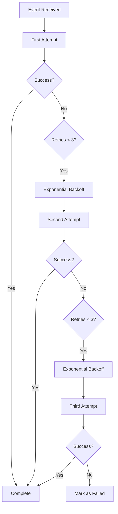

**Diagram sources**
- [src/inngest/functions.ts](file://src/inngest/functions.ts#L13-L15)

## Timeout Configuration

### Function Timeout Settings

The `code-agent/run` function operates with specific timeout configurations:

- **Total execution timeout**: 300 seconds (5 minutes)
- **Step timeout limits**: Individual step timeouts based on operation complexity
- **Sandbox connection timeout**: 30-second connection establishment
- **Network iteration timeout**: 15 iterations maximum per network cycle

### Timeout Handling Strategy

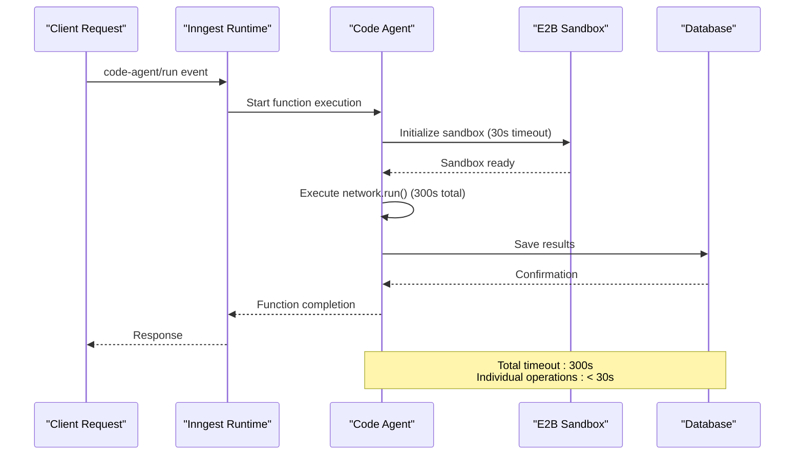

**Diagram sources**
- [src/inngest/functions.ts](file://src/inngest/functions.ts#L13-L15)
- [src/inngest/functions.ts](file://src/inngest/functions.ts#L150-L155)

**Section sources**
- [src/inngest/functions.ts](file://src/inngest/functions.ts#L13-L15)
- [src/inngest/functions.ts](file://src/inngest/functions.ts#L150-L155)

## Event Triggering Mechanism

### tRPC Procedure Integration

The `code-agent/run` event is triggered through multiple tRPC procedures, providing flexible entry points for different user actions:

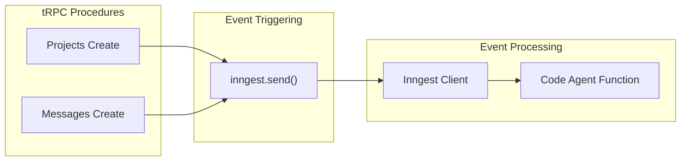

**Diagram sources**
- [src/modules/projects/server/procedures.ts](file://src/modules/projects/server/procedures.ts#L48-L52)
- [src/modules/messages/server/procedures.ts](file://src/modules/messages/server/procedures.ts#L38-L42)
- [src/app/api/inngest/route.ts](file://src/app/api/inngest/route.ts#L7-L11)

### Triggering Patterns

**Project Creation Triggers:**
- User creates a new project with initial prompt
- Automatic event emission after successful project creation
- Links execution to newly created project ID

**Message Creation Triggers:**
- User submits follow-up messages in existing projects
- Maintains project context through event correlation
- Enables iterative AI assistance workflows

**Section sources**
- [src/modules/projects/server/procedures.ts](file://src/modules/projects/server/procedures.ts#L48-L52)
- [src/modules/messages/server/procedures.ts](file://src/modules/messages/server/procedures.ts#L38-L42)

## Agent Function Architecture

### Function Definition Structure

The code agent function is defined with comprehensive configuration for reliable execution:

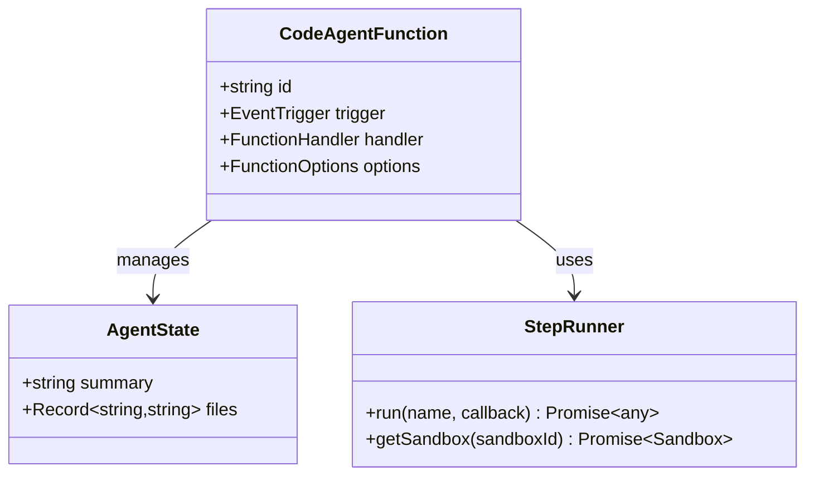

**Diagram sources**
- [src/inngest/functions.ts](file://src/inngest/functions.ts#L13-L15)
- [src/inngest/functions.ts](file://src/inngest/functions.ts#L11-L12)

### Core Components

**State Management:**
- Persistent agent state across execution steps
- File system state tracking
- Task summary persistence

**Execution Context:**
- Isolated sandbox environment
- Tool availability and configuration
- Network orchestration capabilities

**Section sources**
- [src/inngest/functions.ts](file://src/inngest/functions.ts#L13-L15)
- [src/inngest/functions.ts](file://src/inngest/functions.ts#L11-L12)

## E2B Sandbox Environment

### Sandbox Initialization

The E2B sandbox provides a secure, isolated environment for AI agent execution:

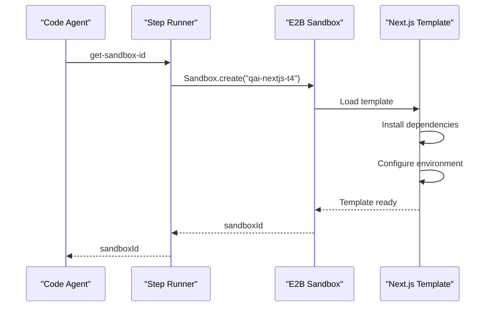

**Diagram sources**
- [src/inngest/functions.ts](file://src/inngest/functions.ts#L16-L19)
- [sandbox-templates/nextjs/e2b.toml](file://sandbox-templates/nextjs/e2b.toml#L1-L18)

### Environment Configuration

**Base Image:** Node.js 21 slim
**Pre-installed Framework:** Next.js 15.1.6
**UI Library:** Shadcn UI 3.2.1
**Styling:** Tailwind CSS with neutral theme
**Development Mode:** Hot reload enabled on port 3000

### Security Boundaries

- **Process isolation**: Complete process separation
- **Network isolation**: Controlled network access
- **File system isolation**: Restricted file system access
- **Resource limits**: CPU and memory constraints

**Section sources**
- [sandbox-templates/nextjs/e2b.toml](file://sandbox-templates/nextjs/e2b.toml#L1-L18)
- [sandbox-templates/nextjs/e2b.Dockerfile](file://sandbox-templates/nextjs/e2b.Dockerfile#L1-L20)
- [sandbox-templates/nextjs/compile_page.sh](file://sandbox-templates/nextjs/compile_page.sh#L1-L20)

## Tool System

### Available Tools

The AI agent has access to three specialized tools for sandbox interaction:

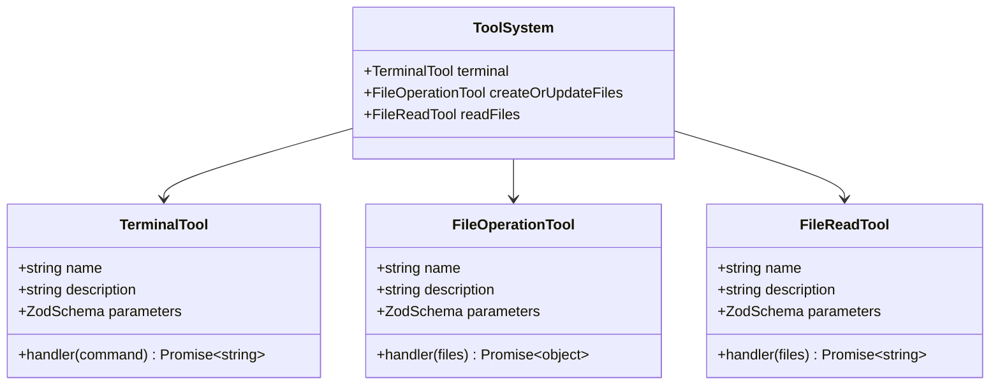

**Diagram sources**
- [src/inngest/functions.ts](file://src/inngest/functions.ts#L25-L135)

### Terminal Tool

**Purpose:** Execute shell commands within the sandbox environment

**Parameter Schema:**
```typescript
{
  command: z.string()
}
```

**Capabilities:**
- Package installation via npm
- Build process execution
- System utility access
- Development server interaction

**Error Handling:**
- Captures stdout and stderr streams
- Provides detailed error reporting
- Prevents command injection attacks

### File Operations Tool

**Purpose:** Create or update files in the sandbox file system

**Parameter Schema:**
```typescript
{
  files: z.array(z.object({
    path: z.string(),
    content: z.string()
  }))
}
```

**Features:**
- Atomic file operations
- Path validation and sanitization
- State synchronization with agent
- Error rollback capabilities

### File Read Tool

**Purpose:** Read content from sandbox files

**Parameter Schema:**
```typescript
{
  files: z.array(z.string())
}
```

**Output Format:**
```typescript
JSON.stringify([
  {
    path: string,
    content: string
  }
])
```

**Section sources**
- [src/inngest/functions.ts](file://src/inngest/functions.ts#L25-L135)

## Agent Network Lifecycle

### Network Configuration

The agent network orchestrates multiple iterations of agent execution:

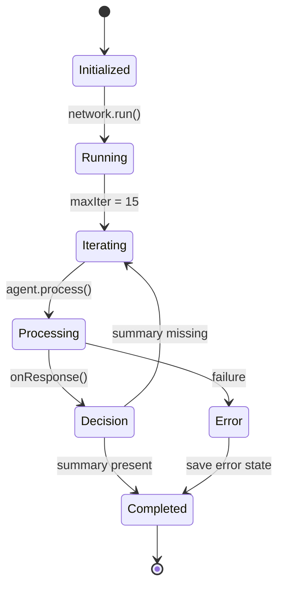

**Diagram sources**
- [src/inngest/functions.ts](file://src/inngest/functions.ts#L140-L155)

### Iteration Control

**Maximum Iterations:** 15
**Termination Condition:** Task summary present in agent state
**Routing Logic:** Continues execution until completion criteria met

### State Propagation

Each network iteration maintains and propagates state:
- File system modifications
- Task progress tracking
- Agent responses and decisions

**Section sources**
- [src/inngest/functions.ts](file://src/inngest/functions.ts#L140-L155)

## State Persistence and Response Handling

### Response Processing Pipeline

The agent's response handling captures task summaries and maintains state:

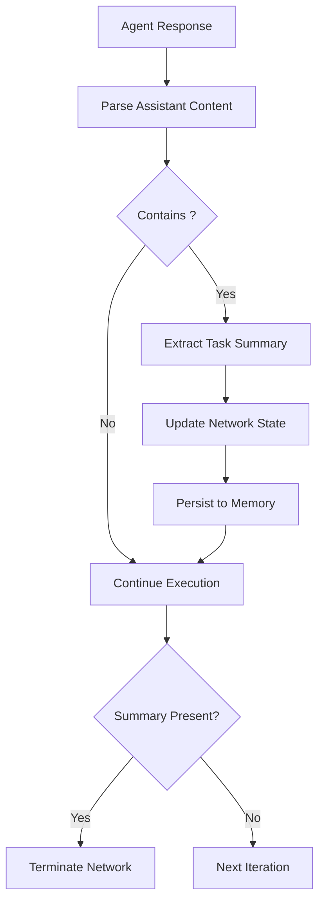

**Diagram sources**
- [src/inngest/functions.ts](file://src/inngest/functions.ts#L137-L145)

### State Management Features

**Summary Extraction:**
- Detects `<task_summary>` markers in agent responses
- Extracts complete task descriptions
- Preserves formatting and structure

**File State Tracking:**
- Maintains file modification history
- Tracks incremental changes
- Enables rollback capabilities

**Persistence Mechanisms:**
- In-memory state storage
- Network-level state propagation
- Database integration for long-term storage

**Section sources**
- [src/inngest/functions.ts](file://src/inngest/functions.ts#L137-L145)
- [src/inngest/utils.ts](file://src/inngest/utils.ts#L10-L20)

## Database Integration

### Data Model Structure

The database schema supports comprehensive execution tracking:

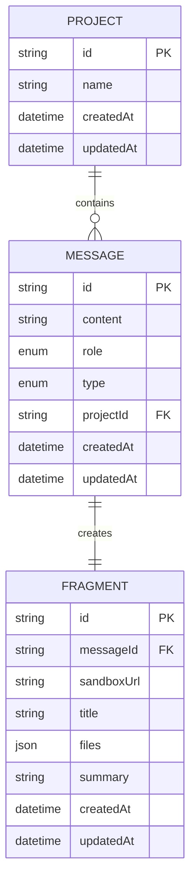

**Diagram sources**
- [prisma/schema.prisma](file://prisma/schema.prisma#L1-L66)

### Database Operations

**Success Case:**
- Creates message record with task summary
- Establishes fragment relationship
- Stores sandbox URL and file state
- Links to original project

**Error Case:**
- Records error message with generic failure text
- Maintains project association
- Preserves execution context

### Data Persistence Workflow

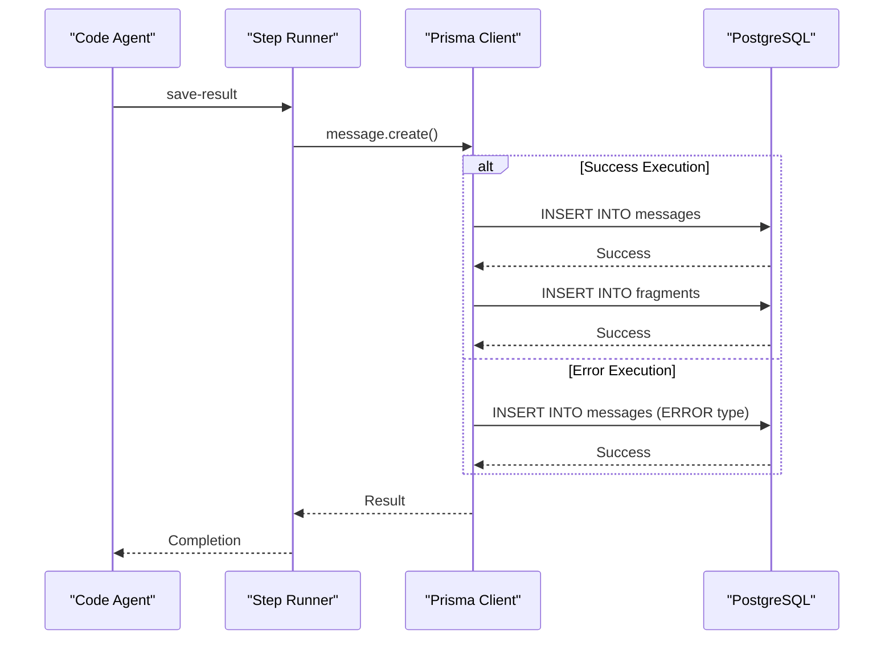

**Diagram sources**
- [src/inngest/functions.ts](file://src/inngest/functions.ts#L175-L195)

**Section sources**
- [prisma/schema.prisma](file://prisma/schema.prisma#L1-L66)
- [src/inngest/functions.ts](file://src/inngest/functions.ts#L175-L195)

## Security Aspects

### Sandbox Isolation

**Process Isolation:**
- Complete process namespace separation
- Memory space isolation
- File descriptor isolation

**Network Isolation:**
- Controlled outbound connections
- No inbound service exposure
- DNS resolution through controlled channels

**File System Isolation:**
- Read-only root filesystem
- Temporary writable areas
- Path traversal prevention

### Input Validation

**Payload Validation:**
- Zod schema validation for all inputs
- Character limit enforcement (1000 chars max)
- Required field checking
- Type safety enforcement

**Command Sanitization:**
- Shell command validation
- Parameter escaping
- Dangerous command blocking
- Resource usage monitoring

### Network State Management

**Connection Security:**
- TLS encryption for all communications
- Certificate validation
- Secure credential handling

**State Protection:**
- Memory encryption during execution
- Secure state serialization
- Access control enforcement

**Section sources**
- [src/inngest/functions.ts](file://src/inngest/functions.ts#L25-L135)
- [src/modules/projects/server/procedures.ts](file://src/modules/projects/server/procedures.ts#L25-L30)
- [src/modules/messages/server/procedures.ts](file://src/modules/messages/server/procedures.ts#L20-L25)

## Debugging and Monitoring

### Inngest Dashboard Integration

The Inngest dashboard provides comprehensive monitoring capabilities:

**Event Tracking:**
- Real-time event delivery status
- Processing duration metrics
- Error rate monitoring

**Function Performance:**
- Step execution timing
- Resource utilization tracking
- Bottleneck identification

**Debug Information:**
- Step-by-step execution logs
- Sandbox connection status
- Tool execution traces

### Logging Strategy

**Structured Logging:**
- JSON-formatted log entries
- Correlation ID tracking
- Severity level classification

**Error Logging:**
- Detailed error contexts
- Stack trace preservation
- Recovery attempt logging

### Monitoring Metrics

**Key Performance Indicators:**
- Event delivery latency
- Function execution time
- Success/failure rates
- Resource consumption

**Alerting Thresholds:**
- Timeout detection
- Error rate spikes
- Resource exhaustion warnings

## Failure Scenarios

### Common Failure Modes

**Sandbox Connection Failures:**
- E2B service unavailability
- Template loading errors
- Resource allocation issues

**Agent Execution Failures:**
- Tool execution timeouts
- Memory exhaustion
- Infinite loop detection

**Database Operation Failures:**
- Connection timeouts
- Constraint violations
- Transaction rollbacks

### Error Recovery Strategies

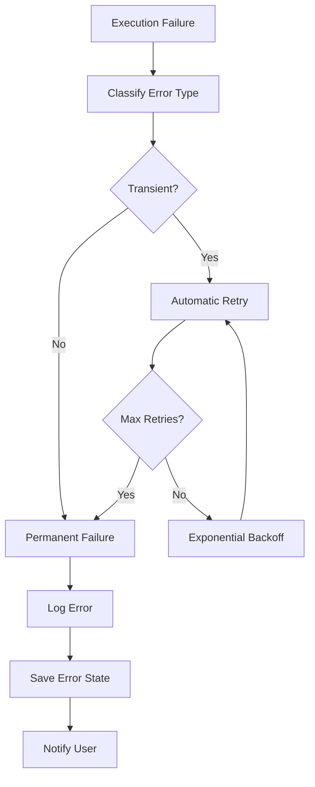

**Diagram sources**
- [src/inngest/functions.ts](file://src/inngest/functions.ts#L175-L195)

### Error Handling Implementation

**Graceful Degradation:**
- Fallback to basic functionality
- Reduced feature set for partial failures
- User-friendly error messaging

**Recovery Mechanisms:**
- Sandbox recreation on connection loss
- State restoration from checkpoints
- Partial result preservation

**Section sources**
- [src/inngest/functions.ts](file://src/inngest/functions.ts#L175-L195)

## Examples and Usage Patterns

### Basic Event Sending

**From tRPC Procedures:**
```typescript
// Project creation with automatic event triggering
await inngest.send({
  name: "code-agent/run",
  data: {
    value: "Create a responsive navbar with mobile menu",
    projectId: createdProject.id,
  },
});

// Message creation with iterative assistance
await inngest.send({
  name: "code-agent/run",
  data: {
    value: "Add dark mode toggle functionality",
    projectId: existingProject.id,
  },
});
```

### Advanced Usage Patterns

**Iterative Development:**
```typescript
// Initial prompt
await inngest.send({
  name: "code-agent/run",
  data: {
    value: "Build a todo list application with CRUD operations",
    projectId: projectId,
  },
});

// Follow-up enhancements
await inngest.send({
  name: "code-agent/run",
  data: {
    value: "Add sorting and filtering capabilities",
    projectId: projectId,
  },
});
```

**Error Handling Integration:**
```typescript
try {
  await inngest.send({
    name: "code-agent/run",
    data: {
      value: "Complex UI component with animations",
      projectId: projectId,
    },
  });
} catch (error) {
  // Handle event sending failures
  console.error("Failed to trigger code agent:", error);
}
```

### Debugging Event Steps

**Monitoring Execution:**
- Use Inngest dashboard for real-time visibility
- Monitor step execution times
- Track tool usage patterns
- Analyze error frequencies

**Local Development:**
- Enable detailed logging
- Test with simplified prompts
- Verify sandbox connectivity
- Validate database operations

**Section sources**
- [src/modules/projects/server/procedures.ts](file://src/modules/projects/server/procedures.ts#L48-L52)
- [src/modules/messages/server/procedures.ts](file://src/modules/messages/server/procedures.ts#L38-L42)