# Create Message

<cite>
**Referenced Files in This Document**
- [procedures.ts](file://src/modules/messages/server/procedures.ts)
- [_app.ts](file://src/trpc/routers/_app.ts)
- [message-form.tsx](file://src/modules/projects/ui/components/message-form.tsx)
- [messages-container.tsx](file://src/modules/projects/ui/components/messages-container.tsx)
- [message-card.tsx](file://src/modules/projects/ui/components/message-card.tsx)
- [message-loading.tsx](file://src/modules/projects/ui/components/message-loading.tsx)
- [client.tsx](file://src/trpc/client.tsx)
- [query-client.ts](file://src/trpc/query-client.ts)
- [functions.ts](file://src/inngest/functions.ts)
- [db.ts](file://src/lib/db.ts)
- [project-view.tsx](file://src/modules/projects/ui/views/project-view.tsx)
- [prompt.ts](file://src/prompt.ts)
</cite>

## Table of Contents
1. [Introduction](#introduction)
2. [System Architecture](#system-architecture)
3. [Server-Side Implementation](#server-side-implementation)
4. [Frontend Integration](#frontend-integration)
5. [Validation and Security](#validation-and-security)
6. [Asynchronous Workflow](#asynchronous-workflow)
7. [UI State Management](#ui-state-management)
8. [Error Handling](#error-handling)
9. [Performance Considerations](#performance-considerations)
10. [Security Measures](#security-measures)
11. [Troubleshooting Guide](#troubleshooting-guide)
12. [Conclusion](#conclusion)

## Introduction

The 'messages.create' tRPC mutation is a critical component of the QAI platform that enables users to submit messages for AI-powered code generation. This system demonstrates a sophisticated full-stack architecture combining Zod validation, Prisma ORM persistence, Inngest event orchestration, and React Query state management to deliver a seamless user experience while maintaining robust security and performance standards.

The mutation serves as the entry point for user interactions, validating input constraints, persisting messages with specific roles and types, and triggering an AI agent workflow that generates code fragments in a sandboxed environment. This comprehensive system showcases modern web development patterns including reactive UI updates, optimistic concurrency, and asynchronous processing.

## System Architecture

The 'messages.create' mutation follows a layered architecture pattern that separates concerns across multiple technical domains:

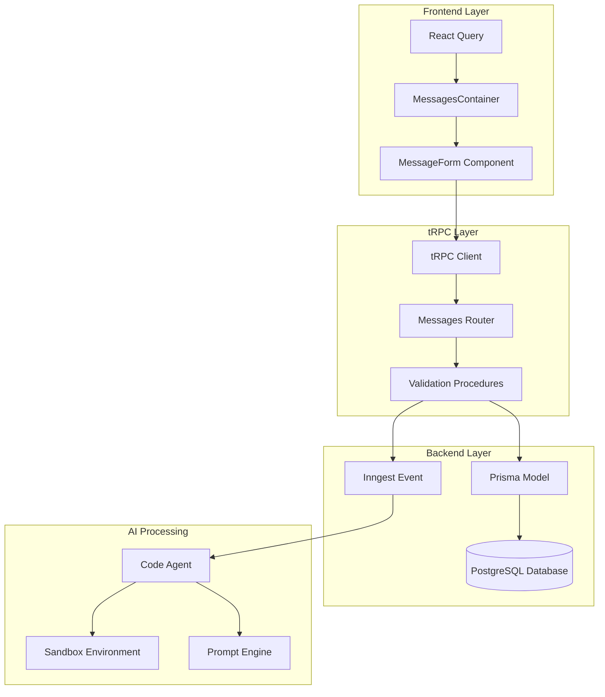

**Diagram sources**
- [message-form.tsx](file://src/modules/projects/ui/components/message-form.tsx#L1-L122)
- [messages-container.tsx](file://src/modules/projects/ui/components/messages-container.tsx#L1-L76)
- [procedures.ts](file://src/modules/messages/server/procedures.ts#L1-L56)
- [functions.ts](file://src/inngest/functions.ts#L1-L212)

The architecture demonstrates clear separation of responsibilities:
- **Frontend**: Handles user interaction, form validation, and UI state management
- **tRPC Layer**: Provides type-safe API communication with input validation
- **Backend**: Manages data persistence and event orchestration
- **AI Processing**: Executes code generation in isolated environments

## Server-Side Implementation

The server-side implementation resides in the messages router and demonstrates enterprise-grade validation and persistence patterns:

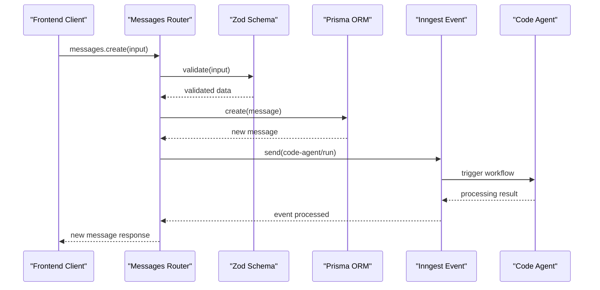

**Diagram sources**
- [procedures.ts](file://src/modules/messages/server/procedures.ts#L25-L56)
- [functions.ts](file://src/inngest/functions.ts#L15-L212)

### Input Validation

The mutation employs comprehensive Zod validation to ensure data integrity:

| Field | Type | Constraints | Validation Logic |
|-------|------|-------------|------------------|
| `value` | string | Required | Minimum 1 character, Maximum 1000 characters |
| `projectId` | string | Required | Must be non-empty string |

The validation schema ensures that:
- User input meets length requirements (1-1000 characters)
- Project association is mandatory
- Input sanitization prevents injection attacks
- Type safety guarantees consistent data handling

### Database Persistence

The mutation creates a new message record with predefined attributes:

| Field | Value | Purpose |
|-------|-------|---------|
| `projectId` | input.projectId | Links message to project context |
| `content` | input.value | Stores user-provided message text |
| `role` | "USER" | Identifies message origin |
| `type` | "RESULT" | Categorizes message type |

The Prisma ORM handles transaction management and foreign key constraints, ensuring referential integrity between messages and projects.

### Event Orchestration

Critical to the system's functionality, the mutation triggers the 'code-agent/run' Inngest event, initiating the AI workflow:

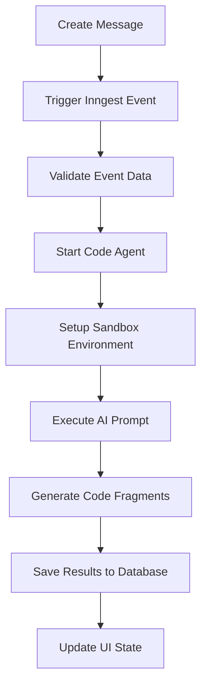

**Diagram sources**
- [procedures.ts](file://src/modules/messages/server/procedures.ts#L45-L56)
- [functions.ts](file://src/inngest/functions.ts#L15-L212)

**Section sources**
- [procedures.ts](file://src/modules/messages/server/procedures.ts#L25-L56)

## Frontend Integration

The frontend implementation utilizes React Hook Form with Zod resolver for client-side validation and React Query for state management:

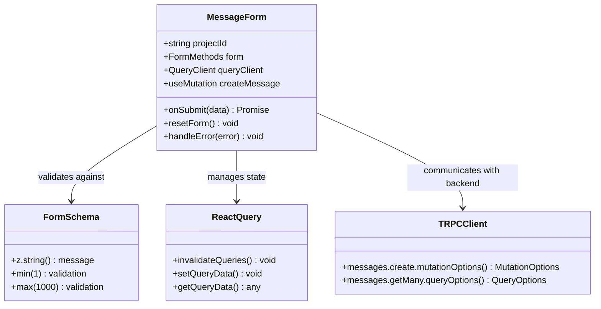

**Diagram sources**
- [message-form.tsx](file://src/modules/projects/ui/components/message-form.tsx#L20-L122)
- [client.tsx](file://src/trpc/client.tsx#L1-L60)

### Form Submission Handling

The MessageForm component implements sophisticated form handling with optimistic updates and error recovery:

| Feature | Implementation | Purpose |
|---------|----------------|---------|
| Zod Resolver | `zodResolver(formSchema)` | Client-side validation |
| Loading States | `createMessage.isPending` | UI feedback during processing |
| Form Reset | `form.reset()` | Clear input after successful submission |
| Error Handling | `toast.error()` | User-friendly error notifications |
| Optimistic Updates | Immediate UI updates | Enhanced user experience |

### React Query Integration

The mutation integrates seamlessly with React Query for state synchronization:

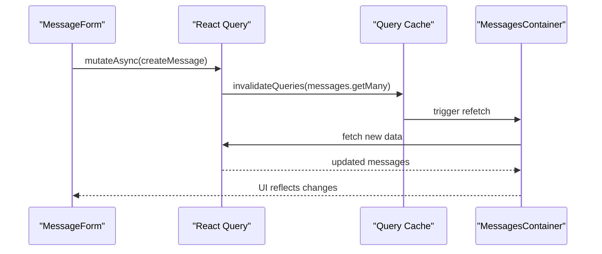

**Diagram sources**
- [message-form.tsx](file://src/modules/projects/ui/components/message-form.tsx#L45-L60)
- [messages-container.tsx](file://src/modules/projects/ui/components/messages-container.tsx#L20-L35)

### Loading State Management

The MessagesContainer component displays loading indicators when processing user messages:

| State | Component | Behavior |
|-------|-----------|----------|
| User Message Submitted | MessageLoading | Shows animated loading text |
| AI Response Pending | None | Maintains user message display |
| AI Response Complete | MessageCard | Renders assistant response |
| Error State | Toast Notification | Displays error message |

**Section sources**
- [message-form.tsx](file://src/modules/projects/ui/components/message-form.tsx#L1-L122)
- [messages-container.tsx](file://src/modules/projects/ui/components/messages-container.tsx#L1-L76)

## Validation and Security

The system implements multi-layered validation and security measures to protect against various attack vectors:

### Input Sanitization

| Validation Layer | Technology | Purpose |
|------------------|------------|---------|
| Client-side | React Hook Form + Zod | Immediate user feedback |
| Server-side | Zod Schema | Backend data integrity |
| Database-level | Prisma Constraints | Physical data protection |

### Length Restrictions

The validation enforces strict character limits:
- **Minimum**: 1 character (prevents empty submissions)
- **Maximum**: 1000 characters (prevents denial-of-service attacks)
- **Type Safety**: Compile-time guarantees through TypeScript

### Security Measures

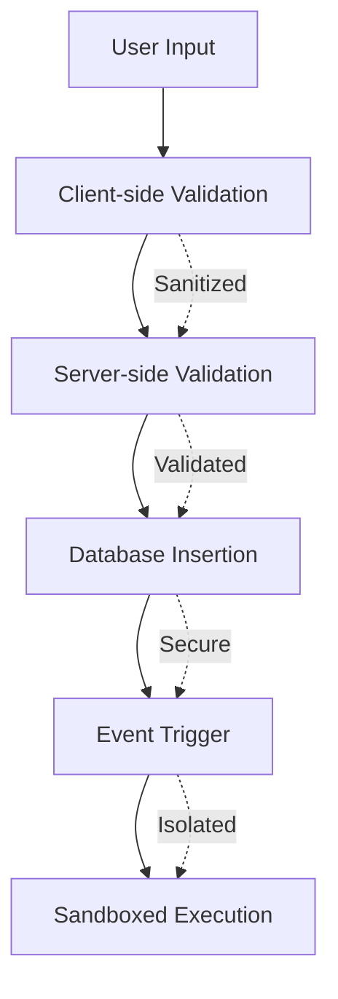

**Diagram sources**
- [message-form.tsx](file://src/modules/projects/ui/components/message-form.tsx#L25-L30)
- [procedures.ts](file://src/modules/messages/server/procedures.ts#L28-L33)

**Section sources**
- [message-form.tsx](file://src/modules/projects/ui/components/message-form.tsx#L25-L30)
- [procedures.ts](file://src/modules/messages/server/procedures.ts#L28-L33)

## Asynchronous Workflow

The mutation orchestrates a complex asynchronous workflow that maintains UI responsiveness while processing AI requests:

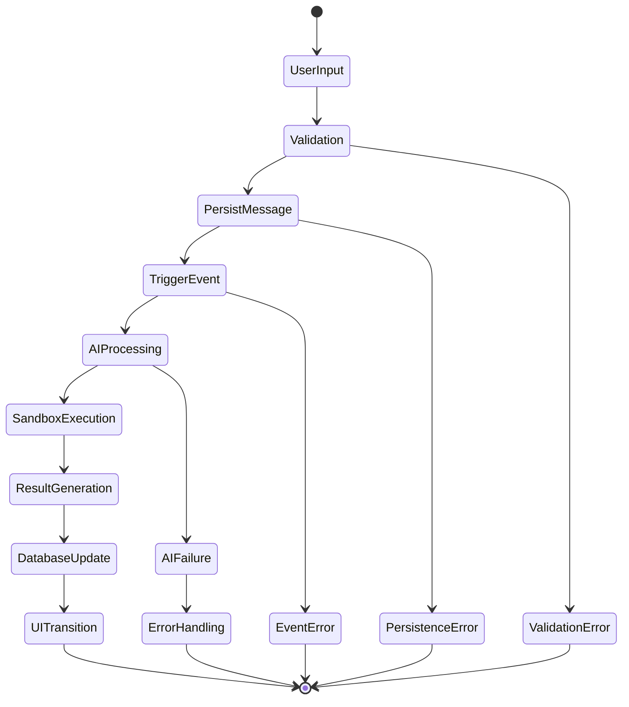

**Diagram sources**
- [procedures.ts](file://src/modules/messages/server/procedures.ts#L45-L56)
- [functions.ts](file://src/inngest/functions.ts#L15-L212)

### Workflow Phases

1. **Immediate Response**: User receives instant feedback upon form submission
2. **Background Processing**: AI agent operates independently of UI thread
3. **Progressive Enhancement**: UI updates as AI results become available
4. **Error Recovery**: Graceful degradation for failed operations

### Concurrency Management

The system handles concurrent message submissions through:
- **Optimistic Updates**: Immediate UI feedback before server confirmation
- **Query Invalidation**: Automatic cache refresh upon successful mutations
- **Loading States**: Clear indication of ongoing operations

**Section sources**
- [procedures.ts](file://src/modules/messages/server/procedures.ts#L45-L56)
- [functions.ts](file://src/inngest/functions.ts#L15-L212)

## UI State Management

The frontend implements sophisticated state management patterns to handle the complex interaction between user input, loading states, and AI responses:

### Component Interaction

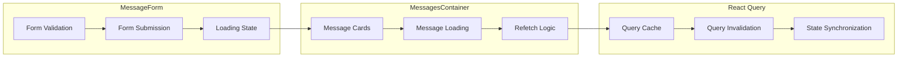

**Diagram sources**
- [message-form.tsx](file://src/modules/projects/ui/components/message-form.tsx#L45-L60)
- [messages-container.tsx](file://src/modules/projects/ui/components/messages-container.tsx#L20-L50)

### State Transitions

| Initial State | User Action | Intermediate State | Final State |
|---------------|-------------|-------------------|-------------|
| Idle | Submit Message | Loading | Message + Loading Indicator |
| Message + Loading | AI Response | Message + Response | Updated Message List |
| Error | Retry | Loading | New State |
| Success | New Message | Loading | Fresh Cycle |

### Scroll Management

The MessagesContainer implements intelligent scrolling behavior:
- **Automatic Scrolling**: New messages appear at the bottom
- **Smooth Transitions**: Animated scroll for better UX
- **Fragment Navigation**: Clickable fragments update the preview pane

**Section sources**
- [messages-container.tsx](file://src/modules/projects/ui/components/messages-container.tsx#L40-L76)
- [message-card.tsx](file://src/modules/projects/ui/components/message-card.tsx#L1-L149)

## Error Handling

The system implements comprehensive error handling across all layers to provide graceful degradation and meaningful user feedback:

### Error Categories

| Error Type | Source | Handling Strategy | User Experience |
|------------|--------|-------------------|-----------------|
| Validation Errors | Client/Server | Immediate feedback | Inline error messages |
| Network Errors | tRPC Client | Retry mechanisms | Toast notifications |
| Database Errors | Prisma | Transaction rollback | Generic error message |
| AI Processing Errors | Inngest Agent | Fallback response | Error message display |

### Error Recovery Patterns

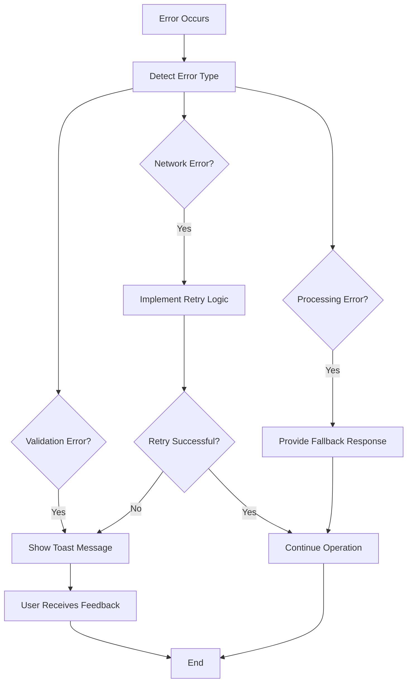

**Diagram sources**
- [message-form.tsx](file://src/modules/projects/ui/components/message-form.tsx#L50-L60)

### Error Boundaries

The system implements error boundaries at multiple levels:
- **Form Level**: Individual field validation errors
- **Mutation Level**: API communication failures
- **Component Level**: Rendering errors in message display
- **Application Level**: Unhandled exceptions

**Section sources**
- [message-form.tsx](file://src/modules/projects/ui/components/message-form.tsx#L50-L60)

## Performance Considerations

The implementation incorporates several performance optimization strategies to ensure responsive user experience:

### Caching Strategy

| Cache Type | Duration | Scope | Purpose |
|------------|----------|-------|---------|
| Query Cache | 30 seconds | Messages List | Reduce API calls |
| Mutation Cache | Until invalidated | Single operation | Optimistic updates |
| Component Cache | Session-based | UI state | Preserve user context |

### Lazy Loading

The system implements progressive loading:
- **Project View**: Lazy-loaded components for better initial load times
- **Message List**: Incremental loading as AI responses arrive
- **File Explorer**: On-demand file content loading

### Memory Management

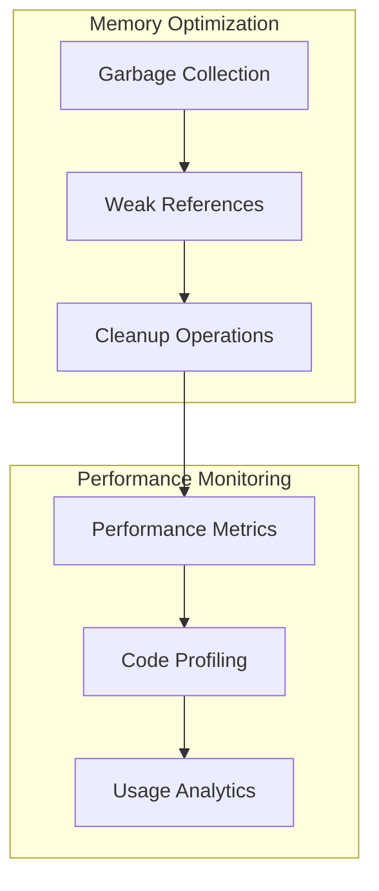

**Diagram sources**
- [query-client.ts](file://src/trpc/query-client.ts#L1-L23)

### Optimization Techniques

- **Batch Queries**: Group related database operations
- **Selective Refetching**: Targeted cache updates
- **Debounced Inputs**: Prevent excessive API calls
- **Virtual Scrolling**: Efficient rendering of large message lists

**Section sources**
- [query-client.ts](file://src/trpc/query-client.ts#L1-L23)
- [messages-container.tsx](file://src/modules/projects/ui/components/messages-container.tsx#L25-L35)

## Security Measures

The system implements defense-in-depth security measures to protect against various threat vectors:

### Input Validation

| Security Layer | Implementation | Protection Against |
|----------------|----------------|-------------------|
| Client-side | React Hook Form + Zod | Basic sanitization |
| Server-side | Zod Schema | Data integrity |
| Database-level | Prisma constraints | SQL injection |
| Network-level | HTTPS/TLS | Data interception |

### Access Control

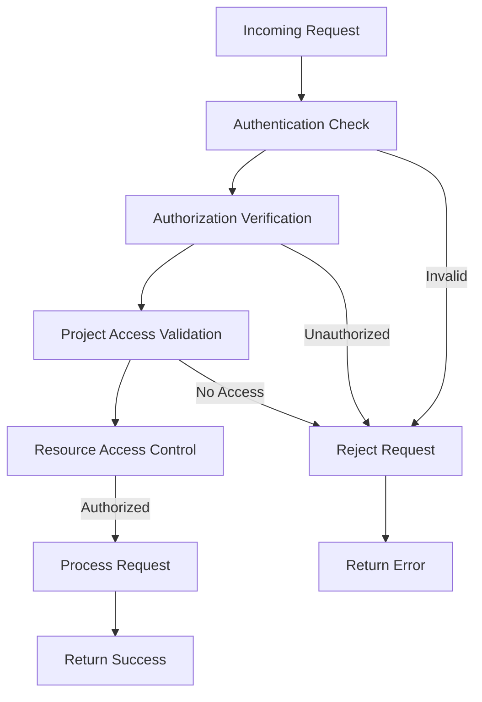

**Diagram sources**
- [procedures.ts](file://src/modules/messages/server/procedures.ts#L10-L25)

### Data Protection

- **Input Sanitization**: Removal of potentially harmful characters
- **Output Encoding**: Proper escaping for HTML/CSS/JS contexts
- **Rate Limiting**: Prevention of abuse through excessive requests
- **Audit Logging**: Tracking of sensitive operations

### Sandbox Isolation

The AI processing occurs in isolated sandbox environments:
- **Process Isolation**: Separate processes for each request
- **Network Isolation**: Restricted network access
- **File System Isolation**: Controlled file system access
- **Resource Limits**: CPU/memory constraints

**Section sources**
- [procedures.ts](file://src/modules/messages/server/procedures.ts#L28-L33)
- [functions.ts](file://src/inngest/functions.ts#L15-L50)

## Troubleshooting Guide

Common issues and their solutions when working with the 'messages.create' mutation:

### Form Submission Issues

| Problem | Symptoms | Solution |
|---------|----------|----------|
| Form not submitting | No response to click | Check `isButtonDisabled` state |
| Validation errors | Red error messages | Verify input length and format |
| Stuck loading | Button stays spinning | Check network connectivity |

### AI Processing Problems

| Issue | Cause | Resolution |
|-------|-------|------------|
| No AI response | Agent timeout | Wait for retry or refresh |
| Sandbox failure | Resource exhaustion | Monitor resource usage |
| Invalid code | Agent error | Review prompt quality |

### Database Connectivity

| Error | Possible Causes | Debug Steps |
|-------|----------------|-------------|
| "Project ID required" | Missing projectId | Verify URL parameters |
| "Message too long" | Validation failure | Check character count |
| "Database connection" | Server outage | Check service health |

### Performance Issues

| Symptom | Likely Cause | Improvement |
|---------|--------------|-------------|
| Slow form submission | Network latency | Enable caching |
| UI lag | Large message lists | Implement virtual scrolling |
| Memory leaks | Unclosed subscriptions | Review cleanup logic |

**Section sources**
- [message-form.tsx](file://src/modules/projects/ui/components/message-form.tsx#L50-L60)
- [functions.ts](file://src/inngest/functions.ts#L180-L212)

## Conclusion

The 'messages.create' tRPC mutation represents a sophisticated implementation of modern web development patterns, combining type safety, validation, asynchronous processing, and reactive UI updates. The system demonstrates enterprise-grade architecture with clear separation of concerns, comprehensive error handling, and robust security measures.

Key achievements of this implementation include:

- **Type Safety**: Full TypeScript coverage with compile-time validation
- **User Experience**: Responsive interface with immediate feedback and smooth transitions
- **Performance**: Optimized caching and lazy loading strategies
- **Security**: Multi-layered validation and sandbox isolation
- **Maintainability**: Clean architecture with well-defined boundaries

The mutation serves as an excellent example of how to build scalable, secure, and user-friendly applications that leverage modern web technologies while maintaining code quality and developer experience. The integration between tRPC, React Query, and Inngest demonstrates how different technologies can work together to create seamless user experiences.

Future enhancements could include real-time WebSocket connections for immediate AI updates, enhanced caching strategies for improved performance, and expanded validation rules for better user guidance. The current implementation provides a solid foundation for these improvements while maintaining backward compatibility and system stability.