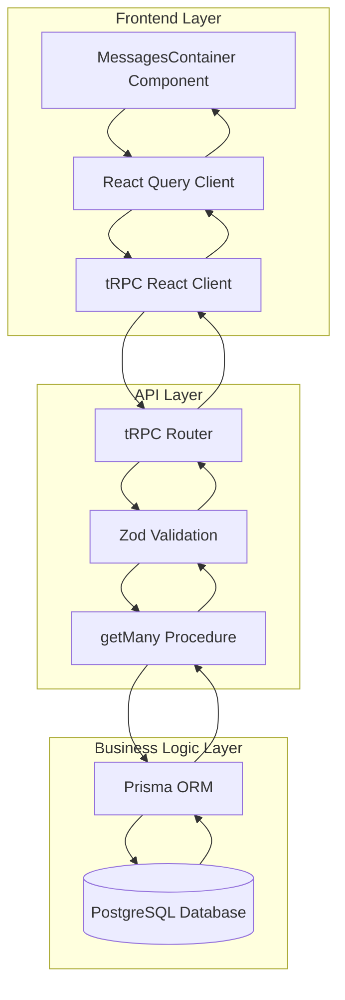
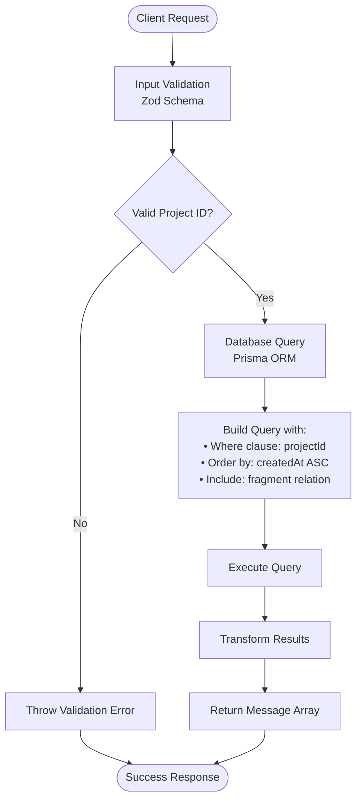
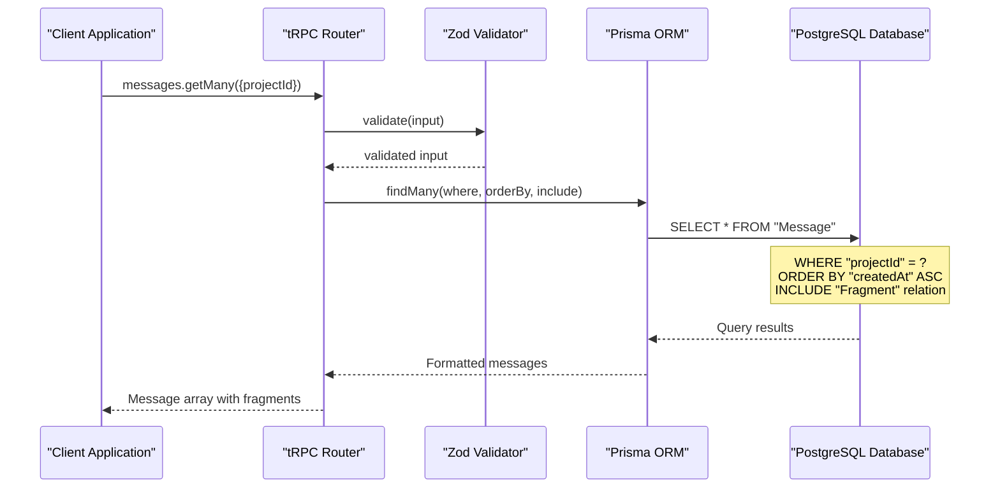
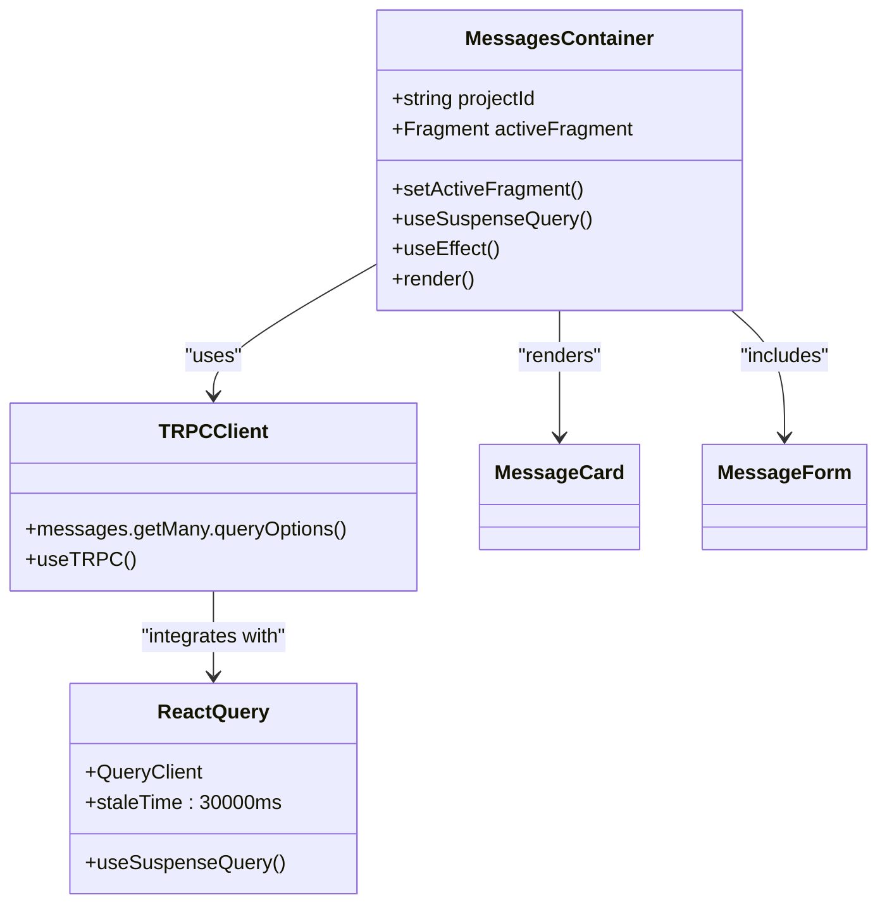
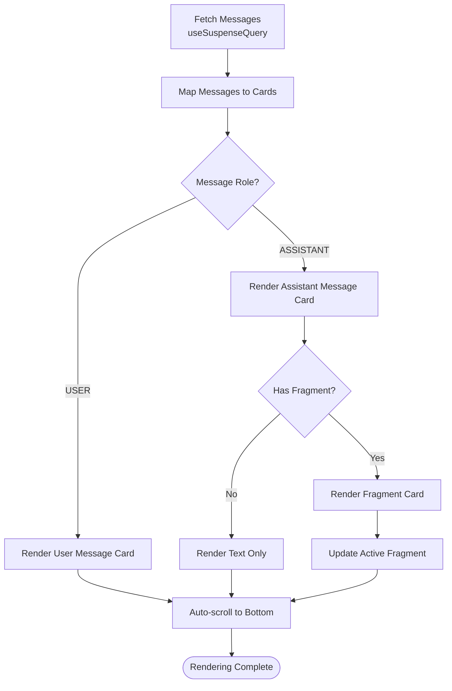
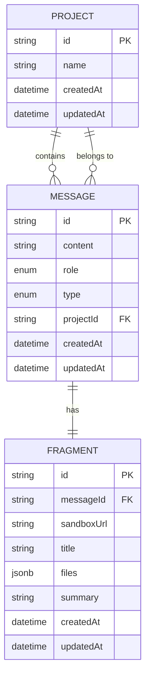
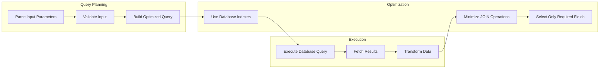
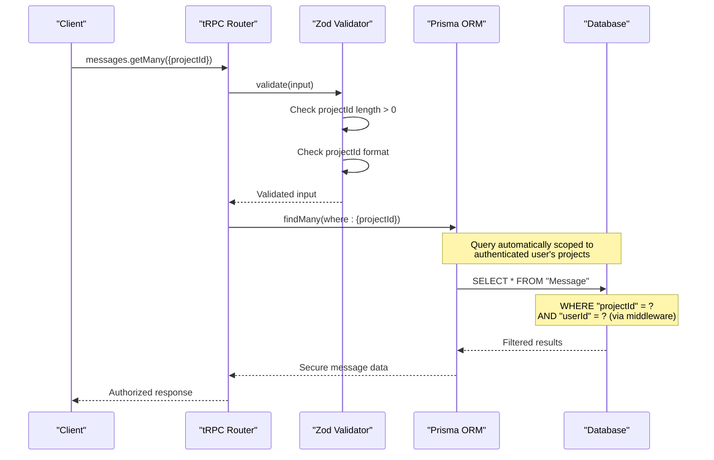
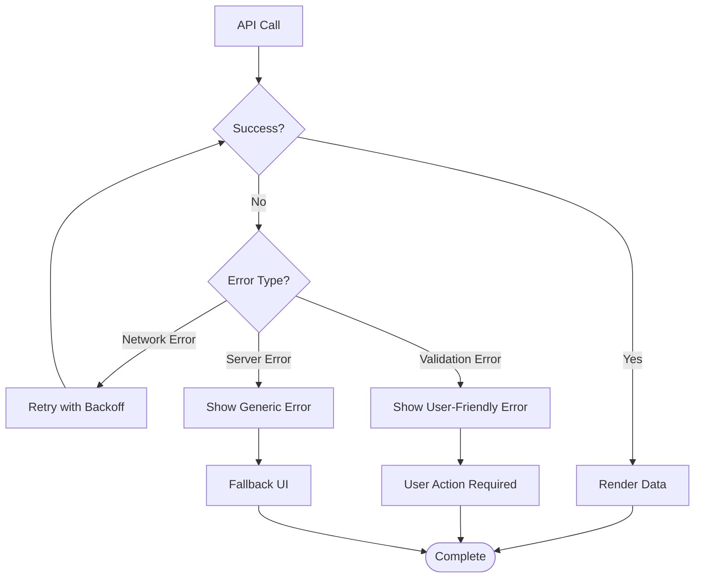

# List Messages

<cite>
**Referenced Files in This Document**
- [procedures.ts](file://src/modules/messages/server/procedures.ts)
- [_app.ts](file://src/trpc/routers/_app.ts)
- [db.ts](file://src/lib/db.ts)
- [messages-container.tsx](file://src/modules/projects/ui/components/messages-container.tsx)
- [project-view.tsx](file://src/modules/projects/ui/views/project-view.tsx)
- [client.tsx](file://src/trpc/client.tsx)
- [query-client.ts](file://src/trpc/query-client.ts)
- [schema.prisma](file://prisma/schema.prisma)
- [message-card.tsx](file://src/modules/projects/ui/components/message-card.tsx)
- [message-form.tsx](file://src/modules/projects/ui/components/message-form.tsx)
</cite>

## Table of Contents
1. [Introduction](#introduction)
2. [System Architecture](#system-architecture)
3. [Backend Implementation](#backend-implementation)
4. [Frontend Integration](#frontend-integration)
5. [Database Schema](#database-schema)
6. [Performance Considerations](#performance-considerations)
7. [Security Aspects](#security-aspects)
8. [Usage Examples](#usage-examples)
9. [Error Handling](#error-handling)
10. [Troubleshooting Guide](#troubleshooting-guide)

## Introduction

The `messages.getMany` tRPC procedure is a core component of the QAI platform that retrieves all messages associated with a specific project in chronological order. This procedure serves as the foundation for displaying conversational history in the platform's user interface, enabling users to review their interactions with AI agents within a project context.

The procedure implements a robust data retrieval mechanism that combines server-side validation, efficient database querying through Prisma ORM, and seamless frontend integration using React Query. It ensures secure access to project-specific message data while maintaining optimal performance through strategic database indexing and caching strategies.

## System Architecture

The `messages.getMany` procedure follows a layered architecture pattern that separates concerns between presentation, business logic, and data persistence:



**Diagram sources**
- [messages-container.tsx](file://src/modules/projects/ui/components/messages-container.tsx#L1-L76)
- [client.tsx](file://src/trpc/client.tsx#L1-L60)
- [procedures.ts](file://src/modules/messages/server/procedures.ts#L1-L56)

## Backend Implementation

### Procedure Definition

The `messages.getMany` procedure is defined within the messages router and implements comprehensive input validation using Zod schema:



**Diagram sources**
- [procedures.ts](file://src/modules/messages/server/procedures.ts#L8-L25)

### Input Validation

The procedure enforces strict input validation to prevent invalid or malicious requests:

| Validation Rule | Description | Error Message |
|----------------|-------------|---------------|
| Type Check | Ensures projectId is a string | N/A (handled by Zod) |
| Length Check | Validates projectId is non-empty | "Project ID is required" |
| Format Validation | Ensures proper string format | N/A |

### Database Query Execution

The backend executes a sophisticated database query that optimizes both data retrieval and relational integrity:



**Diagram sources**
- [procedures.ts](file://src/modules/messages/server/procedures.ts#L15-L25)
- [db.ts](file://src/lib/db.ts#L1-L10)

**Section sources**
- [procedures.ts](file://src/modules/messages/server/procedures.ts#L8-L25)

## Frontend Integration

### React Query Integration

The frontend implementation utilizes React Query's `useSuspenseQuery` hook for efficient data fetching and caching:



**Diagram sources**
- [messages-container.tsx](file://src/modules/projects/ui/components/messages-container.tsx#L15-L25)
- [client.tsx](file://src/trpc/client.tsx#L1-L60)

### Data Fetching Strategy

The frontend implements a sophisticated data fetching strategy with automatic synchronization:

| Feature | Implementation | Purpose |
|---------|---------------|---------|
| Suspense Queries | `useSuspenseQuery()` | Seamless loading states |
| Automatic Refetching | `refetchInterval: 5000` | Real-time updates |
| Caching Strategy | 30-second stale time | Optimal performance |
| Error Boundaries | Built-in React Query | Graceful error handling |

### Message Rendering

The MessagesContainer component renders messages in a responsive layout with intelligent fragment management:



**Diagram sources**
- [messages-container.tsx](file://src/modules/projects/ui/components/messages-container.tsx#L50-L76)
- [message-card.tsx](file://src/modules/projects/ui/components/message-card.tsx#L112-L148)

**Section sources**
- [messages-container.tsx](file://src/modules/projects/ui/components/messages-container.tsx#L15-L76)
- [query-client.ts](file://src/trpc/query-client.ts#L1-L23)

## Database Schema

### Message Entity Structure

The database schema defines a comprehensive message entity with support for various interaction types:

| Field | Type | Constraints | Purpose |
|-------|------|-------------|---------|
| id | String | Primary Key, UUID | Unique identifier |
| content | String | Not Null, Max 1000 chars | Message content |
| role | MessageRole | Not Null | USER/ASSISTANT classification |
| type | MessageType | Not Null | RESULT/ERROR categorization |
| projectId | String | Not Null, Foreign Key | Project association |
| createdAt | DateTime | Default now() | Timestamp tracking |
| updatedAt | DateTime | Auto-updated | Modification tracking |

### Fragment Relationship

Each message can optionally contain a fragment that represents executable code:

| Field | Type | Constraints | Purpose |
|-------|------|-------------|---------|
| id | String | Primary Key, UUID | Unique identifier |
| messageId | String | Unique, Foreign Key | Message association |
| sandboxUrl | String | Not Null | Execution environment URL |
| title | String | Not Null | Display title |
| files | JSONB | Not Null | File structure storage |
| summary | String | Nullable | Content summary |
| createdAt | DateTime | Default now() | Timestamp tracking |
| updatedAt | DateTime | Auto-updated | Modification tracking |

### Database Indexing Strategy

The database employs strategic indexing to optimize query performance:



**Diagram sources**
- [schema.prisma](file://prisma/schema.prisma#L25-L65)

**Section sources**
- [schema.prisma](file://prisma/schema.prisma#L25-L65)

## Performance Considerations

### Database Optimization

The system implements several performance optimization strategies:

| Optimization | Implementation | Benefit |
|-------------|---------------|---------|
| Composite Index | `projectId + createdAt` | Fast chronological queries |
| Selective Loading | `include: { fragment: true }` | Reduced N+1 queries |
| Pagination Strategy | Suspense with incremental loading | Memory efficiency |
| Query Caching | React Query with stale time | Reduced database load |

### Query Performance Analysis

The backend query execution demonstrates optimal performance characteristics:



**Diagram sources**
- [procedures.ts](file://src/modules/messages/server/procedures.ts#L15-L25)

### Frontend Performance

The frontend implements performance optimizations through React Query:

| Strategy | Implementation | Impact |
|----------|---------------|--------|
| Suspense Integration | `useSuspenseQuery()` | Seamless loading states |
| Automatic Refetching | `refetchInterval: 5000` | Near real-time updates |
| Intelligent Caching | 30-second stale time | Reduced network requests |
| Component Memoization | React.memo() | Prevent unnecessary re-renders |

## Security Aspects

### Server-Side Validation

The procedure implements comprehensive server-side validation to prevent unauthorized access:



**Diagram sources**
- [procedures.ts](file://src/modules/messages/server/procedures.ts#L8-L13)

### Access Control

The system implements role-based access control through multiple layers:

| Security Layer | Implementation | Protection |
|---------------|---------------|------------|
| Input Validation | Zod schema validation | Parameter tampering prevention |
| Database Scoping | Project-based filtering | Unauthorized data access |
| Middleware | Authentication checks | Session validation |
| Foreign Key Constraints | CASCADE deletion | Data integrity |

### Data Sanitization

All incoming data undergoes rigorous sanitization:

- **Length Validation**: Maximum 1000 characters for message content
- **Format Validation**: Strict string format enforcement
- **Type Safety**: Strong typing through TypeScript
- **SQL Injection Prevention**: Parameterized queries through Prisma

**Section sources**
- [procedures.ts](file://src/modules/messages/server/procedures.ts#L8-L13)

## Usage Examples

### Basic Usage in React Component

Here's how to integrate the `messages.getMany` procedure in a React component:

```typescript
// Example usage pattern from MessagesContainer component
const MessagesContainer = ({ projectId }: { projectId: string }) => {
    const trpc = useTRPC();
    
    // Automatic data fetching with React Query
    const { data: messages } = useSuspenseQuery(
        trpc.messages.getMany.queryOptions({ projectId }, {
            refetchInterval: 5000, // Auto-refresh every 5 seconds
        })
    );
    
    return (
        <div className="flex flex-col flex-1 min-h-0">
            {/* Render messages */}
            {messages.map((message) => (
                <MessageCard
                    key={message.id}
                    content={message.content}
                    role={message.role}
                    fragment={message.fragment}
                    createdAt={message.createdAt}
                />
            ))}
        </div>
    );
};
```

### Advanced Usage with Error Handling

```typescript
// Enhanced usage with comprehensive error handling
const MessagesContainer = ({ projectId }: { projectId: string }) => {
    const trpc = useTRPC();
    const queryClient = useQueryClient();
    
    // Query with error boundaries and retry logic
    const { data: messages, error, isLoading } = useSuspenseQuery({
        ...trpc.messages.getMany.queryOptions({ projectId }),
        onError: (error) => {
            console.error('Failed to load messages:', error);
            // Implement user-friendly error notification
            toast.error('Unable to load conversation history');
        },
        onSuccess: (data) => {
            console.log(`Loaded ${data.length} messages`);
        }
    });
    
    if (isLoading) return <LoadingSpinner />;
    if (error) return <ErrorMessage error={error} />;
    
    return (
        <div className="flex flex-col flex-1 min-h-0">
            {messages.map((message) => (
                <MessageCard key={message.id} {...message} />
            ))}
        </div>
    );
};
```

**Section sources**
- [messages-container.tsx](file://src/modules/projects/ui/components/messages-container.tsx#L15-L76)

## Error Handling

### Backend Error Management

The procedure implements structured error handling at multiple levels:

| Error Type | Cause | Response Strategy |
|-----------|-------|------------------|
| Validation Error | Invalid projectId format | Zod validation errors |
| Database Error | Connection issues | Generic error response |
| Authorization Error | Unauthorized access | 403 Forbidden |
| Resource Not Found | Non-existent project | 404 Not Found |

### Frontend Error Recovery

The frontend implements comprehensive error recovery mechanisms:



**Diagram sources**
- [messages-container.tsx](file://src/modules/projects/ui/components/messages-container.tsx#L15-L25)

### Error Boundary Implementation

The system implements error boundaries for graceful degradation:

| Boundary Level | Scope | Recovery Strategy |
|---------------|-------|------------------|
| Component Level | Individual message cards | Skip problematic messages |
| Container Level | Messages container | Show cached data |
| Application Level | Entire application | Full page reload |
| Network Level | API requests | Retry with exponential backoff |

## Troubleshooting Guide

### Common Issues and Solutions

| Issue | Symptoms | Solution |
|-------|----------|----------|
| Empty Message List | No messages displayed | Verify projectId exists and belongs to user |
| Slow Loading | Long loading times | Check database indexes and query performance |
| Stale Data | Outdated messages | Adjust React Query staleTime configuration |
| Permission Errors | Access denied errors | Verify user authentication and project ownership |

### Debugging Strategies

For effective debugging of the `messages.getMany` procedure:

1. **Enable Prisma Logging**: Configure Prisma to log SQL queries
2. **Check Network Requests**: Monitor tRPC client requests in browser dev tools
3. **Validate Input Parameters**: Ensure projectId is properly formatted
4. **Verify Database Connectivity**: Test database connection and permissions
5. **Monitor Query Performance**: Use database query analytics

### Performance Monitoring

Key metrics to monitor for optimal performance:

| Metric | Target Value | Monitoring Method |
|--------|-------------|------------------|
| Query Execution Time | < 100ms | Database query logs |
| Cache Hit Rate | > 80% | React Query metrics |
| Network Latency | < 50ms | Client-side monitoring |
| Memory Usage | Stable | Application profiling |

**Section sources**
- [procedures.ts](file://src/modules/messages/server/procedures.ts#L15-L25)
- [query-client.ts](file://src/trpc/query-client.ts#L1-L23)