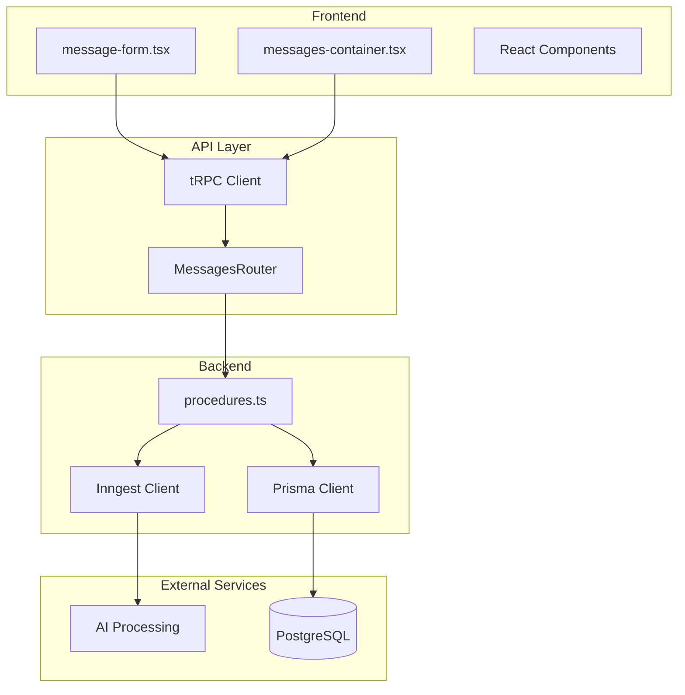
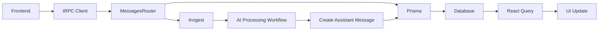
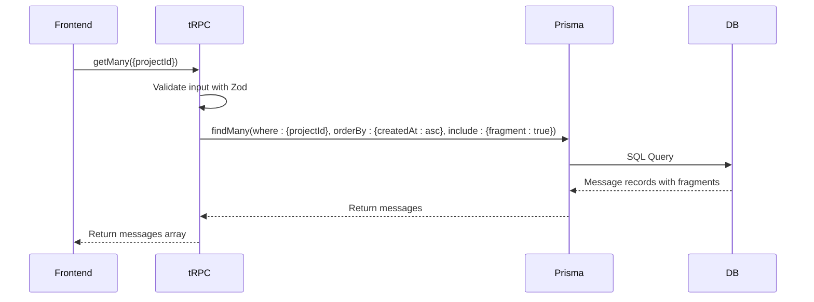
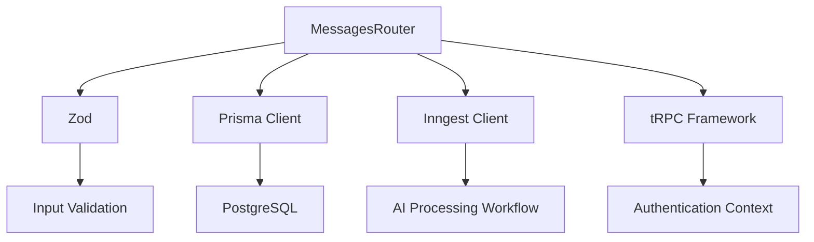

# Messages Router

<cite>
**Referenced Files in This Document**   
- [procedures.ts](file://src/modules/messages/server/procedures.ts)
- [schema.prisma](file://prisma/schema.prisma)
- [client.tsx](file://src/trpc/client.tsx)
- [functions.ts](file://src/inngest/functions.ts)
- [init.ts](file://src/trpc/init.ts)
- [db.ts](file://src/lib/db.ts)
- [message-form.tsx](file://src/modules/projects/ui/components/message-form.tsx)
- [messages-container.tsx](file://src/modules/projects/ui/components/messages-container.tsx)
</cite>

## Table of Contents
1. [Introduction](#introduction)
2. [Project Structure](#project-structure)
3. [Core Components](#core-components)
4. [Architecture Overview](#architecture-overview)
5. [Detailed Component Analysis](#detailed-component-analysis)
6. [Dependency Analysis](#dependency-analysis)
7. [Performance Considerations](#performance-considerations)
8. [Troubleshooting Guide](#troubleshooting-guide)
9. [Conclusion](#conclusion)

## Introduction
This document provides comprehensive API documentation for the MessagesRouter tRPC procedures in the QAI platform. The focus is on the 'list' (getMany) and 'create' methods, detailing their input validation with Zod, authentication context, response payloads, and integration with asynchronous workflows via Inngest. The documentation covers how messages are retrieved in chronological order, how user messages trigger AI processing, and the real-time implications for frontend updates.

## Project Structure
The QAI platform follows a modular Next.js architecture with clear separation between frontend components, backend API routes, and business logic. The messages functionality is organized under the `modules/messages` directory, with server-side procedures isolated from UI components. The tRPC framework provides type-safe API endpoints, while Prisma handles database operations and Inngest manages asynchronous workflows.



**Diagram sources**
- [procedures.ts](file://src/modules/messages/server/procedures.ts)
- [message-form.tsx](file://src/modules/projects/ui/components/message-form.tsx)
- [messages-container.tsx](file://src/modules/projects/ui/components/messages-container.tsx)

**Section sources**
- [procedures.ts](file://src/modules/messages/server/procedures.ts)
- [schema.prisma](file://prisma/schema.prisma)

## Core Components
The MessagesRouter consists of two primary procedures: `getMany` for retrieving messages and `create` for adding new messages. Both procedures use Zod for input validation and leverage Prisma for database operations. The `create` procedure additionally integrates with Inngest to trigger asynchronous AI processing workflows. The system maintains message integrity through proper foreign key relationships and cascading deletes.

**Section sources**
- [procedures.ts](file://src/modules/messages/server/procedures.ts)
- [schema.prisma](file://prisma/schema.prisma)

## Architecture Overview
The QAI platform implements a clean separation between synchronous API requests and asynchronous background processing. When a user submits a message, the system immediately persists it to the database and returns a response, while delegating AI processing to a separate workflow. This architecture ensures responsive user interfaces while handling potentially long-running AI operations.



**Diagram sources**
- [procedures.ts](file://src/modules/messages/server/procedures.ts)
- [functions.ts](file://src/inngest/functions.ts)
- [client.tsx](file://src/trpc/client.tsx)

## Detailed Component Analysis

### getMany Procedure Analysis
The `getMany` procedure retrieves all messages for a specified project, ordered chronologically. It includes associated fragment data through Prisma's include functionality, enabling efficient retrieval of related entities in a single query.



**Diagram sources**
- [procedures.ts](file://src/modules/messages/server/procedures.ts#L10-L25)
- [schema.prisma](file://prisma/schema.prisma#L30-L50)

**Section sources**
- [procedures.ts](file://src/modules/messages/server/procedures.ts#L10-L25)

### create Procedure Analysis
The `create` procedure handles user message submission by first persisting the message to the database and then triggering an asynchronous AI processing workflow via Inngest. This two-step process ensures data consistency while enabling non-blocking AI operations.


**Diagram sources**
- [procedures.ts](file://src/modules/messages/server/procedures.ts#L27-L55)
- [functions.ts](file://src/inngest/functions.ts#L10-L200)

**Section sources**
- [procedures.ts](file://src/modules/messages/server/procedures.ts#L27-L55)

### Input Validation and Security
The MessagesRouter implements robust input validation and security measures to protect against common vulnerabilities and ensure data integrity.


**Diagram sources**
- [procedures.ts](file://src/modules/messages/server/procedures.ts#L30-L35)
- [init.ts](file://src/trpc/init.ts)

**Section sources**
- [procedures.ts](file://src/modules/messages/server/procedures.ts#L30-L35)

## Dependency Analysis
The MessagesRouter depends on several core services and libraries to function properly. These dependencies enable type safety, database access, and asynchronous workflow management.



**Diagram sources**
- [procedures.ts](file://src/modules/messages/server/procedures.ts)
- [db.ts](file://src/lib/db.ts)
- [client.ts](file://src/inngest/client.ts)

**Section sources**
- [procedures.ts](file://src/modules/messages/server/procedures.ts)
- [db.ts](file://src/lib/db.ts)

## Performance Considerations
The MessagesRouter is optimized for performance through database indexing and efficient query patterns. The system leverages React Query for client-side caching and automatic refetching, minimizing unnecessary network requests.

### Database Indexing
The Prisma schema and migration history indicate that the Message table has been optimized with appropriate indexes:

- **projectId field**: Indexed to enable fast lookups of all messages for a specific project
- **createdAt field**: Indexed to support efficient chronological ordering
- **Foreign key constraint**: Ensures referential integrity between messages and projects

These indexes ensure that the `getMany` query performs efficiently even as the message volume grows.

### Caching Strategy
The frontend implementation uses React Query with a 30-second stale time, balancing data freshness with performance:

```typescript
// QueryClient configuration
defaultOptions: {
  queries: {
    staleTime: 30 * 1000,
  }
}
```

This configuration ensures that UI components receive timely updates while avoiding excessive database queries.

**Section sources**
- [schema.prisma](file://prisma/schema.prisma)
- [query-client.ts](file://src/trpc/query-client.ts)

## Troubleshooting Guide
This section addresses common issues and error scenarios when working with the MessagesRouter procedures.

### Common Errors
- **Input validation failures**: Ensure message content is between 1-1000 characters and projectId is provided
- **Project not found**: Verify the projectId exists in the database
- **Database connection issues**: Check DATABASE_URL environment variable and network connectivity
- **Inngest delivery failures**: Verify Inngest service is running and has proper API keys

### Debugging Steps
1. Check browser console for client-side validation errors
2. Verify network requests in browser developer tools
3. Examine server logs for detailed error messages
4. Validate database connectivity and schema
5. Confirm Inngest service status and function registration

**Section sources**
- [procedures.ts](file://src/modules/messages/server/procedures.ts)
- [functions.ts](file://src/inngest/functions.ts)

## Conclusion
The MessagesRouter in the QAI platform provides a robust, type-safe API for managing user messages and triggering AI processing workflows. By leveraging tRPC for endpoint definition, Prisma for database operations, and Inngest for asynchronous processing, the system achieves a clean separation of concerns while maintaining high performance and reliability. The implementation includes comprehensive input validation, proper error handling, and efficient data retrieval patterns that scale well with increasing message volume.