# Create Project

<cite>
**Referenced Files in This Document**
- [procedures.ts](file://src/modules/projects/server/procedures.ts)
- [_app.ts](file://src/trpc/routers/_app.ts)
- [project-form.tsx](file://src/modules/home/ui/components/project-form.tsx)
- [functions.ts](file://src/inngest/functions.ts)
- [route.ts](file://src/app/api/trpc/[trpc]/route.ts)
- [init.ts](file://src/trpc/init.ts)
- [schema.prisma](file://prisma/schema.prisma)
- [client.tsx](file://src/trpc/client.tsx)
- [query-client.ts](file://src/trpc/query-client.ts)
- [db.ts](file://src/lib/db.ts)
</cite>

## Table of Contents
1. [Introduction](#introduction)
2. [API Endpoint Overview](#api-endpoint-overview)
3. [Input Validation](#input-validation)
4. [Database Operations](#database-operations)
5. [Inngest Event Emission](#inngest-event-emission)
6. [Frontend Integration](#frontend-integration)
7. [Security Considerations](#security-considerations)
8. [Performance Aspects](#performance-aspects)
9. [Error Handling](#error-handling)
10. [TypeScript Implementation](#typescript-implementation)

## Introduction

The `projects.create` tRPC procedure is the primary entry point for creating new AI-powered projects in the QAI platform. This mutation accepts a natural language prompt from users, validates the input, creates a new project record with a randomized identifier, establishes an initial conversation thread, and triggers the AI agent workflow to begin processing the user's request.

The procedure follows a comprehensive workflow that includes input sanitization, database transaction management, real-time event emission, and seamless frontend integration through React Query and tRPC client patterns.

## API Endpoint Overview

The `projects.create` procedure is exposed through the tRPC router system and provides a streamlined interface for project creation. The endpoint accepts a single input parameter containing the user's natural language prompt and returns the newly created project object.


**Diagram sources**
- [procedures.ts](file://src/modules/projects/server/procedures.ts#L35-L65)
- [functions.ts](file://src/inngest/functions.ts#L15-L25)

**Section sources**
- [procedures.ts](file://src/modules/projects/server/procedures.ts#L35-L65)
- [_app.ts](file://src/trpc/routers/_app.ts#L1-L10)

## Input Validation

The procedure implements robust input validation using Zod schema validation to ensure data integrity and security. The input object contains a single `value` field that represents the user's natural language prompt.

### Validation Schema

| Field | Type | Constraints | Description |
|-------|------|-------------|-------------|
| `value` | string | Required, 1-1000 characters | Natural language prompt describing the desired project |

### Validation Rules

- **Required Field**: The `value` field must be present and non-empty
- **Length Constraint**: Maximum 1000 characters to prevent excessive data processing
- **Sanitization**: Automatic sanitization through Zod validation prevents injection attacks
- **Type Safety**: TypeScript ensures compile-time validation of input types

```mermaid
flowchart TD
Input["User Input<br/>(value: string)"] --> Validate["Zod Validation"]
Validate --> LengthCheck{"Length ≤ 1000?"}
LengthCheck --> |No| ValidationError["Validation Error"]
LengthCheck --> |Yes| Sanitize["Input Sanitization"]
Sanitize --> Success["Validated Input"]
ValidationError --> ErrorResponse["HTTP 400 Error"]
Success --> DatabaseOp["Database Operation"]
```



**Diagram sources**
- [procedures.ts](file://src/modules/projects/server/procedures.ts#L38-L44)

**Section sources**
- [procedures.ts](file://src/modules/projects/server/procedures.ts#L38-L44)

## Database Operations

The procedure executes a coordinated database operation using Prisma transactions to ensure atomicity and consistency. The operation creates both a Project record and an associated Message record in a single transaction.

### Database Schema Structure

The QAI platform uses PostgreSQL with the following key entities:

| Entity | Fields | Purpose |
|--------|--------|---------|
| **Project** | `id`, `name`, `createdAt`, `updatedAt` | Container for user projects |
| **Message** | `id`, `content`, `role`, `type`, `projectId` | Conversation history |
| **Fragment** | `id`, `messageId`, `sandboxUrl`, `files` | AI-generated code artifacts |

### Transaction Flow


**Diagram sources**
- [procedures.ts](file://src/modules/projects/server/procedures.ts#L46-L60)
- [schema.prisma](file://prisma/schema.prisma#L15-L35)

### Project Name Generation

The procedure uses the `random-word-slugs` library to generate human-readable, kebab-case project identifiers. This approach provides several benefits:

- **Human-Friendly**: Easy to remember and share
- **Collision Resistant**: Low probability of name conflicts
- **Consistent Format**: Maintains uniform naming convention
- **Randomness**: Prevents predictable project URLs

**Section sources**
- [procedures.ts](file://src/modules/projects/server/procedures.ts#L46-L60)
- [schema.prisma](file://prisma/schema.prisma#L15-L35)

## Inngest Event Emission

After successful project creation, the procedure emits an Inngest event to trigger the AI agent workflow. This asynchronous event-driven architecture enables scalable, decoupled processing of user requests.

### Event Structure

| Property | Type | Value | Purpose |
|----------|------|-------|---------|
| `name` | string | `"code-agent/run"` | Identifies the event type |
| `data.value` | string | User prompt | Original user request |
| `data.projectId` | string | Generated project ID | Reference to project |

### Workflow Trigger


**Diagram sources**
- [procedures.ts](file://src/modules/projects/server/procedures.ts#L62-L70)
- [functions.ts](file://src/inngest/functions.ts#L15-L25)

**Section sources**
- [procedures.ts](file://src/modules/projects/server/procedures.ts#L62-L70)
- [functions.ts](file://src/inngest/functions.ts#L15-L25)

## Frontend Integration

The frontend implementation demonstrates best practices for tRPC client usage with React Query, including optimistic updates, loading states, and error handling.

### React Hook Implementation

The frontend uses `useMutation` from React Query to handle the create operation with comprehensive state management:


**Diagram sources**
- [project-form.tsx](file://src/modules/home/ui/components/project-form.tsx#L40-L60)

### Form Integration

The project creation form integrates seamlessly with the tRPC mutation, providing:

- **Real-time Validation**: Zod schema validation with react-hook-form
- **Loading States**: Visual feedback during API calls
- **Error Handling**: User-friendly error notifications
- **Optimistic Updates**: Immediate UI response with fallback

**Section sources**
- [project-form.tsx](file://src/modules/home/ui/components/project-form.tsx#L40-L80)

## Security Considerations

The QAI platform implements multiple layers of security to protect against various attack vectors and ensure responsible usage.

### Input Sanitization

- **Automatic Zod Validation**: Prevents SQL injection and malformed data
- **Character Limiting**: Restricts input length to prevent resource exhaustion
- **Type Safety**: Compile-time validation prevents runtime errors

### Rate Limiting Strategy

While not explicitly implemented in the current code, the platform architecture supports rate limiting through:

- **Middleware Integration**: Express rate limiting can be applied at the API gateway
- **User Context**: Authentication context enables per-user rate limiting
- **Resource Monitoring**: Database connection pooling prevents abuse

### Access Control

- **Context-Based Authorization**: tRPC context provides user identification
- **Query Validation**: All database operations include proper filtering
- **Transaction Isolation**: Database transactions prevent concurrent modification issues

## Performance Aspects

The implementation incorporates several performance optimization strategies to ensure efficient operation under load.

### Database Efficiency

| Optimization | Implementation | Benefit |
|--------------|----------------|---------|
| **Transaction Usage** | Single Prisma transaction | Atomic operations, reduced overhead |
| **Indexing** | Foreign key constraints | Fast JOIN operations |
| **Connection Pooling** | Prisma client reuse | Reduced connection establishment |
| **Query Optimization** | Selective field projection | Minimized data transfer |

### Caching Strategy


**Diagram sources**
- [query-client.ts](file://src/trpc/query-client.ts#L1-L23)
- [project-form.tsx](file://src/modules/home/ui/components/project-form.tsx#L45-L55)

### Memory Management

- **Prisma Client Singleton**: Global singleton pattern prevents memory leaks
- **React Query Cleanup**: Automatic cleanup of subscriptions and timers
- **Event Listener Management**: Proper cleanup in component unmount

**Section sources**
- [db.ts](file://src/lib/db.ts#L1-L10)
- [query-client.ts](file://src/trpc/query-client.ts#L1-L23)

## Error Handling

The procedure implements comprehensive error handling at multiple levels to provide robust operation and meaningful feedback.

### Validation Errors


**Diagram sources**
- [procedures.ts](file://src/modules/projects/server/procedures.ts#L38-L44)

### Error Categories

| Error Type | Status Code | Description | Recovery Strategy |
|------------|-------------|-------------|-------------------|
| **Validation Error** | 400 | Invalid input format | User correction |
| **Database Error** | 500 | Internal server issue | Retry mechanism |
| **Rate Limit** | 429 | Too many requests | Exponential backoff |
| **Authentication** | 401 | Unauthorized access | Re-authentication |

**Section sources**
- [procedures.ts](file://src/modules/projects/server/procedures.ts#L38-L44)
- [project-form.tsx](file://src/modules/home/ui/components/project-form.tsx#L55-L65)

## TypeScript Implementation

The complete TypeScript implementation demonstrates best practices for type-safe API consumption and reactive UI patterns.

### Backend Type Definitions

The procedure defines strongly-typed input and output interfaces:

```typescript
// Input validation schema
const inputSchema = z.object({
    value: z.string()
        .min(1, {message: "Prompt is required"})
        .max(1000, {message: "Prompt must be less than 1000 characters"}),
});

// Output type inference
type CreateProjectInput = z.infer<typeof inputSchema>;
type CreateProjectOutput = Awaited<ReturnType<typeof createProject>>;
```

### Frontend Consumption Pattern

The frontend demonstrates proper tRPC client usage with React Query:

```typescript
// Mutation hook with type safety
const createProject = useMutation(trpc.projects.create.mutationOptions({
    onSuccess: (data) => {
        // Type-safe project data
        queryClient.invalidateQueries(
            trpc.projects.getMany.queryOptions(),
        );
        router.push(`/projects/${data.id}`);
        toast.success("Project created successfully");
    },
    onError: (error) => {
        toast.error(error.message);
    },
}));
```

### Integration Patterns

The implementation showcases several integration patterns:

- **Type-Safe Mutations**: Full TypeScript support from backend to frontend
- **Optimistic Updates**: Immediate UI feedback with rollback capability
- **Loading State Management**: Comprehensive loading indicators
- **Error Boundary Integration**: Graceful error handling with user feedback

**Section sources**
- [procedures.ts](file://src/modules/projects/server/procedures.ts#L35-L71)
- [project-form.tsx](file://src/modules/home/ui/components/project-form.tsx#L40-L80)