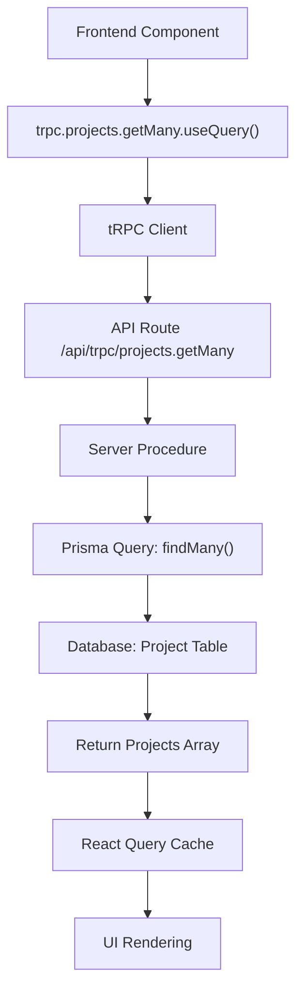
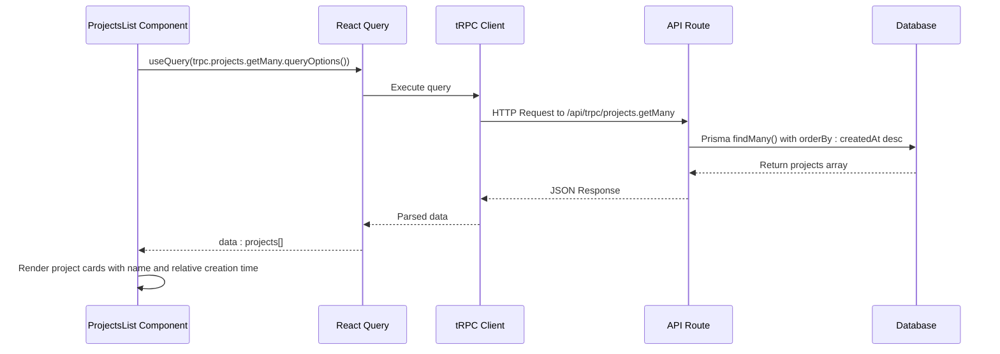
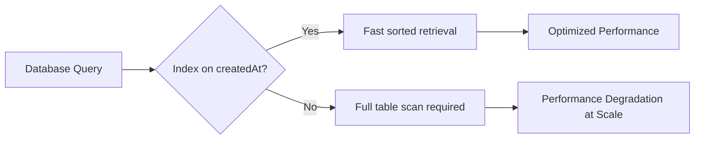

# Get All Projects

<cite>
**Referenced Files in This Document**   
- [procedures.ts](file://src/modules/projects/server/procedures.ts)
- [projects-list.tsx](file://src/modules/home/ui/components/projects-list.tsx)
- [prisma/schema.prisma](file://prisma/schema.prisma)
- [client.tsx](file://src/trpc/client.tsx)
- [query-client.ts](file://src/trpc/query-client.ts)
- [app.ts](file://src/trpc/routers/_app.ts)
</cite>

## Table of Contents
1. [Introduction](#introduction)
2. [API Endpoint Overview](#api-endpoint-overview)
3. [Implementation Details](#implementation-details)
4. [Frontend Usage Example](#frontend-usage-example)
5. [Performance Considerations](#performance-considerations)
6. [Use Cases](#use-cases)
7. [Scalability and Future Enhancements](#scalability-and-future-enhancements)
8. [Conclusion](#conclusion)

## Introduction
This document provides comprehensive documentation for the `projects.getMany` tRPC query in the QAI platform. The query retrieves all projects from the database, sorted in descending order by their creation timestamp (`createdAt`), ensuring that the most recently created projects appear first in the user interface. This functionality is essential for providing users with immediate access to their latest work. The documentation covers the API's implementation, usage patterns, performance implications, and potential scalability improvements.

## API Endpoint Overview
The `projects.getMany` tRPC query is designed to fetch all project records from the database without requiring any input parameters. It returns an array of Project objects, each containing the project's ID, name, and timestamps for creation and update. The results are automatically sorted by the `createdAt` field in descending order, prioritizing newer projects in the response.



**Diagram sources**
- [procedures.ts](file://src/modules/projects/server/procedures.ts#L15-L22)
- [client.tsx](file://src/trpc/client.tsx#L10-L60)

**Section sources**
- [procedures.ts](file://src/modules/projects/server/procedures.ts#L15-L22)

## Implementation Details
The `projects.getMany` query is implemented within the projects router using tRPC and Prisma. It leverages Prisma's `findMany` method with an `orderBy` clause to sort results by `createdAt` in descending order. The query is defined as a tRPC procedure without input validation, as it does not require any parameters. The Project model, defined in the Prisma schema, includes fields for `id`, `name`, `createdAt`, and `updatedAt`, which are all returned in the response.

```mermaid
classDiagram
class Project {
+id : string
+name : string
+createdAt : DateTime
+updatedAt : DateTime
}
class ProjectsRouter {
+getMany() : Promise<Project[]>
}
class PrismaClient {
+project : ProjectModel
}
class ProjectModel {
+findMany(orderBy : { createdAt : "desc" }) : Promise<Project[]>
}
ProjectsRouter --> PrismaClient : "uses"
PrismaClient --> ProjectModel : "exposes"
ProjectModel --> Project : "returns"
```

**Diagram sources**
- [procedures.ts](file://src/modules/projects/server/procedures.ts#L15-L22)
- [schema.prisma](file://prisma/schema.prisma#L10-L16)

**Section sources**
- [procedures.ts](file://src/modules/projects/server/procedures.ts#L15-L22)
- [schema.prisma](file://prisma/schema.prisma#L10-L16)

## Frontend Usage Example
The `projects.getMany` query is consumed on the frontend using the `useQuery` hook from React Query through the tRPC client. The `ProjectsList` component demonstrates this pattern by calling `trpc.projects.getMany.queryOptions()` to retrieve the query configuration and passing it to `useQuery`. This approach enables automatic caching, background refetching, and loading state management. The component handles the loading state by conditionally rendering a "No projects yet" message when the data array is empty.



**Diagram sources**
- [projects-list.tsx](file://src/modules/home/ui/components/projects-list.tsx#L7-L59)
- [client.tsx](file://src/trpc/client.tsx#L10-L60)

**Section sources**
- [projects-list.tsx](file://src/modules/home/ui/components/projects-list.tsx#L7-L59)

## Performance Considerations
The `projects.getMany` query performance is directly impacted by the size of the projects table and the efficiency of the database sorting operation. To optimize performance, a database index on the `createdAt` field is strongly recommended. This index allows the database to quickly locate and sort records without scanning the entire table. Additionally, the React Query integration provides client-side caching with a 30-second stale time, reducing redundant network requests and improving perceived performance. The tRPC client uses HTTP batching, which can further optimize network utilization when multiple queries are executed simultaneously.



**Diagram sources**
- [procedures.ts](file://src/modules/projects/server/procedures.ts#L15-L22)
- [query-client.ts](file://src/trpc/query-client.ts#L10-L22)

**Section sources**
- [procedures.ts](file://src/modules/projects/server/procedures.ts#L15-L22)
- [query-client.ts](file://src/trpc/query-client.ts#L10-L22)

## Use Cases
The `projects.getMany` query serves several critical use cases within the QAI platform. The primary use case is displaying a list of all projects on the homepage, where users can quickly access their recent work. This is implemented in the `ProjectsList` component, which renders project cards with their names and relative creation times. Another important use case is populating navigation sidebars or project selectors, allowing users to switch between projects efficiently. The query's simplicity and consistent sorting make it ideal for any UI component that needs to present an ordered list of projects without pagination.

**Section sources**
- [projects-list.tsx](file://src/modules/home/ui/components/projects-list.tsx#L7-L59)
- [page.tsx](file://src/app/(home)/page.tsx#L28-L33)

## Scalability and Future Enhancements
While the current implementation is effective for small to medium-sized datasets, scalability considerations become important as the number of projects grows. For large user bases with thousands of projects, retrieving all records in a single query can lead to performance issues and increased memory usage. Future enhancements could include implementing pagination with cursor-based or offset-based approaches, or introducing infinite scrolling to load projects incrementally. Additional filtering options, such as searching by project name or filtering by date range, could also improve usability for users with extensive project histories.

**Section sources**
- [procedures.ts](file://src/modules/projects/server/procedures.ts#L15-L22)

## Conclusion
The `projects.getMany` tRPC query is a fundamental API endpoint in the QAI platform, providing efficient access to all user projects sorted by recency. Its implementation leverages tRPC for type safety and React Query for advanced caching and state management. The query's simplicity and performance optimizations make it well-suited for common use cases like homepage project lists and navigation components. By following best practices such as database indexing and leveraging client-side caching, the current implementation delivers a responsive user experience. As the platform scales, considerations for pagination and additional filtering will ensure continued performance and usability.