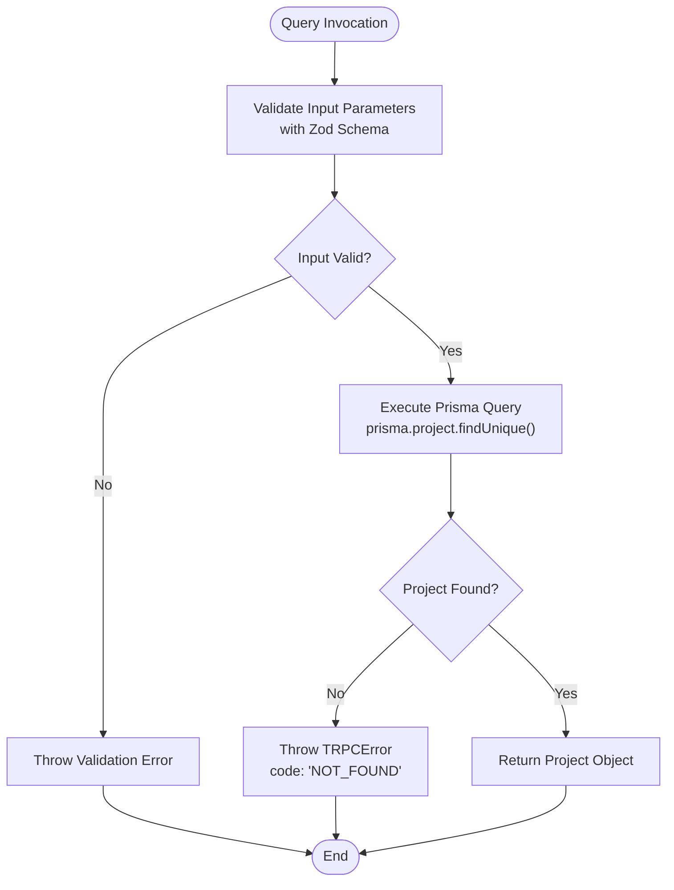
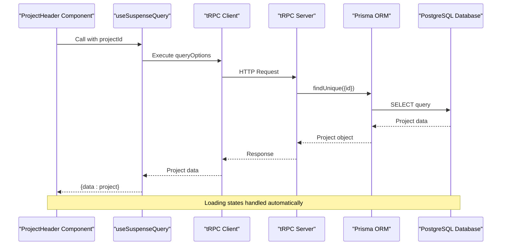
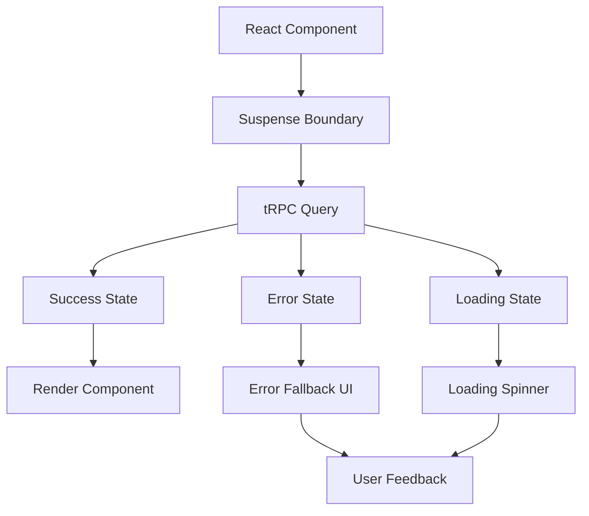
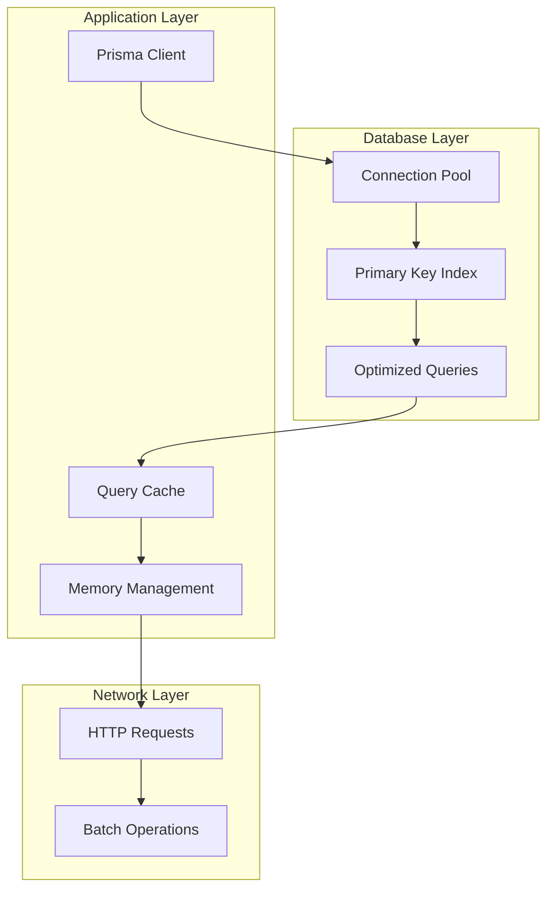
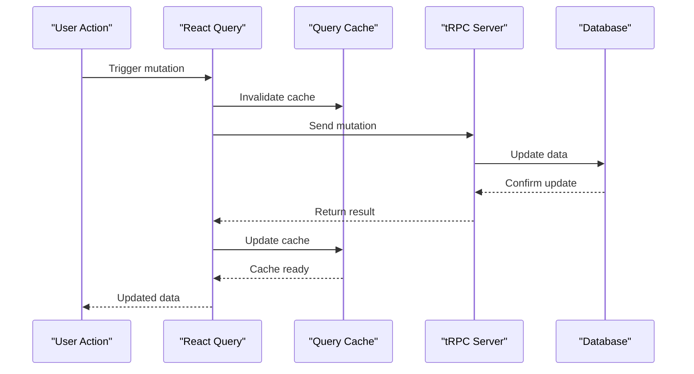

# Get Single Project

<cite>
**Referenced Files in This Document**
- [procedures.ts](file://src/modules/projects/server/procedures.ts)
- [_app.ts](file://src/trpc/routers/_app.ts)
- [init.ts](file://src/trpc/init.ts)
- [client.tsx](file://src/trpc/client.tsx)
- [query-client.ts](file://src/trpc/query-client.ts)
- [db.ts](file://src/lib/db.ts)
- [schema.prisma](file://prisma/schema.prisma)
- [project-header.tsx](file://src/modules/projects/ui/components/project-header.tsx)
- [project-view.tsx](file://src/modules/projects/ui/views/project-view.tsx)
- [page.tsx](file://src/app/projects/[projectId]/page.tsx)
</cite>

## Table of Contents
1. [Introduction](#introduction)
2. [API Endpoint Specification](#api-endpoint-specification)
3. [Server Implementation](#server-implementation)
4. [Client-Side Usage](#client-side-usage)
5. [TypeScript Integration](#typescript-integration)
6. [Error Handling](#error-handling)
7. [Performance Considerations](#performance-considerations)
8. [Caching Strategies](#caching-strategies)
9. [Best Practices](#best-practices)
10. [Troubleshooting](#troubleshooting)

## Introduction

The `projects.getOne` tRPC query is a fundamental API endpoint in the QAI platform that retrieves a specific project by its unique identifier. This endpoint demonstrates the platform's commitment to type-safe, efficient API development using tRPC with Prisma ORM integration. The query provides a robust mechanism for fetching individual project records while maintaining strong validation and error handling.

## API Endpoint Specification

### Endpoint Details

| Property | Value |
|----------|-------|
| **Path** | `/projects.getOne` |
| **Method** | `GET` (via tRPC) |
| **Authentication** | Implicit via tRPC context |
| **Rate Limiting** | Configurable via tRPC middleware |

### Input Parameters

| Parameter | Type | Required | Validation | Description |
|-----------|------|----------|------------|-------------|
| `id` | `string` | Yes | `z.string().min(1)` | Unique project identifier (UUID format) |

### Input Schema

The input is validated using Zod schema with the following specification:

```typescript
input(z.object({
    id: z.string().min(1, {message: "Project ID is required"})
}))
```

### Output Response

The successful response returns the complete Project model including all related entities:

```typescript
{
    id: string,
    name: string,
    createdAt: Date,
    updatedAt: Date,
    messages: Message[]
}
```

**Section sources**
- [procedures.ts](file://src/modules/projects/server/procedures.ts#L8-L16)

## Server Implementation

### Core Query Logic

The `getOne` query follows a straightforward but robust implementation pattern:



**Diagram sources**
- [procedures.ts](file://src/modules/projects/server/procedures.ts#L8-L23)

### Database Interaction

The query utilizes Prisma's `findUnique` method with optimized database access:

```typescript
const existingProject = await prisma.project.findUnique({
    where: {
        id: input.id,
    },
});
```

### Error Handling Implementation

When a project is not found, the system throws a structured TRPCError:

```typescript
throw new TRPCError({
    code: "NOT_FOUND",
    message: "Project not found",
});
```

**Section sources**
- [procedures.ts](file://src/modules/projects/server/procedures.ts#L8-L23)

## Client-Side Usage

### Basic React Query Integration

The primary way to consume the `projects.getOne` query in React applications is through the `useSuspenseQuery` hook:

```typescript
const { data: project } = useSuspenseQuery(
    trpc.projects.getOne.queryOptions({ id: projectId })
);
```

### Component Integration Example

Here's how the query integrates within the project header component:



**Diagram sources**
- [project-header.tsx](file://src/modules/projects/ui/components/project-header.tsx#L35-L37)
- [client.tsx](file://src/trpc/client.tsx#L1-L59)

**Section sources**
- [project-header.tsx](file://src/modules/projects/ui/components/project-header.tsx#L35-L37)

## TypeScript Integration

### Type Safety Features

The tRPC system provides comprehensive type safety from server to client:

```typescript
// Server-side input validation
.input(z.object({
    id: z.string().min(1, {message: "Project ID is required"})
}))

// Automatic client-side type inference
trpc.projects.getOne.queryOptions({ id: string })

// Full TypeScript support for return types
const { data: project } = useSuspenseQuery(...)
// project is typed as Project | undefined
```

### Generated Types

The Prisma schema automatically generates TypeScript types for the Project model:

```typescript
// From schema.prisma
model Project {
    id        String   @id @default(uuid())
    name      String
    createdAt DateTime @default(now())
    updatedAt DateTime @updatedAt
    messages  Message[]
}
```

**Section sources**
- [schema.prisma](file://prisma/schema.prisma#L17-L22)
- [procedures.ts](file://src/modules/projects/server/procedures.ts#L8-L16)

## Error Handling

### Client-Side Error Management

The tRPC + React Query integration provides automatic error handling:

```typescript
// Automatic error boundaries
<Suspense fallback={<LoadingSpinner />}>
    <ProjectHeader projectId={projectId} />
</Suspense>

// Error states are handled transparently
// No explicit error checking required in most cases
```

### Graceful Fallback Patterns

For scenarios where the project might not exist, implement defensive patterns:

```typescript
export const ProjectHeader = ({ projectId }: Props) => {
    const trpc = useTRPC();
    
    // Automatic fallback for missing projects
    const { data: project } = useSuspenseQuery(
        trpc.projects.getOne.queryOptions({ id: projectId })
    );
    
    // Render fallback UI for missing projects
    if (!project) {
        return <div>Project not found</div>;
    }
    
    return (
        <header className="p-2 flex justify-between items-center border-b">
            {/* Project content */}
        </header>
    );
};
```

### Error Boundary Integration

The application uses React Suspense for automatic error boundary handling:



**Diagram sources**
- [project-header.tsx](file://src/modules/projects/ui/components/project-header.tsx#L35-L37)

**Section sources**
- [project-header.tsx](file://src/modules/projects/ui/components/project-header.tsx#L35-L46)

## Performance Considerations

### Database Indexing Strategy

The `id` field in the Project model is automatically indexed by Prisma due to the `@id` decorator:

```typescript
// From schema.prisma
model Project {
    id        String   @id @default(uuid())
    // Other fields...
}
```

This ensures O(log n) lookup performance for project retrieval operations.

### Query Optimization

The `findUnique` method is optimized for single-record lookups:

```typescript
// Optimized for single record by unique identifier
const existingProject = await prisma.project.findUnique({
    where: { id: input.id },
});
```

### Memory Efficiency

Prisma's connection pooling and query optimization ensure efficient memory usage:



**Diagram sources**
- [db.ts](file://src/lib/db.ts#L1-L9)
- [schema.prisma](file://prisma/schema.prisma#L17-L22)

**Section sources**
- [db.ts](file://src/lib/db.ts#L1-L9)
- [schema.prisma](file://prisma/schema.prisma#L17-L22)

## Caching Strategies

### Built-in React Query Caching

The tRPC integration with React Query provides automatic caching:

```typescript
// Query client configuration with 30-second stale time
export function makeQueryClient() {
    return new QueryClient({
        defaultOptions: {
            queries: {
                staleTime: 30 * 1000, // 30 seconds
            },
        },
    });
}
```

### Prefetching Strategy

Server-side prefetching for improved user experience:

```typescript
// In page.tsx
void queryClient.prefetchQuery(
    trpc.projects.getOne.queryOptions({ id: projectId })
);
```

### Cache Invalidation

Automatic cache invalidation when project data changes:



**Diagram sources**
- [query-client.ts](file://src/trpc/query-client.ts#L6-L12)
- [page.tsx](file://src/app/projects/[projectId]/page.tsx#L15-L16)

**Section sources**
- [query-client.ts](file://src/trpc/query-client.ts#L6-L12)
- [page.tsx](file://src/app/projects/[projectId]/page.tsx#L15-L16)

## Best Practices

### Input Validation

Always validate input parameters on the client side before making API calls:

```typescript
// Client-side validation
const isValidProjectId = (id: string): boolean => {
    return typeof id === 'string' && id.length > 0;
};

// Usage
if (isValidProjectId(projectId)) {
    const { data: project } = useSuspenseQuery(
        trpc.projects.getOne.queryOptions({ id: projectId })
    );
}
```

### Loading States

Implement appropriate loading states for better user experience:

```typescript
export const ProjectHeader = ({ projectId }: Props) => {
    const trpc = useTRPC();
    
    // Explicit loading state handling
    const { data: project, isLoading, isError } = useSuspenseQuery(
        trpc.projects.getOne.queryOptions({ id: projectId })
    );
    
    if (isLoading) {
        return <div>Loading project...</div>;
    }
    
    if (isError || !project) {
        return <div>Error loading project</div>;
    }
    
    return <header>{/* Project UI */}</header>;
};
```

### Error Recovery

Implement error recovery mechanisms for network failures:

```typescript
// Retry logic with exponential backoff
const retryConfig = {
    attempts: 3,
    delay: 1000,
    maxDelay: 10000
};
```

### Performance Monitoring

Monitor query performance and implement analytics:

```typescript
// Performance tracking
const startTime = performance.now();
const { data: project } = useSuspenseQuery(
    trpc.projects.getOne.queryOptions({ id: projectId })
);
const endTime = performance.now();
console.log(`Project load time: ${endTime - startTime}ms`);
```

## Troubleshooting

### Common Issues and Solutions

#### 1. Project Not Found Errors

**Problem**: Getting "Project not found" errors unexpectedly

**Solution**: Verify the project ID format and existence:

```typescript
// Debug project ID
console.log('Project ID:', projectId);
console.log('ID length:', projectId?.length);

// Check if ID is valid UUID format
const isValidUUID = (id: string): boolean => {
    const uuidPattern = /^[0-9a-f]{8}-[0-9a-f]{4}-[0-9a-f]{4}-[0-9a-f]{4}-[0-9a-f]{12}$/i;
    return uuidPattern.test(id);
};
```

#### 2. Network Timeout Issues

**Problem**: Queries timing out or failing to load

**Solution**: Implement proper error boundaries and retry logic:

```typescript
// Enhanced error handling
<Suspense fallback={<LoadingSpinner />}>
    <ErrorBoundary fallback={<ErrorFallback />}>
        <ProjectHeader projectId={projectId} />
    </ErrorBoundary>
</Suspense>
```

#### 3. Type Errors

**Problem**: TypeScript type mismatches

**Solution**: Ensure proper type imports and refresh generated types:

```bash
# Regenerate Prisma types
npx prisma generate

# Restart TypeScript compiler
npm run dev
```

#### 4. Performance Issues

**Problem**: Slow project loading times

**Solution**: Implement caching and optimize database queries:

```typescript
// Optimize query with selective field loading
const project = await prisma.project.findUnique({
    where: { id: input.id },
    select: {
        id: true,
        name: true,
        createdAt: true
    }
});
```

### Debugging Tools

#### Enable tRPC Logging

```typescript
// In trpc/init.ts
const t = initTRPC.create({
    logger: {
        log: console.log,
        warn: console.warn,
        error: console.error,
    },
});
```

#### Monitor Query Performance

```typescript
// Add performance monitoring
const useProjectWithAnalytics = (projectId: string) => {
    const startTime = Date.now();
    
    const result = useSuspenseQuery(
        trpc.projects.getOne.queryOptions({ id: projectId })
    );
    
    useEffect(() => {
        const loadTime = Date.now() - startTime;
        console.log(`Project ${projectId} loaded in ${loadTime}ms`);
    }, [result.data]);
    
    return result;
};
```

**Section sources**
- [procedures.ts](file://src/modules/projects/server/procedures.ts#L17-L22)
- [project-header.tsx](file://src/modules/projects/ui/components/project-header.tsx#L35-L46)