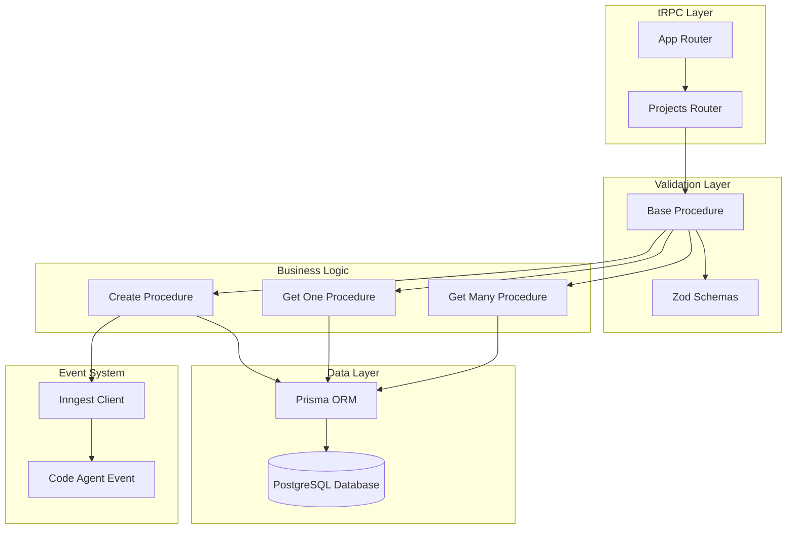
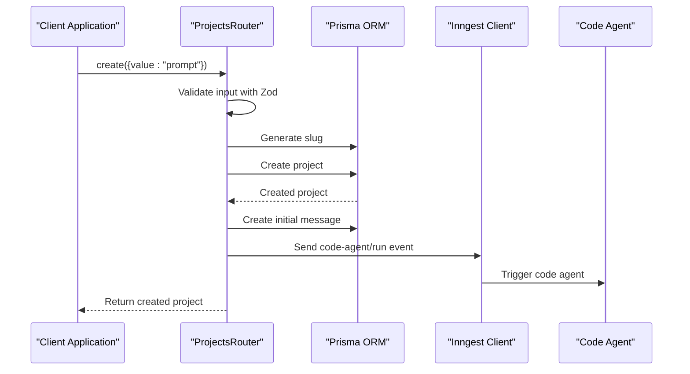
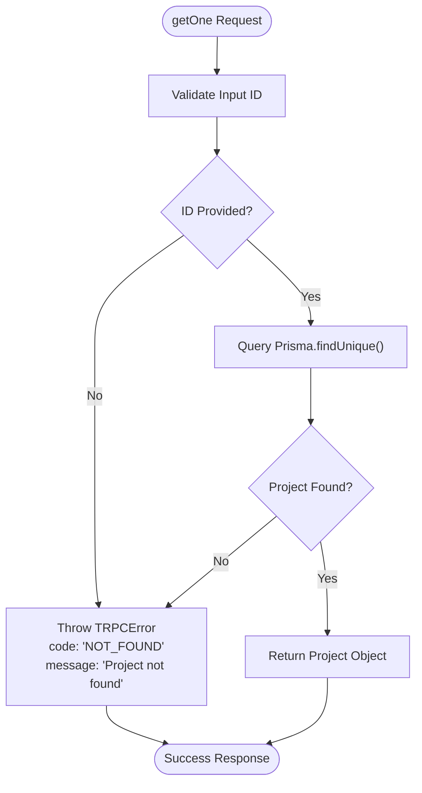
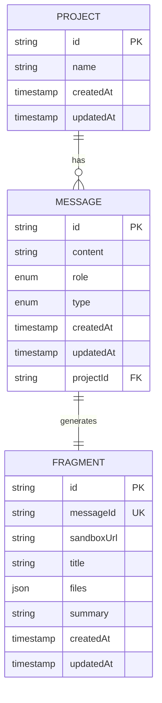
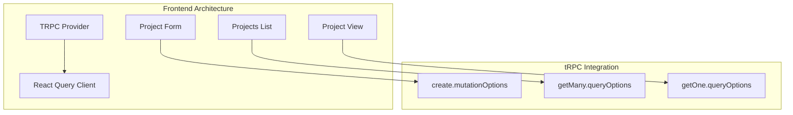
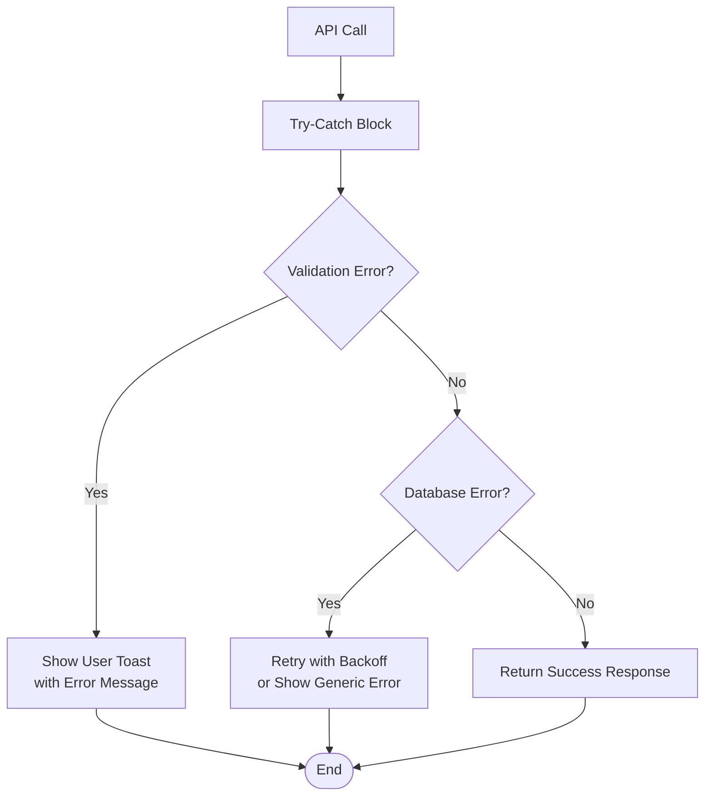

# Projects Router API Documentation

<cite>
**Referenced Files in This Document**
- [procedures.ts](file://src/modules/projects/server/procedures.ts)
- [_app.ts](file://src/trpc/routers/_app.ts)
- [client.tsx](file://src/trpc/client.tsx)
- [query-client.ts](file://src/trpc/query-client.ts)
- [project-form.tsx](file://src/modules/home/ui/components/project-form.tsx)
- [projects-list.tsx](file://src/modules/home/ui/components/projects-list.tsx)
- [page.tsx](file://src/app/projects/[projectId]/page.tsx)
- [project-view.tsx](file://src/modules/projects/ui/views/project-view.tsx)
- [schema.prisma](file://prisma/schema.prisma)
- [migration.sql](file://prisma/migrations/20251019214950_projects/migration.sql)
- [functions.ts](file://src/inngest/functions.ts)
- [constants.ts](file://src/modules/home/constants.ts)
</cite>

## Table of Contents
1. [Introduction](#introduction)
2. [Router Architecture](#router-architecture)
3. [Core Procedures](#core-procedures)
4. [Zod Validation Schemas](#zod-validation-schemas)
5. [Database Schema](#database-schema)
6. [Frontend Integration](#frontend-integration)
7. [Performance Considerations](#performance-considerations)
8. [Security Aspects](#security-aspects)
9. [Error Handling](#error-handling)
10. [Usage Examples](#usage-examples)

## Introduction

The ProjectsRouter is a tRPC router that manages project-related operations in the QAI platform. It provides three primary procedures for creating, retrieving, and listing projects, integrating with Prisma ORM for database operations and Inngest for asynchronous event processing.

## Router Architecture

The ProjectsRouter is built using tRPC's functional router pattern and integrates with the main application router through a modular architecture.



**Diagram sources**
- [_app.ts](file://src/trpc/routers/_app.ts#L1-L10)
- [procedures.ts](file://src/modules/projects/server/procedures.ts#L1-L72)

**Section sources**
- [_app.ts](file://src/trpc/routers/_app.ts#L1-L10)
- [procedures.ts](file://src/modules/projects/server/procedures.ts#L1-L72)

## Core Procedures

### create

Creates a new project with automatic slug generation and initiates the code agent workflow.

#### Method Signature
```typescript
create: baseProcedure
  .input(
    z.object({
      value: z.string()
        .min(1, {message: "Prompt is required"})
        .max(1000, {message: "Prompt must be less than 1000 characters"})
    })
  )
  .mutation(async ({ input }) => {
    // Implementation details
  })
```

#### Procedure Behavior
1. **Slug Generation**: Automatically generates a kebab-case slug using `random-word-slugs` library
2. **Project Creation**: Creates a new project record with the generated name
3. **Initial Message**: Creates an initial user message associated with the project
4. **Event Triggering**: Sends a `code-agent/run` event to Inngest with prompt and project ID
5. **Return Value**: Returns the created project object

#### Workflow Diagram


**Diagram sources**
- [procedures.ts](file://src/modules/projects/server/procedures.ts#L45-L72)
- [functions.ts](file://src/inngest/functions.ts#L1-L212)

### get

Retrieves a single project by ID with comprehensive error handling.

#### Method Signature
```typescript
getOne: baseProcedure
  .input(z.object({
    id: z.string().min(1, {message: "Project ID is required"})
  }))
  .query(async ({ input }) => {
    // Implementation details
  })
```

#### Procedure Behavior
1. **Input Validation**: Validates that the project ID is provided and non-empty
2. **Database Query**: Performs a unique lookup on the project ID
3. **Error Handling**: Throws TRPCError with NOT_FOUND code if project doesn't exist
4. **Success Response**: Returns the project object if found

#### Error Handling Flow


**Diagram sources**
- [procedures.ts](file://src/modules/projects/server/procedures.ts#L8-L25)

### getMany

Retrieves all projects sorted by creation date in descending order.

#### Method Signature
```typescript
getMany: baseProcedure
  .query(async () => {
    // Implementation details
  })
```

#### Procedure Behavior
1. **Database Query**: Executes `findMany()` operation on the Project model
2. **Sorting**: Orders results by `createdAt` field in descending order
3. **Response Structure**: Returns an array of project objects sorted chronologically

#### Response Structure
```typescript
interface Project {
  id: string;
  name: string;
  createdAt: Date;
  updatedAt: Date;
}
```

**Section sources**
- [procedures.ts](file://src/modules/projects/server/procedures.ts#L8-L72)

## Zod Validation Schemas

### Input Validation

The ProjectsRouter implements comprehensive input validation using Zod schemas:

| Procedure | Field | Type | Validation Rules |
|-----------|-------|------|------------------|
| `create` | `value` | string | Required, min length 1, max length 1000 |
| `getOne` | `id` | string | Required, min length 1 |

### Validation Error Messages

- **Prompt Validation**: "Prompt is required" and "Prompt must be less than 1000 characters"
- **Project ID Validation**: "Project ID is required"
- **Not Found Error**: "Project not found"

**Section sources**
- [procedures.ts](file://src/modules/projects/server/procedures.ts#L45-L60)

## Database Schema

### Project Model

The Project model defines the core data structure for projects:



**Diagram sources**
- [schema.prisma](file://prisma/schema.prisma#L18-L30)

### Database Migrations

The project schema includes foreign key relationships with cascading deletes:

- **Project ID**: Primary key with UUID default
- **Name**: Generated kebab-case slug
- **Timestamps**: Automatic createdAt and updatedAt fields
- **Message Relationship**: One-to-many relationship with Messages
- **Foreign Key Constraint**: CASCADE delete on project deletion

**Section sources**
- [schema.prisma](file://prisma/schema.prisma#L18-L30)
- [migration.sql](file://prisma/migrations/20251019214950_projects/migration.sql#L1-L22)

## Frontend Integration

### tRPC Client Setup

The frontend integrates with the ProjectsRouter through a configured tRPC client:



**Diagram sources**
- [client.tsx](file://src/trpc/client.tsx#L1-L60)
- [query-client.ts](file://src/trpc/query-client.ts#L1-L23)

### React Query Integration

The frontend uses React Query for caching and background updates:

| Hook | Purpose | Caching Strategy |
|------|---------|------------------|
| `useMutation` | Project creation | Optimistic updates, cache invalidation |
| `useQuery` | Project listing | Stale time: 30 seconds, background refetch |
| `useQuery` | Single project | Background fetching, optimistic updates |

### Component Examples

#### Project Creation Form
The ProjectForm component demonstrates mutation usage with error handling and success callbacks.

#### Projects List
The ProjectsList component shows query usage for displaying project collections.

#### Project View
The ProjectView component illustrates single project retrieval with hydration support.

**Section sources**
- [project-form.tsx](file://src/modules/home/ui/components/project-form.tsx#L1-L143)
- [projects-list.tsx](file://src/modules/home/ui/components/projects-list.tsx#L1-L60)
- [project-view.tsx](file://src/modules/projects/ui/views/project-view.tsx#L1-L91)

## Performance Considerations

### Database Indexing

For optimal performance, the following database indexes should be considered:

| Table | Column | Index Type | Purpose |
|-------|--------|------------|---------|
| `Project` | `id` | Primary Key | Fast lookup by project ID |
| `Project` | `createdAt` | Standard Index | Efficient sorting in getMany |
| `Message` | `projectId` | Foreign Key Index | Fast joins and filtering |

### Query Optimization

- **getMany**: Uses efficient ORDER BY with indexed createdAt column
- **getOne**: Leverages unique index on primary key for O(log n) lookup
- **Pagination**: Not currently implemented but could be added for large datasets

### Caching Strategy

The React Query client implements intelligent caching:

- **Stale Time**: 30 seconds for project lists
- **Background Refetch**: Automatic updates when data becomes stale
- **Optimistic Updates**: Immediate UI updates during mutations

**Section sources**
- [query-client.ts](file://src/trpc/query-client.ts#L1-L23)

## Security Aspects

### Input Sanitization

The ProjectsRouter implements comprehensive input validation:

- **Length Limits**: Prevents buffer overflow attacks through character limits
- **Type Validation**: Ensures proper data types using Zod
- **Required Fields**: Validates presence of mandatory fields

### Rate Limiting Considerations

While not implemented in the current router, recommended rate limiting strategies:

| Endpoint | Recommended Limit | Reason |
|----------|------------------|---------|
| `create` | 10 requests/minute | Prevent spam project creation |
| `getOne` | 100 requests/minute | Allow reasonable browsing |
| `getMany` | 20 requests/minute | Prevent excessive listing |

### Access Control

Currently, the router assumes authenticated users. Future enhancements could include:

- **User Scoping**: Filter projects by authenticated user ID
- **Permission Checks**: Verify user ownership before operations
- **Audit Logging**: Track project creation and modification events

## Error Handling

### TRPC Error Codes

The ProjectsRouter uses standardized error handling:

| Procedure | Error Code | Condition | Message |
|-----------|------------|-----------|---------|
| `getOne` | `NOT_FOUND` | Project not found | "Project not found" |
| `create` | `BAD_REQUEST` | Validation failure | Specific validation messages |

### Error Recovery Patterns



### Frontend Error Handling

The frontend implements comprehensive error handling:

- **Toast Notifications**: User-friendly error messages
- **Loading States**: Clear indication of pending operations
- **Fallback UI**: Graceful degradation on errors
- **Redirect Logic**: Intelligent navigation on specific errors

**Section sources**
- [procedures.ts](file://src/modules/projects/server/procedures.ts#L18-L25)
- [project-form.tsx](file://src/modules/home/ui/components/project-form.tsx#L45-L55)

## Usage Examples

### Basic Project Creation

```typescript
// TypeScript example using tRPC client
const createProject = useMutation(trpc.projects.create.mutationOptions({
  onSuccess: (data) => {
    // Invalidate project list cache
    queryClient.invalidateQueries(
      trpc.projects.getMany.queryOptions(),
    );
    // Navigate to new project
    router.push(`/projects/${data.id}`);
    // Show success notification
    toast.success("Project created successfully");
  },
  onError: (error) => {
    // Handle specific error conditions
    if (error.message.includes("usage limit")) {
      router.push("/pricing");
    } else {
      toast.error(error.message);
    }
  },
}));
```

### Project Listing with React Query

```typescript
// TypeScript example for project listing
export const ProjectsList = () => {
  const trpc = useTRPC();
  const { data: projects } = useQuery(
    trpc.projects.getMany.queryOptions()
  );

  return (
    <div className="grid grid-cols-1 sm:grid-cols-3 gap-6">
      {projects?.map((project) => (
        <Button
          key={project.id}
          variant="outline"
          className="font-normal h-auto justify-start w-full text-start p-4"
          asChild
        >
          <Link href={`/projects/${project.id}`}>
            <div className="flex items-center gap-x-4">
              <Image src="/logo.png" alt="QAI" width={32} height={32} />
              <div className="flex flex-col">
                <h3 className="truncate font-medium">{project.name}</h3>
                <p className="text-xs text-muted-foreground">
                  {formatDistanceToNow(project.createdAt, { addSuffix: true })}
                </p>
              </div>
            </div>
          </Link>
        </Button>
      ))}
    </div>
  );
};
```

### Single Project Retrieval

```typescript
// Server-side rendering example
const Page = async ({ params }: Props) => {
  const { projectId } = await params;
  
  const queryClient = getQueryClient();
  // Prefetch data for SSR
  void queryClient.prefetchQuery(
    trpc.projects.getOne.queryOptions({ id: projectId })
  );
  
  return (
    <HydrationBoundary state={dehydrate(queryClient)}>
      <ProjectView projectId={projectId} />
    </HydrationBoundary>
  );
};
```

### Template-Based Project Creation

```typescript
// Example of using project templates
const handleTemplateClick = (value: string) => {
  form.setValue("message", value, {
    shouldDirty: true,
    shouldTouch: true,
    shouldValidate: true,
  });
};

// Template configuration
const PROJECT_TEMPLATES = [
  {
    title: "Build a Netflix clone",
    prompt: "Build a Netflix-style homepage...",
  },
  // ... other templates
];
```

**Section sources**
- [project-form.tsx](file://src/modules/home/ui/components/project-form.tsx#L45-L55)
- [projects-list.tsx](file://src/modules/home/ui/components/projects-list.tsx#L10-L30)
- [page.tsx](file://src/app/projects/[projectId]/page.tsx#L10-L15)
- [constants.ts](file://src/modules/home/constants.ts#L1-L50)