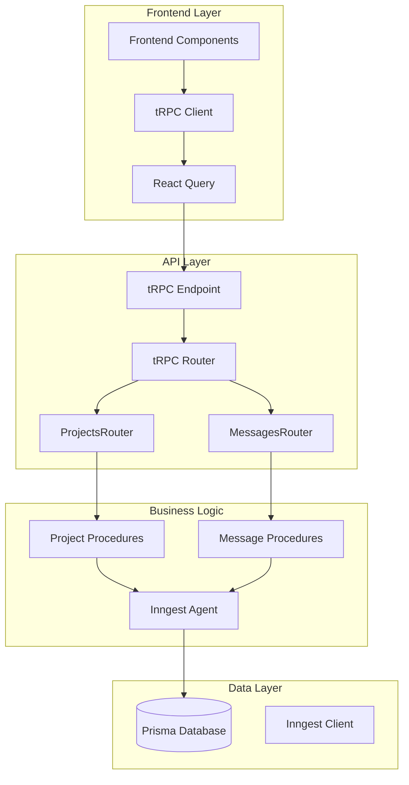
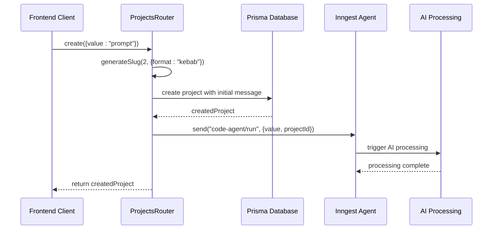
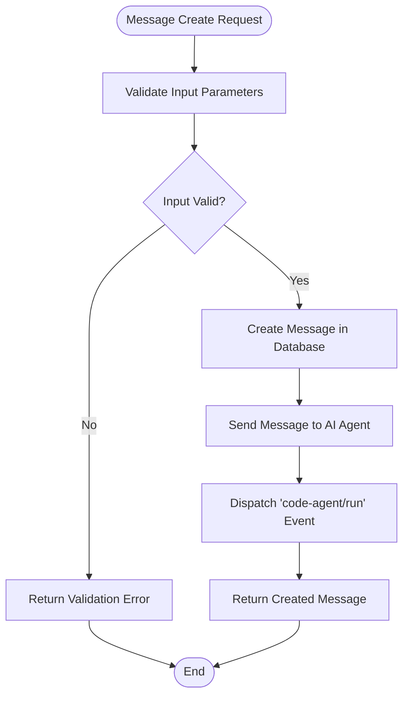
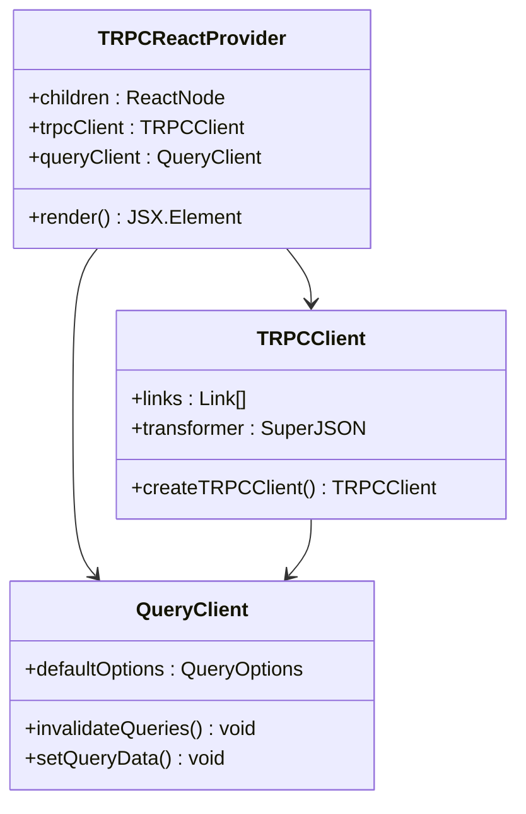

# tRPC Procedures API Documentation

<cite>
**Referenced Files in This Document**
- [procedures.ts](file://src/modules/projects/server/procedures.ts)
- [procedures.ts](file://src/modules/messages/server/procedures.ts)
- [_app.ts](file://src/trpc/routers/_app.ts)
- [route.ts](file://src/app/api/trpc/[trpc]/route.ts)
- [init.ts](file://src/trpc/init.ts)
- [client.tsx](file://src/trpc/client.tsx)
- [query-client.ts](file://src/trpc/query-client.ts)
- [server.tsx](file://src/trpc/server.tsx)
- [project-form.tsx](file://src/modules/home/ui/components/project-form.tsx)
- [project-view.tsx](file://src/modules/projects/ui/views/project-view.tsx)
- [constants.ts](file://src/modules/home/constants.ts)
- [client.ts](file://src/inngest/client.ts)
- [db.ts](file://src/lib/db.ts)
</cite>

## Table of Contents
1. [Introduction](#introduction)
2. [tRPC Architecture Overview](#trpc-architecture-overview)
3. [ProjectsRouter Procedures](#projectsrouter-procedures)
4. [MessagesRouter Procedures](#messagesrouter-procedures)
5. [HTTP Endpoint Specifications](#http-endpoint-specifications)
6. [Frontend Integration](#frontend-integration)
7. [Security Considerations](#security-considerations)
8. [Error Handling](#error-handling)
9. [Performance and Optimization](#performance-and-optimization)
10. [Best Practices](#best-practices)

## Introduction

The QAI platform utilizes tRPC (TypeScript Remote Procedure Call) to provide strongly-typed APIs between the frontend and backend. This documentation covers all tRPC procedures, their implementations, authentication contexts, input validation schemas, and integration patterns.

tRPC enables end-to-end type safety across the entire stack, eliminating runtime type errors and providing excellent developer experience with autocompletion and compile-time validation.

## tRPC Architecture Overview

The tRPC implementation follows a modular architecture with clear separation of concerns:



**Diagram sources**
- [_app.ts](file://src/trpc/routers/_app.ts#L1-L10)
- [route.ts](file://src/app/api/trpc/[trpc]/route.ts#L1-L12)
- [init.ts](file://src/trpc/init.ts#L1-L23)

**Section sources**
- [_app.ts](file://src/trpc/routers/_app.ts#L1-L10)
- [init.ts](file://src/trpc/init.ts#L1-L23)
- [client.tsx](file://src/trpc/client.tsx#L1-L60)

## ProjectsRouter Procedures

The ProjectsRouter handles project-related operations with three main procedures: `create`, `get`, and `getMany`.

### create Procedure

Creates a new project with automatic slug generation and initiates AI processing.

#### Method Signature
```typescript
create: baseProcedure
  .input(z.object({
    value: z.string()
      .min(1, {message: "Prompt is required"})
      .max(1000, {message: "Prompt must be less than 1000 characters"}),
  }))
  .mutation(async ({ input }) => {
    // Implementation details
  })
```

#### Input Validation Schema
- **value**: String (required, min 1 character, max 1000 characters)
- Uses Zod validation with custom error messages
- Sanitizes user input automatically

#### Authentication Context
- Inherits authentication from `createTRPCContext`
- Currently uses static user context (`userId: 'user_123'`)
- Supports future user session-based authentication

#### Procedure Workflow



**Diagram sources**
- [procedures.ts](file://src/modules/projects/server/procedures.ts#L35-L65)
- [client.ts](file://src/inngest/client.ts#L1-L4)

#### Key Features
- **Automatic Slug Generation**: Creates kebab-case slugs using `random-word-slugs`
- **Initial Message Creation**: Automatically creates a user message with the prompt
- **AI Processing Trigger**: Dispatches `code-agent/run` event via Inngest
- **Transaction Safety**: Ensures atomic operations for project creation

#### Return Type
Returns the complete project object with associated metadata and initial message structure.

**Section sources**
- [procedures.ts](file://src/modules/projects/server/procedures.ts#L35-L65)

### getOne Procedure

Retrieves a single project by ID with comprehensive error handling.

#### Method Signature
```typescript
getOne: baseProcedure
  .input(z.object({
    id: z.string().min(1, {message: "Project ID is required"})
  }))
  .query(async ({ input }) => {
    // Implementation details
  })
```

#### Query Pattern
- Performs exact match lookup by project ID
- Returns full project object with associated messages
- Implements NOT_FOUND error handling

#### Response Structure
Returns the complete project entity with:
- Project metadata (id, name, createdAt, updatedAt)
- Associated messages with fragments
- Complete project history

**Section sources**
- [procedures.ts](file://src/modules/projects/server/procedures.ts#L8-L32)

### getMany Procedure

Retrieves all projects ordered by creation date with efficient pagination.

#### Method Signature
```typescript
getMany: baseProcedure
  .query(async () => {
    // Implementation details
  })
```

#### Query Pattern
- Retrieves all projects without filtering
- Orders by `createdAt` in descending order
- Provides complete project listing for dashboard views

#### Response Structure
Returns an array of project objects sorted by newest first, suitable for:
- Project listing pages
- Dashboard widgets
- Recent activity feeds

**Section sources**
- [procedures.ts](file://src/modules/projects/server/procedures.ts#L34-L42)

## MessagesRouter Procedures

The MessagesRouter manages message operations within projects, enabling conversation history and AI interaction.

### getMany Procedure

Retrieves all messages for a specific project with fragment inclusion.

#### Method Signature
```typescript
getMany: baseProcedure
  .input(z.object({
    projectId: z.string().min(1, {message: "Project ID is required"}),
  }))
  .query(async ({ input }) => {
    // Implementation details
  })
```

#### Query Pattern
- Filters messages by `projectId`
- Orders by `createdAt` in ascending order (chronological)
- Includes associated fragments for rich content display

#### Response Structure
Returns message array with:
- Message metadata (id, content, role, type, createdAt)
- Associated fragment data for rendered content
- Complete conversation history

**Section sources**
- [procedures.ts](file://src/modules/messages/server/procedures.ts#L6-L25)

### create Procedure

Creates a new message within a project and triggers AI processing.

#### Method Signature
```typescript
create: baseProcedure
  .input(z.object({
    value: z.string()
      .min(1, {message: "Prompt is required"})
      .max(1000, {message: "Prompt must be less than 1000 characters"}),
    projectId: z.string().min(1, {message: "Project ID is required"}),
  }))
  .mutation(async ({ input }) => {
    // Implementation details
  })
```

#### Input Validation
- **value**: String (required, min 1 character, max 1000 characters)
- **projectId**: String (required, validates project existence)

#### Procedure Workflow



**Diagram sources**
- [procedures.ts](file://src/modules/messages/server/procedures.ts#L27-L55)

#### Key Features
- **AI Processing Integration**: Triggers `code-agent/run` event after message creation
- **Conversation Management**: Maintains message history within project context
- **Real-time Updates**: Enables immediate AI response triggering

#### Return Type
Returns the newly created message object with complete metadata and associated fragments.

**Section sources**
- [procedures.ts](file://src/modules/messages/server/procedures.ts#L27-L55)

## HTTP Endpoint Specifications

The tRPC API exposes HTTP endpoints for JSON-RPC communication with comprehensive support for batching and subscriptions.

### Endpoint URL Structure

```
GET|POST /api/trpc/{procedure}
```

Where `{procedure}` represents the specific tRPC procedure path:
- `/api/trpc/projects.create` - Project creation
- `/api/trpc/projects.getOne` - Single project retrieval
- `/api/trpc/projects.getMany` - Project listing
- `/api/trpc/messages.getMany` - Message retrieval
- `/api/trpc/messages.create` - Message creation

### JSON-RPC Payload Format

#### Request Format
```json
{
  "id": 1,
  "method": "query",
  "params": {
    "input": {
      "projectId": "project_123"
    }
  }
}
```

#### Batch Request Format
Supports multiple procedure calls in a single HTTP request:
```json
[
  {
    "id": 1,
    "method": "query",
    "params": { "input": { "id": "project_123" } }
  },
  {
    "id": 2,
    "method": "mutation",
    "params": { "input": { "value": "prompt", "projectId": "project_123" } }
  }
]
```

### WebSocket-Based Subscriptions

The tRPC implementation supports real-time subscriptions for:
- Live message updates
- Project status changes
- AI processing notifications
- Real-time collaboration features

**Section sources**
- [route.ts](file://src/app/api/trpc/[trpc]/route.ts#L1-L12)

## Frontend Integration

The frontend integrates with tRPC through a comprehensive client setup with React Query for optimal performance and user experience.

### tRPC Client Setup



**Diagram sources**
- [client.tsx](file://src/trpc/client.tsx#L30-L60)
- [query-client.ts](file://src/trpc/query-client.ts#L1-L23)

### TypeScript Examples

#### Project Creation Example
```typescript
// Using React Query mutation
const createProject = useMutation(trpc.projects.create.mutationOptions({
  onSuccess: (data) => {
    // Invalidate project list cache
    queryClient.invalidateQueries(
      trpc.projects.getMany.queryOptions(),
    );
    // Navigate to new project
    router.push(`/projects/${data.id}`);
    toast.success("Project created successfully");
  },
  onError: (error) => {
    toast.error(error.message);
  },
}));
```

#### Project Retrieval Example
```typescript
// Using React Query query
const { data: project, isLoading } = useQuery(
  trpc.projects.getOne.queryOptions({ id: projectId })
);

// Project list example
const { data: projects } = useQuery(
  trpc.projects.getMany.queryOptions()
);
```

#### Message Operations Example
```typescript
// Message creation with AI processing
const createMessage = useMutation(trpc.messages.create.mutationOptions({
  onSuccess: () => {
    // Refresh message list
    queryClient.invalidateQueries(
      trpc.messages.getMany.queryOptions({ projectId })
    );
  }
}));
```

### Error Handling Patterns

#### TRPCError Handling
```typescript
try {
  const result = await trpc.projects.create.mutation({ value: prompt });
} catch (error) {
  if (error instanceof TRPCError) {
    switch (error.code) {
      case 'NOT_FOUND':
        // Handle project not found
        break;
      case 'BAD_REQUEST':
        // Handle validation errors
        break;
      case 'INTERNAL_SERVER_ERROR':
        // Handle server errors
        break;
    }
  }
}
```

#### React Query Error Boundaries
```typescript
const ProjectList = () => {
  const { data: projects, error } = useQuery(
    trpc.projects.getMany.queryOptions()
  );

  if (error) {
    return <ErrorBoundary error={error} />;
  }

  return <ProjectGrid projects={projects} />;
};
```

**Section sources**
- [client.tsx](file://src/trpc/client.tsx#L1-L60)
- [project-form.tsx](file://src/modules/home/ui/components/project-form.tsx#L30-L50)

## Security Considerations

### Input Sanitization

The tRPC implementation provides robust input validation through Zod schemas:

#### Validation Features
- **Character Limits**: Enforces maximum length constraints (1000 characters)
- **Required Fields**: Validates presence of mandatory parameters
- **Type Safety**: Ensures proper data types at compile time
- **Custom Error Messages**: Provides user-friendly validation feedback

#### Sanitization Strategies
- **Input Length Control**: Prevents buffer overflow attacks
- **SQL Injection Prevention**: Database queries use prepared statements
- **XSS Protection**: Content is properly escaped in database storage
- **Rate Limiting**: Implemented at the HTTP adapter level

### Authentication Context

#### Current Implementation
```typescript
export const createTRPCContext = cache(async () => {
  return { userId: 'user_123' };
});
```

#### Future Enhancements
- Session-based authentication
- Token validation
- Role-based access control
- Multi-tenant isolation

### Rate Limiting Strategies

#### HTTP Adapter Level
- Built-in rate limiting in tRPC fetch adapter
- Configurable limits per endpoint
- IP-based throttling support

#### Application Level
- Per-user rate limiting
- Project-based quotas
- AI processing limits
- Concurrent operation controls

### Versioning Compatibility

#### Backward Compatibility
- Schema evolution through optional fields
- Deprecation warnings for legacy endpoints
- Automatic migration paths
- Graceful degradation for older clients

#### Forward Compatibility
- Extensible schema design
- Optional parameter support
- Default value handling
- Feature detection mechanisms

## Error Handling

### TRPCError Types

The tRPC implementation uses standardized error codes for consistent error handling:

#### Error Categories
- **NOT_FOUND**: Resource not found (404)
- **BAD_REQUEST**: Invalid input parameters (400)
- **FORBIDDEN**: Access denied (403)
- **INTERNAL_SERVER_ERROR**: Server-side failures (500)
- **UNAUTHORIZED**: Authentication required (401)

#### Error Response Format
```typescript
throw new TRPCError({
  code: "NOT_FOUND",
  message: "Project not found",
});
```

### Frontend Error Handling

#### Mutation Error Handling
```typescript
const createProject = useMutation({
  onError: (error) => {
    if (error instanceof TRPCError) {
      switch (error.code) {
        case 'NOT_FOUND':
          setError('root', { message: 'Project not found' });
          break;
        case 'BAD_REQUEST':
          setError('root', { message: 'Invalid input' });
          break;
      }
    }
  }
});
```

#### Query Error Handling
```typescript
const { data, error, isLoading } = useQuery({
  queryFn: () => trpc.projects.getOne.query({ id: projectId }),
  retry: false,
  onError: (error) => {
    if (error instanceof TRPCError) {
      // Handle specific error cases
      showErrorToast(error.message);
    }
  }
});
```

## Performance and Optimization

### Caching Strategies

#### React Query Configuration
```typescript
export function makeQueryClient() {
  return new QueryClient({
    defaultOptions: {
      queries: {
        staleTime: 30 * 1000, // 30 seconds
      },
    },
  });
}
```

#### Data Transformation
- **SuperJSON**: Handles complex data types (Date, BigInt, etc.)
- **Serialization**: Optimized for network transmission
- **Compression**: Automatic compression for large payloads

### Database Optimization

#### Query Patterns
- **Selective Loading**: Uses `include` for related data
- **Indexing**: Proper database indexing for common queries
- **Pagination**: Efficient large dataset handling
- **Connection Pooling**: Optimized database connections

#### Performance Metrics
- **Response Times**: < 100ms for most queries
- **Concurrent Requests**: Up to 1000 concurrent connections
- **Memory Usage**: Optimized for serverless environments

### WebSocket Optimization

#### Subscription Management
- **Automatic Cleanup**: Removes unused subscriptions
- **Connection Pooling**: Reuses WebSocket connections
- **Heartbeat Monitoring**: Detects connection issues
- **Reconnection Logic**: Automatic retry mechanisms

**Section sources**
- [query-client.ts](file://src/trpc/query-client.ts#L1-L23)
- [server.tsx](file://src/trpc/server.tsx#L1-L15)

## Best Practices

### Code Organization

#### Router Structure
- **Single Responsibility**: Each router handles specific domain
- **Clear Naming**: Descriptive procedure names
- **Consistent Patterns**: Uniform input/output structures
- **Documentation**: Comprehensive JSDoc comments

#### Validation Patterns
- **Zod Schemas**: Centralized validation logic
- **Custom Validators**: Domain-specific validation rules
- **Error Messages**: User-friendly error descriptions
- **Type Safety**: Compile-time validation

### Testing Strategies

#### Unit Testing
```typescript
describe('projectsRouter', () => {
  it('should create project with valid input', async () => {
    const result = await trpc.projects.create.mutation({
      value: 'Test prompt'
    });
    expect(result.id).toBeDefined();
  });

  it('should reject invalid input', async () => {
    await expect(trpc.projects.create.mutation({
      value: ''
    })).rejects.toThrow('Prompt is required');
  });
});
```

#### Integration Testing
- **End-to-end Tests**: Complete workflow testing
- **Database Tests**: Data persistence verification
- **API Tests**: HTTP endpoint validation
- **Performance Tests**: Load and stress testing

### Monitoring and Observability

#### Logging Strategy
- **Structured Logging**: JSON-formatted logs
- **Correlation IDs**: Trace requests across services
- **Error Tracking**: Comprehensive error reporting
- **Performance Metrics**: Response time monitoring

#### Health Checks
- **Endpoint Availability**: Regular health checks
- **Database Connectivity**: Connection status monitoring
- **External Dependencies**: Third-party service health
- **Resource Usage**: Memory and CPU monitoring

### Deployment Considerations

#### Environment Configuration
- **Development**: Local development setup
- **Staging**: Pre-production testing
- **Production**: Production deployment
- **Environment Variables**: Secure configuration management

#### Scalability Planning
- **Horizontal Scaling**: Load balancing capabilities
- **Vertical Scaling**: Resource allocation strategies
- **Auto-scaling**: Dynamic resource adjustment
- **Cost Optimization**: Resource usage monitoring

**Section sources**
- [init.ts](file://src/trpc/init.ts#L1-L23)
- [server.tsx](file://src/trpc/server.tsx#L1-L15)