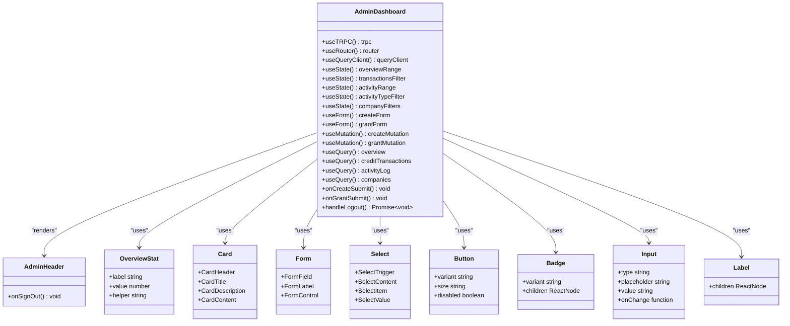

# Admin Dashboard Redesign

<cite>
**Referenced Files in This Document**   
- [admin-dashboard.tsx](file://src/modules/admin/ui/admin-dashboard.tsx)
- [admin-header.tsx](file://src/modules/admin/ui/admin-header.tsx)
- [admin-login-form.tsx](file://src/modules/admin/ui/admin-login-form.tsx)
- [page.tsx](file://src/app/admin/page.tsx)
- [login/page.tsx](file://src/app/admin/login/page.tsx)
- [route.ts](file://src/app/api/admin/login/route.ts)
- [route.ts](file://src/app/api/admin/logout/route.ts)
- [auth.ts](file://src/lib/auth.ts)
- [procedures.ts](file://src/modules/companies/server/procedures.ts)
- [card.tsx](file://src/components/ui/card.tsx)
- [button.tsx](file://src/components/ui/button.tsx)
- [table.tsx](file://src/components/ui/table.tsx)
- [form.tsx](file://src/components/ui/form.tsx)
- [select.tsx](file://src/components/ui/select.tsx)
- [layout.tsx](file://src/app/layout.tsx)
- [globals.css](file://src/app/globals.css)
- [package.json](file://package.json)
</cite>

## Table of Contents
1. [Introduction](#introduction)
2. [Project Structure](#project-structure)
3. [Core Components](#core-components)
4. [Architecture Overview](#architecture-overview)
5. [Detailed Component Analysis](#detailed-component-analysis)
6. [Dependency Analysis](#dependency-analysis)
7. [Performance Considerations](#performance-considerations)
8. [Troubleshooting Guide](#troubleshooting-guide)
9. [Conclusion](#conclusion)

## Introduction
This document provides a comprehensive analysis of the Admin Dashboard redesign for the QAI platform. The admin interface serves as a centralized control center for managing company access, monitoring usage, and performing administrative operations. The dashboard enables administrators to generate recruiter codes, grant credits, track company activity, and audit platform operations through a modern, responsive interface built with React, Next.js, and TypeScript.

## Project Structure
The Admin Dashboard is organized within a Next.js application structure with a clear separation of concerns. The admin functionality is contained within dedicated modules and routes, following a component-based architecture with reusable UI elements.

**Diagram sources**
- [page.tsx](file://src/app/admin/page.tsx)
- [login/page.tsx](file://src/app/admin/login/page.tsx)
- [admin-dashboard.tsx](file://src/modules/admin/ui/admin-dashboard.tsx)
- [admin-header.tsx](file://src/modules/admin/ui/admin-header.tsx)
- [admin-login-form.tsx](file://src/modules/admin/ui/admin-login-form.tsx)
- [route.ts](file://src/app/api/admin/login/route.ts)
- [route.ts](file://src/app/api/admin/logout/route.ts)
- [procedures.ts](file://src/modules/companies/server/procedures.ts)

**Section sources**
- [page.tsx](file://src/app/admin/page.tsx)
- [login/page.tsx](file://src/app/admin/login/page.tsx)
- [admin-dashboard.tsx](file://src/modules/admin/ui/admin-dashboard.tsx)

## Core Components
The Admin Dashboard consists of several core components that work together to provide administrative functionality. The main dashboard component renders multiple sections including overview statistics, operations forms, company listings, credit operations, and activity logs. Each section is designed to provide specific administrative capabilities with a consistent user experience.

The authentication flow is handled through dedicated login components and API routes that validate admin credentials against a shared secret. Once authenticated, administrators gain access to the full dashboard with all operational capabilities. The interface uses React Hook Form for form management and Zod for validation, ensuring data integrity across all operations.

**Section sources**
- [admin-dashboard.tsx](file://src/modules/admin/ui/admin-dashboard.tsx)
- [admin-login-form.tsx](file://src/modules/admin/ui/admin-login-form.tsx)
- [procedures.ts](file://src/modules/companies/server/procedures.ts)

## Architecture Overview
The Admin Dashboard follows a client-server architecture with a React-based frontend and a Next.js API backend. The frontend communicates with backend procedures through tRPC, providing type-safe API calls with automatic TypeScript inference. The architecture separates concerns between UI presentation, business logic, and data access layers.

**Diagram sources**
- [admin-dashboard.tsx](file://src/modules/admin/ui/admin-dashboard.tsx)
- [procedures.ts](file://src/modules/companies/server/procedures.ts)
- [route.ts](file://src/app/api/admin/login/route.ts)
- [auth.ts](file://src/lib/auth.ts)
- [page.tsx](file://src/app/admin/page.tsx)

## Detailed Component Analysis

### Admin Dashboard Component
The AdminDashboard component serves as the main interface for administrative operations, organizing functionality into distinct sections with comprehensive data visualization and interaction capabilities.

**Diagram sources**
- [admin-dashboard.tsx](file://src/modules/admin/ui/admin-dashboard.tsx)
- [admin-header.tsx](file://src/modules/admin/ui/admin-header.tsx)
- [card.tsx](file://src/components/ui/card.tsx)
- [form.tsx](file://src/components/ui/form.tsx)
- [select.tsx](file://src/components/ui/select.tsx)
- [button.tsx](file://src/components/ui/button.tsx)
- [badge.tsx](file://src/components/ui/badge.tsx)
- [input.tsx](file://src/components/ui/input.tsx)
- [label.tsx](file://src/components/ui/label.tsx)

**Section sources**
- [admin-dashboard.tsx](file://src/modules/admin/ui/admin-dashboard.tsx)

### Authentication Flow
The authentication system for the admin dashboard implements a secure cookie-based authentication mechanism that protects administrative routes and operations.

**Diagram sources**
- [page.tsx](file://src/app/admin/page.tsx)
- [login/page.tsx](file://src/app/admin/login/page.tsx)
- [route.ts](file://src/app/api/admin/login/route.ts)
- [route.ts](file://src/app/api/admin/logout/route.ts)
- [auth.ts](file://src/lib/auth.ts)

**Section sources**
- [page.tsx](file://src/app/admin/page.tsx)
- [login/page.tsx](file://src/app/admin/login/page.tsx)
- [route.ts](file://src/app/api/admin/login/route.ts)
- [route.ts](file://src/app/api/admin/logout/route.ts)
- [auth.ts](file://src/lib/auth.ts)

### Data Management and API Integration
The admin dashboard integrates with backend procedures through tRPC to manage company data, credit operations, and activity logging. The system uses React Query for efficient data fetching and caching.

**Diagram sources**
- [admin-dashboard.tsx](file://src/modules/admin/ui/admin-dashboard.tsx)
- [procedures.ts](file://src/modules/companies/server/procedures.ts)

**Section sources**
- [admin-dashboard.tsx](file://src/modules/admin/ui/admin-dashboard.tsx)
- [procedures.ts](file://src/modules/companies/server/procedures.ts)

## Dependency Analysis
The Admin Dashboard has a well-defined dependency structure with clear separation between UI components, business logic, and data access layers. The component dependencies form a hierarchical structure that promotes reusability and maintainability.

**Diagram sources**
- [admin-dashboard.tsx](file://src/modules/admin/ui/admin-dashboard.tsx)
- [admin-header.tsx](file://src/modules/admin/ui/admin-header.tsx)
- [card.tsx](file://src/components/ui/card.tsx)
- [form.tsx](file://src/components/ui/form.tsx)
- [select.tsx](file://src/components/ui/select.tsx)
- [button.tsx](file://src/components/ui/button.tsx)
- [input.tsx](file://src/components/ui/input.tsx)
- [label.tsx](file://src/components/ui/label.tsx)
- [badge.tsx](file://src/components/ui/badge.tsx)

**Section sources**
- [admin-dashboard.tsx](file://src/modules/admin/ui/admin-dashboard.tsx)
- [admin-header.tsx](file://src/modules/admin/ui/admin-header.tsx)
- [components/ui/*.tsx](file://src/components/ui/)

## Performance Considerations
The Admin Dashboard implements several performance optimizations to ensure a responsive user experience. React Query provides efficient data fetching with caching, deduplication, and background refetching. The dashboard uses useMemo to optimize expensive computations like company filtering and activity filtering, preventing unnecessary re-renders.

The interface implements proper loading states for all asynchronous operations, with pending states on form submissions to prevent duplicate requests. Data is fetched in parallel where possible, with multiple useQuery hooks running simultaneously to minimize perceived load times. The table components use virtualization principles with overflow-x-auto to handle large datasets efficiently.

The authentication system uses cookie-based authentication with server-side validation, reducing the need for repeated API calls to verify user status. The tRPC integration provides type safety while maintaining efficient serialization through SuperJSON.

## Troubleshooting Guide
When encountering issues with the Admin Dashboard, consider the following common problems and solutions:

**Section sources**
- [admin-dashboard.tsx](file://src/modules/admin/ui/admin-dashboard.tsx)
- [auth.ts](file://src/lib/auth.ts)
- [route.ts](file://src/app/api/admin/login/route.ts)
- [procedures.ts](file://src/modules/companies/server/procedures.ts)

## Conclusion
The Admin Dashboard redesign provides a comprehensive, user-friendly interface for managing the QAI platform's administrative functions. The implementation follows modern React best practices with a clear component hierarchy, proper state management, and efficient data fetching. The authentication system ensures secure access to administrative features, while the tRPC integration provides type-safe communication between frontend and backend.

The dashboard's modular architecture allows for easy extension and maintenance, with well-defined boundaries between UI components and business logic. The use of established libraries like React Hook Form, Zod, and React Query ensures reliability and developer productivity. The responsive design adapts to different screen sizes, providing a consistent experience across devices.