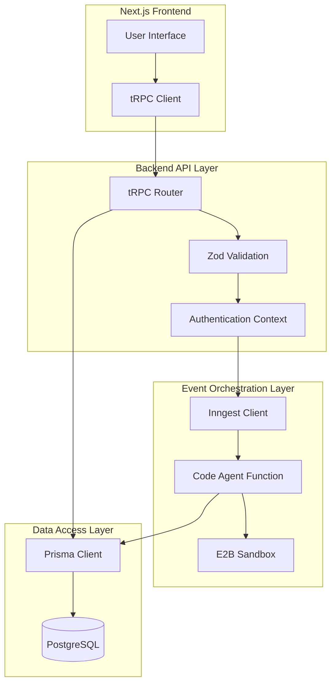
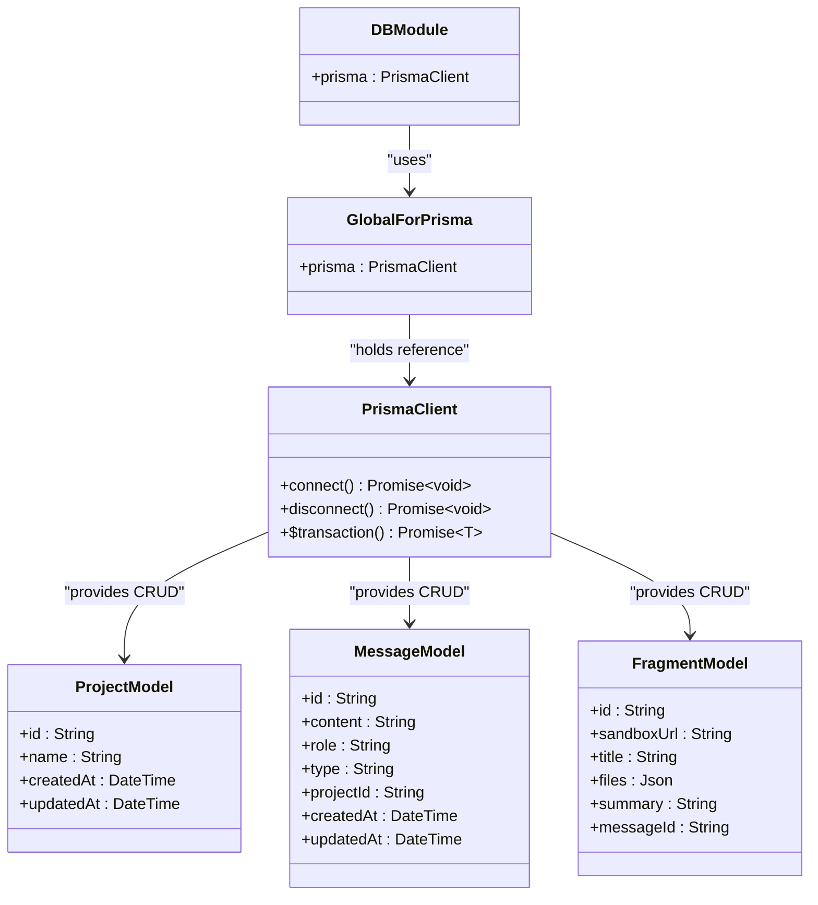
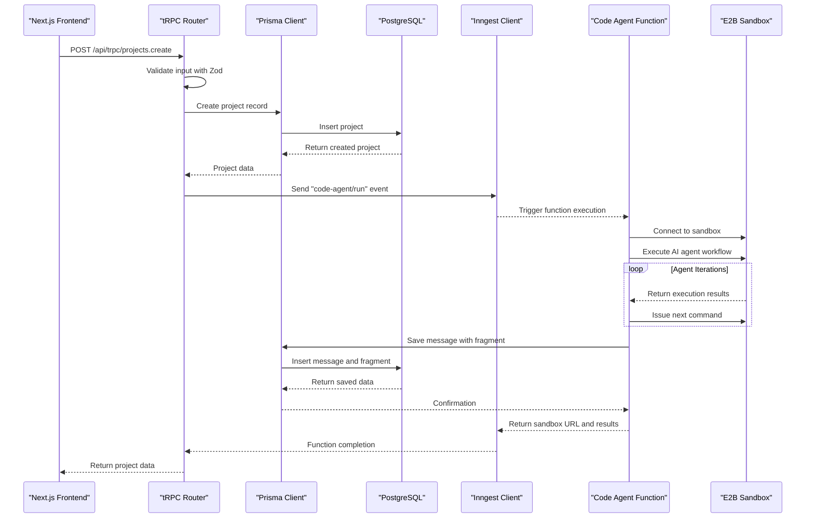

# Backend Architecture

<cite>
**Referenced Files in This Document**   
- [init.ts](file://src/trpc/init.ts)
- [server.tsx](file://src/trpc/server.tsx)
- [appRouter.ts](file://src/trpc/routers/_app.ts)
- [route.ts](file://src/app/api/trpc/[trpc]/route.ts)
- [client.ts](file://src/inngest/client.ts)
- [functions.ts](file://src/inngest/functions.ts)
- [utils.ts](file://src/inngest/utils.ts)
- [route.ts](file://src/app/api/inngest/route.ts)
- [db.ts](file://src/lib/db.ts)
- [procedures.ts](file://src/modules/projects/server/procedures.ts)
- [procedures.ts](file://src/modules/messages/server/procedures.ts)
- [package.json](file://package.json)
- [prompt.ts](file://src/prompt.ts)
</cite>

## Table of Contents
1. [Introduction](#introduction)
2. [Three-Tier Architecture Overview](#three-tier-architecture-overview)
3. [tRPC API Layer](#trpc-api-layer)
4. [Inngest Event Orchestration](#inngest-event-orchestration)
5. [Prisma Data Access Layer](#prisma-data-access-layer)
6. [Request Flow and Event-Driven Processing](#request-flow-and-event-driven-processing)
7. [Security Considerations](#security-considerations)
8. [Scalability and Performance](#scalability-and-performance)
9. [Conclusion](#conclusion)

## Introduction
The QAI platform backend system implements a robust three-tier architecture that separates concerns between API handling, event orchestration, and data persistence. This document details the architectural components and their interactions, focusing on the tRPC API layer for request handling, Inngest for event-driven AI processing workflows, and Prisma for database operations. The system is designed to handle project creation and message processing through an asynchronous workflow where API requests trigger background AI agent executions, enabling responsive user experiences while performing computationally intensive tasks.

**Section sources**
- [init.ts](file://src/trpc/init.ts)
- [client.ts](file://src/inngest/client.ts)
- [db.ts](file://src/lib/db.ts)

## Three-Tier Architecture Overview
The QAI platform backend follows a clean three-tier architecture pattern that separates the application into distinct layers: presentation (API), business logic (event orchestration), and data access. The tRPC layer handles incoming HTTP requests from the Next.js frontend, validating inputs and managing authentication context. Upon successful request processing, this layer emits events to the Inngest orchestration system, which manages asynchronous AI agent workflows. The Prisma layer provides type-safe database access across both synchronous and asynchronous operations, ensuring data consistency throughout the application. This separation of concerns allows for independent scaling and maintenance of each component while maintaining a cohesive system architecture.

**Diagram sources**
- [init.ts](file://src/trpc/init.ts)
- [client.ts](file://src/inngest/client.ts)
- [db.ts](file://src/lib/db.ts)

**Section sources**
- [init.ts](file://src/trpc/init.ts)
- [client.ts](file://src/inngest/client.ts)
- [db.ts](file://src/lib/db.ts)

## tRPC API Layer
The tRPC API layer serves as the entry point for all client requests, providing a type-safe RPC framework that enables seamless communication between the Next.js frontend and backend services. Implemented through tRPC routers, this layer exposes endpoints for project and message operations, with each procedure incorporating Zod-based input validation to ensure data integrity. The architecture utilizes a base procedure configuration that includes context creation and data transformers (SuperJSON) for handling complex data types. API routes in the Next.js application are configured to handle tRPC requests, forwarding them to the appropriate routers based on the endpoint. This layer is responsible for immediate request validation and response generation while delegating long-running AI processing tasks to the event orchestration system.

**Section sources**
- [init.ts](file://src/trpc/init.ts)
- [server.tsx](file://src/trpc/server.tsx)
- [appRouter.ts](file://src/trpc/routers/_app.ts)
- [route.ts](file://src/app/api/trpc/[trpc]/route.ts)

## Inngest Event Orchestration
The Inngest event orchestration layer manages asynchronous AI agent workflows triggered by user actions in the application. When a project is created or a message is sent, the tRPC layer emits a "code-agent/run" event to Inngest, which then executes the corresponding function. The code agent function implements a sophisticated AI agent that interacts with an E2B code interpreter sandbox to execute commands, create/update files, and read files within a secure environment. This agent follows a network-based approach with multiple tools and a lifecycle that tracks state across iterations. The orchestration system handles function scheduling, error recovery, and state management, allowing complex AI workflows to run reliably in the background without blocking the main application thread.

**Section sources**
- [client.ts](file://src/inngest/client.ts)
- [functions.ts](file://src/inngest/functions.ts)
- [utils.ts](file://src/inngest/utils.ts)
- [route.ts](file://src/app/api/inngest/route.ts)

## Prisma Data Access Layer
The Prisma data access layer implements a singleton pattern for database client initialization, ensuring efficient connection management across both synchronous API requests and asynchronous Inngest functions. The Prisma client is instantiated once and stored in a global variable to prevent multiple connections during hot reloading in development. This approach optimizes resource usage and maintains connection stability in production environments. The data layer provides type-safe operations for creating, reading, and updating projects and messages, with specific models for message fragments that store sandbox URLs, file contents, and execution summaries. Both the tRPC procedures and Inngest functions utilize the same Prisma client instance, ensuring consistent data access patterns throughout the application.

**Diagram sources**
- [db.ts](file://src/lib/db.ts)

**Section sources**
- [db.ts](file://src/lib/db.ts)

## Request Flow and Event-Driven Processing
The request flow in the QAI platform follows a well-defined sequence from HTTP request to database persistence and event emission. When a user creates a project or sends a message, the Next.js frontend routes the request to the tRPC API layer, where it undergoes validation and authentication. Upon successful validation, the request is processed by the appropriate tRPC procedure, which creates the corresponding database records using Prisma. Immediately after persistence, the procedure emits a "code-agent/run" event to Inngest with the necessary payload data. This event triggers the code agent function, which orchestrates AI-driven code generation within an E2B sandbox environment. Once the agent completes its task, it saves the results back to the database through Prisma, completing the asynchronous workflow. This event-driven architecture ensures responsive user interfaces while handling computationally intensive AI operations in the background.

**Diagram sources**
- [procedures.ts](file://src/modules/projects/server/procedures.ts)
- [procedures.ts](file://src/modules/messages/server/procedures.ts)
- [functions.ts](file://src/inngest/functions.ts)
- [db.ts](file://src/lib/db.ts)

**Section sources**
- [procedures.ts](file://src/modules/projects/server/procedures.ts)
- [procedures.ts](file://src/modules/messages/server/procedures.ts)
- [functions.ts](file://src/inngest/functions.ts)

## Security Considerations
The QAI platform incorporates multiple security measures across its architecture to protect data integrity and system stability. Input validation is implemented using Zod schemas at the tRPC procedure level, ensuring that all incoming data meets specified requirements before processing. Authentication context is implicitly managed through the tRPC context creation function, which would typically extract and validate user credentials from requests. The system leverages rate limiting capabilities provided by Express (indicated in package dependencies), protecting against abuse and denial-of-service attacks. Sensitive operations within the AI agent are constrained by a comprehensive system prompt that enforces security rules, such as prohibiting direct modification of package files and restricting file system access to relative paths. Database operations are performed through the type-safe Prisma client, reducing the risk of injection attacks and ensuring proper data handling.

**Section sources**
- [init.ts](file://src/trpc/init.ts)
- [procedures.ts](file://src/modules/projects/server/procedures.ts)
- [procedures.ts](file://src/modules/messages/server/procedures.ts)
- [prompt.ts](file://src/prompt.ts)
- [package.json](file://package.json)

## Scalability and Performance
The QAI platform architecture is designed with scalability in mind, particularly for handling concurrent AI agent executions and database load. The separation of synchronous API handling from asynchronous AI processing allows the system to maintain responsive user interfaces even under heavy computational loads. Inngest's event orchestration provides built-in queuing and retry mechanisms, enabling the platform to manage spikes in AI agent requests without overwhelming resources. The singleton Prisma client pattern optimizes database connection usage, reducing overhead and preventing connection exhaustion. The E2B sandbox environment allows for isolated execution of AI-generated code, enabling parallel processing of multiple agent workflows. This architecture supports horizontal scaling of both the API layer and event processing functions, with the potential to distribute Inngest functions across multiple workers to handle increased concurrency requirements.

**Section sources**
- [db.ts](file://src/lib/db.ts)
- [functions.ts](file://src/inngest/functions.ts)
- [client.ts](file://src/inngest/client.ts)

## Conclusion
The QAI platform backend architecture effectively implements a three-tier design that separates concerns between API handling, event orchestration, and data access. The tRPC layer provides a type-safe interface for client communication with robust input validation, while the Inngest event system enables reliable asynchronous processing of AI agent workflows. The Prisma data access layer ensures consistent and type-safe database operations across both synchronous and asynchronous contexts, with a singleton pattern optimizing connection management. This architecture supports a responsive user experience by decoupling immediate request handling from computationally intensive AI processing, while maintaining data consistency and system security. The design is scalable and maintainable, providing a solid foundation for the platform's AI-driven functionality.