# Conversation History Management

<cite>
**Referenced Files in This Document**   
- [conversation.ts](file://src/inngest/conversation.ts)
- [functions.ts](file://src/inngest/functions.ts)
- [messages/server/procedures.ts](file://src/modules/messages/server/procedures.ts)
- [projects/server/procedures.ts](file://src/modules/projects/server/procedures.ts)
- [messages-container.tsx](file://src/modules/projects/ui/components/messages-container.tsx)
- [message-card.tsx](file://src/modules/projects/ui/components/message-card.tsx)
- [message-form.tsx](file://src/modules/projects/ui/components/message-form.tsx)
- [conversation_summary/migration.sql](file://prisma/migrations/20251101123344_conversation_summary/migration.sql)
- [client.ts](file://src/inngest/client.ts)
</cite>

## Table of Contents
1. [Introduction](#introduction)
2. [Project Structure](#project-structure)
3. [Core Components](#core-components)
4. [Architecture Overview](#architecture-overview)
5. [Detailed Component Analysis](#detailed-component-analysis)
6. [Dependency Analysis](#dependency-analysis)
7. [Performance Considerations](#performance-considerations)
8. [Troubleshooting Guide](#troubleshooting-guide)
9. [Conclusion](#conclusion)

## Introduction
This document provides a comprehensive analysis of the conversation history management system in the QAI application. The system handles the storage, retrieval, and processing of conversation data between users and the AI agent, including message history, context management, and conversation summarization. The architecture integrates frontend components, backend services, and AI processing functions to create a seamless conversational experience.

## Project Structure
The conversation history management system is distributed across multiple directories in the codebase, with components organized by functionality and layer. The system follows a modular architecture with clear separation between data access, business logic, and presentation layers.

```mermaid
graph TB
subgraph "Frontend"
UI[UI Components]
MessageForm[message-form.tsx]
MessageCard[message-card.tsx]
MessagesContainer[messages-container.tsx]
end
subgraph "Backend"
TRPC[TRPC Routers]
MessagesRouter[messages/server/procedures.ts]
ProjectsRouter[projects/server/procedures.ts]
end
subgraph "AI Processing"
Inngest[Inngest Functions]
Conversation[conversation.ts]
Functions[functions.ts]
end
subgraph "Data Layer"
Prisma[Prisma Schema]
Migration[conversation_summary/migration.sql]
end
UI --> TRPC
TRPC --> Inngest
Inngest --> Data Layer
```

**Diagram sources**
- [message-form.tsx](file://src/modules/projects/ui/components/message-form.tsx)
- [messages-container.tsx](file://src/modules/projects/ui/components/messages-container.tsx)
- [messages/server/procedures.ts](file://src/modules/messages/server/procedures.ts)
- [functions.ts](file://src/inngest/functions.ts)
- [conversation_summary/migration.sql](file://prisma/migrations/20251101123344_conversation_summary/migration.sql)

**Section sources**
- [message-form.tsx](file://src/modules/projects/ui/components/message-form.tsx)
- [messages-container.tsx](file://src/modules/projects/ui/components/messages-container.tsx)
- [messages/server/procedures.ts](file://src/modules/messages/server/procedures.ts)
- [functions.ts](file://src/inngest/functions.ts)
- [conversation_summary/migration.sql](file://prisma/migrations/20251101123344_conversation_summary/migration.sql)

## Core Components
The conversation history management system consists of several core components that work together to handle user interactions, maintain conversation context, and generate AI responses. Key components include the conversation context loader, payload builder, summary generator, and message processing pipeline. The system is designed to efficiently manage conversation history while maintaining context for AI processing.

**Section sources**
- [conversation.ts](file://src/inngest/conversation.ts)
- [functions.ts](file://src/inngest/functions.ts)
- [messages/server/procedures.ts](file://src/modules/messages/server/procedures.ts)

## Architecture Overview
The conversation history management system follows a layered architecture that integrates frontend user interfaces with backend processing and AI functions. The system uses TRPC for API communication, Prisma for database access, and Inngest for AI workflow orchestration. Conversation data flows from the user interface through the API layer to the AI processing system, with summarized context maintained for efficient processing.


**Diagram sources**
- [message-form.tsx](file://src/modules/projects/ui/components/message-form.tsx)
- [messages/server/procedures.ts](file://src/modules/messages/server/procedures.ts)
- [functions.ts](file://src/inngest/functions.ts)
- [conversation.ts](file://src/inngest/conversation.ts)

## Detailed Component Analysis

### Conversation Context Management
The system manages conversation context through a combination of full message history and rolling summaries. The context includes the complete message history for the current project, the latest code fragment, and the most recent user message. This context is used to build payloads for AI processing while maintaining efficiency through summarization.


**Diagram sources**
- [conversation.ts](file://src/inngest/conversation.ts#L0-L46)
- [message-card.tsx](file://src/modules/projects/ui/components/message-card.tsx#L0-L25)

**Section sources**
- [conversation.ts](file://src/inngest/conversation.ts#L0-L46)
- [message-card.tsx](file://src/modules/projects/ui/components/message-card.tsx#L0-L25)

### Conversation Payload Building
The system builds conversation payloads for AI processing by combining the conversation summary, formatted history, and current user request. The payload is structured with XML-like tags to delineate different sections, making it easier for the AI to parse and understand the context. The history is truncated based on character limits to ensure optimal processing performance.


**Diagram sources**
- [conversation.ts](file://src/inngest/conversation.ts#L40-L85)

**Section sources**
- [conversation.ts](file://src/inngest/conversation.ts#L40-L85)

### Conversation Summarization
The system implements a rolling conversation summarization mechanism that maintains context across interactions. Each new exchange (user message and assistant response) is added to the summary, with older content truncated when the summary exceeds the maximum length. This ensures that the AI has access to relevant context while preventing unbounded growth of the summary.

```mermaid
flowchart TD
Start([Compute Rolling Summary]) --> NormalizeInput["Normalize User & Assistant Messages"]
NormalizeInput --> TrimEntries["Trim to Entry Max Length"]
TrimEntries --> CreateEntry["Create New Entry: User: ...\\nAssistant: ..."]
CreateEntry --> Combine["Combine Previous Summary & New Entry"]
Combine --> CheckLength{"Combined Length ≤ Max?"}
CheckLength --> |Yes| ReturnCombined["Return Combined Summary"]
CheckLength --> |No| Truncate["Truncate from Beginning"]
Truncate --> FindBreak["Find First Line Break"]
FindBreak --> TrimStart["Trim Starting from Line Break"]
TrimStart --> AddNotice["Prepend [Earlier conversation truncated]"]
AddNotice --> ReturnTruncated["Return Truncated Summary"]
ReturnCombined --> End([Summary Complete])
ReturnTruncated --> End
```



**Diagram sources**
- [conversation.ts](file://src/inngest/conversation.ts#L82-L132)

**Section sources**
- [conversation.ts](file://src/inngest/conversation.ts#L82-L132)

### Message History Truncation
To manage conversation history size, the system implements a reverse traversal algorithm that prioritizes recent messages. The algorithm starts from the most recent message and works backward, accumulating messages until the character limit is reached. This ensures that the most relevant, recent context is preserved while older content is truncated.


**Diagram sources**
- [conversation.ts](file://src/inngest/conversation.ts#L134-L178)

**Section sources**
- [conversation.ts](file://src/inngest/conversation.ts#L134-L178)

## Dependency Analysis
The conversation history management system has a well-defined dependency structure that connects frontend components with backend services and AI processing functions. The system relies on several key dependencies to function properly, including database access, API routing, and event processing.


**Diagram sources**
- [message-form.tsx](file://src/modules/projects/ui/components/message-form.tsx)
- [messages-container.tsx](file://src/modules/projects/ui/components/messages-container.tsx)
- [message-card.tsx](file://src/modules/projects/ui/components/message-card.tsx)
- [projects/server/procedures.ts](file://src/modules/projects/server/procedures.ts)
- [messages/server/procedures.ts](file://src/modules/messages/server/procedures.ts)
- [conversation.ts](file://src/inngest/conversation.ts)
- [functions.ts](file://src/inngest/functions.ts)
- [client.ts](file://src/inngest/client.ts)

**Section sources**
- [projects/server/procedures.ts](file://src/modules/projects/server/procedures.ts)
- [messages/server/procedures.ts](file://src/modules/messages/server/procedures.ts)
- [conversation.ts](file://src/inngest/conversation.ts)
- [functions.ts](file://src/inngest/functions.ts)

## Performance Considerations
The conversation history management system is designed with performance in mind, particularly regarding the handling of large conversation histories. The system uses several optimization techniques to ensure responsive user experiences and efficient AI processing. These include parallel database queries for loading conversation context, character-limited history truncation, and rolling summarization to prevent unbounded context growth. The use of React Query for data fetching and caching helps minimize redundant API calls and improves frontend performance.

## Troubleshooting Guide
When troubleshooting issues with the conversation history management system, consider the following common scenarios and their solutions:

**Section sources**
- [conversation.ts](file://src/inngest/conversation.ts)
- [functions.ts](file://src/inngest/functions.ts)
- [messages/server/procedures.ts](file://src/modules/messages/server/procedures.ts)

## Conclusion
The conversation history management system in the QAI application provides a robust framework for handling user interactions with AI agents. By combining full message history with rolling summaries, the system maintains context for AI processing while optimizing performance. The architecture effectively separates concerns between frontend presentation, backend API services, and AI processing functions, creating a maintainable and scalable solution. Key features like context preservation, history truncation, and conversation summarization work together to deliver a seamless user experience while managing the complexities of AI-driven conversations.