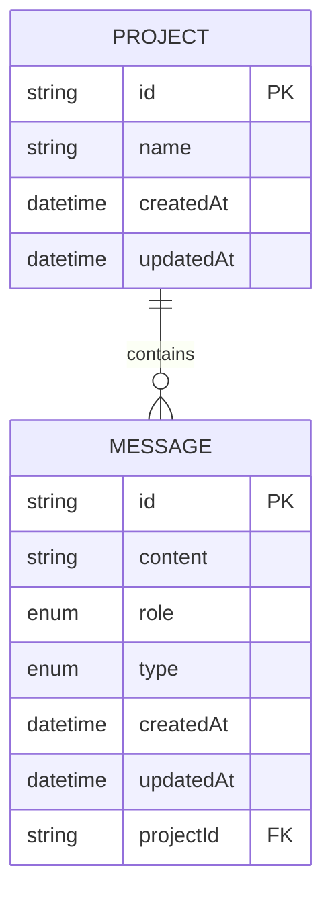
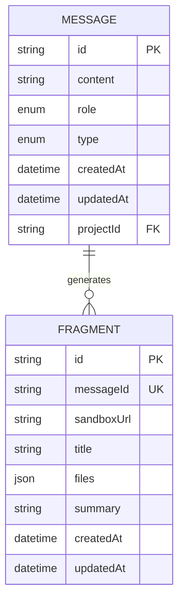
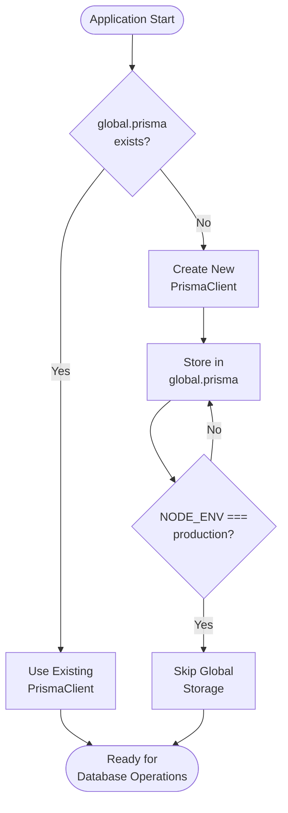
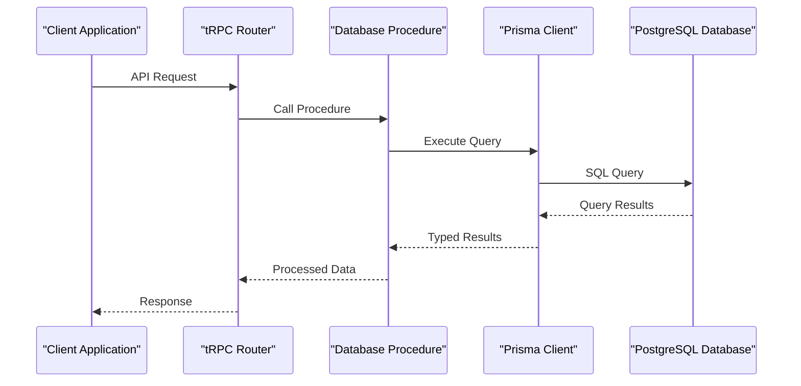
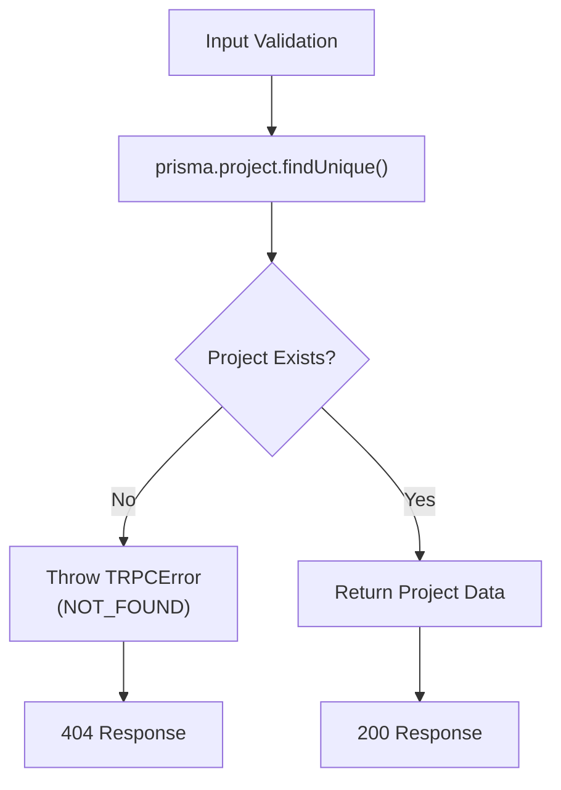
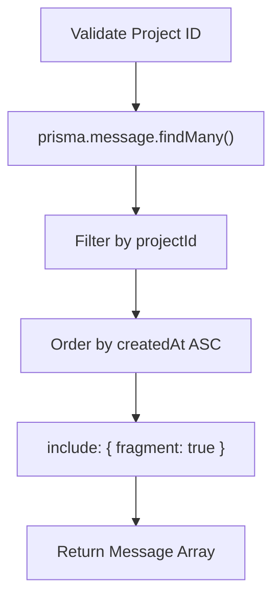
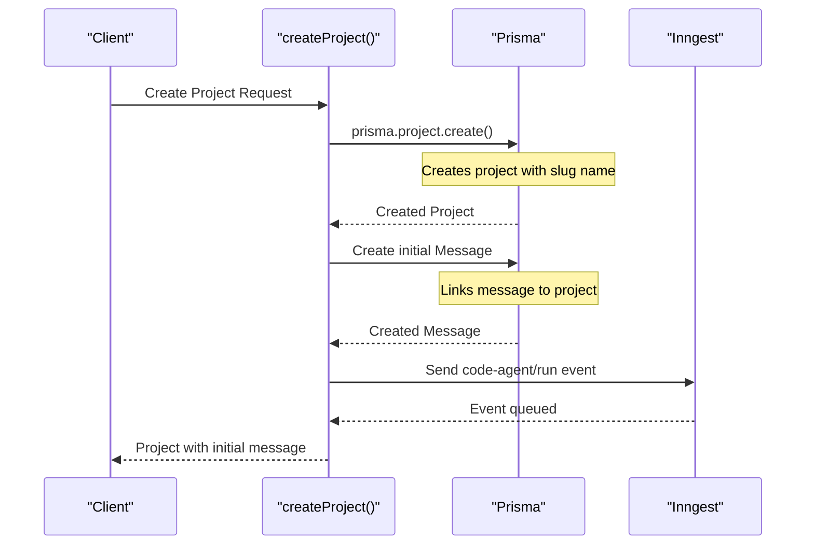
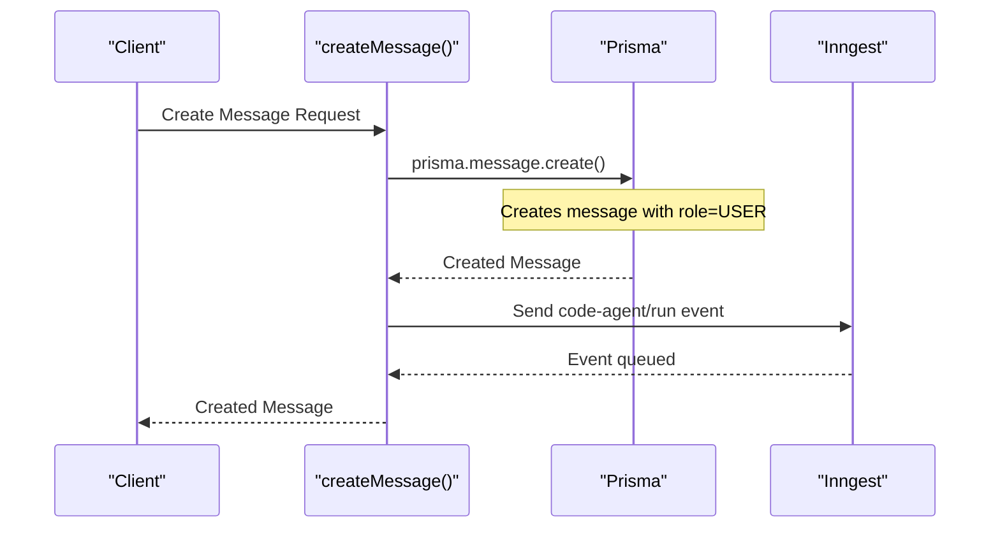
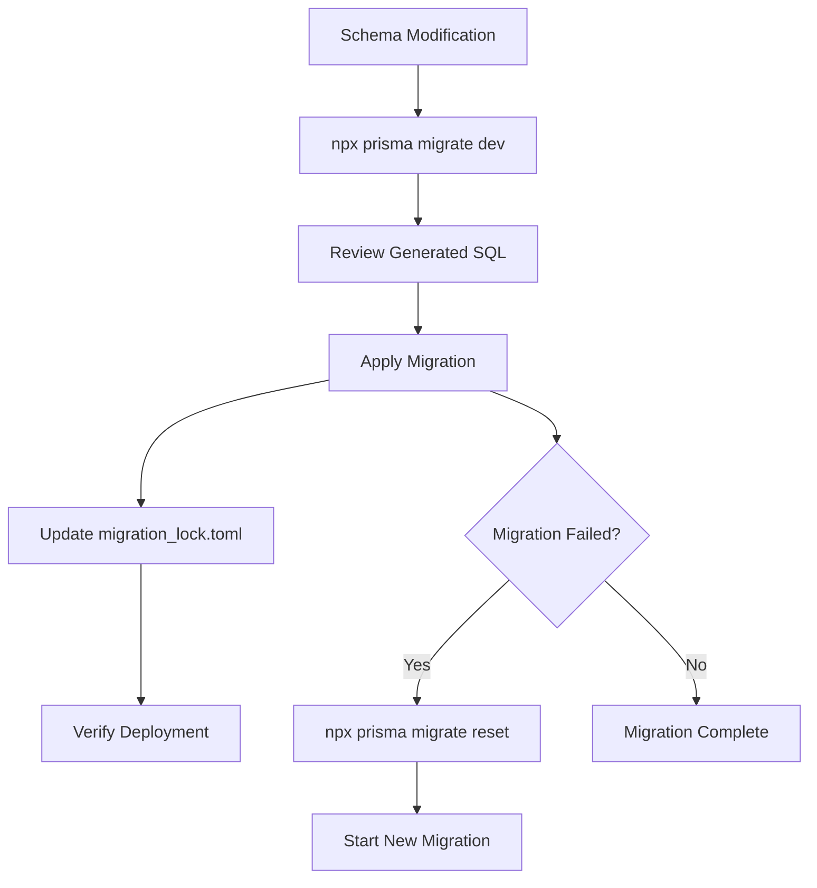
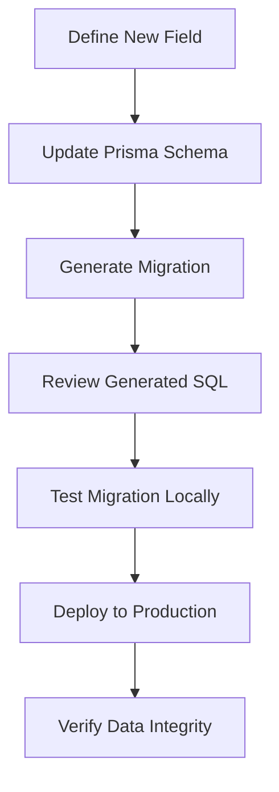

# Database Access & Prisma ORM

<cite>
**Referenced Files in This Document**
- [prisma/schema.prisma](file://prisma/schema.prisma)
- [src/lib/db.ts](file://src/lib/db.ts)
- [src/trpc/init.ts](file://src/trpc/init.ts)
- [src/modules/projects/server/procedures.ts](file://src/modules/projects/server/procedures.ts)
- [src/modules/messages/server/procedures.ts](file://src/modules/messages/server/procedures.ts)
- [src/trpc/routers/_app.ts](file://src/trpc/routers/_app.ts)
- [prisma/migrations/20251019200148_message_fragment/migration.sql](file://prisma/migrations/20251019200148_message_fragment/migration.sql)
- [prisma/migrations/20251019214950_projects/migration.sql](file://prisma/migrations/20251019214950_projects/migration.sql)
- [package.json](file://package.json)
- [src/inngest/client.ts](file://src/inngest/client.ts)
</cite>

## Table of Contents
1. [Introduction](#introduction)
2. [Prisma Schema Architecture](#prisma-schema-architecture)
3. [Database Model Relationships](#database-model-relationships)
4. [Singleton Pattern Implementation](#singleton-pattern-implementation)
5. [tRPC Database Integration](#trpc-database-integration)
6. [CRUD Operations](#crud-operations)
7. [Database Migration Workflow](#database-migration-workflow)
8. [Performance Considerations](#performance-considerations)
9. [Schema Extension Guidelines](#schema-extension-guidelines)
10. [Best Practices](#best-practices)

## Introduction

The QAI platform utilizes Prisma ORM as its primary database abstraction layer, providing type-safe database operations and seamless integration with the tRPC API framework. This documentation covers the complete database architecture, including the Prisma schema design, connection management patterns, and practical implementation examples for CRUD operations.

The platform's database design follows a hierarchical structure with Projects containing Messages, which in turn can have associated Fragments for code execution contexts. This architecture supports the platform's AI-assisted code development workflow where projects serve as containers for conversational histories and executable code fragments.

## Prisma Schema Architecture

The Prisma schema defines four core models that establish the foundation for the QAI platform's data persistence layer. The schema is configured to work with PostgreSQL databases and includes sophisticated relationship modeling with cascading delete behavior.

### Core Model Definitions

The schema consists of four interconnected models with specific field types, constraints, and relationships:

```mermaid
erDiagram
PROJECT {
string id PK
string name
datetime createdAt
datetime updatedAt
}
MESSAGE {
string id PK
string content
enum role
enum type
datetime createdAt
datetime updatedAt
string projectId FK
}
FRAGMENT {
string id PK
string messageId UK
string sandboxUrl
string title
json files
string summary
datetime createdAt
datetime updatedAt
}
PROJECT ||--o{ MESSAGE : contains
MESSAGE ||--o{ FRAGMENT : generates
MESSAGE }o|--|| PROJECT : belongs_to
```

**Diagram sources**
- [prisma/schema.prisma](file://prisma/schema.prisma#L15-L65)

**Section sources**
- [prisma/schema.prisma](file://prisma/schema.prisma#L1-L66)

### Field Types and Constraints

The schema employs PostgreSQL-native field types with appropriate constraints:

- **String Fields**: UUID-based identifiers using `@id @default(uuid())` for primary keys
- **DateTime Fields**: Automatic timestamp management with `@default(now())` and `@updatedAt`
- **Enum Types**: Strongly-typed enums for `MessageRole` (USER, ASSISTANT) and `MessageType` (RESULT, ERROR)
- **JSON Fields**: Flexible `Json` type for storing dynamic file structures in Fragments
- **Foreign Keys**: Cascading relationships with `onDelete: Cascade` for referential integrity

### Index Configuration

The schema automatically creates appropriate indexes:
- Primary key indexes on all entity IDs
- Unique constraint on Fragment.messageId to prevent duplicate fragments per message
- Foreign key indexes for efficient join operations

## Database Model Relationships

The QAI platform implements a sophisticated three-tier relationship model that mirrors the application's functional architecture.

### One-to-Many Relationship: Project to Message

Each Project serves as a container for multiple Messages, representing the conversational history of a development session. This relationship enables:



**Diagram sources**
- [prisma/schema.prisma](file://prisma/schema.prisma#L15-L30)

The relationship is implemented with:
- **Cascade Delete**: When a Project is deleted, all associated Messages are automatically removed
- **Foreign Key Constraint**: Ensures referential integrity between Projects and Messages
- **Query Optimization**: Efficient filtering by projectId for retrieving project-specific conversations

### One-to-One Relationship: Message to Fragment

Each Message can have at most one associated Fragment, representing the executable code context generated during AI interactions:



**Diagram sources**
- [prisma/schema.prisma](file://prisma/schema.prisma#L32-L65)

Key characteristics of this relationship:
- **Optional Association**: Not every Message generates a Fragment
- **Unique Constraint**: Each Fragment is linked to exactly one Message
- **Cascading Behavior**: Fragment deletion occurs when the associated Message is removed

**Section sources**
- [prisma/schema.prisma](file://prisma/schema.prisma#L32-L65)

## Singleton Pattern Implementation

The database connection management follows a singleton pattern optimized for serverless environments, preventing connection leaks and ensuring efficient resource utilization.

### Connection Pooling Strategy

The implementation uses a global singleton pattern with environment-specific behavior:



**Diagram sources**
- [src/lib/db.ts](file://src/lib/db.ts#L1-L9)

### Production vs Development Behavior

The singleton implementation exhibits different behavior based on the environment:

- **Development Environment**: Stores the PrismaClient instance in the global object to enable hot reloading and prevent multiple client instances
- **Production Environment**: Creates a fresh PrismaClient instance per request to avoid potential memory leaks in serverless functions

### Benefits of Singleton Pattern

1. **Resource Efficiency**: Prevents multiple database connections from being established
2. **Memory Management**: Reduces memory overhead in serverless environments
3. **Connection Reuse**: Maintains persistent connections when appropriate
4. **Type Safety**: Provides consistent typing across the application

**Section sources**
- [src/lib/db.ts](file://src/lib/db.ts#L1-L10)

## tRPC Database Integration

The platform integrates Prisma ORM seamlessly with tRPC for type-safe API operations, enabling automatic type inference and compile-time validation of database interactions.

### tRPC Procedure Architecture

The database integration follows a layered architecture with clear separation of concerns:



**Diagram sources**
- [src/trpc/init.ts](file://src/trpc/init.ts#L1-L23)
- [src/modules/projects/server/procedures.ts](file://src/modules/projects/server/procedures.ts#L1-L72)

### Type-Safe Database Operations

The integration leverages TypeScript's type inference capabilities:

- **Input Validation**: Zod schemas provide runtime validation with compile-time type safety
- **Output Typing**: Prisma automatically infers return types from schema definitions
- **Error Handling**: TRPCError provides structured error responses with appropriate HTTP status codes

### Database Query Patterns

Common query patterns demonstrate the integration's flexibility:

#### Project Retrieval with Error Handling
The project retrieval procedure showcases robust error handling and input validation:



**Diagram sources**
- [src/modules/projects/server/procedures.ts](file://src/modules/projects/server/procedures.ts#L10-L25)

#### Message History Retrieval with Includes
The message retrieval procedure demonstrates advanced querying with relationship inclusion:



**Diagram sources**
- [src/modules/messages/server/procedures.ts](file://src/modules/messages/server/procedures.ts#L10-L25)

**Section sources**
- [src/trpc/init.ts](file://src/trpc/init.ts#L1-L23)
- [src/modules/projects/server/procedures.ts](file://src/modules/projects/server/procedures.ts#L1-L72)
- [src/modules/messages/server/procedures.ts](file://src/modules/messages/server/procedures.ts#L1-L56)

## CRUD Operations

The platform implements comprehensive CRUD operations through tRPC procedures, demonstrating best practices for database interactions in a Next.js application.

### Create Operations

#### Project Creation with Initial Message
The project creation operation demonstrates complex transaction-like behavior:



**Diagram sources**
- [src/modules/projects/server/procedures.ts](file://src/modules/projects/server/procedures.ts#L35-L55)

#### Message Creation
The message creation operation handles individual record insertion with event triggering:



**Diagram sources**
- [src/modules/messages/server/procedures.ts](file://src/modules/messages/server/procedures.ts#L35-L50)

### Read Operations

#### Project Retrieval
Multiple retrieval patterns support different use cases:

- **Single Project**: `findUnique()` with error handling for 404 responses
- **Project List**: `findMany()` with ordering by creation date
- **Message History**: `findMany()` with filtering and relationship inclusion

#### Message Queries
Advanced querying capabilities include:
- **Project-specific filtering**: Retrieve all messages for a given project
- **Ordered results**: Chronological sorting by creation timestamp
- **Relationship inclusion**: Fetch associated Fragments in a single query

### Update Operations

While not explicitly shown in the current implementation, update operations would typically involve:
- **Partial updates**: Using `update()` with selective field modification
- **Upsert operations**: Creating or updating records atomically
- **Bulk operations**: Updating multiple records efficiently

### Delete Operations

The schema implements cascade delete behavior:
- **Project Deletion**: Automatically removes all associated Messages
- **Message Deletion**: Removes associated Fragments due to foreign key constraints
- **Referential Integrity**: Maintains data consistency through database-level constraints

**Section sources**
- [src/modules/projects/server/procedures.ts](file://src/modules/projects/server/procedures.ts#L35-L55)
- [src/modules/messages/server/procedures.ts](file://src/modules/messages/server/procedures.ts#L35-L50)

## Database Migration Workflow

The platform uses Prisma Migrate for database schema evolution, providing version-controlled migrations with rollback capabilities and environment-specific deployments.

### Migration Architecture

The migration system follows a chronological approach with atomic transactions:



**Diagram sources**
- [prisma/migrations/20251019200148_message_fragment/migration.sql](file://prisma/migrations/20251019200148_message_fragment/migration.sql#L1-L38)
- [prisma/migrations/20251019214950_projects/migration.sql](file://prisma/migrations/20251019214950_projects/migration.sql#L1-L22)

### Migration History

The platform currently maintains two migration files:

#### Message and Fragment Migration (20251019200148)
- **Purpose**: Establishes the Message and Fragment models with enum types
- **Changes**: Creates MessageRole and MessageType enums, adds Fragment table with unique constraints
- **Relationships**: Establishes Fragment-message relationship with cascade delete

#### Projects Migration (20251019214950)
- **Purpose**: Adds Project model and establishes project-message relationships
- **Changes**: Alters Message table to add projectId column, creates Project table
- **Constraints**: Implements foreign key relationships with cascade delete behavior

### Environment Configuration

Database connectivity is managed through environment variables:

- **DATABASE_URL**: Configured in the datasource block of the Prisma schema
- **Environment-Specific**: Different URLs for development, staging, and production
- **Connection Security**: Supports SSL and connection pooling configurations

### Migration Best Practices

1. **Development Workflow**: Use `prisma migrate dev` for local development
2. **Reset Protection**: Never use `prisma migrate reset` in production
3. **Backup Strategy**: Maintain database backups before applying migrations
4. **Testing**: Test migrations in staging environments before production deployment
5. **Rollback Planning**: Understand the irreversible nature of certain migration changes

**Section sources**
- [prisma/schema.prisma](file://prisma/schema.prisma#L10-L14)
- [prisma/migrations/20251019200148_message_fragment/migration.sql](file://prisma/migrations/20251019200148_message_fragment/migration.sql#L1-L38)
- [prisma/migrations/20251019214950_projects/migration.sql](file://prisma/migrations/20251019214950_projects/migration.sql#L1-L22)

## Performance Considerations

The database architecture incorporates several performance optimization strategies tailored for serverless environments and high-concurrency scenarios.

### Query Optimization Strategies

#### Selective Field Loading
The current implementation demonstrates efficient field selection:

- **Project Retrieval**: Uses `findUnique()` for single record access
- **Message Queries**: Includes only necessary relationships with `include` clauses
- **Pagination Support**: Future implementations can leverage Prisma's built-in pagination

#### Index Utilization
Automatic index creation provides performance benefits:

- **Primary Key Indexes**: Optimized for equality checks and joins
- **Foreign Key Indexes**: Enable efficient relationship traversal
- **Unique Constraints**: Prevent duplicate entries and optimize lookups

### Connection Pooling

The singleton pattern implementation supports connection pooling:

- **Serverless Optimization**: Prevents connection exhaustion in cold start scenarios
- **Resource Management**: Efficient cleanup of unused connections
- **Memory Efficiency**: Reduced memory footprint in high-traffic environments

### Query Performance Patterns

#### N+1 Query Problem Prevention
The current implementation avoids N+1 problems through:

- **Relationship Inclusion**: Using `include` clauses to fetch related data in single queries
- **Batch Operations**: Future implementations can leverage Prisma's batch operations
- **Lazy Loading**: Deferring expensive operations until necessary

#### Caching Opportunities
Potential caching strategies include:

- **Project Metadata**: Cache frequently accessed project information
- **Message History**: Cache recent message conversations for quick retrieval
- **Fragment Data**: Cache code execution results for repeated access

### Scalability Considerations

#### Horizontal Scaling
The architecture supports horizontal scaling through:

- **Stateless Design**: Database operations don't rely on server state
- **Connection Reuse**: Efficient connection management across instances
- **Immutable Schema**: Schema changes don't require server restarts

#### Vertical Scaling
Performance improvements can be achieved through:

- **Database Optimization**: Proper indexing and query optimization
- **Connection Pool Tuning**: Adjust pool sizes based on traffic patterns
- **Query Monitoring**: Track slow queries and optimize accordingly

### Monitoring and Observability

Recommended monitoring practices:

- **Query Performance**: Monitor slow queries and optimize bottlenecks
- **Connection Metrics**: Track connection pool utilization
- **Error Rates**: Monitor database error rates and retry patterns
- **Resource Usage**: Monitor database resource consumption

## Schema Extension Guidelines

Extending the database schema while maintaining data integrity requires careful consideration of backward compatibility, migration strategies, and performance implications.

### Adding New Fields

#### Simple Field Addition
For adding basic fields to existing models:



#### Field Constraints and Defaults
Best practices for new field additions:
- **Nullability**: Carefully consider nullability based on business requirements
- **Default Values**: Use meaningful defaults to maintain data integrity
- **Indexes**: Add indexes for frequently queried fields
- **Validation**: Implement validation rules at the application level

### Creating New Models

#### Model Design Principles
When designing new models:

- **Relationship Modeling**: Clearly define relationships with existing models
- **Cascade Behavior**: Choose appropriate cascade delete/update behavior
- **Index Strategy**: Plan indexing strategy for query performance
- **Data Volume**: Consider storage requirements and growth patterns

#### Migration Strategy
New model migrations should follow established patterns:

1. **Atomic Changes**: Make all schema changes in a single migration
2. **Backward Compatibility**: Ensure existing functionality continues to work
3. **Data Migration**: Plan for data transformation if necessary
4. **Testing**: Thoroughly test in staging environments

### Maintaining Data Integrity

#### Foreign Key Constraints
Maintain referential integrity through:

- **Proper Relationships**: Define clear parent-child relationships
- **Cascade Behavior**: Choose appropriate cascade actions
- **Indexing**: Ensure foreign key columns are indexed
- **Validation**: Implement application-level validation

#### Business Logic Constraints
Beyond database constraints:

- **Application Rules**: Enforce business rules at the application level
- **Audit Trails**: Implement logging for critical data changes
- **Validation Layers**: Add validation at multiple levels
- **Testing**: Comprehensive testing for data integrity

### Version Control Best Practices

#### Migration Management
Effective migration management:

- **Descriptive Names**: Use clear, descriptive migration names
- **Documentation**: Document the purpose and impact of each migration
- **Rollback Plans**: Prepare rollback strategies for complex changes
- **Testing Protocols**: Establish testing protocols for migrations

#### Schema Evolution
Long-term schema evolution considerations:

- **Backward Compatibility**: Maintain compatibility with existing clients
- **Deprecation Strategy**: Plan deprecation of old fields and relationships
- **Performance Impact**: Consider performance implications of schema changes
- **Monitoring**: Monitor the impact of schema changes on application performance

## Best Practices

The QAI platform's database implementation demonstrates several best practices for modern web applications using Prisma ORM and PostgreSQL.

### Code Organization

#### Layered Architecture
The implementation follows a clean layered architecture:

- **Data Access Layer**: Prisma client encapsulation in `src/lib/db.ts`
- **Business Logic Layer**: tRPC procedures in dedicated modules
- **Presentation Layer**: React components consuming tRPC APIs

#### Module Separation
Clear separation of concerns:

- **Projects Module**: Handles project-related operations
- **Messages Module**: Manages conversational history
- **Shared Infrastructure**: Common utilities and configurations

### Error Handling

#### Structured Error Responses
The platform implements comprehensive error handling:

- **TRPCError Usage**: Consistent error response format
- **HTTP Status Codes**: Appropriate status codes for different error types
- **Error Messages**: Descriptive messages for debugging and user feedback

#### Graceful Degradation
Robust error handling patterns:

- **Input Validation**: Early validation prevents database errors
- **Transaction Safety**: Use transactions for complex operations
- **Fallback Mechanisms**: Graceful degradation when database operations fail

### Security Considerations

#### Data Validation
Multi-layered validation approach:

- **Prisma Schema Validation**: Built-in field type and constraint validation
- **Zod Schema Validation**: Runtime validation with TypeScript integration
- **Business Logic Validation**: Application-level validation rules

#### Access Control
Security best practices:

- **Input Sanitization**: Prevent SQL injection through Prisma's parameterized queries
- **Rate Limiting**: Implement rate limiting for API endpoints
- **Audit Logging**: Log critical database operations for security monitoring

### Testing Strategies

#### Unit Testing
Comprehensive testing approach:

- **Database Tests**: Test database operations independently
- **Integration Tests**: Test complete workflows
- **Mocking Strategy**: Use appropriate mocking for external dependencies

#### Performance Testing
Performance testing considerations:

- **Load Testing**: Test under realistic load conditions
- **Connection Testing**: Verify connection pool behavior
- **Query Optimization**: Test query performance regularly

### Maintenance and Monitoring

#### Database Health
Monitoring and maintenance practices:

- **Connection Monitoring**: Track connection pool utilization
- **Query Performance**: Monitor slow queries and optimize regularly
- **Backup Verification**: Regular backup testing and verification
- **Schema Auditing**: Periodic review of schema design decisions

#### Operational Excellence
Operational best practices:

- **Deployment Automation**: Automated deployment with rollback capabilities
- **Environment Parity**: Consistent configuration across environments
- **Documentation**: Comprehensive documentation of database operations
- **Incident Response**: Established procedures for database-related incidents

**Section sources**
- [src/lib/db.ts](file://src/lib/db.ts#L1-L10)
- [src/modules/projects/server/procedures.ts](file://src/modules/projects/server/procedures.ts#L10-L25)
- [src/modules/messages/server/procedures.ts](file://src/modules/messages/server/procedures.ts#L10-L25)