# Inngest Event Functions

<cite>
**Referenced Files in This Document**
- [src/inngest/client.ts](file://src/inngest/client.ts) - *Updated in recent commit*
- [src/inngest/functions.ts](file://src/inngest/functions.ts) - *Updated to use new conversation history management APIs*
- [src/inngest/conversation.ts](file://src/inngest/conversation.ts) - *Added new conversation context management APIs*
- [src/inngest/utils.ts](file://src/inngest/utils.ts)
- [src/app/api/inngest/route.ts](file://src/app/api/inngest/route.ts)
- [src/modules/messages/server/procedures.ts](file://src/modules/messages/server/procedures.ts)
- [src/modules/projects/server/procedures.ts](file://src/modules/projects/server/procedures.ts)
- [src/prompt.ts](file://src/prompt.ts)
- [src/lib/db.ts](file://src/lib/db.ts)
- [package.json](file://package.json)
- [sandbox-templates/nextjs/e2b.toml](file://sandbox-templates/nextjs/e2b.toml)
- [sandbox-templates/nextjs/compile_page.sh](file://sandbox-templates/nextjs/compile_page.sh)
</cite>

## Update Summary
**Changes Made**
- Updated documentation to reflect new conversation history management APIs
- Added detailed explanation of conversation context loading and payload building
- Documented the rolling conversation summary computation mechanism
- Updated code agent function section to show integration with new conversation APIs
- Enhanced event payload schema section with conversation context details
- Added new section on conversation context management

## Table of Contents
1. [Introduction](#introduction)
2. [System Architecture](#system-architecture)
3. [Inngest Client Configuration](#inngest-client-configuration)
4. [Code Agent Function](#code-agent-function)
5. [Conversation Context Management](#conversation-context-management)
6. [Event Payload Schema](#event-payload-schema)
7. [Tool Integration](#tool-integration)
8. [Sandbox Management](#sandbox-management)
9. [Error Handling and Retry Mechanisms](#error-handling-and-retry-mechanisms)
10. [tRPC Integration](#trpc-integration)
11. [Webhook Configuration](#webhook-configuration)
12. [Observability and Monitoring](#observability-and-monitoring)
13. [Best Practices](#best-practices)
14. [Extending the Agent](#extending-the-agent)
15. [Troubleshooting Guide](#troubleshooting-guide)

## Introduction

The QAI platform leverages Inngest as its core event-driven orchestration engine for managing asynchronous AI agent workflows. This system enables seamless communication between tRPC procedures and AI-powered code generation functions, providing a robust foundation for building and deploying AI-powered applications.

The platform implements a sophisticated architecture where user requests trigger Inngest events that orchestrate complex workflows involving AI agents, sandbox environments, and external service integrations. The system is designed for reliability, scalability, and observability, with comprehensive error handling and retry mechanisms.

## System Architecture

The QAI platform follows a distributed event-driven architecture that separates concerns between user interface, API layer, event orchestration, and execution environments.

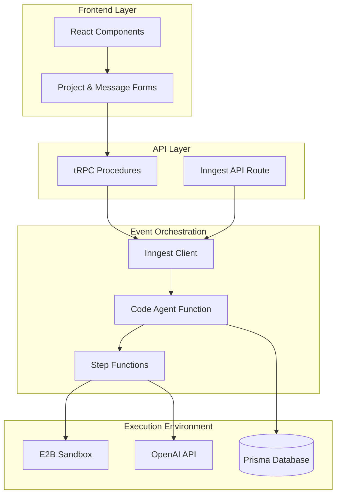

**Diagram sources**
- [src/inngest/client.ts](file://src/inngest/client.ts#L1-L4)
- [src/app/api/inngest/route.ts](file://src/app/api/inngest/route.ts#L1-L12)
- [src/inngest/functions.ts](file://src/inngest/functions.ts#L13-L288)

**Section sources**
- [src/inngest/client.ts](file://src/inngest/client.ts#L1-L4)
- [src/app/api/inngest/route.ts](file://src/app/api/inngest/route.ts#L1-L12)

## Inngest Client Configuration

The Inngest client serves as the central hub for event creation, sending, and receiving within the QAI platform. The configuration establishes a unified identity for all Inngest operations.

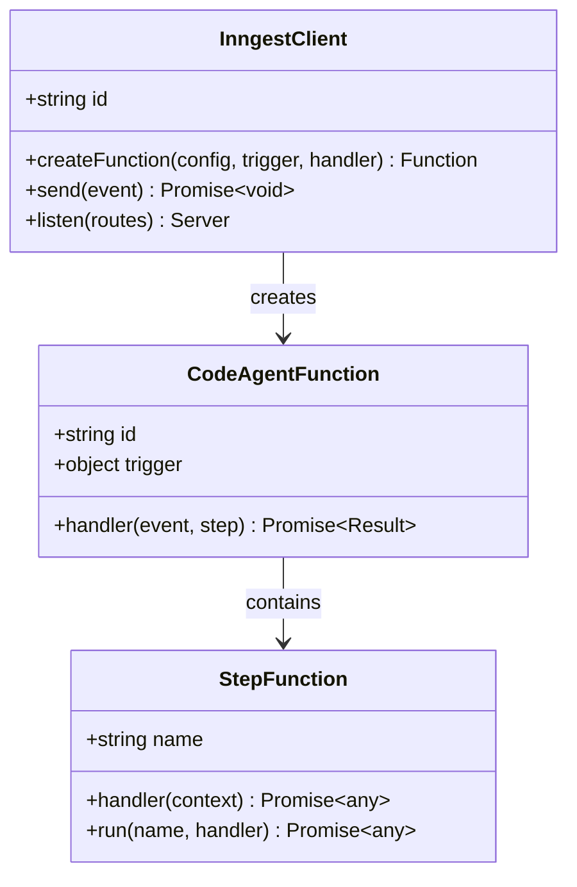

**Diagram sources**
- [src/inngest/client.ts](file://src/inngest/client.ts#L1-L4)
- [src/inngest/functions.ts](file://src/inngest/functions.ts#L13-L288)

The client initialization establishes a unique identifier for the application, enabling proper event routing and function discovery within the Inngest ecosystem.

**Section sources**
- [src/inngest/client.ts](file://src/inngest/client.ts#L1-L4)

## Code Agent Function

The `codeAgentFunction` represents the core orchestration logic for AI-powered code generation workflows. This function implements a sophisticated multi-step process that combines AI reasoning with sandbox execution capabilities.

### Function Structure

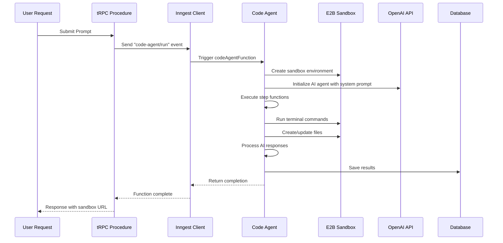

**Diagram sources**
- [src/inngest/functions.ts](file://src/inngest/functions.ts#L13-L288)
- [src/modules/messages/server/procedures.ts](file://src/modules/messages/server/procedures.ts#L40-L55)

### Agent State Management

The agent maintains state through a structured interface that tracks both execution progress and file modifications:

| State Property | Type | Purpose | Description |
|----------------|------|---------|-------------|
| `summary` | `string` | Progress Tracking | Final task summary generated by AI |
| `files` | `{ [path: string]: string }` | File Management | Current state of all managed files |
| `hasFreshSummary` | `boolean` | State Tracking | Indicates if summary has been updated in current iteration |

### Workflow Execution

The function orchestrates a complex workflow through several distinct phases:

1. **Environment Setup**: Creates and manages sandbox instances
2. **Context Loading**: Loads conversation history and project summary
3. **Agent Initialization**: Configures AI agent with system prompts and tools
4. **Network Execution**: Manages multi-agent collaboration with iteration limits
5. **Result Processing**: Handles successful completions and error scenarios
6. **Persistence**: Stores results in database with associated metadata

**Section sources**
- [src/inngest/functions.ts](file://src/inngest/functions.ts#L13-L288)

## Conversation Context Management

The platform has been updated to use new conversation history management APIs that provide enhanced context preservation and summary computation capabilities.

### Context Loading

The `loadProjectConversationContext` function retrieves all necessary context for the AI agent:

```typescript
export async function loadProjectConversationContext(
  projectId: string,
): Promise<LoadConversationContextResult> {
  const [project, messages] = await Promise.all([
    prisma.project.findUnique({
      where: { id: projectId },
      select: { conversationSummary: true },
    }),
    prisma.message.findMany({
      where: { projectId },
      orderBy: { createdAt: "asc" },
      include: { fragment: true },
    }),
  ]);

  const latestFragment = messages
    .map((message) => message.fragment)
    .filter((fragment): fragment is Fragment => Boolean(fragment))
    .at(-1) ?? null;

  const latestUserMessage = [...messages]
    .reverse()
    .find((message) => message.role === "USER") ?? null;

  return {
    projectSummary: project?.conversationSummary ?? null,
    messages,
    latestFragment,
    latestUserMessage,
  };
}
```

This function loads:
- Project-level conversation summary
- Complete message history
- Latest code fragment
- Most recent user message

**Section sources**
- [src/inngest/conversation.ts](file://src/inngest/conversation.ts#L16-L46)

### Conversation Payload Building

The `buildConversationPayload` function constructs a structured prompt with context:

```typescript
export function buildConversationPayload({
  projectSummary,
  messages,
  latestUserMessage,
  userInput,
  historyCharLimit = DEFAULT_HISTORY_CHAR_LIMIT,
}: {
  projectSummary: string | null;
  messages: MessageWithFragment[];
  latestUserMessage: Message | null;
  userInput: string;
  historyCharLimit?: number;
}): string {
  const historyMessages = latestUserMessage
    ? messages.filter((message) => message.id !== latestUserMessage.id)
    : messages;

  const formattedHistory = formatConversationHistory(
    historyMessages,
    historyCharLimit,
  );

  const sections: string[] = [];

  if (projectSummary && projectSummary.trim().length > 0) {
    sections.push(
      `<conversation_summary>\n${projectSummary.trim()}\n</conversation_summary>`,
    );
  }

  if (formattedHistory) {
    sections.push(`<conversation_history>\n${formattedHistory}\n</conversation_history>`);
  }

  sections.push(`<user_request>\n${userInput}\n</user_request>`);

  return sections.join("\n\n");
}
```

The payload includes three key sections:
- `<conversation_summary>`: Project-level summary of previous interactions
- `<conversation_history>`: Recent message history (excluding current request)
- `<user_request>`: Current user input

**Section sources**
- [src/inngest/conversation.ts](file://src/inngest/conversation.ts#L48-L85)

### Rolling Summary Computation

The `computeRollingConversationSummary` function maintains a compact summary of the conversation:

```typescript
export function computeRollingConversationSummary({
  previousSummary,
  userMessage,
  assistantMessage,
  maxLength = DEFAULT_SUMMARY_MAX_LENGTH,
  entryMaxLength = DEFAULT_ENTRY_MAX_LENGTH,
}: {
  previousSummary: string | null;
  userMessage: string;
  assistantMessage: string;
  maxLength?: number;
  entryMaxLength?: number;
}): string {
  const normalizedUser = collapseWhitespace(userMessage).slice(
    0,
    entryMaxLength,
  );
  const normalizedAssistant = collapseWhitespace(
    stripXmlLikeTags(assistantMessage),
  ).slice(0, entryMaxLength);

  const newEntry = `User: ${normalizedUser}\nAssistant: ${normalizedAssistant}`;

  const combined = [previousSummary?.trim(), newEntry]
    .filter((entry): entry is string => Boolean(entry && entry.length > 0))
    .join("\n");

  if (combined.length <= maxLength) {
    return combined;
  }

  const truncated = combined.slice(combined.length - maxLength);
  const firstLineBreak = truncated.indexOf("\n");
  const trimmedTruncated =
    firstLineBreak >= 0 ? truncated.slice(firstLineBreak + 1) : truncated;

  return `[Earlier conversation truncated]\n${trimmedTruncated.trimStart()}`;
}
```

Key features:
- Truncates entries to prevent token overflow
- Maintains rolling window of conversation
- Preserves context with truncation markers
- Handles whitespace normalization
- Strips XML-like tags from assistant messages

**Section sources**
- [src/inngest/conversation.ts](file://src/inngest/conversation.ts#L87-L124)

## Event Payload Schema

The event payload schema defines the contract between tRPC procedures and Inngest functions, ensuring consistent data flow throughout the system.

### Standard Event Structure

| Field | Type | Required | Description |
|-------|------|----------|-------------|
| `name` | `string` | Yes | Event identifier ("code-agent/run") |
| `data` | `object` | Yes | Event payload containing context |
| `data.value` | `string` | Yes | User prompt or instruction |
| `data.projectId` | `string` | Yes | Associated project identifier |

### Payload Validation

The system employs Zod schema validation to ensure payload integrity:

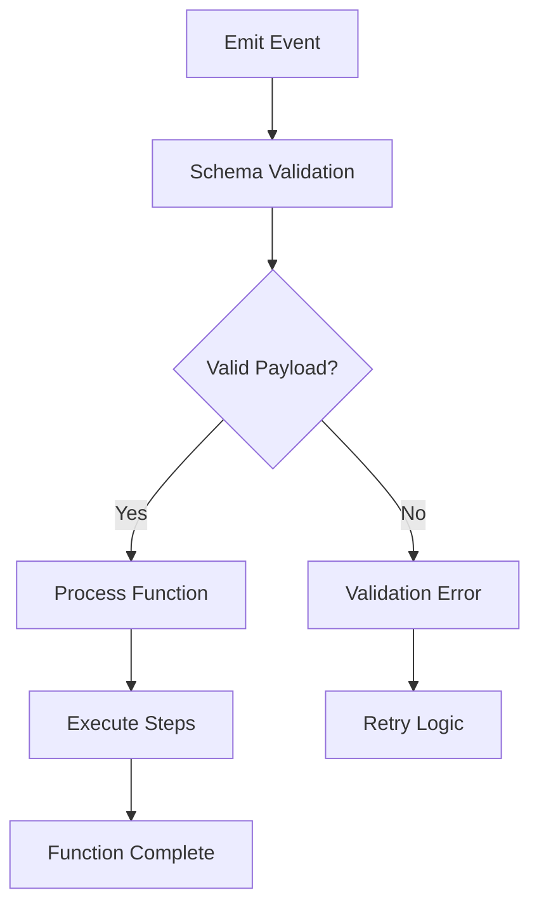

**Diagram sources**
- [src/modules/messages/server/procedures.ts](file://src/modules/messages/server/procedures.ts#L40-L55)
- [src/modules/projects/server/procedures.ts](file://src/modules/projects/server/procedures.ts#L55-L70)

**Section sources**
- [src/modules/messages/server/procedures.ts](file://src/modules/messages/server/procedures.ts#L40-L55)
- [src/modules/projects/server/procedures.ts](file://src/modules/projects/server/procedures.ts#L55-L70)

## Tool Integration

The code agent integrates with multiple specialized tools that extend its capabilities for file manipulation, terminal execution, and system interaction.

### Terminal Tool

The terminal tool provides secure command execution within the sandbox environment:

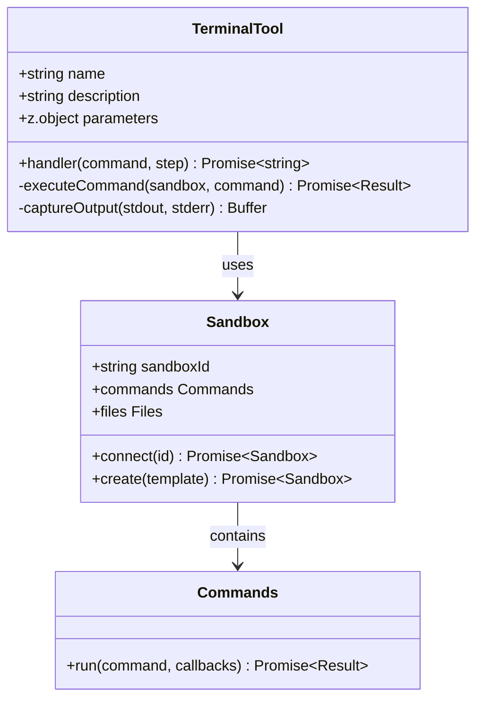

**Diagram sources**
- [src/inngest/functions.ts](file://src/inngest/functions.ts#L25-L60)

### File Operations Tool

The file operations tool manages the sandbox filesystem with atomic updates:

| Operation | Purpose | Safety Features |
|-----------|---------|-----------------|
| `createOrUpdateFiles` | Write or update files | Atomic batch operations |
| `readFiles` | Read file contents | Path validation |
| `write` | Direct file write | Sandbox isolation |

### Network Tool Integration

The agent utilizes a network tool for collaborative reasoning and state management across multiple agents.

**Section sources**
- [src/inngest/functions.ts](file://src/ngest/functions.ts#L25-L120)

## Sandbox Management

The platform leverages E2B (Execute in Browser) sandboxes to provide isolated, reproducible environments for AI agent execution.

### Sandbox Lifecycle

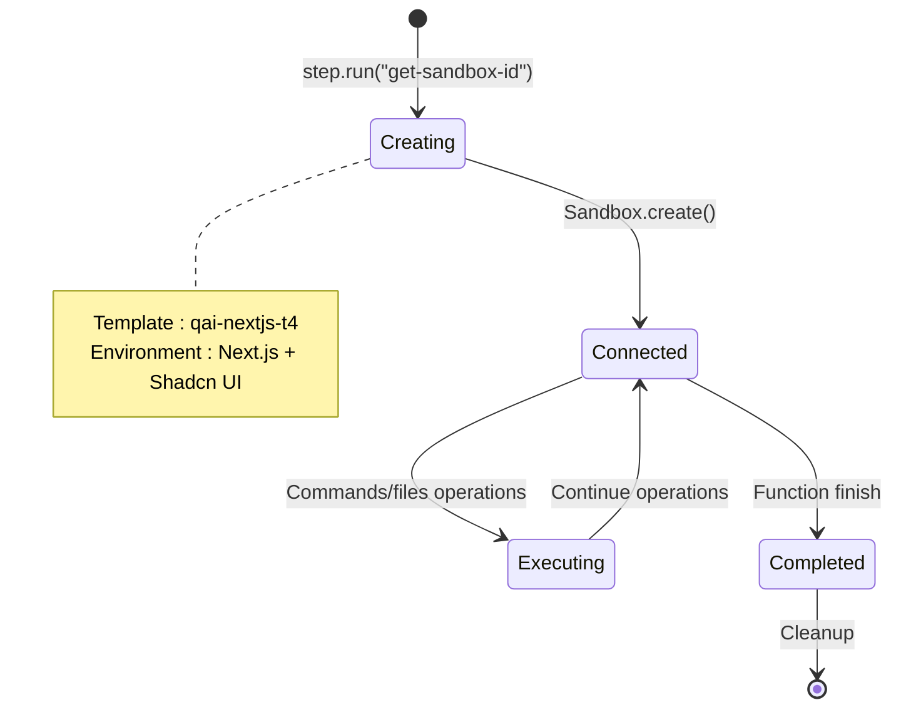

**Diagram sources**
- [src/inngest/functions.ts](file://src/inngest/functions.ts#L15-L20)
- [src/inngest/utils.ts](file://src/inngest/utils.ts#L4-L6)

### Template Configuration

The sandbox template is configured for optimal AI agent performance:

| Configuration | Value | Purpose |
|---------------|-------|---------|
| Template ID | `qai-nextjs-t4` | Pre-configured Next.js environment |
| Dockerfile | Custom | Optimized for AI workloads |
| Startup Command | `npx next dev --turbopack` | Hot-reload development server |
| Compilation Script | `compile_page.sh` | Automated page compilation |

### Environment Isolation

Each sandbox provides complete isolation while maintaining essential development tools:

- **File System**: Full read/write access within sandbox boundaries
- **Networking**: Controlled internet access for package installations
- **Resource Limits**: CPU and memory constraints for safety
- **Cleanup**: Automatic termination after function completion

**Section sources**
- [src/inngest/functions.ts](file://src/inngest/functions.ts#L15-L20)
- [src/inngest/utils.ts](file://src/inngest/utils.ts#L4-L6)
- [sandbox-templates/nextjs/e2b.toml](file://sandbox-templates/nextjs/e2b.toml#L1-L16)
- [sandbox-templates/nextjs/compile_page.sh](file://sandbox-templates/nextjs/compile_page.sh#L1-L19)

## Error Handling and Retry Mechanisms

The platform implements comprehensive error handling and retry strategies to ensure reliable operation across all system components.

### Function-Level Error Handling

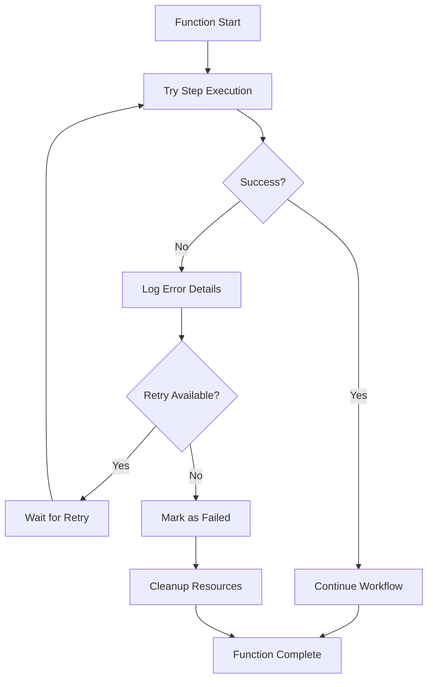

**Diagram sources**
- [src/inngest/functions.ts](file://src/inngest/functions.ts#L50-L60)
- [src/inngest/functions.ts](file://src/inngest/functions.ts#L100-L110)

### Error Classification

The system handles various error categories with specific recovery strategies:

| Error Type | Handling Strategy | Recovery Action |
|------------|-------------------|-----------------|
| Sandbox Connection | Retry with exponential backoff | Re-create sandbox |
| AI Model Failure | Fallback to previous state | Resume from checkpoint |
| File System Error | Atomic rollback | Restore previous state |
| Network Timeout | Circuit breaker pattern | Fail fast with notification |

### Retry Configuration

Inngest provides built-in retry mechanisms with configurable policies:

- **Default Retries**: 3 attempts with exponential backoff
- **Timeout Handling**: 30-second step timeouts
- **Circuit Breaker**: Automatic failure detection
- **Dead Letter Queue**: Persistent error handling

**Section sources**
- [src/inngest/functions.ts](file://src/inngest/functions.ts#L50-L60)
- [src/inngest/functions.ts](file://src/inngest/functions.ts#L100-L110)

## tRPC Integration

The platform seamlessly integrates Inngest with tRPC procedures to provide a cohesive API layer for user interactions.

### Event Emission Pattern

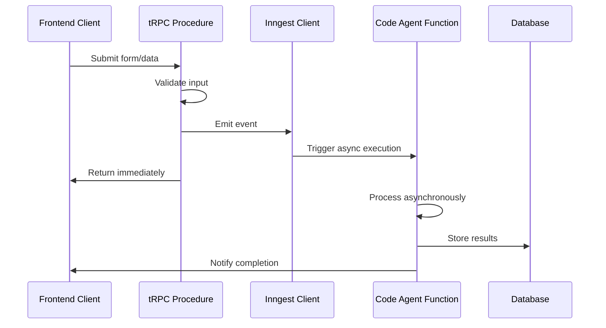

**Diagram sources**
- [src/modules/messages/server/procedures.ts](file://src/modules/messages/server/procedures.ts#L40-L55)
- [src/modules/projects/server/procedures.ts](file://src/modules/projects/server/procedures.ts#L55-L70)

### Procedure Implementation

Both message and project procedures follow identical patterns for event emission:

| Component | Responsibility | Implementation Details |
|-----------|----------------|------------------------|
| Input Validation | Zod schema validation | Character limits, required fields |
| Database Persistence | Immediate storage | User feedback provision |
| Event Emission | Asynchronous triggering | Inngest.send() with payload |
| Response Handling | Immediate return | User interface responsiveness |

### Asynchronous Processing Benefits

The tRPC-Inngest integration provides several advantages:

- **Immediate Response**: User receives immediate acknowledgment
- **Scalable Workflows**: Long-running tasks don't block API endpoints
- **Error Resilience**: Failed executions don't impact API availability
- **Resource Efficiency**: Parallel processing of multiple requests

**Section sources**
- [src/modules/messages/server/procedures.ts](file://src/modules/messages/server/procedures.ts#L40-L55)
- [src/modules/projects/server/procedures.ts](file://src/modules/projects/server/procedures.ts#L55-L70)

## Webhook Configuration

The platform exposes Inngest webhooks through a dedicated API route that handles function invocations and event processing.

### Route Configuration

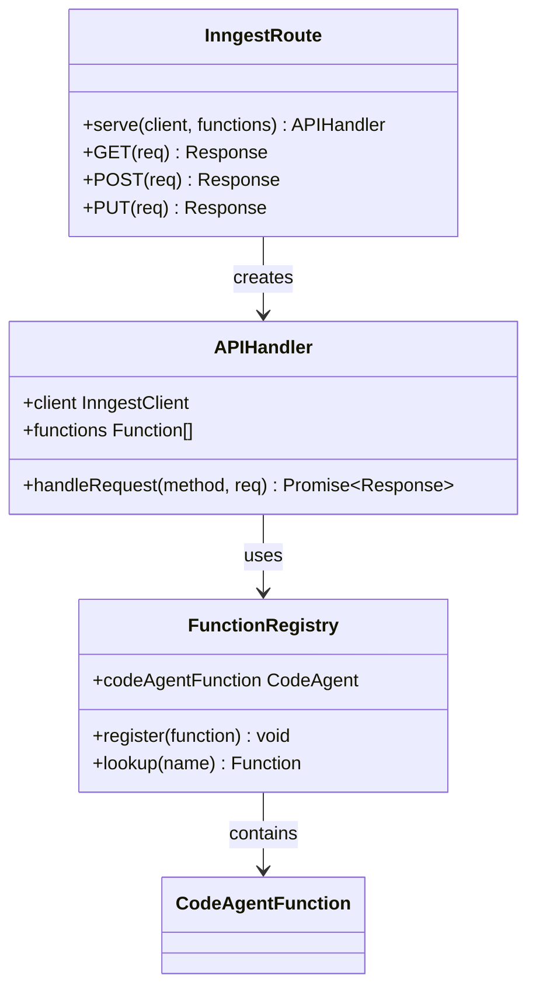

**Diagram sources**
- [src/app/api/inngest/route.ts](file://src/app/api/inngest/route.ts#L1-L12)

### Endpoint Capabilities

The webhook endpoint supports standard HTTP methods for Inngest integration:

| Method | Purpose | Usage |
|--------|---------|-------|
| GET | Health check | Verify endpoint availability |
| POST | Function invocation | Trigger Inngest functions |
| PUT | Event processing | Handle external events |

### Security Considerations

The webhook implementation includes several security measures:

- **Authentication**: Inngest-managed authentication tokens
- **Rate Limiting**: Built-in rate limiting for abuse prevention
- **Payload Validation**: Automatic schema validation
- **CORS Policy**: Proper cross-origin resource sharing

**Section sources**
- [src/app/api/inngest/route.ts](file://src/app/api/inngest/route.ts#L1-L12)

## Observability and Monitoring

The platform provides comprehensive observability through Inngest's built-in monitoring capabilities and custom logging infrastructure.

### Dashboard Integration

Inngest offers a comprehensive dashboard for monitoring function execution:

- **Execution Traces**: Detailed step-by-step execution logs
- **Performance Metrics**: Response times and throughput analytics
- **Error Tracking**: Automatic error categorization and alerting
- **Resource Usage**: Memory and CPU utilization monitoring

### Logging Strategy

The system implements structured logging for operational insights:

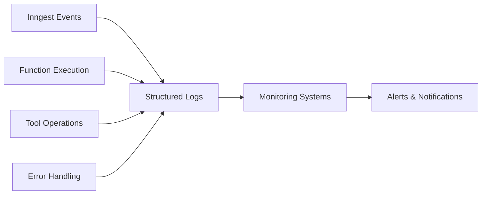

**Diagram sources**
- [src/inngest/functions.ts](file://src/inngest/functions.ts#L50-L60)
- [src/inngest/functions.ts](file://src/inngest/functions.ts#L100-L110)

### Key Metrics

Important metrics tracked for system health:

| Metric Category | Key Indicators | Monitoring Purpose |
|-----------------|----------------|-------------------|
| Function Performance | Execution time, success rate | Operational efficiency |
| Resource Utilization | Sandbox usage, memory consumption | Capacity planning |
| Error Rates | Failure percentage, error types | Quality assurance |
| User Experience | Response latency, completion rate | Customer satisfaction |

**Section sources**
- [src/inngest/functions.ts](file://src/inngest/functions.ts#L50-L60)
- [src/inngest/functions.ts](file://src/inngest/functions.ts#L100-L110)

## Best Practices

### Writing Resilient Event Functions

1. **Implement Comprehensive Error Handling**: Always wrap critical operations in try-catch blocks
2. **Use Atomic Operations**: Ensure state changes are either fully completed or completely rolled back
3. **Implement Timeout Controls**: Set reasonable timeouts for long-running operations
4. **Provide Clear Logging**: Include contextual information for debugging

### Debugging Strategies

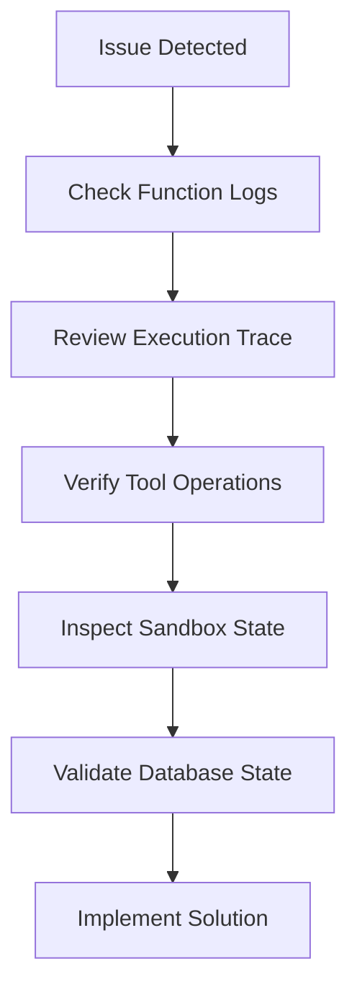

### Performance Optimization

- **Parallel Execution**: Use Inngest's step parallelization capabilities
- **Resource Management**: Properly cleanup sandbox resources
- **Caching Strategies**: Cache expensive operations where possible
- **Batch Operations**: Group related operations for efficiency

### Testing Approaches

- **Unit Testing**: Test individual steps and tools
- **Integration Testing**: Verify end-to-end workflows
- **Load Testing**: Simulate high-concurrency scenarios
- **Error Scenario Testing**: Validate error handling paths

## Extending the Agent

The platform's architecture supports easy extension of the AI agent with new tools and capabilities.

### Adding New Tools

To add a new tool to the agent:

1. **Define Tool Interface**: Create Zod schema for parameters
2. **Implement Handler Logic**: Define tool execution behavior
3. **Integrate with Agent**: Add tool to agent configuration
4. **Test Integration**: Verify tool works within workflow

### Custom Tool Example Pattern

```typescript
// Example pattern for adding new tools
createTool({
  name: "customTool",
  description: "Custom tool description",
  parameters: z.object({
    // Define parameters
  }),
  handler: async ({ params }, { step }) => {
    return await step?.run("custom-tool", async () => {
      // Implementation logic
      return result;
    });
  },
})
```

### System Prompt Extension

The system prompt can be extended to incorporate new capabilities:

- **New Constraints**: Add domain-specific rules
- **Tool Descriptions**: Update tool documentation
- **Example Patterns**: Include new interaction examples
- **Safety Guidelines**: Reinforce security measures

**Section sources**
- [src/inngest/functions.ts](file://src/inngest/functions.ts#L25-L120)
- [src/prompt.ts](file://src/prompt.ts#L1-L114)

## Troubleshooting Guide

### Common Issues and Solutions

#### Sandbox Connection Failures

**Symptoms**: Sandbox creation fails or times out
**Causes**: Resource constraints, template issues
**Solutions**: 
- Check sandbox template configuration
- Verify E2B service availability
- Monitor resource usage

#### AI Model Integration Issues

**Symptoms**: Agent fails to process prompts
**Causes**: API rate limits, authentication failures
**Solutions**:
- Verify OpenAI API credentials
- Implement rate limiting
- Add fallback mechanisms

#### Event Delivery Problems

**Symptoms**: Events not triggering functions
**Causes**: Webhook misconfiguration, authentication issues
**Solutions**:
- Verify webhook endpoint accessibility
- Check Inngest authentication tokens
- Review event payload structure

### Diagnostic Tools

1. **Inngest Dashboard**: Monitor function execution and errors
2. **Console Logging**: Enable detailed logging for debugging
3. **Health Checks**: Implement endpoint monitoring
4. **Error Tracking**: Integrate with error monitoring services

### Performance Tuning

- **Optimize Step Functions**: Minimize step execution time
- **Resource Allocation**: Adjust sandbox resource limits
- **Caching Strategies**: Implement intelligent caching
- **Parallel Processing**: Leverage Inngest's parallel execution

**Section sources**
- [src/inngest/functions.ts](file://src/inngest/functions.ts#L50-L60)
- [src/inngest/functions.ts](file://src/inngest/functions.ts#L100-L110)