# tRPC API Layer Architecture Documentation

<cite>
**Referenced Files in This Document**
- [src/app/api/trpc/[trpc]/route.ts](file://src/app/api/trpc/[trpc]/route.ts)
- [src/trpc/init.ts](file://src/trpc/init.ts)
- [src/trpc/routers/_app.ts](file://src/trpc/routers/_app.ts)
- [src/trpc/client.tsx](file://src/trpc/client.tsx)
- [src/trpc/server.tsx](file://src/trpc/server.tsx)
- [src/trpc/query-client.ts](file://src/trpc/query-client.ts)
- [src/modules/projects/server/procedures.ts](file://src/modules/projects/server/procedures.ts)
- [src/modules/messages/server/procedures.ts](file://src/modules/messages/server/procedures.ts)
- [src/lib/db.ts](file://src/lib/db.ts)
- [package.json](file://package.json)
</cite>

## Table of Contents
1. [Introduction](#introduction)
2. [Architecture Overview](#architecture-overview)
3. [Core tRPC Infrastructure](#core-trpc-infrastructure)
4. [Routing Structure and Composition](#routing-structure-and-composition)
5. [Type Safety and Shared Interfaces](#type-safety-and-shared-interfaces)
6. [Next.js App Router Integration](#nextjs-app-router-integration)
7. [Input Validation with Zod](#input-validation-with-zod)
8. [Data Serialization with SuperJSON](#data-serialization-with-superjson)
9. [Request Lifecycle](#request-lifecycle)
10. [CRUD Patterns and Error Handling](#crud-patterns-and-error-handling)
11. [Security and Authentication Context](#security-and-authentication-context)
12. [Extending the Router](#extending-the-router)
13. [Best Practices and Organization](#best-practices-and-organization)
14. [Performance Considerations](#performance-considerations)
15. [Troubleshooting Guide](#troubleshooting-guide)

## Introduction

The QAI platform implements a sophisticated tRPC (TypeScript RPC) API layer that provides end-to-end type safety between the frontend and backend through shared TypeScript interfaces. This architecture eliminates the traditional API contract mismatch problem by generating type-safe client-server communication automatically.

The tRPC implementation in QAI follows modern Next.js patterns with App Router integration, leveraging React Server Components, Streaming SSR, and concurrent rendering capabilities. The system demonstrates advanced patterns for modular router composition, input validation, data serialization, and error handling while maintaining clean separation of concerns.

## Architecture Overview

The tRPC API layer in QAI follows a layered architecture that seamlessly integrates with Next.js App Router:

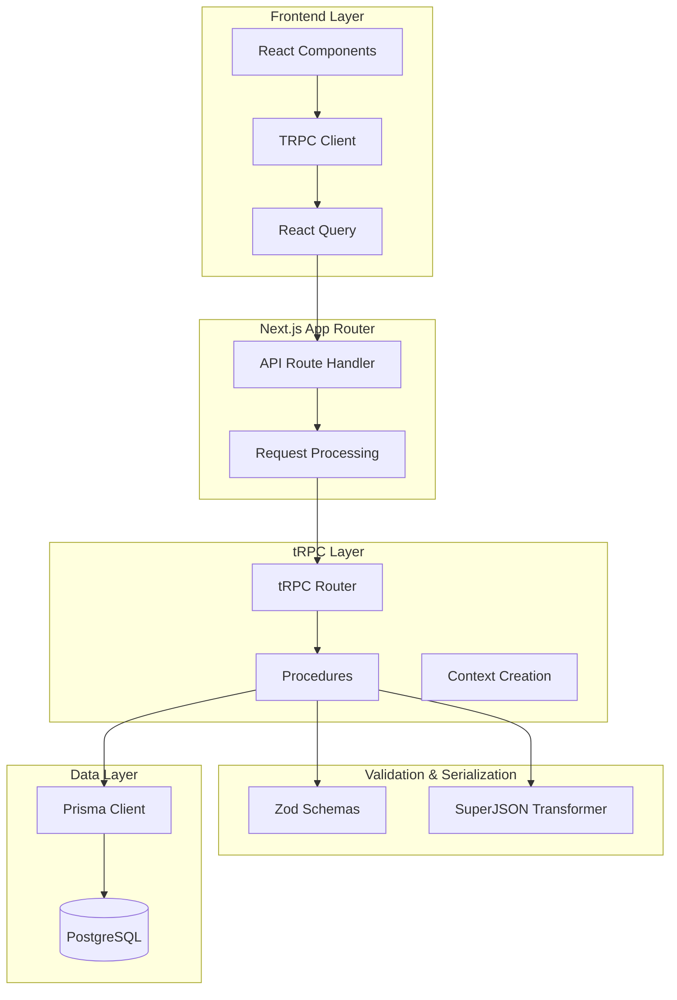

**Diagram sources**
- [src/app/api/trpc/[trpc]/route.ts](file://src/app/api/trpc/[trpc]/route.ts#L1-L11)
- [src/trpc/init.ts](file://src/trpc/init.ts#L1-L22)
- [src/trpc/routers/_app.ts](file://src/trpc/routers/_app.ts#L1-L9)

**Section sources**
- [src/app/api/trpc/[trpc]/route.ts](file://src/app/api/trpc/[trpc]/route.ts#L1-L11)
- [src/trpc/init.ts](file://src/trpc/init.ts#L1-L22)

## Core tRPC Infrastructure

The foundation of the tRPC architecture is built around several key components that provide type safety, data transformation, and procedure composition:

### tRPC Initialization and Configuration

The tRPC system is initialized with shared configuration across the entire application:

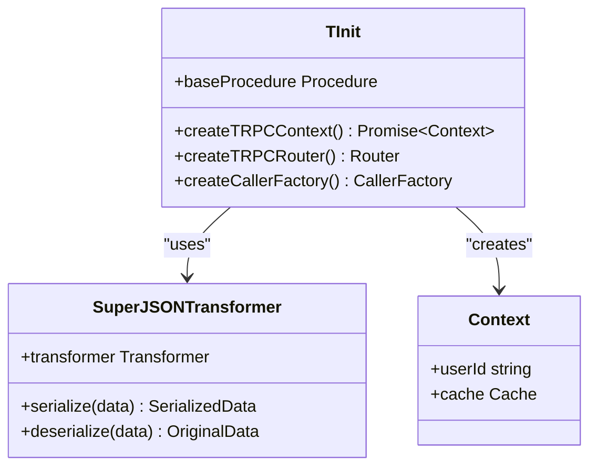

**Diagram sources**
- [src/trpc/init.ts](file://src/trpc/init.ts#L1-L22)

The initialization process establishes:
- **Shared Transformer**: SuperJSON for handling complex data types
- **Context Factory**: Caching mechanism for efficient context creation
- **Base Procedure**: Foundation for all tRPC procedures
- **Router Factory**: Modular router composition capability

**Section sources**
- [src/trpc/init.ts](file://src/trpc/init.ts#L1-L22)

### Type System Integration

The tRPC infrastructure provides comprehensive type safety through:
- **Automatic Type Generation**: Procedures automatically generate client-side types
- **Shared Schema Definitions**: Zod schemas are shared between client and server
- **Response Type Inference**: Automatic inference of return types
- **Error Type Safety**: Structured error handling with typed error responses

## Routing Structure and Composition

The QAI platform implements a modular router architecture that promotes code organization and maintainability:

### Application Router Composition

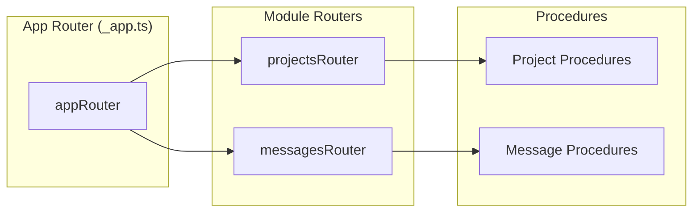

**Diagram sources**
- [src/trpc/routers/_app.ts](file://src/trpc/routers/_app.ts#L1-L9)
- [src/modules/projects/server/procedures.ts](file://src/modules/projects/server/procedures.ts#L1-L71)
- [src/modules/messages/server/procedures.ts](file://src/modules/messages/server/procedures.ts#L1-L55)

### Router Composition Pattern

The modular router structure allows for:
- **Feature-Based Organization**: Each module maintains its own procedures
- **Namespace Isolation**: Clean separation between different API domains
- **Scalable Architecture**: Easy addition of new modules and procedures
- **Type Safety**: Complete type inference across composed routers

**Section sources**
- [src/trpc/routers/_app.ts](file://src/trpc/routers/_app.ts#L1-L9)
- [src/modules/projects/server/procedures.ts](file://src/modules/projects/server/procedures.ts#L1-L71)
- [src/modules/messages/server/procedures.ts](file://src/modules/messages/server/procedures.ts#L1-L55)

## Type Safety and Shared Interfaces

The tRPC implementation ensures end-to-end type safety through several mechanisms:

### Shared TypeScript Interfaces

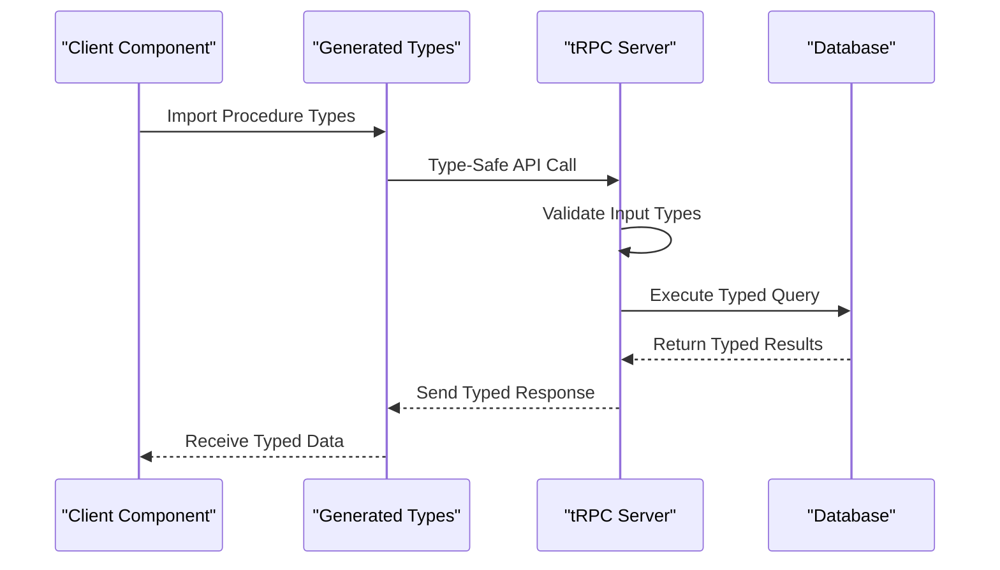

**Diagram sources**
- [src/trpc/client.tsx](file://src/trpc/client.tsx#L1-L59)
- [src/trpc/server.tsx](file://src/trpc/server.tsx#L1-L14)

### Type Generation Benefits

- **Compile-Time Safety**: Type errors caught before runtime
- **IDE Autocompletion**: Enhanced developer experience
- **Refactoring Safety**: Automatic updates across the stack
- **Documentation**: Generated type definitions serve as API documentation

**Section sources**
- [src/trpc/client.tsx](file://src/trpc/client.tsx#L1-L59)
- [src/trpc/server.tsx](file://src/trpc/server.tsx#L1-L14)

## Next.js App Router Integration

The tRPC API layer is seamlessly integrated with Next.js App Router through a dedicated API route handler:

### API Route Handler Implementation

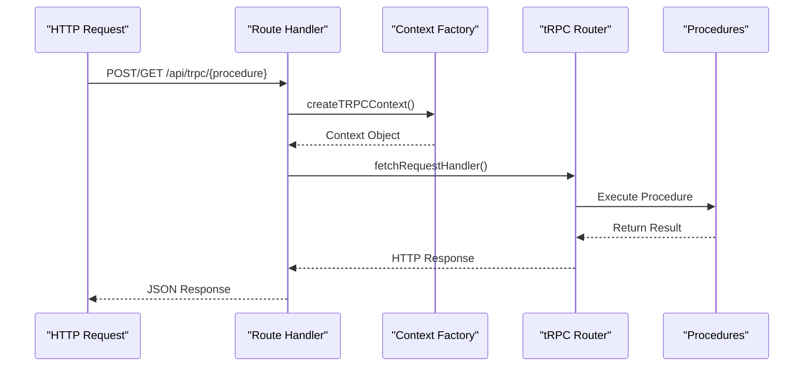

**Diagram sources**
- [src/app/api/trpc/[trpc]/route.ts](file://src/app/api/trpc/[trpc]/route.ts#L1-L11)

### Integration Features

The integration provides:
- **Streaming SSR Support**: Compatible with Next.js streaming capabilities
- **Concurrent Rendering**: Full support for React 19 concurrent features
- **Server Actions**: Seamless integration with Next.js server actions
- **Middleware Compatibility**: Works with Next.js middleware ecosystem

**Section sources**
- [src/app/api/trpc/[trpc]/route.ts](file://src/app/api/trpc/[trpc]/route.ts#L1-L11)

## Input Validation with Zod

The QAI platform uses Zod for comprehensive input validation within tRPC procedures:

### Validation Schema Patterns

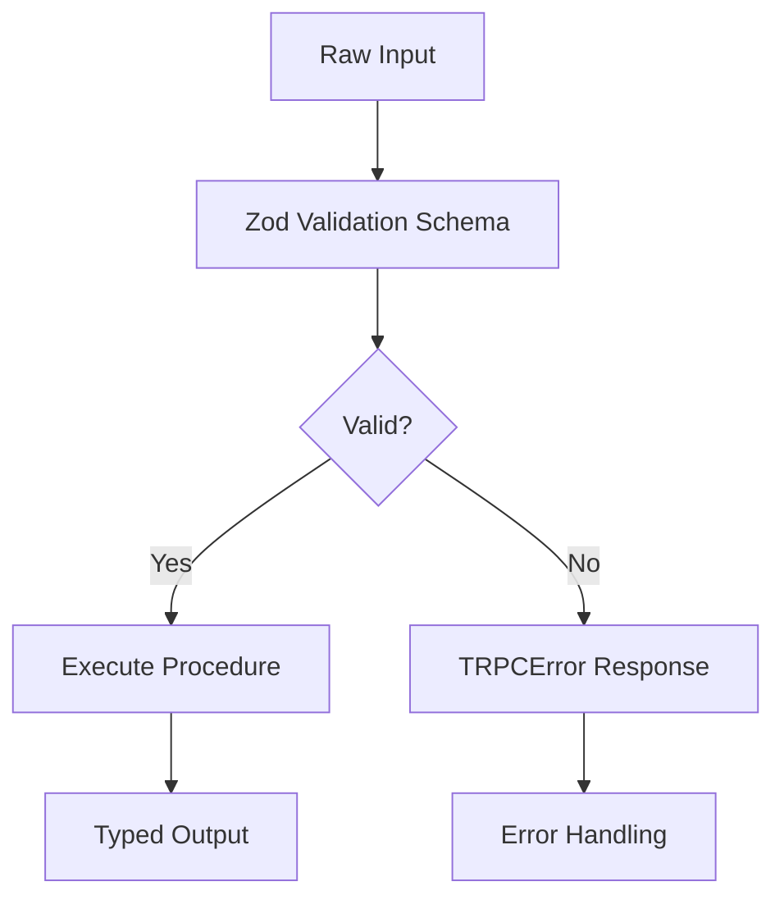

**Diagram sources**
- [src/modules/projects/server/procedures.ts](file://src/modules/projects/server/procedures.ts#L25-L35)
- [src/modules/messages/server/procedures.ts](file://src/modules/messages/server/procedures.ts#L15-L25)

### Validation Implementation Examples

The projects module demonstrates robust input validation:
- **Required Field Validation**: Ensures essential fields are present
- **Length Constraints**: Validates string length limits
- **Custom Error Messages**: Provides user-friendly error feedback
- **Nested Object Validation**: Handles complex input structures

**Section sources**
- [src/modules/projects/server/procedures.ts](file://src/modules/projects/server/procedures.ts#L25-L35)
- [src/modules/messages/server/procedures.ts](file://src/modules/messages/server/procedures.ts#L15-L25)

## Data Serialization with SuperJSON

SuperJSON provides advanced data serialization capabilities for handling complex JavaScript types:

### Serialization Pipeline

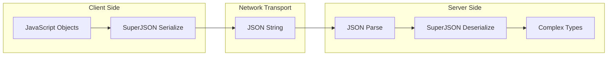

**Diagram sources**
- [src/trpc/init.ts](file://src/trpc/init.ts#L1-L22)
- [src/trpc/query-client.ts](file://src/trpc/query-client.ts#L1-L22)

### Supported Data Types

SuperJSON handles:
- **Date Objects**: Proper serialization of Date instances
- **BigInt Values**: Safe handling of large integers
- **Map and Set Objects**: Complex collection types
- **Error Objects**: Custom error serialization
- **Undefined Values**: Proper handling of undefined properties

**Section sources**
- [src/trpc/init.ts](file://src/trpc/init.ts#L1-L22)
- [src/trpc/query-client.ts](file://src/trpc/query-client.ts#L1-L22)

## Request Lifecycle

Understanding the complete request lifecycle helps developers optimize and debug tRPC applications:

### Complete Request Flow

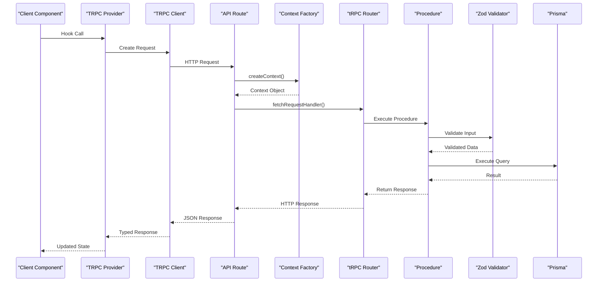

**Diagram sources**
- [src/app/api/trpc/[trpc]/route.ts](file://src/app/api/trpc/[trpc]/route.ts#L1-L11)
- [src/trpc/client.tsx](file://src/trpc/client.tsx#L28-L59)

### Lifecycle Stages

1. **Client Request**: React component triggers tRPC query
2. **Request Preparation**: Client library prepares HTTP request
3. **Context Creation**: Server creates execution context
4. **Request Handling**: tRPC router processes the request
5. **Input Validation**: Zod validates incoming data
6. **Procedure Execution**: Business logic executes
7. **Response Serialization**: SuperJSON serializes results
8. **Client Response**: Typed response returned to client

**Section sources**
- [src/app/api/trpc/[trpc]/route.ts](file://src/app/api/trpc/[trpc]/route.ts#L1-L11)
- [src/trpc/client.tsx](file://src/trpc/client.tsx#L28-L59)

## CRUD Patterns and Error Handling

The QAI platform demonstrates comprehensive CRUD patterns with robust error handling:

### CRUD Implementation Patterns

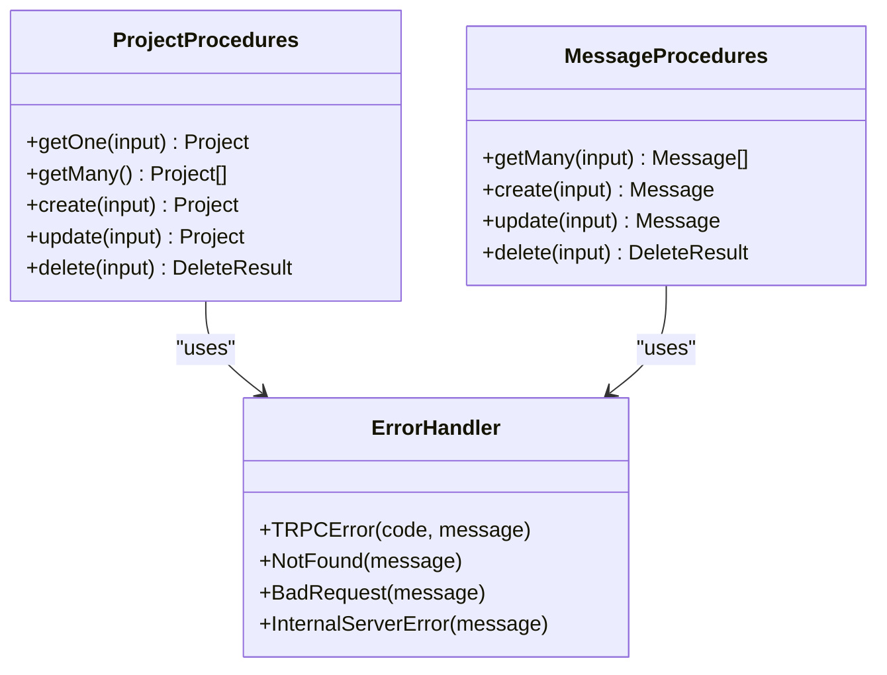

**Diagram sources**
- [src/modules/projects/server/procedures.ts](file://src/modules/projects/server/procedures.ts#L8-L71)
- [src/modules/messages/server/procedures.ts](file://src/modules/messages/server/procedures.ts#L5-L55)

### Error Handling Strategies

The platform implements structured error handling:
- **TRPCError**: Standardized error responses with codes
- **Not Found Handling**: Clear 404 responses for missing resources
- **Validation Errors**: Descriptive validation failure messages
- **Internal Server Errors**: Graceful handling of unexpected failures

**Section sources**
- [src/modules/projects/server/procedures.ts](file://src/modules/projects/server/procedures.ts#L15-L25)
- [src/modules/projects/server/procedures.ts](file://src/modules/projects/server/procedures.ts#L50-L60)

## Security and Authentication Context

The tRPC context system provides a foundation for authentication and authorization:

### Context Injection Pattern

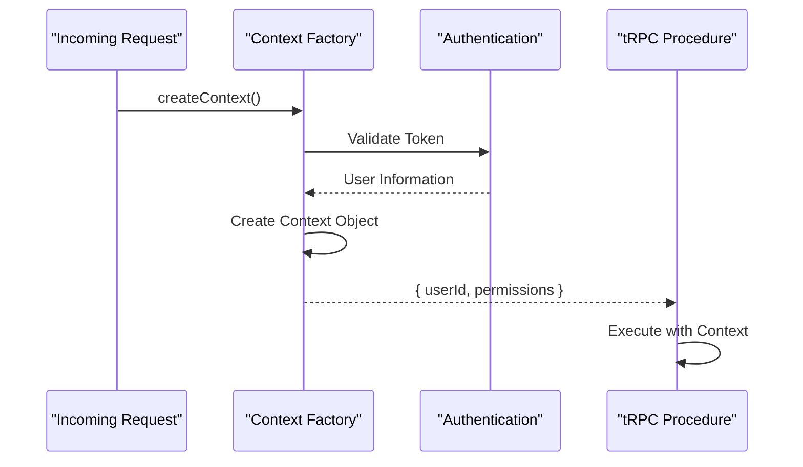

**Diagram sources**
- [src/trpc/init.ts](file://src/trpc/init.ts#L4-L8)

### Authentication Context Implementation

The current implementation provides:
- **Cached Context Creation**: Efficient context reuse across requests
- **User Identity**: Basic user identification (`userId: 'user_123'`)
- **Future Extensibility**: Ready for authentication middleware
- **Server-Side Only**: Secure context creation prevents client access

**Section sources**
- [src/trpc/init.ts](file://src/trpc/init.ts#L4-L8)

## Extending the Router

Adding new endpoints to the tRPC router follows established patterns:

### Adding New Module Procedures

To extend the router with new functionality:
1. **Create Module Procedures**: Define procedures in a dedicated file
2. **Import into Router**: Add the module router to the app router
3. **Export Types**: Ensure type definitions are exported
4. **Test Integration**: Verify type safety and functionality

### Example Extension Pattern

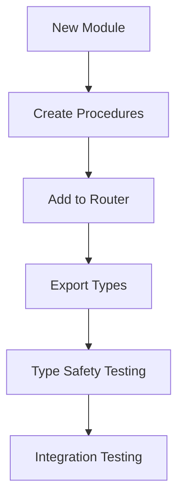

**Diagram sources**
- [src/trpc/routers/_app.ts](file://src/trpc/routers/_app.ts#L1-L9)

**Section sources**
- [src/trpc/routers/_app.ts](file://src/trpc/routers/_app.ts#L1-L9)

## Best Practices and Organization

The QAI platform demonstrates several best practices for tRPC router organization:

### Modular Architecture Principles

- **Single Responsibility**: Each module focuses on a specific domain
- **Clear Boundaries**: Well-defined interfaces between modules
- **Consistent Patterns**: Uniform approach across all modules
- **Type Safety First**: Prioritize type safety in all designs

### Code Organization Guidelines

- **Separation of Concerns**: Distinct files for procedures, types, and schemas
- **Naming Conventions**: Consistent naming for procedures and routes
- **Error Handling**: Centralized error handling patterns
- **Documentation**: Inline documentation for complex procedures

**Section sources**
- [src/modules/projects/server/procedures.ts](file://src/modules/projects/server/procedures.ts#L1-L71)
- [src/modules/messages/server/procedures.ts](file://src/modules/messages/server/procedures.ts#L1-L55)

## Performance Considerations

The tRPC implementation includes several performance optimizations:

### Caching Strategies

- **Context Caching**: React's `cache` decorator for efficient context creation
- **Query Client Caching**: React Query for intelligent caching
- **Connection Pooling**: Efficient database connection management
- **Serialization Optimization**: SuperJSON for efficient data transfer

### Optimization Techniques

- **Batch Requests**: HTTP batch links for reduced network overhead
- **Selective Queries**: Granular data fetching patterns
- **Server-Side Caching**: Appropriate caching strategies
- **Lazy Loading**: On-demand procedure loading

**Section sources**
- [src/trpc/init.ts](file://src/trpc/init.ts#L4-L8)
- [src/trpc/query-client.ts](file://src/trpc/query-client.ts#L1-L22)

## Troubleshooting Guide

Common issues and solutions for tRPC development:

### Type Safety Issues

**Problem**: Type mismatches between client and server
**Solution**: Ensure proper type exports and rebuild the application

**Problem**: Missing type definitions
**Solution**: Verify router exports and regenerate types

### Runtime Errors

**Problem**: Context creation failures
**Solution**: Check authentication middleware and context factory

**Problem**: Serialization errors
**Solution**: Verify SuperJSON transformer configuration

### Performance Issues

**Problem**: Slow procedure execution
**Solution**: Optimize database queries and add appropriate indexing

**Problem**: Network latency
**Solution**: Implement batching and caching strategies

**Section sources**
- [src/trpc/init.ts](file://src/trpc/init.ts#L1-L22)
- [src/trpc/query-client.ts](file://src/trpc/query-client.ts#L1-L22)