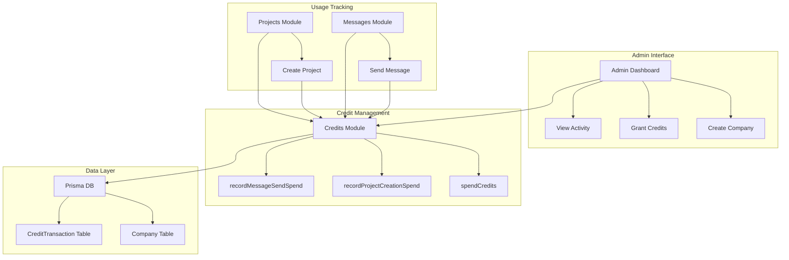
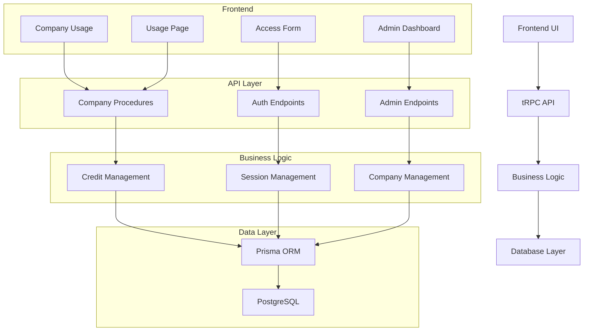
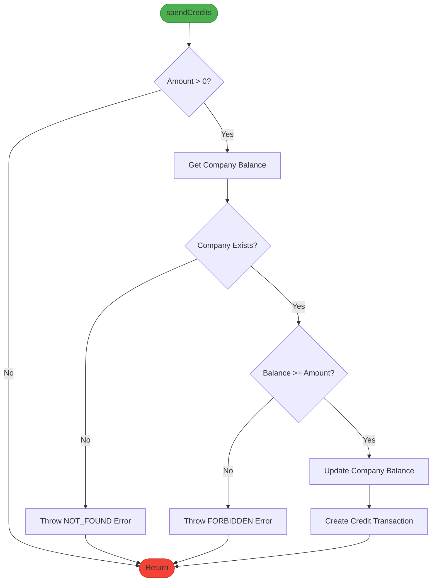
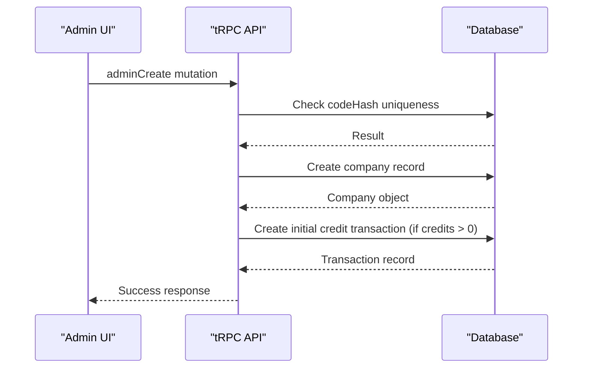
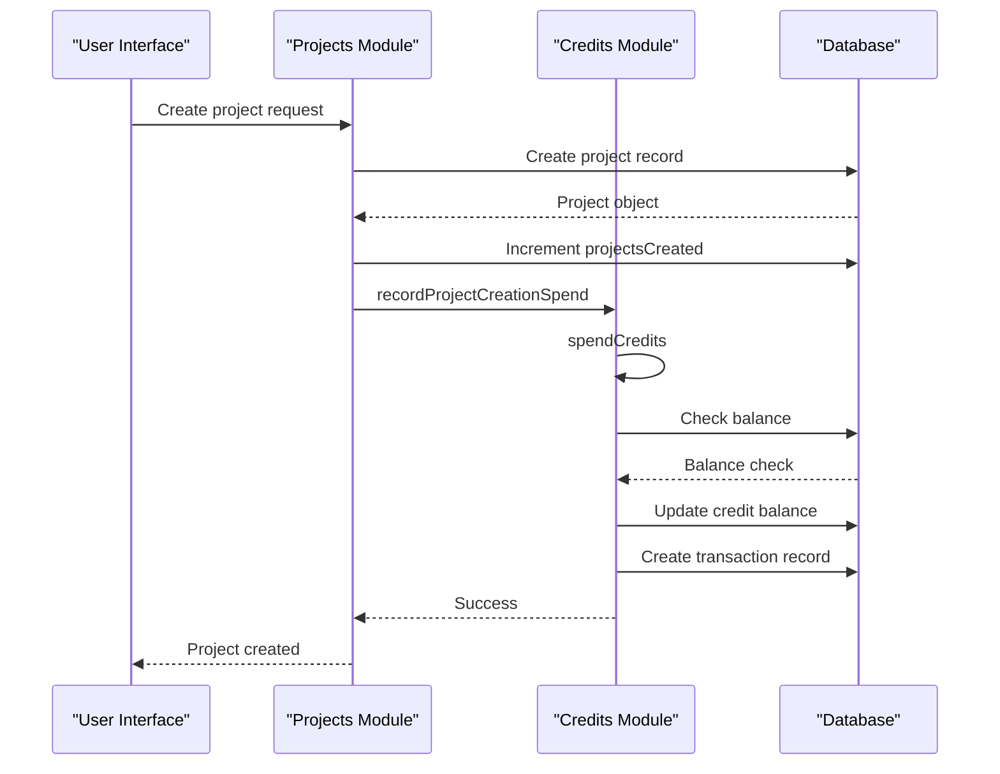
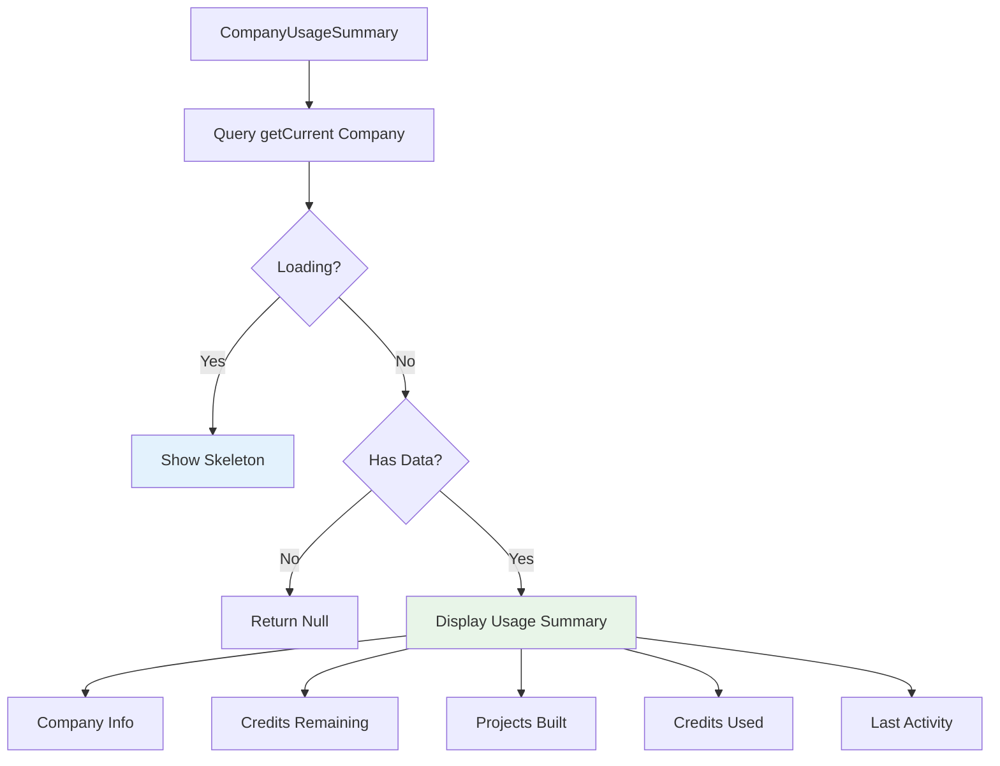
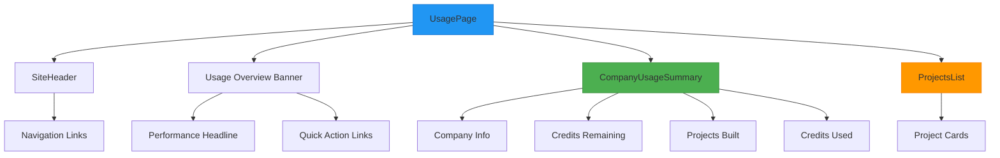

# Company Credit Management

<cite>
**Referenced Files in This Document**   
- [credits.ts](file://src/modules/companies/server/credits.ts)
- [procedures.ts](file://src/modules/companies/server/procedures.ts)
- [admin-dashboard.tsx](file://src/modules/admin/ui/admin-dashboard.tsx)
- [company-usage.tsx](file://src/modules/home/ui/components/company-usage.tsx)
- [db.ts](file://src/lib/db.ts)
- [auth.ts](file://src/lib/auth.ts)
- [env.ts](file://src/lib/env.ts)
- [projects/procedures.ts](file://src/modules/projects/server/procedures.ts)
- [messages/procedures.ts](file://src/modules/messages/server/procedures.ts)
- [route.ts](file://src/app/api/admin/login/route.ts)
- [route.ts](file://src/app/api/auth/login/route.ts)
- [page.tsx](file://src/app/usage/page.tsx) - *Added in recent commit*
- [site-header.tsx](file://src/modules/home/ui/components/site-header.tsx) - *Refactored for usage page*
</cite>

## Update Summary
**Changes Made**   
- Added new section: "Dedicated Usage Page" to document the newly created `/usage` page
- Updated "User Interface Components" section to reflect the refactored `SiteHeader` component
- Added references to new and modified files in document, section, and diagram sources
- Updated table of contents to include new section
- Enhanced source tracking with annotations for recently added or modified files

## Table of Contents
1. [Introduction](#introduction)
2. [Project Structure](#project-structure)
3. [Core Components](#core-components)
4. [Architecture Overview](#architecture-overview)
5. [Detailed Component Analysis](#detailed-component-analysis)
6. [Dependency Analysis](#dependency-analysis)
7. [Performance Considerations](#performance-considerations)
8. [Troubleshooting Guide](#troubleshooting-guide)
9. [Conclusion](#conclusion)

## Introduction
The Company Credit Management system is a comprehensive solution for managing access and usage credits for companies using the QAI platform. The system enables administrators to create company accounts with access codes, allocate initial credits, and monitor credit usage across projects and messages. Companies consume credits when creating projects and sending messages, with real-time tracking and transaction logging. The system includes both administrative interfaces for managing companies and user-facing components for displaying credit usage. Recently, a dedicated usage page has been added to provide a centralized view of company statistics and credit information.

## Project Structure
The credit management system is organized across several key directories in the application:

- `src/modules/companies/server/`: Contains core credit management logic including credit spending and company procedures
- `src/modules/admin/ui/`: Admin dashboard components for managing companies and granting credits
- `src/modules/home/ui/components/`: User-facing components for displaying credit usage
- `src/lib/`: Shared utilities for authentication, database access, and environment configuration
- `src/modules/projects/server/` and `src/modules/messages/server/`: Procedures that consume credits when creating projects and messages
- `src/app/usage/`: New dedicated page for company usage statistics and credit tracking

**Diagram sources**
- [admin-dashboard.tsx](file://src/modules/admin/ui/admin-dashboard.tsx)
- [credits.ts](file://src/modules/companies/server/credits.ts)
- [procedures.ts](file://src/modules/companies/server/procedures.ts)

**Section sources**
- [src/modules](file://src/modules)
- [src/lib](file://src/lib)

## Core Components
The credit management system consists of several core components that work together to provide a complete solution for company access and credit tracking. The system is built around a transactional model that ensures data consistency when spending or granting credits. Key components include the credit spending mechanism, company management procedures, administrative interfaces, and user-facing usage displays. The system uses environment variables to configure credit costs and security secrets, providing flexibility for different deployment environments.

**Section sources**
- [credits.ts](file://src/modules/companies/server/credits.ts)
- [procedures.ts](file://src/modules/companies/server/procedures.ts)
- [env.ts](file://src/lib/env.ts)

## Architecture Overview
The Company Credit Management system follows a layered architecture with clear separation of concerns between the presentation, business logic, and data access layers. The system uses tRPC for type-safe API endpoints, Prisma for database access, and React for both server-side and client-side rendering. Credit transactions are handled within database transactions to ensure atomicity and consistency. The architecture supports both administrative operations (creating companies, granting credits) and user operations (creating projects, sending messages that consume credits).

**Diagram sources**
- [init.ts](file://src/trpc/init.ts)
- [db.ts](file://src/lib/db.ts)
- [credits.ts](file://src/modules/companies/server/credits.ts)
- [procedures.ts](file://src/modules/companies/server/procedures.ts)
- [page.tsx](file://src/app/usage/page.tsx) - *Added in recent commit*

## Detailed Component Analysis

### Credit Management System
The credit management system provides the core functionality for tracking and managing company credits. It includes functions for spending credits, recording specific types of credit usage, and handling transactions with proper error handling and validation.

#### Credit Spending Logic

**Diagram sources**
- [credits.ts](file://src/modules/companies/server/credits.ts#L15-L75)

**Section sources**
- [credits.ts](file://src/modules/companies/server/credits.ts#L1-L76)

### Administrative Management
The administrative interface allows authorized users to manage company accounts, create access codes, and grant additional credits. The system includes both API endpoints and UI components for these operations.

#### Admin Company Creation Flow

**Diagram sources**
- [procedures.ts](file://src/modules/companies/server/procedures.ts#L50-L90)
- [admin-dashboard.tsx](file://src/modules/admin/ui/admin-dashboard.tsx#L50-L150)

### User Credit Consumption
The system tracks credit consumption when users create projects and send messages. These operations are integrated with the credit management system to ensure proper deduction of credits.

#### Project Creation Credit Flow

**Diagram sources**
- [projects/procedures.ts](file://src/modules/projects/server/procedures.ts#L60-L80)
- [credits.ts](file://src/modules/companies/server/credits.ts#L60-L75)

**Section sources**
- [projects/procedures.ts](file://src/modules/projects/server/procedures.ts#L1-L90)
- [messages/procedures.ts](file://src/modules/messages/server/procedures.ts#L1-L74)

### User Interface Components
The system includes user interface components for displaying credit usage information to both administrators and company users.

#### Company Usage Dashboard

**Diagram sources**
- [company-usage.tsx](file://src/modules/home/ui/components/company-usage.tsx#L1-L70)

**Section sources**
- [company-usage.tsx](file://src/modules/home/ui/components/company-usage.tsx#L1-L70)
- [admin-dashboard.tsx](file://src/modules/admin/ui/admin-dashboard.tsx#L1-L308)

### Dedicated Usage Page
A new dedicated usage page has been implemented to provide a comprehensive view of company statistics and credit information. The page at `/usage` displays key metrics including credits remaining, projects built, and credits used. It utilizes a reusable `SiteHeader` component that has been refactored for consistent navigation across the application.

The usage page features:
- Company performance overview with visual hierarchy
- Quick action links for common tasks
- Company usage summary component showing real-time credit data
- Projects list component displaying all company projects
- Responsive design with radial background gradient

**Diagram sources**
- [page.tsx](file://src/app/usage/page.tsx#L1-L107) - *Added in recent commit*
- [site-header.tsx](file://src/modules/home/ui/components/site-header.tsx#L1-L85) - *Refactored for usage page*
- [company-usage.tsx](file://src/modules/home/ui/components/company-usage.tsx#L1-L69)
- [projects-list.tsx](file://src/modules/home/ui/components/projects-list.tsx#L1-L59)

**Section sources**
- [page.tsx](file://src/app/usage/page.tsx#L1-L107) - *Added in recent commit*
- [site-header.tsx](file://src/modules/home/ui/components/site-header.tsx#L1-L85) - *Refactored for usage page*
- [company-usage.tsx](file://src/modules/home/ui/components/company-usage.tsx#L1-L69)
- [projects-list.tsx](file://src/modules/home/ui/components/projects-list.tsx#L1-L59)

## Dependency Analysis
The credit management system has a well-defined dependency structure that ensures separation of concerns while maintaining necessary connections between components. The system relies on several key dependencies for its functionality.

```mermaid
graph TD
A[Admin Dashboard] --> B[companies.adminList]
A --> C[companies.adminCreate]
A --> D[companies.adminGrantCredits]
E[Company Usage] --> F[companies.getCurrent]
G[Projects Module] --> H[credits.recordProjectCreationSpend]
I[Messages Module] --> J[credits.recordMessageSendSpend]
K[credits.spendCredits] --> L[prisma.$transaction]
K --> M[env.PROJECT_CREDIT_COST]
K --> N[env.MESSAGE_CREDIT_COST]
O[Auth Module] --> P[prisma.company.findUnique]
O --> Q[prisma.companySession.create]
R[Company Procedures] --> S[prisma.company.findUnique]
R --> T[prisma.company.create]
R --> U[prisma.creditTransaction.create]
V[Usage Page] --> W[SiteHeader]
V --> X[CompanyUsageSummary]
V --> Y[ProjectsList]
```

**Diagram sources**
- [package.json](file://package.json)
- [procedures.ts](file://src/modules/companies/server/procedures.ts)
- [credits.ts](file://src/modules/companies/server/credits.ts)
- [page.tsx](file://src/app/usage/page.tsx) - *Added in recent commit*
- [site-header.tsx](file://src/modules/home/ui/components/site-header.tsx) - *Refactored for usage page*

## Performance Considerations
The credit management system is designed with performance in mind, using database transactions for atomic operations and efficient queries for data retrieval. The system implements caching through React's cache mechanism for company sessions, reducing database load for frequently accessed data. Database indexes are properly configured on key fields such as codeHash and token to ensure fast lookups. The use of tRPC with query options allows for effective client-side caching and data synchronization, minimizing unnecessary API calls. The new usage page implements React Query for efficient data fetching and caching of company statistics.

## Troubleshooting Guide
When encountering issues with the credit management system, consider the following common problems and solutions:

**Section sources**
- [credits.ts](file://src/modules/companies/server/credits.ts#L30-L45)
- [auth.ts](file://src/lib/auth.ts#L50-L70)
- [procedures.ts](file://src/modules/companies/server/procedures.ts#L20-L30)

## Conclusion
The Company Credit Management system provides a robust solution for managing company access and credit usage within the QAI platform. The system's architecture ensures data consistency through transactional operations while providing a flexible interface for both administrators and end users. Key features include secure authentication, real-time credit tracking, and comprehensive administrative controls. The recent addition of a dedicated usage page with company statistics and the refactoring of the header into a reusable component enhance the user experience by providing a centralized view of credit information including credits remaining, projects built, and credits used. The modular design allows for easy extension and maintenance, with clear separation between different functional areas. The system effectively balances security, performance, and usability to support the platform's business requirements.