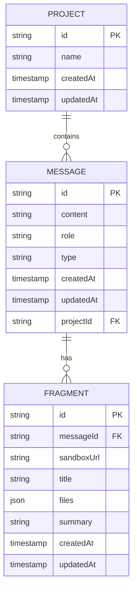
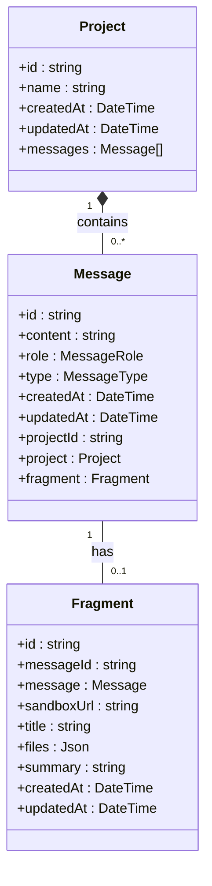
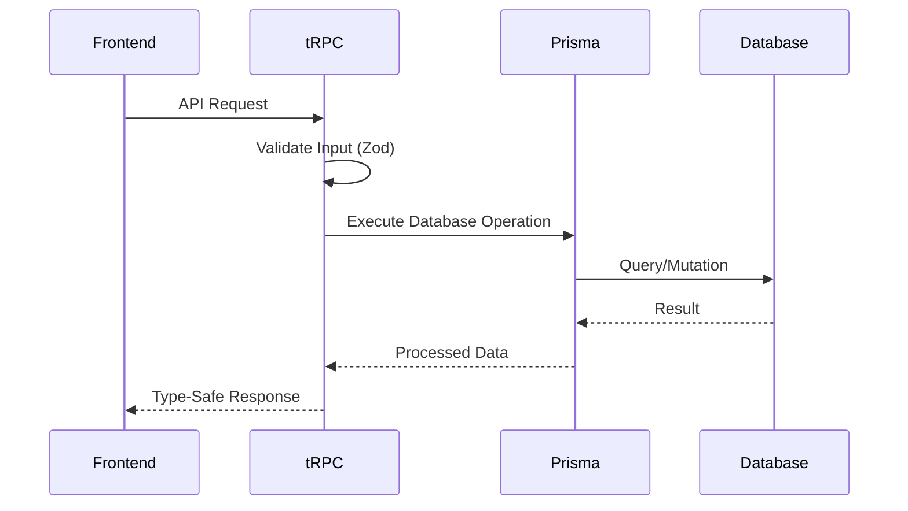

# Data Access & Prisma Client

<cite>
**Referenced Files in This Document**   
- [src/lib/db.ts](file://src/lib/db.ts)
- [prisma/schema.prisma](file://prisma/schema.prisma)
- [src/modules/projects/server/procedures.ts](file://src/modules/projects/server/procedures.ts)
- [src/modules/messages/server/procedures.ts](file://src/modules/messages/server/procedures.ts)
- [package.json](file://package.json)
</cite>

## Table of Contents
1. [Introduction](#introduction)
2. [Prisma Configuration & Schema](#prisma-configuration--schema)
3. [Singleton Pattern Implementation](#singleton-pattern-implementation)
4. [Database Connection & Environment Setup](#database-connection--environment-setup)
5. [Generated Prisma Client](#generated-prisma-client)
6. [Core Data Models](#core-data-models)
7. [Common Database Operations](#common-database-operations)
8. [Integration with tRPC Procedures](#integration-with-trpc-procedures)
9. [Transaction Handling](#transaction-handling)
10. [Error Handling Strategies](#error-handling-strategies)
11. [Connection Pooling & Performance](#connection-pooling--performance)
12. [Debugging with Prisma Studio](#debugging-with-prisma-studio)
13. [Next.js Hot-Reload Implications](#nextjs-hot-reload-implications)
14. [Performance Best Practices](#performance-best-practices)
15. [Conclusion](#conclusion)

## Introduction

The QAI platform implements a robust data access layer using Prisma Client as an ORM for PostgreSQL. This documentation details the architecture, configuration, and usage patterns of the database layer, focusing on the singleton pattern implementation, integration with tRPC, and performance considerations. The system is designed to ensure type safety, prevent connection leaks, and provide efficient database operations across the Next.js application.

## Prisma Configuration & Schema

The Prisma schema defines the data models and database configuration for the QAI platform. The schema is located in `prisma/schema.prisma` and specifies PostgreSQL as the database provider with the connection URL sourced from environment variables.



**Diagram sources**
- [prisma/schema.prisma](file://prisma/schema.prisma#L1-L65)

**Section sources**
- [prisma/schema.prisma](file://prisma/schema.prisma#L1-L65)

## Singleton Pattern Implementation

The Prisma Client instance is managed using a singleton pattern to prevent multiple instances from being created during development, which could lead to connection leaks. This implementation uses a global variable to store the Prisma Client instance, ensuring that only one instance is shared across the application.

```mermaid
classDiagram
class PrismaSingleton {
+PrismaClient prisma
-globalForPrisma : { prisma : PrismaClient }
+prisma : PrismaClient
}
PrismaSingleton : This pattern prevents multiple Prisma Client instances
PrismaSingleton : in Next.js development environment with hot reloading
```

**Diagram sources**
- [src/lib/db.ts](file://src/lib/db.ts#L1-L9)

**Section sources**
- [src/lib/db.ts](file://src/lib/db.ts#L1-L9)

## Database Connection & Environment Setup

The database connection is established through the `DATABASE_URL` environment variable, which is referenced in the Prisma schema. This approach allows for flexible configuration across different environments (development, staging, production) without modifying the codebase.

The Prisma Client connects to PostgreSQL using the standard connection string format, including host, port, database name, username, and password. This configuration enables secure and reliable database connectivity while maintaining separation of configuration from code.

**Section sources**
- [prisma/schema.prisma](file://prisma/schema.prisma#L50-L53)

## Generated Prisma Client

The Prisma Client is generated to the `src/generated/prisma` directory as specified in the schema configuration. This generated client provides type-safe database operations based on the defined data models. The generation process occurs automatically when running Prisma migrations or explicitly with the `prisma generate` command.

The generated client includes type definitions for all models, relations, and operations, enabling full TypeScript integration throughout the application. This ensures compile-time type checking for database operations and reduces runtime errors.

**Section sources**
- [prisma/schema.prisma](file://prisma/schema.prisma#L45-L48)
- [package.json](file://package.json#L1-L92)

## Core Data Models

The QAI platform defines three primary data models: Project, Message, and Fragment. These models represent the core entities of the application and their relationships.

### Project Model
The Project model serves as the top-level container for messages and related data. Each project has a unique identifier, name, and timestamps for creation and updates.

### Message Model
The Message model represents individual messages within a project, with fields for content, role (USER or ASSISTANT), type (RESULT or ERROR), and a reference to the parent project.

### Fragment Model
The Fragment model stores additional data related to messages, including sandbox URLs, file information, and summaries. Each fragment is uniquely associated with a single message.



**Diagram sources**
- [prisma/schema.prisma](file://prisma/schema.prisma#L55-L65)

**Section sources**
- [prisma/schema.prisma](file://prisma/schema.prisma#L55-L65)

## Common Database Operations

The Prisma Client provides a comprehensive API for performing CRUD operations on the data models. The following examples demonstrate common operations used throughout the QAI platform.

### Connecting to the Database
The Prisma Client instance is imported and used directly for database operations. The singleton pattern ensures that the connection is properly managed.

### Querying Projects
Projects can be retrieved individually or in lists, with sorting options for creation date.

### Creating Messages
New messages are created with associated project references and metadata.

**Section sources**
- [src/modules/projects/server/procedures.ts](file://src/modules/projects/server/procedures.ts#L1-L71)
- [src/modules/messages/server/procedures.ts](file://src/modules/messages/server/procedures.ts#L1-L55)

## Integration with tRPC Procedures

The Prisma Client is tightly integrated with tRPC procedures to provide type-safe database operations through API endpoints. This integration enables end-to-end type safety from the database to the frontend components.

tRPC routers use the singleton Prisma instance to perform database operations within procedure contexts. Input validation with Zod ensures data integrity before database operations, while error handling provides meaningful feedback to clients.



**Diagram sources**
- [src/modules/projects/server/procedures.ts](file://src/modules/projects/server/procedures.ts#L1-L71)
- [src/modules/messages/server/procedures.ts](file://src/modules/messages/server/procedures.ts#L1-L55)

**Section sources**
- [src/modules/projects/server/procedures.ts](file://src/modules/projects/server/procedures.ts#L1-L71)
- [src/modules/messages/server/procedures.ts](file://src/modules/messages/server/procedures.ts#L1-L55)

## Transaction Handling

While the current implementation doesn't explicitly show transaction usage, Prisma Client supports database transactions for operations that require atomicity. Transactions ensure that multiple operations either all succeed or all fail, maintaining data consistency.

For future implementation, Prisma's `$transaction` method can be used to wrap multiple operations in a single transaction, particularly useful for complex operations that modify multiple related records.

## Error Handling Strategies

The application implements structured error handling using TRPCError for database-related issues. When a requested project is not found, a NOT_FOUND error is thrown with a descriptive message. This approach provides consistent error responses to clients and helps with debugging.

Additional error handling could include database connection errors, validation errors, and constraint violations, all of which can be caught and transformed into appropriate TRPC errors with relevant codes and messages.

**Section sources**
- [src/modules/projects/server/procedures.ts](file://src/modules/projects/server/procedures.ts#L25-L35)

## Connection Pooling & Performance

Prisma Client manages connection pooling automatically, optimizing database connection usage and performance. The underlying PostgreSQL driver handles connection reuse, reducing the overhead of establishing new connections for each operation.

The singleton pattern complements connection pooling by ensuring that only one Prisma Client instance manages the pool, preventing excessive connection creation in development environments with hot reloading.

## Debugging with Prisma Studio

Prisma Studio provides a graphical interface for viewing and editing database records, which is invaluable for debugging and development. The tool can be launched with the `npx prisma studio` command and connects directly to the configured database.

Developers can use Prisma Studio to inspect data, verify migrations, and troubleshoot issues without writing SQL queries, making it easier to understand the state of the database during development.

## Next.js Hot-Reload Implications

The singleton pattern implementation specifically addresses the challenges of Next.js hot reloading in development. Without this pattern, each hot reload could create a new Prisma Client instance, leading to connection leaks and potential "too many connections" errors.

By storing the Prisma Client instance on the global object in development, the application ensures that only one instance persists across hot reloads. This approach maintains database connection efficiency and prevents resource exhaustion during development.

**Section sources**
- [src/lib/db.ts](file://src/lib/db.ts#L1-L9)

## Performance Best Practices

The QAI platform can benefit from several performance best practices when using Prisma Client:

### Selective Field Querying
Using the `select` option to retrieve only needed fields reduces payload size and improves query performance.

### Batch Operations
Utilizing Prisma's batch operations like `createMany` can significantly improve performance when inserting multiple records.

### Proper Indexing
Ensuring appropriate database indexes on frequently queried fields (like projectId in the Message model) enhances query performance.

### Caching Strategies
Implementing caching for frequently accessed but infrequently changing data can reduce database load.

### Connection Management
The singleton pattern already addresses connection management, but additional tuning of connection pool settings may be beneficial for production workloads.

## Conclusion

The QAI platform's data access layer demonstrates a well-architected implementation of Prisma Client with attention to critical concerns like connection management, type safety, and development experience. The singleton pattern effectively prevents connection leaks in development, while the integration with tRPC provides end-to-end type safety. The schema design reflects the application's data requirements with clear relationships between entities. By following Prisma best practices and leveraging its powerful features, the platform maintains a robust and efficient database layer that supports its functionality while remaining maintainable and scalable.