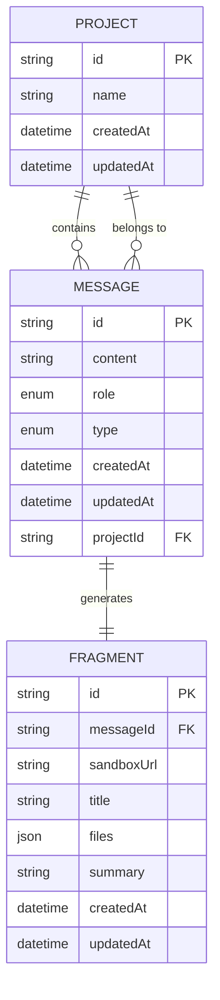
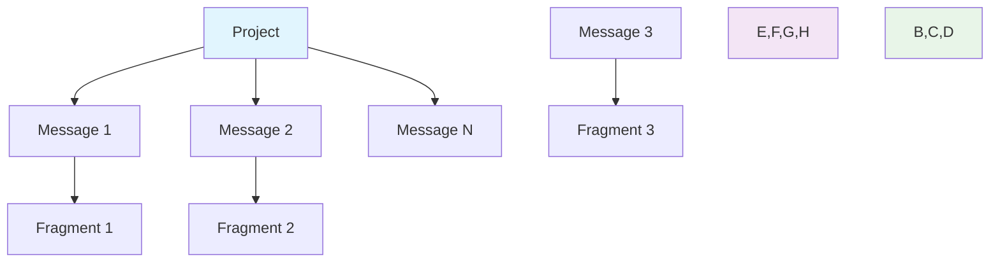
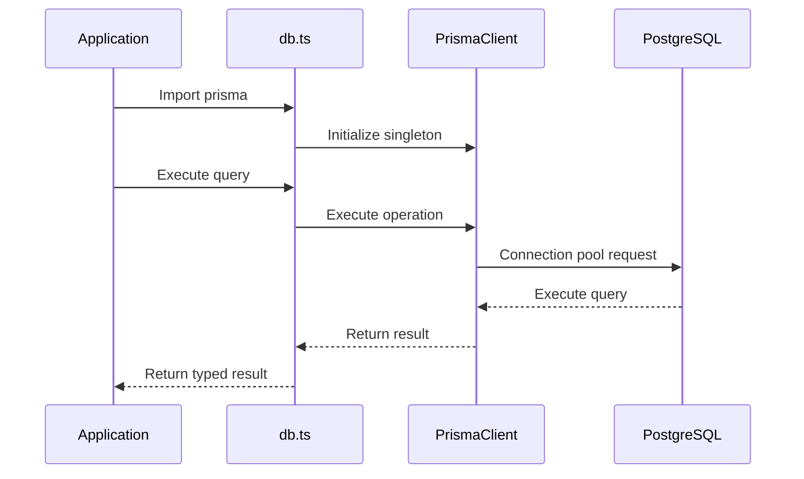
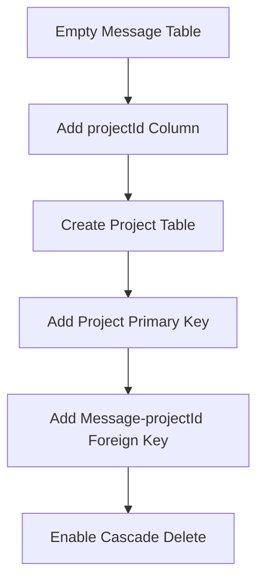
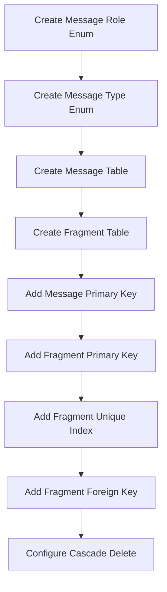
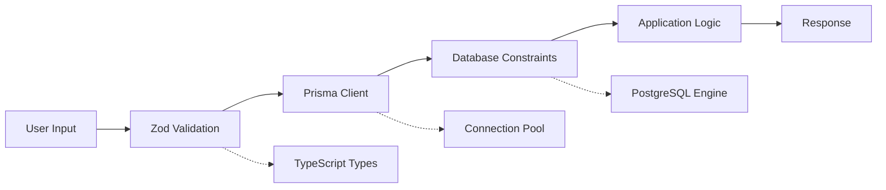
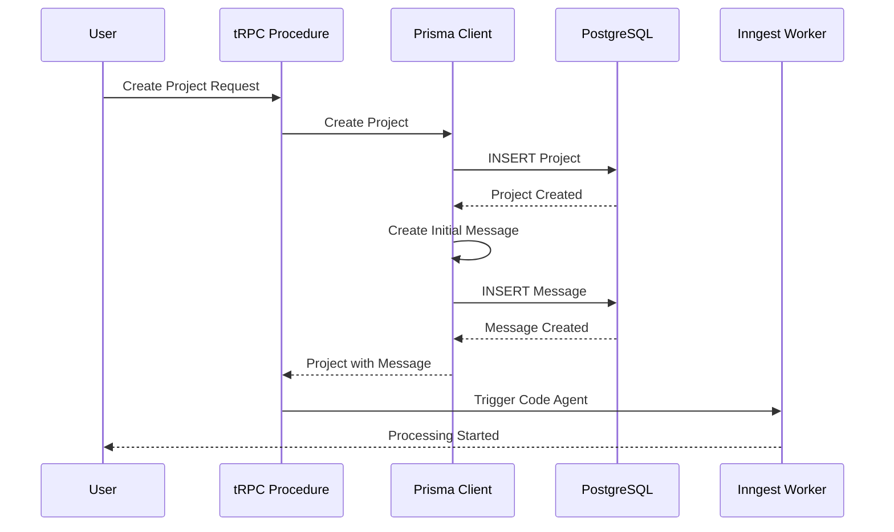

# Data Models & Schema Design

<cite>
**Referenced Files in This Document**
- [prisma/schema.prisma](file://prisma/schema.prisma)
- [src/lib/db.ts](file://src/lib/db.ts)
- [prisma/migrations/20251019200148_message_fragment/migration.sql](file://prisma/migrations/20251019200148_message_fragment/migration.sql)
- [prisma/migrations/20251019214950_projects/migration.sql](file://prisma/migrations/20251019214950_projects/migration.sql)
- [src/modules/projects/server/procedures.ts](file://src/modules/projects/server/procedures.ts)
- [src/modules/messages/server/procedures.ts](file://src/modules/messages/server/procedures.ts)
- [src/modules/projects/ui/views/project-view.tsx](file://src/modules/projects/ui/views/project-view.tsx)
- [src/trpc/init.ts](file://src/trpc/init.ts)
- [src/generated/prisma/index.d.ts](file://src/generated/prisma/index.d.ts)
- [package.json](file://package.json)
</cite>

## Table of Contents
1. [Introduction](#introduction)
2. [Database Schema Overview](#database-schema-overview)
3. [Core Entity Models](#core-entity-models)
4. [Entity Relationships](#entity-relationships)
5. [Data Access Patterns](#data-access-patterns)
6. [Schema Migration History](#schema-migration-history)
7. [Performance Considerations](#performance-considerations)
8. [Data Integrity and Validation](#data-integrity-and-validation)
9. [Data Lifecycle Management](#data-lifecycle-management)
10. [Troubleshooting Guide](#troubleshooting-guide)

## Introduction

The QAI platform utilizes a PostgreSQL database with Prisma ORM for managing conversational AI data. The schema is designed around three core entities: Projects, Messages, and Fragments, which represent the fundamental building blocks of the platform's conversational interface and code execution capabilities.

The database architecture emphasizes relational integrity through foreign key constraints and cascading deletes, ensuring data consistency across the application. The schema supports complex query patterns for message threading, fragment management, and real-time data access through tRPC procedures.

## Database Schema Overview

The QAI platform employs a PostgreSQL database with Prisma ORM for type-safe database operations. The schema follows a hierarchical structure where Projects contain Messages, and Messages contain Fragments representing executable code sandboxes.

**Diagram sources**
- [prisma/schema.prisma](file://prisma/schema.prisma#L14-L65)

**Section sources**
- [prisma/schema.prisma](file://prisma/schema.prisma#L1-L66)
- [src/lib/db.ts](file://src/lib/db.ts#L1-L10)

## Core Entity Models

### Project Model

The Project entity serves as the top-level container for conversational sessions and represents individual AI-driven development projects.

| Field | Type | Constraints | Description |
|-------|------|-------------|-------------|
| `id` | String | Primary Key, UUID() | Unique identifier for the project |
| `name` | String | Not Null | Human-readable project name |
| `createdAt` | DateTime | Default(now()) | Automatic timestamp for creation |
| `updatedAt` | DateTime | Default(now()), Auto-updated | Automatic timestamp for updates |

**Relationships:**
- One-to-many with Message entities
- Parent entity in the conversation hierarchy

### Message Model

The Message entity represents individual messages within a conversation thread, supporting both user and assistant roles with different message types.

| Field | Type | Constraints | Description |
|-------|------|-------------|-------------|
| `id` | String | Primary Key, UUID() | Unique identifier for the message |
| `content` | String | Not Null | Message content or code |
| `role` | MessageRole | Enum, Not Null | USER or ASSISTANT |
| `type` | MessageType | Enum, Not Null | RESULT or ERROR |
| `createdAt` | DateTime | Default(now()) | Automatic timestamp |
| `updatedAt` | DateTime | Default(now()), Auto-updated | Automatic timestamp |
| `projectId` | String | Foreign Key, Not Null | Links to Project entity |

**Enumerations:**
- `MessageRole`: USER, ASSISTANT
- `MessageType`: RESULT, ERROR

**Relationships:**
- Many-to-one with Project entity (with cascade delete)
- One-to-zero-or-one with Fragment entity

### Fragment Model

The Fragment entity represents executable code sandboxes that are generated from assistant messages, containing sandbox URLs, file systems, and execution metadata.

| Field | Type | Constraints | Description |
|-------|------|-------------|-------------|
| `id` | String | Primary Key, UUID() | Unique identifier for the fragment |
| `messageId` | String | Unique, Foreign Key | Links to Message entity |
| `sandboxUrl` | String | Not Null | URL to the code execution sandbox |
| `title` | String | Not Null | Human-readable fragment title |
| `files` | Json | Not Null | JSON representation of file system |
| `summary` | String | Nullable | Optional summary of fragment content |
| `createdAt` | DateTime | Default(now()) | Automatic timestamp |
| `updatedAt` | DateTime | Default(now()), Auto-updated | Automatic timestamp |

**Relationships:**
- Many-to-one with Message entity (with cascade delete)
- Child entity in the execution hierarchy

**Section sources**
- [prisma/schema.prisma](file://prisma/schema.prisma#L14-L65)

## Entity Relationships

The QAI platform's database schema implements a hierarchical relationship structure with strong referential integrity:

**Diagram sources**
- [prisma/schema.prisma](file://prisma/schema.prisma#L20-L25)
- [prisma/schema.prisma](file://prisma/schema.prisma#L40-L45)

### Foreign Key Constraints

The schema implements cascading delete behavior to maintain data consistency:

1. **Project → Message**: When a project is deleted, all associated messages are automatically removed
2. **Message → Fragment**: When a message is deleted, its associated fragment is automatically removed

### Cardinality Relationships

- **Project to Message**: One-to-many (1:N) - Each project can contain multiple messages
- **Message to Fragment**: One-to-zero-or-one (1:0..1) - Each message can generate at most one fragment
- **Message to Project**: Many-to-one (N:1) - Each message belongs to exactly one project

**Section sources**
- [prisma/schema.prisma](file://prisma/schema.prisma#L20-L25)
- [prisma/schema.prisma](file://prisma/schema.prisma#L40-L45)
- [prisma/migrations/20251019200148_message_fragment/migration.sql](file://prisma/migrations/20251019200148_message_fragment/migration.sql#L30-L37)

## Data Access Patterns

### Prisma Client Configuration

The application uses a singleton Prisma client with global instance management for optimal performance and connection pooling:

**Diagram sources**
- [src/lib/db.ts](file://src/lib/db.ts#L1-L10)

### Connection Pooling Strategy

The Prisma client is configured with automatic connection pooling managed by the underlying PostgreSQL driver. The singleton pattern ensures:

- **Memory Efficiency**: Single client instance across the application
- **Connection Reuse**: Automatic pooling of database connections
- **Development Safety**: Separate instances in development mode
- **Global Scope**: Proper cleanup and resource management

### tRPC Procedure Patterns

The application implements standardized tRPC procedures for data access:

#### Project Operations
- **getOne**: Retrieve single project by ID with error handling
- **getMany**: List all projects ordered by creation date
- **create**: Create new project with initial user message

#### Message Operations  
- **getMany**: Retrieve messages for a project with fragment inclusion
- **create**: Create new message within a project context

**Section sources**
- [src/lib/db.ts](file://src/lib/db.ts#L1-L10)
- [src/modules/projects/server/procedures.ts](file://src/modules/projects/server/procedures.ts#L1-L72)
- [src/modules/messages/server/procedures.ts](file://src/modules/messages/server/procedures.ts#L1-L56)

## Schema Migration History

The database schema evolved through two major migrations that established the core entity relationships:

### Projects Migration (20251019214950_projects)

This migration introduced the Project entity and established the foundation for the conversation system:

**Diagram sources**
- [prisma/migrations/20251019214950_projects/migration.sql](file://prisma/migrations/20251019214950_projects/migration.sql#L1-L22)

### Message & Fragment Migration (20251019200148_message_fragment)

This migration established the Message and Fragment entities with their relationships:

**Diagram sources**
- [prisma/migrations/20251019200148_message_fragment/migration.sql](file://prisma/migrations/20251019200148_message_fragment/migration.sql#L1-L38)

**Section sources**
- [prisma/migrations/20251019214950_projects/migration.sql](file://prisma/migrations/20251019214950_projects/migration.sql#L1-L22)
- [prisma/migrations/20251019200148_message_fragment/migration.sql](file://prisma/migrations/20251019200148_message_fragment/migration.sql#L1-L38)

## Performance Considerations

### Query Optimization Strategies

#### Message Threading Performance
- **Indexed Project ID**: Queries filter by `projectId` which is indexed
- **Ordered Retrieval**: Messages are retrieved in chronological order using `createdAt ASC`
- **Selective Loading**: Fragments are conditionally included using Prisma's `include` option

#### Fragment Loading Optimization
- **Lazy Loading**: Fragments are loaded only when needed through tRPC procedures
- **Single Query Pattern**: Related fragments are fetched in the same query as messages
- **Minimal Data Transfer**: Only essential fragment fields are retrieved

### Indexing Strategy

The schema includes several implicit and explicit indexes:

| Table | Indexed Columns | Purpose |
|-------|----------------|---------|
| Message | projectId | Fast project-scoped queries |
| Fragment | messageId | Fast fragment lookups by message |
| Project | id | Primary key access |
| Message | id | Primary key access |
| Fragment | id | Primary key access |

### Connection Pooling Benefits

The Prisma client provides several performance advantages:

- **Automatic Connection Management**: Handles connection lifecycle transparently
- **Query Result Caching**: Reduces redundant database round-trips
- **Transaction Support**: Enables atomic operations across multiple entities
- **Type Safety**: Prevents runtime database errors through compile-time checks

**Section sources**
- [src/modules/messages/server/procedures.ts](file://src/modules/messages/server/procedures.ts#L15-L30)

## Data Integrity and Validation

### Application Layer Validation

The tRPC procedures implement comprehensive input validation:

#### Project Creation Validation
- **Name Length**: Enforced through Zod schema with min/max length constraints
- **Slug Generation**: Automatic generation of readable project identifiers
- **Initial Message**: Required user input for project initialization

#### Message Validation
- **Content Length**: Maximum 1000 character limit for both user and assistant messages
- **Role Validation**: Strict enum enforcement for message roles
- **Type Validation**: Strict enum enforcement for message types

#### Fragment Validation
- **URL Validation**: Sandbox URLs are validated through external service integration
- **File System Integrity**: JSON structure validation for file representations
- **Relationship Consistency**: Ensures message-fragment relationships remain intact

### Database Layer Constraints

The schema enforces data integrity through:

#### Foreign Key Constraints
- **Cascade Deletes**: Automatic cleanup of related records
- **Referential Integrity**: Prevention of orphaned records
- **Unique Constraints**: Ensures message-fragment uniqueness

#### Data Type Constraints
- **UUID Primary Keys**: Ensures globally unique identifiers
- **Timestamp Precision**: Millisecond precision for temporal data
- **JSON Storage**: Flexible file system representation

### Validation Pipeline

**Diagram sources**
- [src/modules/projects/server/procedures.ts](file://src/modules/projects/server/procedures.ts#L35-L50)
- [src/modules/messages/server/procedures.ts](file://src/modules/messages/server/procedures.ts#L25-L40)

**Section sources**
- [src/modules/projects/server/procedures.ts](file://src/modules/projects/server/procedures.ts#L35-L50)
- [src/modules/messages/server/procedures.ts](file://src/modules/messages/server/procedures.ts#L25-L40)
- [prisma/schema.prisma](file://prisma/schema.prisma#L14-L65)

## Data Lifecycle Management

### Creation Workflow

The data lifecycle begins with project creation and continues through message exchange and fragment generation:

**Diagram sources**
- [src/modules/projects/server/procedures.ts](file://src/modules/projects/server/procedures.ts#L45-L70)

### Message Thread Management

Messages are organized chronologically within projects, enabling conversation history tracking:

#### Message Ordering
- **Chronological Sorting**: Messages retrieved by `createdAt ASC`
- **Conversation Flow**: Natural progression from user to assistant responses
- **Fragment Association**: Assistant messages can generate executable fragments

#### Thread Persistence
- **Immutable History**: Message content remains unchanged after creation
- **Timestamp Tracking**: Creation and update timestamps for audit trails
- **Relationship Maintenance**: Foreign key constraints preserve thread integrity

### Fragment Lifecycle

Fragments represent the executable output of assistant messages:

#### Generation Process
1. **Message Processing**: Assistant messages trigger fragment generation
2. **Sandbox Creation**: External service creates isolated execution environment
3. **File Capture**: Complete file system snapshot captured as JSON
4. **Metadata Collection**: Title, summary, and URL stored for user interface

#### Fragment Updates
- **Dynamic Refresh**: Users can refresh fragment content through UI
- **URL Persistence**: Sandbox URLs remain stable for session continuity
- **Content Synchronization**: Local state mirrors remote sandbox updates

**Section sources**
- [src/modules/projects/server/procedures.ts](file://src/modules/projects/server/procedures.ts#L45-L70)
- [src/modules/messages/server/procedures.ts](file://src/modules/messages/server/procedures.ts#L30-L55)
- [src/modules/projects/ui/views/project-view.tsx](file://src/modules/projects/ui/views/project-view.tsx#L1-L91)

## Troubleshooting Guide

### Common Database Issues

#### Connection Problems
- **Symptom**: Prisma client fails to connect
- **Cause**: DATABASE_URL environment variable missing or incorrect
- **Solution**: Verify PostgreSQL connection string and environment configuration

#### Migration Failures
- **Symptom**: Schema inconsistencies after migration
- **Cause**: Concurrent migration attempts or partial migration execution
- **Solution**: Reset database state and re-run migrations carefully

#### Performance Degradation
- **Symptom**: Slow query response times
- **Cause**: Lack of appropriate indexes or query optimization
- **Solution**: Review query patterns and consider adding composite indexes

### Data Integrity Issues

#### Orphaned Records
- **Symptom**: Messages without associated projects
- **Cause**: Manual database modifications bypassing foreign key constraints
- **Solution**: Restore from backup or recreate relationships through application logic

#### Duplicate Fragments
- **Symptom**: Multiple fragments for single messages
- **Cause**: Race conditions during concurrent fragment generation
- **Solution**: Implement optimistic locking or retry mechanisms

### Application-Level Issues

#### Type Errors
- **Symptom**: TypeScript compilation failures with Prisma types
- **Cause**: Outdated Prisma client or schema mismatches
- **Solution**: Regenerate Prisma client and restart development server

#### Validation Failures
- **Symptom**: Input validation errors despite seemingly valid data
- **Cause**: Edge cases in validation logic or constraint violations
- **Solution**: Review validation rules and database constraints

**Section sources**
- [src/lib/db.ts](file://src/lib/db.ts#L1-L10)
- [package.json](file://package.json#L1-L92)