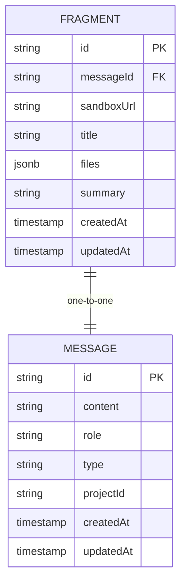
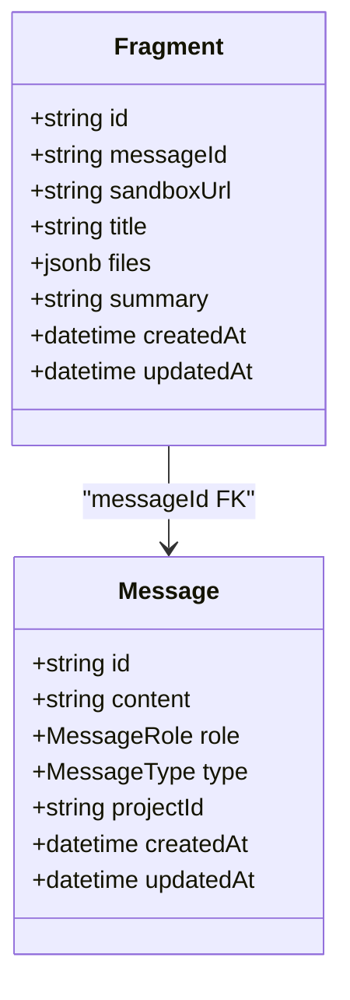
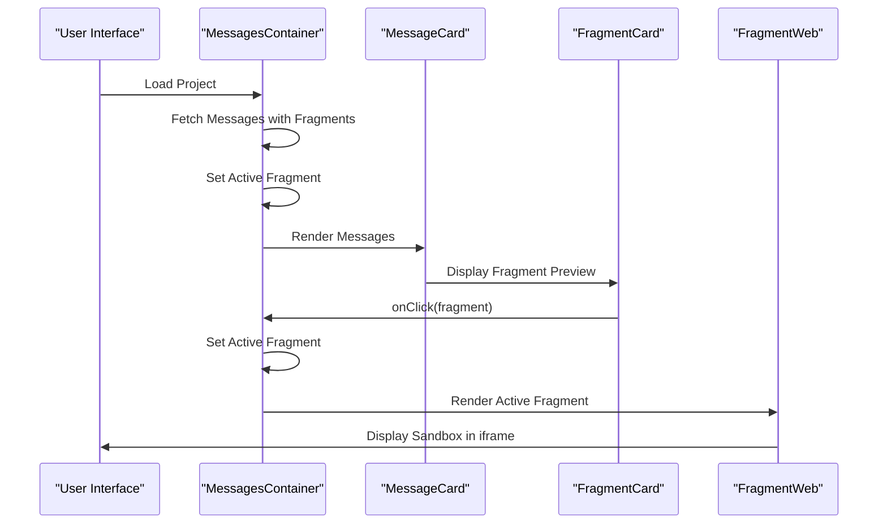

# Fragment Model

<cite>
**Referenced Files in This Document**   
- [message_fragment.sql](file://prisma/migrations/20251019200148_message_fragment/migration.sql)
- [fragment-web.tsx](file://src/modules/projects/ui/components/fragment-web.tsx)
- [message-card.tsx](file://src/modules/projects/ui/components/message-card.tsx)
- [messages-container.tsx](file://src/modules/projects/ui/components/messages-container.tsx)
- [functions.ts](file://src/inngest/functions.ts)
- [procedures.ts](file://src/modules/messages/server/procedures.ts)
- [db.ts](file://src/lib/db.ts)
</cite>

## Table of Contents
1. [Introduction](#introduction)
2. [Schema Definition](#schema-definition)
3. [Relationship with Message Model](#relationship-with-message-model)
4. [Data Storage and Structure](#data-storage-and-structure)
5. [Migration Details](#migration-details)
6. [UI Integration and Rendering](#ui-integration-and-rendering)
7. [Query Patterns and Performance](#query-patterns-and-performance)
8. [Data Security Considerations](#data-security-considerations)
9. [Conclusion](#conclusion)

## Introduction
The Fragment model serves as a critical component in the QAI application architecture, designed to store AI-generated code execution results from the E2B sandbox environment. This model enables persistent storage of dynamic application states, allowing users to interact with generated applications through embedded sandbox previews. The Fragment model is tightly coupled with the Message model, forming a one-to-one relationship that connects AI responses with their corresponding executable outputs.

**Section sources**
- [message_fragment.sql](file://prisma/migrations/20251019200148_message_fragment/migration.sql#L20-L36)

## Schema Definition
The Fragment model schema consists of several key fields that capture essential information about AI-generated code execution results:

- **id**: UUID field serving as the primary key for the Fragment table
- **messageId**: Unique foreign key establishing a one-to-one relationship with the Message model
- **sandboxUrl**: String field storing the URL endpoint for accessing the E2B sandbox environment
- **title**: String field containing a descriptive title for the generated application
- **files**: JSONB field storing the complete file structure generated by the AI coding agent
- **summary**: Optional string field containing a textual summary of the generated application
- **createdAt** and **updatedAt**: Timestamp fields tracking record creation and modification times

The schema is implemented using PostgreSQL's JSONB data type for the files field, enabling efficient storage and querying of dynamic, nested file structures generated during AI code execution.



**Diagram sources**
- [message_fragment.sql](file://prisma/migrations/20251019200148_message_fragment/migration.sql#L20-L36)

**Section sources**
- [message_fragment.sql](file://prisma/migrations/20251019200148_message_fragment/migration.sql#L20-L36)

## Relationship with Message Model
The Fragment model maintains a strict one-to-one relationship with the Message model through the messageId foreign key field. This relationship is enforced by both a foreign key constraint and a unique index on the messageId column, ensuring that each message can have at most one associated fragment.

The relationship implements a cascade delete constraint (ON DELETE CASCADE), meaning that when a Message record is deleted, its associated Fragment record is automatically removed. This ensures data consistency and prevents orphaned fragment records. The cascade update constraint (ON UPDATE CASCADE) allows for message ID updates to propagate to the fragment table, though this is rarely needed in practice given the immutable nature of UUIDs.

This one-to-one relationship reflects the application's design pattern where AI assistant messages of type "RESULT" may contain executable code outputs, while user messages and error messages do not have associated fragments.



**Diagram sources**
- [message_fragment.sql](file://prisma/migrations/20251019200148_message_fragment/migration.sql#L20-L36)
- [procedures.ts](file://src/modules/messages/server/procedures.ts#L20-L55)

**Section sources**
- [message_fragment.sql](file://prisma/migrations/20251019200148_message_fragment/migration.sql#L20-L36)

## Data Storage and Structure
The Fragment model utilizes Prisma's Json type (implemented as JSONB in PostgreSQL) to store the dynamic file structures generated by the AI coding agent in the E2B sandbox environment. This approach provides flexibility in storing varying file hierarchies and content without requiring a predefined schema.

The files field contains a JSON object where keys represent file paths and values contain the corresponding file contents. For example:

```json
{
  "src/app/page.tsx": "export default function Page() { return <div>Hello World</div> }",
  "package.json": "{ \"name\": \"generated-app\", \"dependencies\": { \"react\": \"^18.0.0\" } }",
  "README.md": "# Generated Application\nThis app was created by the AI coding agent."
}
```

The JSONB format in PostgreSQL allows for efficient storage with automatic compression and supports indexing capabilities for querying specific elements within the JSON structure. This enables features like searching for fragments containing specific file types or patterns, though such queries should be used judiciously due to performance implications.

The summary field, when present, contains a concise description of the generated application's functionality, often extracted from the AI agent's response. This provides users with context about the generated code without requiring them to examine the file contents directly.

**Section sources**
- [functions.ts](file://src/inngest/functions.ts#L175-L211)
- [message_fragment.sql](file://prisma/migrations/20251019200148_message_fragment/migration.sql#L20-L36)

## Migration Details
The Fragment table was created through a database migration script located at `prisma/migrations/20251019200148_message_fragment/migration.sql`. This migration not only created the Fragment table but also established the necessary constraints and relationships with the Message table.

The migration process involved:
1. Creating the MessageRole and MessageType enums used by the Message table
2. Creating the Message table with its schema
3. Creating the Fragment table with its schema
4. Adding a unique index on the messageId column to enforce the one-to-one relationship
5. Adding a foreign key constraint linking Fragment.messageId to Message.id with cascade delete and update behavior

The migration script demonstrates proper database schema evolution practices, with clear separation of concerns and appropriate constraint definitions. The use of CASCADE for both DELETE and UPDATE operations ensures referential integrity while accommodating potential future changes to message identifiers.

The migration was applied to the production database without downtime, as it only adds new tables and constraints without modifying existing data structures. This approach follows best practices for database migrations in production environments.

**Section sources**
- [message_fragment.sql](file://prisma/migrations/20251019200148_message_fragment/migration.sql#L0-L36)

## UI Integration and Rendering
The Fragment model is integrated into the user interface through several components that enable users to interact with generated applications. The primary UI components include:

- **FragmentCard**: A clickable card component displayed within message threads that shows the fragment title and preview information
- **FragmentWeb**: A full-featured component that renders the generated application within an iframe using the sandboxUrl

The FragmentWeb component provides users with interactive controls including:
- Refresh button to reload the sandbox environment
- Copy URL button to copy the sandbox URL to the clipboard
- Open in new tab button to view the application in a separate browser window

The iframe implementation uses a restricted sandbox attribute (`allow-forms allow-scripts allow-same-origin`) to balance functionality with security, permitting necessary JavaScript execution while limiting potential security risks. The component uses React state to manage UI feedback, such as showing a "Copied" status after the URL is copied to the clipboard.

The MessagesContainer component automatically sets the most recent assistant message's fragment as the active fragment, providing a seamless user experience where newly generated applications are immediately accessible.



**Diagram sources**
- [fragment-web.tsx](file://src/modules/projects/ui/components/fragment-web.tsx#L0-L74)
- [message-card.tsx](file://src/modules/projects/ui/components/message-card.tsx#L21-L66)
- [messages-container.tsx](file://src/modules/projects/ui/components/messages-container.tsx#L0-L75)

**Section sources**
- [fragment-web.tsx](file://src/modules/projects/ui/components/fragment-web.tsx#L0-L74)
- [message-card.tsx](file://src/modules/projects/ui/components/message-card.tsx#L21-L148)
- [messages-container.tsx](file://src/modules/projects/ui/components/messages-container.tsx#L0-L75)

## Query Patterns and Performance
Access to Fragment data is primarily achieved through Prisma queries that leverage the relationship with the Message model. The most common query pattern involves retrieving messages with their associated fragments using the `include` option:

```typescript
const messages = await prisma.message.findMany({
  where: { projectId: input.projectId },
  orderBy: { createdAt: "asc" },
  include: { fragment: true }
});
```

This pattern efficiently retrieves message-thread data with fragments in a single database query, minimizing round trips and improving performance. The query is used in the messagesRouter to provide complete message history with executable outputs to the frontend.

For performance optimization, the database schema includes a unique index on the messageId column, which accelerates lookups and enforces the one-to-one relationship constraint. However, queries that search within the JSONB files field should be approached with caution, as they can be computationally expensive and may require additional indexing strategies for large datasets.

The current implementation loads all messages and their fragments eagerly, which is suitable for typical project sizes but could be optimized for projects with extensive message histories by implementing pagination or lazy loading of older fragments.

When creating new fragments, the application uses Prisma's nested writes feature to create both the message and fragment records in a single transaction, ensuring data consistency and atomicity.

**Section sources**
- [procedures.ts](file://src/modules/messages/server/procedures.ts#L20-L55)
- [functions.ts](file://src/inngest/functions.ts#L175-L211)
- [db.ts](file://src/lib/db.ts#L0-L8)

## Data Security Considerations
Storing executable code in the database presents several security considerations that are addressed through multiple layers of protection:

1. **Input Validation**: All code content is generated by the AI agent within the controlled E2B sandbox environment, limiting exposure to untrusted user input.

2. **Sandbox Isolation**: The actual code execution occurs in isolated E2B sandbox environments, preventing direct access to the host system or other user data.

3. **Content Security Policy**: The FragmentWeb component uses iframe sandboxing with restricted permissions (`allow-forms allow-scripts allow-same-origin`), preventing dangerous operations like top navigation or plugin execution.

4. **URL Validation**: The sandboxUrl field contains URLs from the trusted E2B domain, reducing the risk of arbitrary code execution from external sources.

5. **Data Encryption**: While not explicitly shown in the code, production deployments should ensure that the database connection uses TLS encryption and that sensitive data is encrypted at rest.

6. **Access Control**: The application architecture ensures that fragments are only accessible within the context of their associated project, with authorization checks enforced at the API level.

7. **Code Review**: Since the stored code is AI-generated and intended for preview purposes, it should be treated as untrusted and subject to review before deployment to production environments.

The combination of database constraints, application-level controls, and infrastructure-level isolation creates a defense-in-depth approach to securing the storage and execution of AI-generated code.

**Section sources**
- [fragment-web.tsx](file://src/modules/projects/ui/components/fragment-web.tsx#L0-L74)
- [functions.ts](file://src/inngest/functions.ts#L175-L211)
- [message_fragment.sql](file://prisma/migrations/20251019200148_message_fragment/migration.sql#L20-L36)

## Conclusion
The Fragment model plays a crucial role in the QAI application by bridging the gap between AI-generated code and user interaction. By storing execution results from the E2B sandbox environment, it enables users to preview and interact with dynamically generated applications directly within the interface. The model's design balances flexibility with data integrity through its JSONB storage format and strict relationship with the Message model.

Key strengths of the implementation include the seamless integration between backend storage and frontend rendering, the use of database constraints to maintain data consistency, and the thoughtful approach to security in handling executable code. The one-to-one relationship with messages ensures clean data modeling, while the cascade delete constraint prevents orphaned records.

Future considerations might include implementing more sophisticated indexing for the JSONB files field to support advanced search capabilities, adding metadata about the AI model version used to generate the code, or enhancing the security model with additional validation layers for production deployment scenarios.