# Message Model

<cite>
**Referenced Files in This Document**
- [prisma/schema.prisma](file://prisma/schema.prisma)
- [prisma/migrations/20251019200148_message_fragment/migration.sql](file://prisma/migrations/20251019200148_message_fragment/migration.sql)
- [prisma/migrations/20251019214950_projects/migration.sql](file://prisma/migrations/20251019214950_projects/migration.sql)
- [src/modules/messages/server/procedures.ts](file://src/modules/messages/server/procedures.ts)
- [src/modules/projects/ui/components/message-card.tsx](file://src/modules/projects/ui/components/message-card.tsx)
- [src/modules/projects/ui/components/messages-container.tsx](file://src/modules/projects/ui/components/messages-container.tsx)
- [src/modules/projects/ui/views/project-view.tsx](file://src/modules/projects/ui/views/project-view.tsx)
- [src/inngest/functions.ts](file://src/inngest/functions.ts)
</cite>

## Table of Contents
1. [Introduction](#introduction)
2. [Model Structure](#model-structure)
3. [Enum Definitions](#enum-definitions)
4. [Relationships](#relationships)
5. [Migration History](#migration-history)
6. [Message Flow and UI Integration](#message-flow-and-ui-integration)
7. [Prisma Query Examples](#prisma-query-examples)
8. [Performance Considerations](#performance-considerations)
9. [Implementation Details](#implementation-details)
10. [Best Practices](#best-practices)

## Introduction

The Message model in the QAI platform serves as the core data structure for representing AI conversation turns within projects. It captures the essential elements of human-AI interactions, including message content, roles, types, timestamps, and associated fragments that represent AI-generated code artifacts. The model is designed to support real-time conversation flows while maintaining efficient data relationships and cascading delete behavior.

## Model Structure

The Message model consists of seven primary fields that define the complete structure of a conversation turn:

### Core Fields

| Field | Type | Description | Constraints |
|-------|------|-------------|-------------|
| `id` | String (UUID) | Unique identifier for the message | Primary Key, Auto-generated |
| `content` | String | The actual message content | Not Null, Max 1000 characters |
| `role` | MessageRole | Role of the message sender | Not Null, Enum type |
| `type` | MessageType | Type classification of the message | Not Null, Enum type |
| `createdAt` | DateTime | Timestamp of message creation | Default: Current timestamp |
| `updatedAt` | DateTime | Timestamp of last modification | Default: Current timestamp |

### Foreign Key Relationship

| Field | Type | Description | Constraints |
|-------|------|-------------|-------------|
| `projectId` | String | Reference to parent Project | Not Null, Cascades on delete |

**Section sources**
- [prisma/schema.prisma](file://prisma/schema.prisma#L28-L45)

## Enum Definitions

The Message model utilizes two specialized enum types to control AI interaction flow and message categorization:

### MessageRole Enum

Defines the sender role in the conversation:

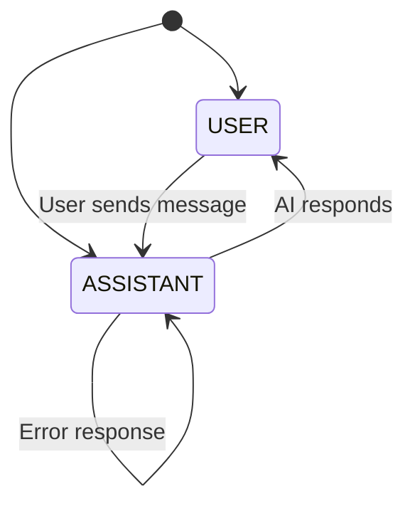

**Diagram sources**
- [prisma/schema.prisma](file://prisma/schema.prisma#L20-L24)

#### Values:
- **USER**: Represents messages sent by human users
- **ASSISTANT**: Represents messages generated by AI assistants

### MessageType Enum

Categorizes the nature and purpose of messages:

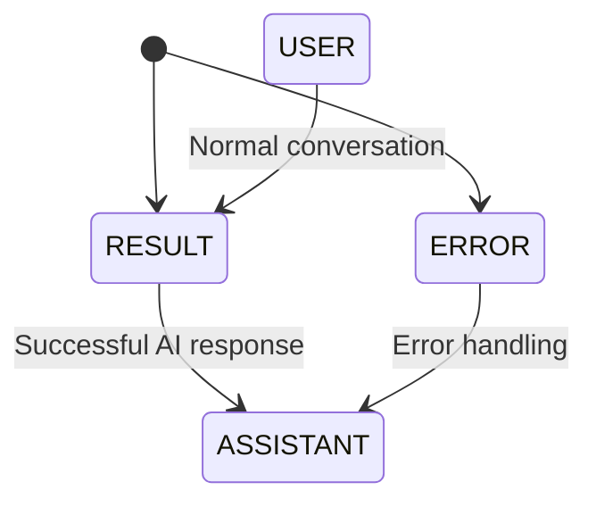

**Diagram sources**
- [prisma/schema.prisma](file://prisma/schema.prisma#L26-L30)

#### Values:
- **RESULT**: Indicates successful AI responses with content
- **ERROR**: Signals error conditions or failed operations

**Section sources**
- [prisma/schema.prisma](file://prisma/schema.prisma#L20-L30)

## Relationships

The Message model participates in two distinct relationships that define its position within the QAI platform's data architecture:

### Many-to-One Relationship with Project

Each message belongs to exactly one project, establishing a hierarchical data structure:

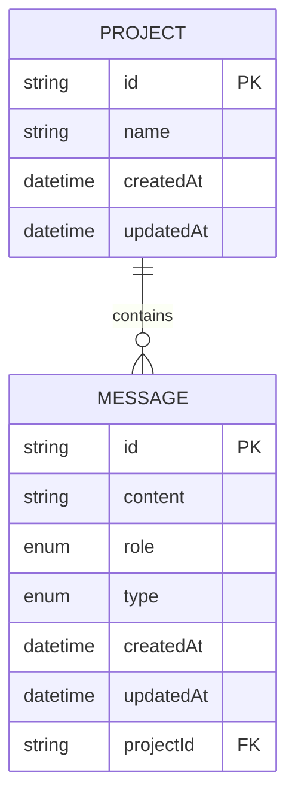

**Diagram sources**
- [prisma/schema.prisma](file://prisma/schema.prisma#L11-L17)
- [prisma/schema.prisma](file://prisma/schema.prisma#L40-L45)

### One-to-One Optional Relationship with Fragment

Messages can optionally be associated with Fragments, which represent AI-generated code artifacts:

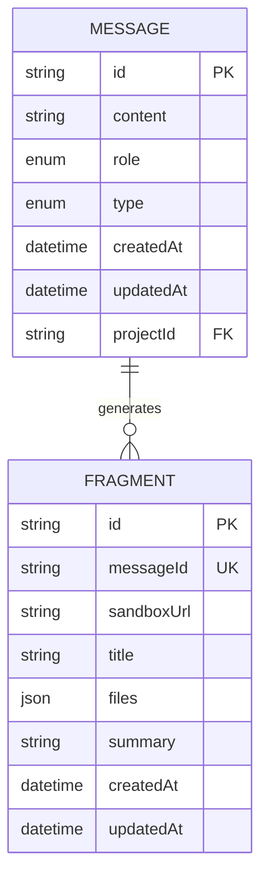

**Diagram sources**
- [prisma/schema.prisma](file://prisma/schema.prisma#L47-L65)

### Cascade Delete Behavior

Both relationships implement cascade delete behavior:
- **Project → Message**: When a project is deleted, all associated messages are automatically removed
- **Message → Fragment**: When a message is deleted, its associated fragment is automatically removed

**Section sources**
- [prisma/schema.prisma](file://prisma/schema.prisma#L40-L65)

## Migration History

The Message model evolved through two distinct migration phases that established its current structure:

### Phase 1: Initial Message Fragment Migration

The first migration (20251019200148_message_fragment) established the core Message and Fragment tables:

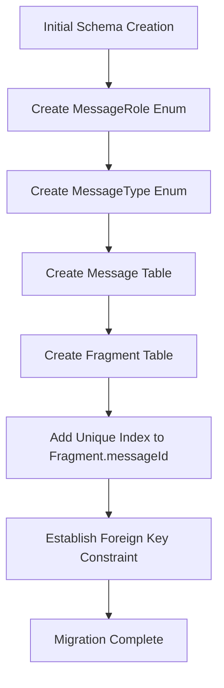

**Diagram sources**
- [prisma/migrations/20251019200148_message_fragment/migration.sql](file://prisma/migrations/20251019200148_message_fragment/migration.sql#L1-L37)

### Phase 2: Project Integration Migration

The second migration (20251019214950_projects) added the projectId foreign key to enable project association:

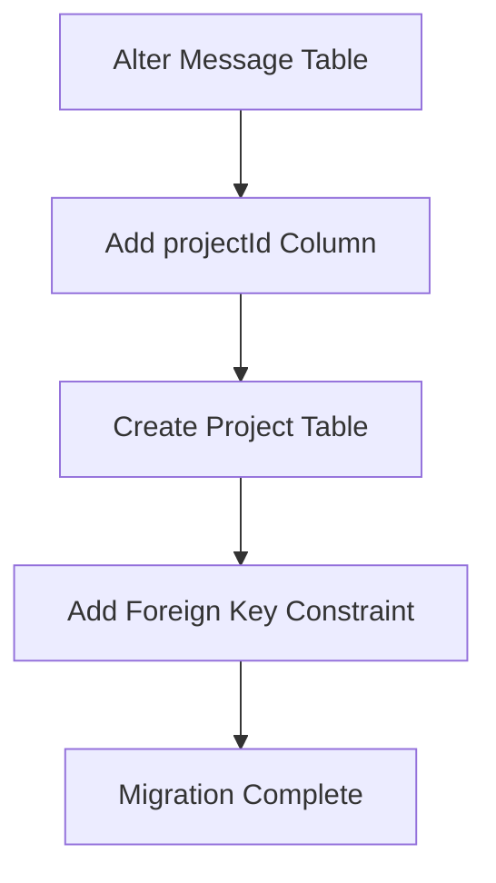

**Diagram sources**
- [prisma/migrations/20251019214950_projects/migration.sql](file://prisma/migrations/20251019214950_projects/migration.sql#L1-L20)

**Section sources**
- [prisma/migrations/20251019200148_message_fragment/migration.sql](file://prisma/migrations/20251019200148_message_fragment/migration.sql#L1-L37)
- [prisma/migrations/20251019214950_projects/migration.sql](file://prisma/migrations/20251019214950_projects/migration.sql#L1-L20)

## Message Flow and UI Integration

Messages serve as the fundamental building blocks for AI conversation flows within the QAI platform, driving both data persistence and UI rendering:

### Conversation Flow Architecture

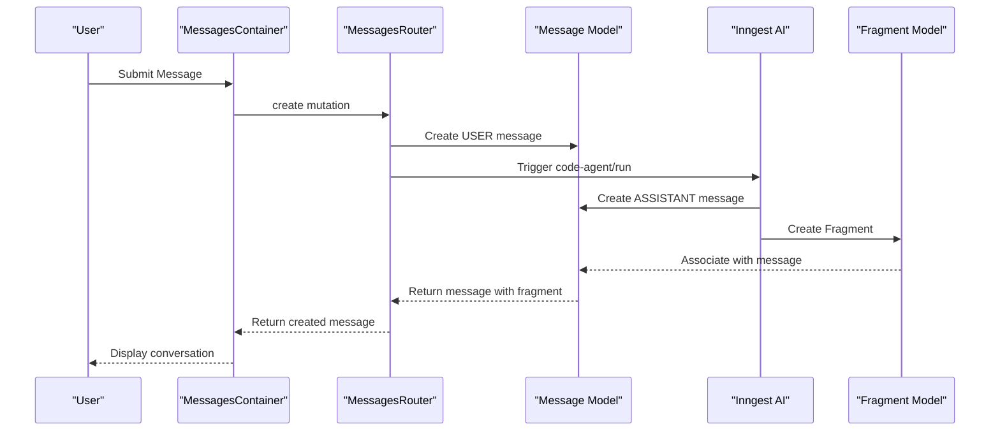

**Diagram sources**
- [src/modules/messages/server/procedures.ts](file://src/modules/messages/server/procedures.ts#L25-L55)
- [src/modules/projects/ui/components/messages-container.tsx](file://src/modules/projects/ui/components/messages-container.tsx#L15-L30)

### UI Rendering Components

The Message model integrates seamlessly with React components to render conversations:

#### MessagesContainer Component
- Fetches messages by projectId using suspense queries
- Implements automatic scrolling to latest messages
- Manages active fragment state for code preview
- Handles real-time updates with polling intervals

#### MessageCard Component
- Renders different layouts based on message role (USER vs ASSISTANT)
- Displays fragments as clickable code previews
- Shows loading indicators for pending AI responses
- Implements fragment activation and navigation

**Section sources**
- [src/modules/projects/ui/components/messages-container.tsx](file://src/modules/projects/ui/components/messages-container.tsx#L1-L75)
- [src/modules/projects/ui/components/message-card.tsx](file://src/modules/projects/ui/components/message-card.tsx#L1-L148)

## Prisma Query Examples

The Message model supports various query patterns for different use cases:

### Basic Message Retrieval

Fetch all messages for a specific project ordered chronologically:

```typescript
// Example query structure (not actual code)
const messages = await prisma.message.findMany({
    where: { projectId: input.projectId },
    orderBy: { createdAt: "asc" },
    include: { fragment: true }
});
```

**Section sources**
- [src/modules/messages/server/procedures.ts](file://src/modules/messages/server/procedures.ts#L10-L25)

### Advanced Filtering Patterns

#### Filter by Message Role
```typescript
// Get only user messages
const userMessages = await prisma.message.findMany({
    where: { 
        projectId: projectId,
        role: "USER"
    }
});

// Get only assistant messages
const assistantMessages = await prisma.message.findMany({
    where: { 
        projectId: projectId,
        role: "ASSISTANT"
    }
});
```

#### Filter by Message Type
```typescript
// Get successful AI responses
const successfulResponses = await prisma.message.findMany({
    where: { 
        projectId: projectId,
        type: "RESULT"
    }
});

// Get error messages
const errorMessages = await prisma.message.findMany({
    where: { 
        projectId: projectId,
        type: "ERROR"
    }
});
```

#### Combined Role and Type Filtering
```typescript
// Get user messages that triggered AI responses
const aiTriggerMessages = await prisma.message.findMany({
    where: { 
        projectId: projectId,
        role: "USER",
        type: "RESULT"
    }
});
```

### Query Optimization Examples

#### Efficient Pagination
```typescript
// Fetch recent messages with limit
const recentMessages = await prisma.message.findMany({
    where: { projectId: projectId },
    orderBy: { createdAt: "desc" },
    take: 50,
    include: { fragment: true }
});
```

#### Selective Field Retrieval
```typescript
// Optimize for UI rendering by selecting only necessary fields
const optimizedMessages = await prisma.message.findMany({
    where: { projectId: projectId },
    select: {
        id: true,
        content: true,
        role: true,
        type: true,
        createdAt: true,
        fragment: {
            select: {
                id: true,
                title: true,
                sandboxUrl: true
            }
        }
    },
    orderBy: { createdAt: "asc" }
});
```

**Section sources**
- [src/modules/messages/server/procedures.ts](file://src/modules/messages/server/procedures.ts#L10-L25)

## Performance Considerations

### Message Retrieval Performance

For long-running projects with extensive conversation histories, several performance optimization strategies should be considered:

#### Indexing Strategy

The current schema includes appropriate indexes:
- **Primary Key Index**: Automatically created on `id` field
- **Unique Index**: Created on `Fragment.messageId` for fast fragment lookups
- **Foreign Key Index**: Implicitly created on `Message.projectId` for project-based queries

#### Query Performance Optimization

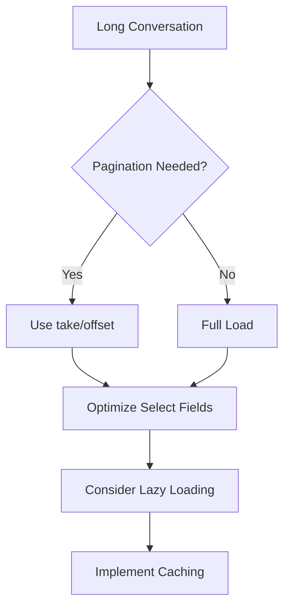

#### Recommended Query Patterns

1. **Pagination for Large Conversations**:
```typescript
const paginatedMessages = await prisma.message.findMany({
    where: { projectId: projectId },
    orderBy: { createdAt: "desc" },
    take: 100, // Limit initial load
    skip: offset,
    include: { fragment: true }
});
```

2. **Selective Loading for Recent Messages**:
```typescript
const recentMessages = await prisma.message.findMany({
    where: { projectId: projectId },
    orderBy: { createdAt: "desc" },
    take: 50,
    select: {
        id: true,
        content: true,
        role: true,
        type: true,
        createdAt: true
    }
});
```

3. **Fragment Preloading Strategy**:
```typescript
// Load messages without fragments initially
const messages = await prisma.message.findMany({
    where: { projectId: projectId },
    select: {
        id: true,
        fragmentId: true // Only load fragment references
    }
});

// Load fragments on demand
const fragments = await prisma.fragment.findMany({
    where: {
        id: { in: messageIds.map(m => m.fragmentId) }
    }
});
```

### Memory Management

#### Client-Side Optimization
- Implement virtualized lists for large message sets
- Use React.memo for expensive message rendering components
- Cache frequently accessed message data in component state

#### Server-Side Optimization
- Consider message archiving for very old conversations
- Implement message aging policies to remove stale data
- Use connection pooling for database connections

**Section sources**
- [prisma/schema.prisma](file://prisma/schema.prisma#L40-L65)
- [src/modules/projects/ui/components/messages-container.tsx](file://src/modules/projects/ui/components/messages-container.tsx#L15-L30)

## Implementation Details

### Server-Side Implementation

The Message model is exposed through tRPC procedures that provide type-safe API endpoints:

#### Create Message Procedure
The create procedure handles user input and triggers AI processing:

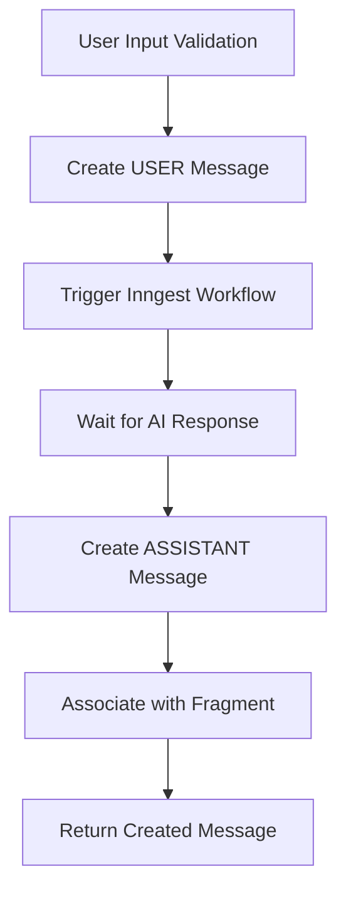

**Diagram sources**
- [src/modules/messages/server/procedures.ts](file://src/modules/messages/server/procedures.ts#L25-L55)

#### Get Many Procedure
Retrieves messages with proper ordering and fragment inclusion:

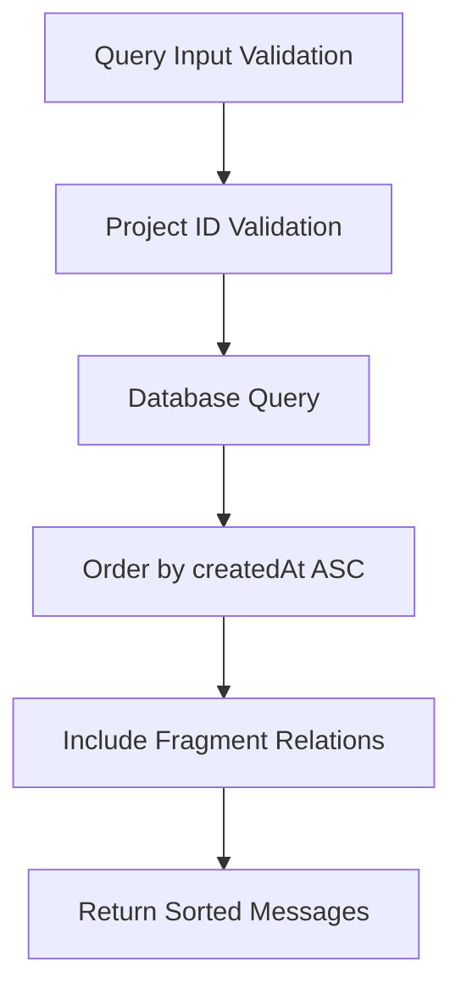

**Diagram sources**
- [src/modules/messages/server/procedures.ts](file://src/modules/messages/server/procedures.ts#L10-L25)

### Client-Side Integration

#### Real-Time Updates
The client-side implementation uses React Query with polling for near-real-time updates:

```typescript
// Polling configuration for continuous updates
const { data: messages } = useSuspenseQuery(
    trpc.messages.getMany.queryOptions({ projectId }, {
        refetchInterval: 5000, // 5-second polling
    }
));
```

#### Fragment Management
The MessagesContainer component manages fragment state and navigation:

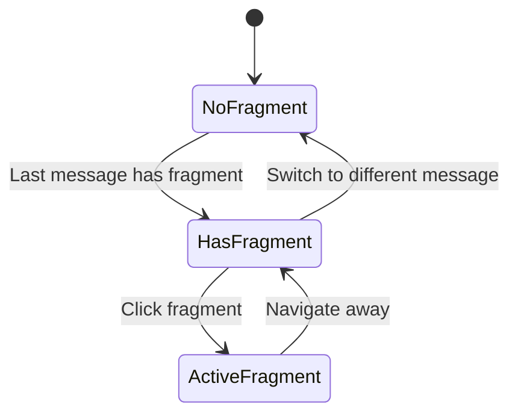

**Diagram sources**
- [src/modules/projects/ui/components/messages-container.tsx](file://src/modules/projects/ui/components/messages-container.tsx#L25-L40)

**Section sources**
- [src/modules/messages/server/procedures.ts](file://src/modules/messages/server/procedures.ts#L1-L55)
- [src/modules/projects/ui/components/messages-container.tsx](file://src/modules/projects/ui/components/messages-container.tsx#L1-L75)

## Best Practices

### Data Integrity Guidelines

1. **Message Validation**: Always validate message content length (1-1000 characters)
2. **Role Assignment**: Only USER and ASSISTANT roles should be used
3. **Type Consistency**: Ensure message types match their intended purpose
4. **Timestamp Management**: Allow database to handle createdAt/updatedAt automatically

### Query Optimization Guidelines

1. **Use Selective Fields**: Only retrieve fields needed for display
2. **Implement Pagination**: For projects with many messages
3. **Cache Frequently Accessed Data**: Use React Query caching effectively
4. **Lazy Load Fragments**: Load fragment data only when needed

### UI/UX Considerations

1. **Smooth Scrolling**: Implement automatic scrolling to new messages
2. **Loading States**: Show appropriate loading indicators during AI processing
3. **Error Handling**: Display meaningful error messages for failed operations
4. **Fragment Navigation**: Provide intuitive fragment activation and preview

### Security Considerations

1. **Input Sanitization**: Validate and sanitize message content
2. **Access Control**: Ensure proper project-level access controls
3. **Rate Limiting**: Implement rate limiting for message creation
4. **Content Moderation**: Consider implementing content filtering for sensitive applications

**Section sources**
- [src/modules/messages/server/procedures.ts](file://src/modules/messages/server/procedures.ts#L25-L55)
- [src/modules/projects/ui/components/message-form.tsx](file://src/modules/projects/ui/components/message-form.tsx#L15-L25)