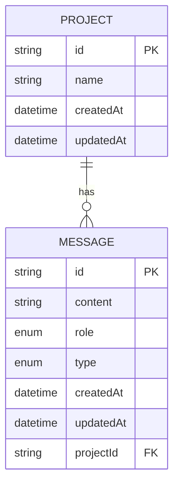
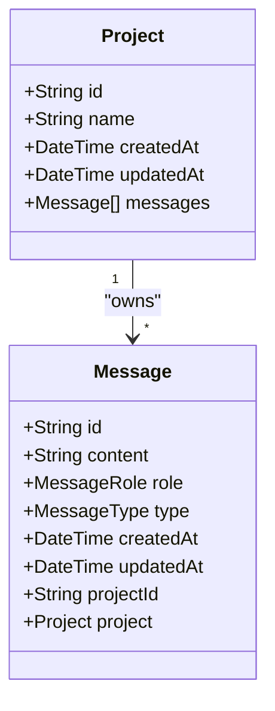
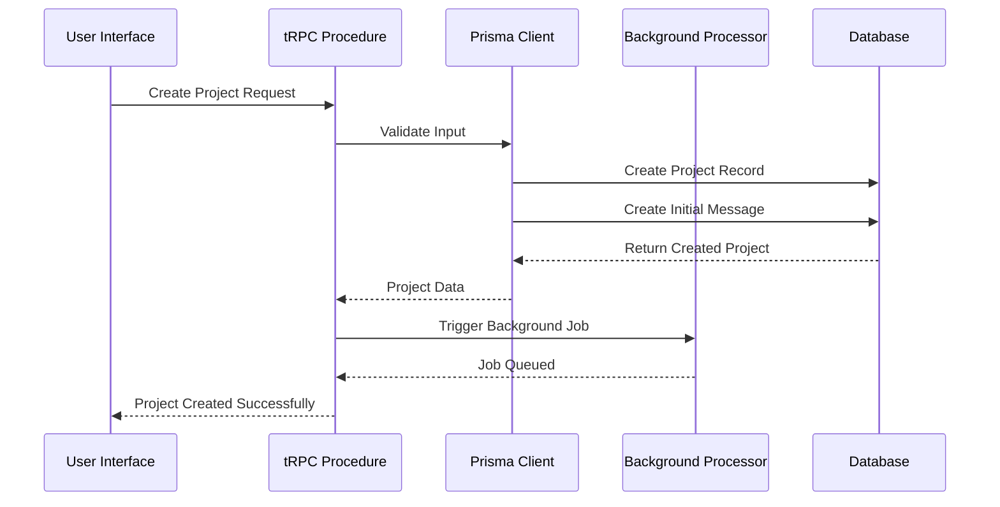
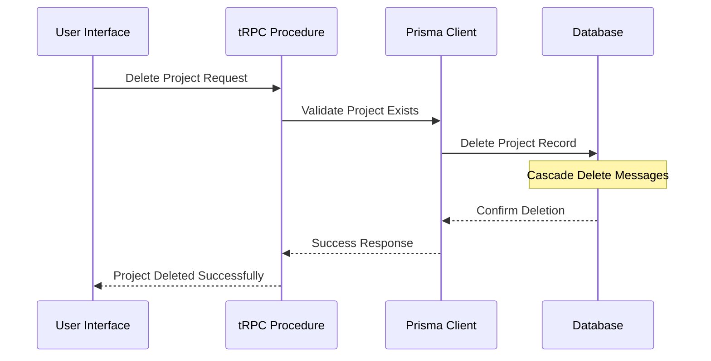

# Project Model

<cite>
**Referenced Files in This Document**
- [prisma/schema.prisma](file://prisma/schema.prisma)
- [prisma/migrations/20251019214950_projects/migration.sql](file://prisma/migrations/20251019214950_projects/migration.sql)
- [src/modules/projects/server/procedures.ts](file://src/modules/projects/server/procedures.ts)
- [src/modules/projects/ui/views/project-view.tsx](file://src/modules/projects/ui/views/project-view.tsx)
- [src/modules/projects/ui/components/project-header.tsx](file://src/modules/projects/ui/components/project-header.tsx)
- [src/modules/home/ui/components/projects-list.tsx](file://src/modules/home/ui/components/projects-list.tsx)
- [src/lib/db.ts](file://src/lib/db.ts)
- [src/generated/prisma/index.d.ts](file://src/generated/prisma/index.d.ts)
- [src/modules/messages/server/procedures.ts](file://src/modules/messages/server/procedures.ts)
- [src/app/projects/[projectId]/page.tsx](file://src/app/projects/[projectId]/page.tsx)
</cite>

## Table of Contents
1. [Introduction](#introduction)
2. [Schema Definition](#schema-definition)
3. [Field Specifications](#field-specifications)
4. [Relationships](#relationships)
5. [SQL Migration](#sql-migration)
6. [Prisma Client Operations](#prisma-client-operations)
7. [tRPC Procedures](#trpc-procedures)
8. [UI Integration](#ui-integration)
9. [Data Integrity Constraints](#data-integrity-constraints)
10. [Performance Considerations](#performance-considerations)
11. [Project Lifecycle Management](#project-lifecycle-management)
12. [Best Practices](#best-practices)

## Introduction

The Project model serves as the central entity in the QAI platform, representing individual AI-powered projects that users create and manage. This model establishes the foundation for project lifecycle management, from creation through deletion, while maintaining strong relationships with associated Message entities. The Project model is designed with PostgreSQL as the underlying database, leveraging Prisma ORM for type-safe database operations and tRPC for efficient API communication.

## Schema Definition

The Project model is defined in the Prisma schema with the following structure:



**Diagram sources**
- [prisma/schema.prisma](file://prisma/schema.prisma#L20-L27)

**Section sources**
- [prisma/schema.prisma](file://prisma/schema.prisma#L20-L27)

## Field Specifications

### Primary Key and Identity

| Field | Type | Prisma Annotation | Description |
|-------|------|-------------------|-------------|
| id | String | `@id @default(uuid())` | Unique identifier using UUID generation |

The `id` field serves as the primary key for the Project entity, automatically generated using UUID v4 format through the `@default(uuid())` annotation. This ensures globally unique identifiers across all project instances.

### Project Metadata

| Field | Type | Prisma Annotation | Description |
|-------|------|-------------------|-------------|
| name | String | None | Human-readable project identifier |
| createdAt | DateTime | `@default(now())` | Automatic timestamp for record creation |
| updatedAt | DateTime | `@updatedAt` | Automatic timestamp for record updates |

The `name` field stores the project's display name, while the `createdAt` and `updatedAt` fields leverage Prisma's built-in annotations for automatic timestamp management. The `@default(now())` annotation initializes the creation timestamp, and `@updatedAt` automatically updates the modification timestamp on record modifications.

**Section sources**
- [prisma/schema.prisma](file://prisma/schema.prisma#L21-L25)

## Relationships

### One-to-Many Relationship with Message Model

The Project model maintains a one-to-many relationship with the Message model through the foreign key constraint on `Message.projectId`. This relationship is established with cascade delete behavior:



**Diagram sources**
- [prisma/schema.prisma](file://prisma/schema.prisma#L26-L27)
- [prisma/schema.prisma](file://prisma/schema.prisma#L47-L49)

### Foreign Key Constraint Details

The relationship is defined with the following Prisma annotations:
- `fields: [projectId]` - Specifies the foreign key field in the Message model
- `references: [id]` - References the primary key in the Project model  
- `onDelete: Cascade` - Ensures automatic deletion of associated messages when a project is deleted

**Section sources**
- [prisma/schema.prisma](file://prisma/schema.prisma#L47-L49)

## SQL Migration

The Project table was introduced through the migration script `20251019214950_projects`, which performs two critical operations:

### Migration Operations

1. **Alter Message Table**: Adds the `projectId` column to the Message table
2. **Create Project Table**: Establishes the new Project table with primary key constraint
3. **Add Foreign Key Constraint**: Creates the relationship between Project and Message tables

### SQL Implementation

The migration includes the following key operations:

```sql
-- Add projectId column to Message table
ALTER TABLE "Message" ADD COLUMN "projectId" TEXT NOT NULL;

-- Create Project table with primary key
CREATE TABLE "Project" (
    "id" TEXT NOT NULL,
    "name" TEXT NOT NULL,
    "createdAt" TIMESTAMP(3) NOT NULL DEFAULT CURRENT_TIMESTAMP,
    "updatedAt" TIMESTAMP(3) NOT NULL,
    CONSTRAINT "Project_pkey" PRIMARY KEY ("id")
);

-- Add foreign key constraint with cascade delete
ALTER TABLE "Message" ADD CONSTRAINT "Message_projectId_fkey" 
FOREIGN KEY ("projectId") REFERENCES "Project"("id") 
ON DELETE CASCADE ON UPDATE CASCADE;
```

**Section sources**
- [prisma/migrations/20251019214950_projects/migration.sql](file://prisma/migrations/20251019214950_projects/migration.sql#L1-L21)

## Prisma Client Operations

### Basic CRUD Operations

The Project model supports standard CRUD operations through Prisma Client:

#### Creating Projects

```typescript
// Basic project creation
await prisma.project.create({
    data: {
        name: "My AI Project",
        messages: {
            create: {
                content: "Initial prompt",
                role: "USER",
                type: "RESULT",
            }
        }
    }
});

// Project creation with auto-generated name
await prisma.project.create({
    data: {
        name: generateSlug(2, { format: "kebab" }),
        messages: {
            create: {
                content: input.value,
                role: "USER",
                type: "RESULT",
            }
        }
    }
});
```

#### Retrieving Projects

```typescript
// Get single project by ID
const project = await prisma.project.findUnique({
    where: { id: projectId },
});

// List all projects with ordering
const projects = await prisma.project.findMany({
    orderBy: { createdAt: "desc" },
});

// Get project with messages (using relations)
const projectWithMessages = await prisma.project.findUnique({
    where: { id: projectId },
    include: { messages: true },
});
```

#### Updating Projects

```typescript
// Update project name
await prisma.project.update({
    where: { id: projectId },
    data: { name: "Updated Project Name" },
});
```

#### Deleting Projects

```typescript
// Delete project (cascade deletes associated messages)
await prisma.project.delete({
    where: { id: projectId },
});
```

**Section sources**
- [src/modules/projects/server/procedures.ts](file://src/modules/projects/server/procedures.ts#L10-L71)

## tRPC Procedures

The Project model is exposed through tRPC procedures that provide type-safe API endpoints:

### Available Procedures

#### getOne - Retrieve Single Project

```typescript
// Input validation
.input(z.object({
    id: z.string().min(1, {message: "Project ID is required"})
}))

// Query implementation
.query(async ({ input }) => {
    const existingProject = await prisma.project.findUnique({
        where: { id: input.id },
    });
    if (!existingProject) {
        throw new TRPCError({
            code: "NOT_FOUND",
            message: "Project not found",
        });
    }
    return existingProject;
});
```

#### getMany - List All Projects

```typescript
// Query implementation
.query(async () => {
    const projects = await prisma.project.findMany({
        orderBy: { createdAt: "desc" },
    });
    return projects;
});
```

#### create - Create New Project

```typescript
// Input validation
.input(z.object({
    value: z.string()
        .min(1, {message: "Prompt is required"})
        .max(1000, {message: "Prompt must be less than 1000 characters"}),
}))

// Mutation implementation
.mutation(async ({ input }) => {
    const createdProject = await prisma.project.create({
        data: {
            name: generateSlug(2, { format: "kebab" }),
            messages: {
                create: {
                    content: input.value,
                    role: "USER",
                    type: "RESULT",
                }
            }
        }
    });

    // Trigger background processing
    await inngest.send({
        name: "code-agent/run",
        data: {
            value: input.value,
            projectId: createdProject.id,
        },
    });
    
    return createdProject;
});
```

**Section sources**
- [src/modules/projects/server/procedures.ts](file://src/modules/projects/server/procedures.ts#L7-L71)

## UI Integration

### Project Listing Component

The ProjectsList component displays all user projects with essential metadata:

```typescript
// ProjectsList.tsx - Project display in dashboard
export const ProjectsList = () => {
    const trpc = useTRPC();
    const { data: projects } = useQuery(trpc.projects.getMany.queryOptions());

    return (
        <div className="grid grid-cols-1 sm:grid-cols-3 gap-6">
            {projects?.map((project) => (
                <Button
                    key={project.id}
                    variant="outline"
                    asChild
                >
                    <Link href={`/projects/${project.id}`}>
                        <div className="flex flex-col">
                            <h3 className="truncate font-medium">
                                {project.name}
                            </h3>
                            <p className="text-xs text-muted-foreground">
                                {formatDistanceToNow(project.createdAt, { addSuffix: true })}
                            </p>
                        </div>
                    </Link>
                </Button>
            ))}
        </div>
    );
};
```

### Project Header Component

The ProjectHeader component provides navigation and project information:

```typescript
// ProjectHeader.tsx - Project details in project view
export const ProjectHeader = ({ projectId }: Props) => {
    const trpc = useTRPC();
    const { data: project } = useSuspenseQuery(
        trpc.projects.getOne.queryOptions({ id: projectId })
    );

    return (
        <header className="p-2 flex justify-between items-center border-b">
            <DropdownMenu>
                <DropdownMenuTrigger asChild>
                    <Button variant="ghost" size="sm">
                        <Image src="/logo.png" alt="QAI" width={30} height={30} />
                        <span className="text-sm font-medium">
                            {project.name}
                        </span>
                    </Button>
                </DropdownMenuTrigger>
            </DropdownMenu>
        </header>
    );
};
```

### Project View Component

The ProjectView component orchestrates the complete project interface:

```typescript
// ProjectView.tsx - Main project interface
export const ProjectView = ({ projectId }: Props) => {
    const [activeFragment, setActiveFragment] = useState<Fragment | null>(null);
    const [tabState, setTabState] = useState<"preview" | "code">("preview");

    return (
        <div className="h-screen">
            {/* Project header */}
            <ProjectHeader projectId={projectId} />
            
            {/* Messages container */}
            <MessagesContainer 
                projectId={projectId}
                activeFragment={activeFragment}
                setActiveFragment={setActiveFragment}
            />
            
            {/* Preview/code tabs */}
            <Tabs value={tabState} onValueChange={setTabState}>
                <TabsContent value="preview">
                    {!!activeFragment && <FragmentWeb data={activeFragment} />}
                </TabsContent>
                <TabsContent value="code">
                    {!!activeFragment?.files && (
                        <FileExplorer files={activeFragment.files} />
                    )}
                </TabsContent>
            </Tabs>
        </div>
    );
};
```

**Section sources**
- [src/modules/home/ui/components/projects-list.tsx](file://src/modules/home/ui/components/projects-list.tsx#L10-L59)
- [src/modules/projects/ui/components/project-header.tsx](file://src/modules/projects/ui/components/project-header.tsx#L30-L35)
- [src/modules/projects/ui/views/project-view.tsx](file://src/modules/projects/ui/views/project-view.tsx#L20-L90)

## Data Integrity Constraints

### Primary Key Constraint

The Project model enforces data integrity through several constraint mechanisms:

1. **UUID Primary Key**: Ensures unique identification across all project instances
2. **Foreign Key Constraint**: Maintains referential integrity between Project and Message tables
3. **Cascade Delete**: Automatically removes associated messages when a project is deleted
4. **Required Fields**: Validates presence of essential fields during creation

### Validation Rules

| Constraint | Implementation | Purpose |
|------------|----------------|---------|
| Project ID Required | Input validation in tRPC | Prevents orphaned records |
| Name Length Limit | Zod schema validation | Ensures reasonable project names |
| Content Length Limit | Zod schema validation | Prevents oversized prompts |
| Cascade Delete | SQL foreign key constraint | Maintains data consistency |

**Section sources**
- [prisma/migrations/20251019214950_projects/migration.sql](file://prisma/migrations/20251019214950_projects/migration.sql#L18-L21)
- [src/modules/projects/server/procedures.ts](file://src/modules/projects/server/procedures.ts#L30-L40)

## Performance Considerations

### Indexing Strategy

The Project model benefits from several performance optimizations:

1. **Primary Key Index**: Automatically created on the `id` field
2. **Composite Indexes**: Consider indexes on frequently queried fields
3. **Foreign Key Index**: Implicitly indexed on `projectId` in Message table

### Query Patterns

#### Efficient Project Listing

```typescript
// Optimized project listing with minimal data
const projects = await prisma.project.findMany({
    select: {
        id: true,
        name: true,
        createdAt: true,
    },
    orderBy: { createdAt: "desc" },
    take: 20, // Limit results
});
```

#### Project with Message Count

```typescript
// Efficient counting without loading all messages
const projectStats = await prisma.project.findUnique({
    where: { id: projectId },
    include: {
        _count: {
            select: { messages: true }
        }
    }
});
```

#### Pagination Support

```typescript
// Implement pagination for large project lists
const projects = await prisma.project.findMany({
    skip: (page - 1) * pageSize,
    take: pageSize,
    orderBy: { createdAt: "desc" },
});
```

### Caching Considerations

The tRPC integration supports React Query caching for improved performance:

```typescript
// Client-side caching with React Query
const { data: projects } = useQuery(
    trpc.projects.getMany.queryOptions()
);

// Prefetching for server-side rendering
void queryClient.prefetchQuery(
    trpc.projects.getOne.queryOptions({ id: projectId })
);
```

**Section sources**
- [src/modules/projects/server/procedures.ts](file://src/modules/projects/server/procedures.ts#L20-L25)
- [src/app/projects/[projectId]/page.tsx](file://src/app/projects/[projectId]/page.tsx#L12-L13)

## Project Lifecycle Management

### Creation Workflow

The project creation process follows a structured workflow:



**Diagram sources**
- [src/modules/projects/server/procedures.ts](file://src/modules/projects/server/procedures.ts#L42-L65)

### Deletion Workflow

When a project is deleted, the cascade constraint ensures complete cleanup:



**Diagram sources**
- [prisma/migrations/20251019214950_projects/migration.sql](file://prisma/migrations/20251019214950_projects/migration.sql#L20-L21)

### State Management

Projects maintain state through several mechanisms:

1. **Timestamp Tracking**: Automatic creation and update timestamps
2. **Relationship State**: Associated messages and fragments
3. **UI State**: Active project selection and navigation state

**Section sources**
- [src/modules/projects/server/procedures.ts](file://src/modules/projects/server/procedures.ts#L10-L71)

## Best Practices

### Data Modeling Guidelines

1. **UUID Primary Keys**: Use UUIDs for globally unique identification
2. **Automatic Timestamps**: Leverage `@default(now())` and `@updatedAt` annotations
3. **Cascade Relationships**: Implement cascade delete for related entities
4. **Validation Layers**: Apply validation at both tRPC and Prisma levels

### Performance Optimization

1. **Selective Field Loading**: Use `select` clauses to load only necessary fields
2. **Pagination**: Implement pagination for large datasets
3. **Caching**: Utilize React Query for client-side caching
4. **Indexing**: Ensure appropriate indexes on frequently queried fields

### Error Handling

1. **Graceful Degradation**: Handle missing projects with appropriate error messages
2. **Validation Feedback**: Provide clear validation error messages
3. **Transaction Safety**: Use transactions for complex operations
4. **Retry Logic**: Implement retry mechanisms for transient failures

### Security Considerations

1. **Input Validation**: Validate all user inputs at multiple layers
2. **Access Control**: Implement proper authorization checks
3. **Data Sanitization**: Sanitize user inputs to prevent injection attacks
4. **Audit Logging**: Log important operations for security monitoring

**Section sources**
- [src/modules/projects/server/procedures.ts](file://src/modules/projects/server/procedures.ts#L15-L25)
- [prisma/schema.prisma](file://prisma/schema.prisma#L21-L25)