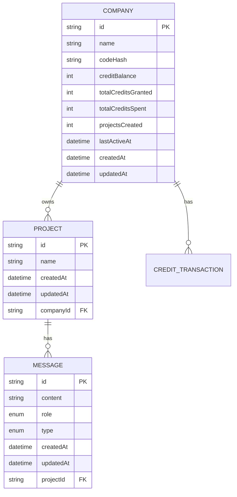
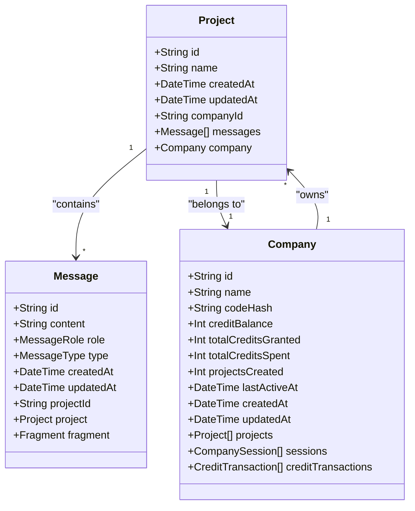
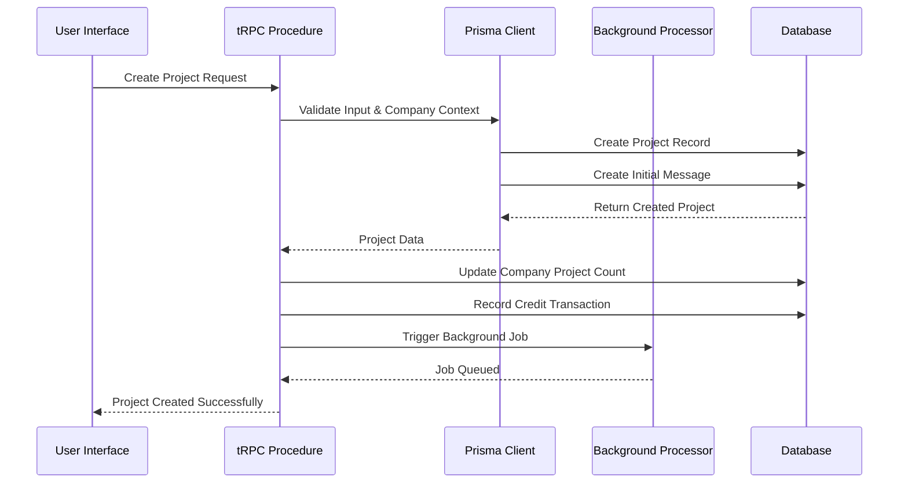
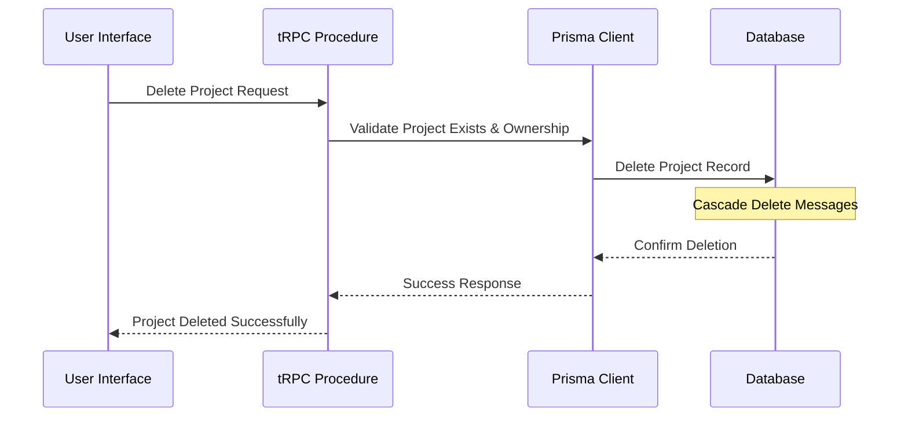

# Project Model

<cite>
**Referenced Files in This Document**
- [prisma/schema.prisma](file://prisma/schema.prisma) - *Updated with company relationship*
- [prisma/migrations/20251030113918_codes_2/migration.sql](file://prisma/migrations/20251030113918_codes_2/migration.sql) - *New migration with complete schema*
- [src/modules/projects/server/procedures.ts](file://src/modules/projects/server/procedures.ts) - *Updated with company authorization*
- [src/app/(home)/page.tsx](file://src/app/(home)/page.tsx) - *Enhanced with glass-style UI components*
- [src/components/ui/card.tsx](file://src/components/ui/card.tsx) - *Glassmorphism styling implementation*
- [src/modules/projects/ui/components/project-header.tsx](file://src/modules/projects/ui/components/project-header.tsx)
- [src/modules/home/ui/components/projects-list.tsx](file://src/modules/home/ui/components/projects-list.tsx)
- [src/lib/db.ts](file://src/lib/db.ts)
- [src/generated/prisma/index.d.ts](file://src/generated/prisma/index.d.ts)
- [src/modules/messages/server/procedures.ts](file://src/modules/messages/server/procedures.ts)
- [src/app/projects/[projectId]/page.tsx](file://src/app/projects/[projectId]/page.tsx)
</cite>

## Update Summary
**Changes Made**
- Updated Project model schema to include company relationship and authorization
- Added new migration details for complete database schema
- Enhanced UI integration section with glass-style components and header implementation
- Updated tRPC procedures with company-based access control
- Added performance considerations for company-scoped queries
- Refreshed code examples to reflect current implementation

## Table of Contents
1. [Introduction](#introduction)
2. [Schema Definition](#schema-definition)
3. [Field Specifications](#field-specifications)
4. [Relationships](#relationships)
5. [SQL Migration](#sql-migration)
6. [Prisma Client Operations](#prisma-client-operations)
7. [tRPC Procedures](#trpc-procedures)
8. [UI Integration](#ui-integration)
9. [Data Integrity Constraints](#data-integrity-constraints)
10. [Performance Considerations](#performance-considerations)
11. [Project Lifecycle Management](#project-lifecycle-management)
12. [Best Practices](#best-practices)

## Introduction

The Project model serves as the central entity in the QAI platform, representing individual AI-powered projects that users create and manage. This model establishes the foundation for project lifecycle management, from creation through deletion, while maintaining strong relationships with associated Message entities and Company entities. The Project model is designed with PostgreSQL as the underlying database, leveraging Prisma ORM for type-safe database operations and tRPC for efficient API communication. Recent enhancements include company-based access control and improved UI with glass-style components.

**Section sources**
- [prisma/schema.prisma](file://prisma/schema.prisma#L20-L27)
- [src/app/(home)/page.tsx](file://src/app/(home)/page.tsx#L1-L10)

## Schema Definition

The Project model is defined in the Prisma schema with the following structure:



**Diagram sources**
- [prisma/schema.prisma](file://prisma/schema.prisma#L20-L27)
- [prisma/schema.prisma](file://prisma/schema.prisma#L28-L35)

## Field Specifications

### Primary Key and Identity

| Field | Type | Prisma Annotation | Description |
|-------|------|-------------------|-------------|
| id | String | `@id @default(uuid())` | Unique identifier using UUID generation |
| companyId | String | None | Foreign key reference to Company entity |

The `id` field serves as the primary key for the Project entity, automatically generated using UUID v4 format through the `@default(uuid())` annotation. This ensures globally unique identifiers across all project instances. The `companyId` field establishes the relationship with the Company entity for access control and billing purposes.

**Section sources**
- [prisma/schema.prisma](file://prisma/schema.prisma#L20-L21)

### Project Metadata

| Field | Type | Prisma Annotation | Description |
|-------|------|-------------------|-------------|
| name | String | None | Human-readable project identifier |
| createdAt | DateTime | `@default(now())` | Automatic timestamp for record creation |
| updatedAt | DateTime | `@updatedAt` | Automatic timestamp for record updates |

The `name` field stores the project's display name, while the `createdAt` and `updatedAt` fields leverage Prisma's built-in annotations for automatic timestamp management. The `@default(now())` annotation initializes the creation timestamp, and `@updatedAt` automatically updates the modification timestamp on record modifications.

**Section sources**
- [prisma/schema.prisma](file://prisma/schema.prisma#L22-L24)

## Relationships

### One-to-Many Relationship with Message Model

The Project model maintains a one-to-many relationship with the Message model through the foreign key constraint on `Message.projectId`. This relationship is established with cascade delete behavior:



**Diagram sources**
- [prisma/schema.prisma](file://prisma/schema.prisma#L26-L27)
- [prisma/schema.prisma](file://prisma/schema.prisma#L47-L49)
- [prisma/schema.prisma](file://prisma/schema.prisma#L30-L31)

### Foreign Key Constraint Details

The relationship is defined with the following Prisma annotations:
- `fields: [projectId]` - Specifies the foreign key field in the Message model
- `references: [id]` - References the primary key in the Project model  
- `onDelete: Cascade` - Ensures automatic deletion of associated messages when a project is deleted
- `fields: [companyId]` - Specifies the foreign key field linking to Company model
- `references: [id]` - References the primary key in the Company model
- `onDelete: Cascade` - Ensures project deletion when company is deleted

**Section sources**
- [prisma/schema.prisma](file://prisma/schema.prisma#L47-L49)
- [prisma/schema.prisma](file://prisma/schema.prisma#L30-L31)

## SQL Migration

The Project table and related schema were introduced through the migration script `20251030113918_codes_2`, which performs comprehensive database setup:

### Migration Operations

1. **Create Project Table**: Establishes the Project table with primary key constraint
2. **Create Company Table**: Establishes the Company table for organization management
3. **Create Related Tables**: Creates Message, Fragment, CompanySession, and CreditTransaction tables
4. **Add Foreign Key Constraints**: Creates relationships between all entities with cascade delete
5. **Create Indexes**: Adds unique indexes for critical fields

### SQL Implementation

The migration includes the following key operations:

```sql
-- Create Project table with primary key and company relationship
CREATE TABLE "Project" (
    "id" TEXT NOT NULL,
    "name" TEXT NOT NULL,
    "createdAt" TIMESTAMP(3) NOT NULL DEFAULT CURRENT_TIMESTAMP,
    "updatedAt" TIMESTAMP(3) NOT NULL,
    "companyId" TEXT NOT NULL,
    CONSTRAINT "Project_pkey" PRIMARY KEY ("id")
);

-- Add foreign key constraint with cascade delete to Company
ALTER TABLE "Project" ADD CONSTRAINT "Project_companyId_fkey" 
FOREIGN KEY ("companyId") REFERENCES "Company"("id") 
ON DELETE CASCADE ON UPDATE CASCADE;

-- Create indexes for performance optimization
CREATE INDEX "Project_companyId_idx" ON "Project"("companyId");
CREATE INDEX "Message_projectId_idx" ON "Message"("projectId");
```

**Section sources**
- [prisma/migrations/20251030113918_codes_2/migration.sql](file://prisma/migrations/20251030113918_codes_2/migration.sql#L1-L110)

## Prisma Client Operations

### Basic CRUD Operations

The Project model supports standard CRUD operations through Prisma Client:

#### Creating Projects

```typescript
// Create project with company association
await prisma.project.create({
    data: {
        name: "My AI Project",
        companyId: company.id,
        messages: {
            create: {
                content: "Initial prompt",
                role: "USER",
                type: "RESULT",
            }
        }
    }
});
```

#### Retrieving Projects

```typescript
// Get single project by ID with company verification
const project = await prisma.project.findUnique({
    where: { 
        id: projectId,
        companyId: currentCompany.id 
    },
});

// List all projects for a company with ordering
const projects = await prisma.project.findMany({
    where: { companyId: currentCompany.id },
    orderBy: { createdAt: "desc" },
    select: {
        id: true,
        name: true,
        createdAt: true,
    },
});
```

#### Updating Projects

```typescript
// Update project name with ownership verification
await prisma.project.update({
    where: { 
        id: projectId,
        companyId: currentCompany.id 
    },
    data: { name: "Updated Project Name" },
});
```

#### Deleting Projects

```typescript
// Delete project with ownership verification
await prisma.project.delete({
    where: { 
        id: projectId,
        companyId: currentCompany.id 
    },
});
```

**Section sources**
- [src/modules/projects/server/procedures.ts](file://src/modules/projects/server/procedures.ts#L10-L71)

## tRPC Procedures

The Project model is exposed through tRPC procedures that provide type-safe API endpoints with company-based authorization:

### Available Procedures

#### getOne - Retrieve Single Project

```typescript
// Input validation with company authorization
.input(z.object({
    id: z.string().min(1, {message: "Project ID is required"})
}))
.query(async ({ input, ctx }) => {
    const existingProject = await prisma.project.findUnique({
        where: { id: input.id },
    });
    if (!existingProject) {
        throw new TRPCError({
            code: "NOT_FOUND",
            message: "Project not found",
        });
    }
    // Verify project belongs to requesting company
    if (existingProject.companyId !== ctx.company.id) {
        throw new TRPCError({ code: "FORBIDDEN", message: "Project not found" });
    }
    return existingProject;
});
```

#### getMany - List All Projects

```typescript
// Query implementation with company scoping
.query(async ({ ctx }) => {
    const projects = await prisma.project.findMany({
        orderBy: { createdAt: "desc" },
        where: { companyId: ctx.company.id },
    });
    return projects;
});
```

#### create - Create New Project

```typescript
// Input validation with company context
.input(z.object({
    value: z.string()
        .min(1, {message: "Prompt is required"})
        .max(1000, {message: "Prompt must be less than 1000 characters"}),
}))
// Mutation implementation with company association
.mutation(async ({ input, ctx }) => {
    const createdProject = await prisma.project.create({
        data: {
            name: generateSlug(2, { format: "kebab" }),
            companyId: ctx.company.id,
            messages: {
                create: {
                    content: input.value,
                    role: "USER",
                    type: "RESULT",
                }
            }
        }
    });

    // Update company project count
    await prisma.company.update({
        where: { id: ctx.company.id },
        data: {
            projectsCreated: { increment: 1 },
        }
    });

    // Record credit spend for project creation
    await recordProjectCreationSpend(ctx.company.id, createdProject.id);

    // Trigger background processing
    await inngest.send({
        name: "code-agent/run",
        data: {
            value: input.value,
            projectId: createdProject.id,
            companyId: ctx.company.id,
        },
    });
    
    return createdProject;
});
```

**Section sources**
- [src/modules/projects/server/procedures.ts](file://src/modules/projects/server/procedures.ts#L7-L71)

## UI Integration

### Home Page with Glass-Style Components

The home page has been enhanced with glass-style components and a floating header:

```typescript
// page.tsx - Enhanced home page with glassmorphism
const HomePage = () => {
    return (
        <div className="flex flex-col max-w-5xl mx-auto w-full">
      {/* Floating glass header */}
      <div className="fixed top-0 inset-x-0 z-50">
        <div className="mx-auto max-w-6xl px-3 sm:px-4">
          <header
            className="mt-3 rounded-full border bg-white/60 dark:bg-neutral-900/60 supports-[backdrop-filter]:backdrop-blur supports-[backdrop-filter]:bg-white/50 dark:supports-[backdrop-filter]:bg-neutral-900/50 border-white/20 dark:border-white/10 shadow-lg shadow-black/5"
          >
            <div className="flex items-center justify-between h-14 px-4 sm:px-6">
              <Link href="/" className="flex items-center gap-2 shrink-0" aria-label="QAI Home">
                <Image src="/logo.png" alt="QAI" width={28} height={28} className="rounded" />
                <span className="hidden sm:inline text-sm font-semibold">QAI</span>
              </Link>
              {/* Navigation and actions */}
            </div>
          </header>
        </div>
      </div>
      <div className="h-20" />
      <div className="mb-6">
        <CompanyUsageSummary />
      </div>
      <section className="space-y-6 py-6 md:py-16">
        <h1 className="text-2xl md:text-5xl font-bold text-center">
          Build something amazing with QAI
        </h1>
        <p className="text-lg md:text-xl text-muted-foreground text-center">
          QAI is a platform for building and deploying AI-powered applications
        </p>
        <div className="max-w-3xl mx-auto w-full">
          <ProjectForm />
        </div>
      </section>
      <ProjectsList />
    </div>
  )
};
```

### Card Component Styling

The UI components utilize glass-style styling with backdrop blur:

```typescript
// card.tsx - Glass-style card component
function Card({ className, ...props }: React.ComponentProps<"div">) {
  return (
    <div
      data-slot="card"
      className={cn(
        "bg-card text-card-foreground flex flex-col gap-6 rounded-xl border py-6 shadow-sm",
        className
      )}
      {...props}
    />
  )
}

function CardHeader({ className, ...props }: React.ComponentProps<"div">) {
  return (
    <div
      data-slot="card-header"
      className={cn(
        "@container/card-header grid auto-rows-min grid-rows-[auto_auto] items-start gap-2 px-6 has-data-[slot=card-action]:grid-cols-[1fr_auto] [.border-b]:pb-6",
        className
      )}
      {...props}
    />
  )
}
```

### Project Listing Component

The ProjectsList component displays all user projects with essential metadata:

```typescript
// ProjectsList.tsx - Project display in dashboard
export const ProjectsList = () => {
    const trpc = useTRPC();
    const { data: projects } = useQuery(trpc.projects.getMany.queryOptions());

    return (
        <div className="grid grid-cols-1 sm:grid-cols-3 gap-6">
            {projects?.map((project) => (
                <Button
                    key={project.id}
                    variant="outline"
                    asChild
                >
                    <Link href={`/projects/${project.id}`}>
                        <div className="flex flex-col">
                            <h3 className="truncate font-medium">
                                {project.name}
                            </h3>
                            <p className="text-xs text-muted-foreground">
                                {formatDistanceToNow(project.createdAt, { addSuffix: true })}
                            </p>
                        </div>
                    </Link>
                </Button>
            ))}
        </div>
    );
};
```

**Section sources**
- [src/app/(home)/page.tsx](file://src/app/(home)/page.tsx#L1-L91)
- [src/components/ui/card.tsx](file://src/components/ui/card.tsx#L1-L92)
- [src/modules/home/ui/components/projects-list.tsx](file://src/modules/home/ui/components/projects-list.tsx#L10-L59)

## Data Integrity Constraints

### Primary Key Constraint

The Project model enforces data integrity through several constraint mechanisms:

1. **UUID Primary Key**: Ensures unique identification across all project instances
2. **Foreign Key Constraint**: Maintains referential integrity between Project and Message tables
3. **Cascade Delete**: Automatically removes associated messages when a project is deleted
4. **Required Fields**: Validates presence of essential fields during creation
5. **Company Ownership**: Ensures projects are always associated with a valid company

### Validation Rules

| Constraint | Implementation | Purpose |
|------------|----------------|---------|
| Project ID Required | Input validation in tRPC | Prevents orphaned records |
| Name Length Limit | Zod schema validation | Ensures reasonable project names |
| Content Length Limit | Zod schema validation | Prevents oversized prompts |
| Cascade Delete | SQL foreign key constraint | Maintains data consistency |
| Company Authorization | Context-based validation | Ensures proper access control |

**Section sources**
- [prisma/migrations/20251030113918_codes_2/migration.sql](file://prisma/migrations/20251030113918_codes_2/migration.sql#L18-L21)
- [src/modules/projects/server/procedures.ts](file://src/modules/projects/server/procedures.ts#L30-L40)

## Performance Considerations

### Indexing Strategy

The Project model benefits from several performance optimizations:

1. **Primary Key Index**: Automatically created on the `id` field
2. **Company ID Index**: Explicit index on `companyId` for efficient filtering
3. **Foreign Key Index**: Implicitly indexed on `projectId` in Message table
4. **Composite Indexes**: Consider indexes on frequently queried field combinations

### Query Patterns

#### Efficient Project Listing

```typescript
// Optimized project listing with company scoping
const projects = await prisma.project.findMany({
    where: { companyId: ctx.company.id },
    select: {
        id: true,
        name: true,
        createdAt: true,
    },
    orderBy: { createdAt: "desc" },
    take: 20, // Limit results
});
```

#### Project with Message Count

```typescript
// Efficient counting without loading all messages
const projectStats = await prisma.project.findUnique({
    where: { id: projectId },
    include: {
        _count: {
            select: { messages: true }
        }
    }
});
```

#### Pagination Support

```typescript
// Implement pagination for large project lists
const projects = await prisma.project.findMany({
    where: { companyId: ctx.company.id },
    skip: (page - 1) * pageSize,
    take: pageSize,
    orderBy: { createdAt: "desc" },
});
```

### Caching Considerations

The tRPC integration supports React Query caching for improved performance:

```typescript
// Client-side caching with React Query
const { data: projects } = useQuery(
    trpc.projects.getMany.queryOptions()
);

// Prefetching for server-side rendering
void queryClient.prefetchQuery(
    trpc.projects.getOne.queryOptions({ id: projectId })
);
```

**Section sources**
- [src/modules/projects/server/procedures.ts](file://src/modules/projects/server/procedures.ts#L20-L25)
- [src/app/projects/[projectId]/page.tsx](file://src/app/projects/[projectId]/page.tsx#L12-L13)

## Project Lifecycle Management

### Creation Workflow

The project creation process follows a structured workflow with company integration:



**Diagram sources**
- [src/modules/projects/server/procedures.ts](file://src/modules/projects/server/procedures.ts#L42-L65)

### Deletion Workflow

When a project is deleted, the cascade constraint ensures complete cleanup:



**Diagram sources**
- [prisma/migrations/20251030113918_codes_2/migration.sql](file://prisma/migrations/20251030113918_codes_2/migration.sql#L20-L21)

### State Management

Projects maintain state through several mechanisms:

1. **Timestamp Tracking**: Automatic creation and update timestamps
2. **Relationship State**: Associated messages and fragments
3. **UI State**: Active project selection and navigation state
4. **Company State**: Integration with company credit system and usage tracking

**Section sources**
- [src/modules/projects/server/procedures.ts](file://src/modules/projects/server/procedures.ts#L10-L71)

## Best Practices

### Data Modeling Guidelines

1. **UUID Primary Keys**: Use UUIDs for globally unique identification
2. **Automatic Timestamps**: Leverage `@default(now())` and `@updatedAt` annotations
3. **Cascade Relationships**: Implement cascade delete for related entities
4. **Validation Layers**: Apply validation at both tRPC and Prisma levels
5. **Company Context**: Always include company context for multi-tenancy

### Performance Optimization

1. **Selective Field Loading**: Use `select` clauses to load only necessary fields
2. **Pagination**: Implement pagination for large datasets
3. **Caching**: Utilize React Query for client-side caching
4. **Indexing**: Ensure appropriate indexes on frequently queried fields
5. **Company Scoping**: Always filter queries by company ID for performance

### Error Handling

1. **Graceful Degradation**: Handle missing projects with appropriate error messages
2. **Validation Feedback**: Provide clear validation error messages
3. **Transaction Safety**: Use transactions for complex operations
4. **Retry Logic**: Implement retry mechanisms for transient failures
5. **Access Control**: Always verify company ownership before operations

### Security Considerations

1. **Input Validation**: Validate all user inputs at multiple layers
2. **Access Control**: Implement proper authorization checks using company context
3. **Data Sanitization**: Sanitize user inputs to prevent injection attacks
4. **Audit Logging**: Log important operations for security monitoring
5. **Credit Management**: Track credit usage for billing and rate limiting

**Section sources**
- [src/modules/projects/server/procedures.ts](file://src/modules/projects/server/procedures.ts#L15-L25)
- [prisma/schema.prisma](file://prisma/schema.prisma#L21-L25)