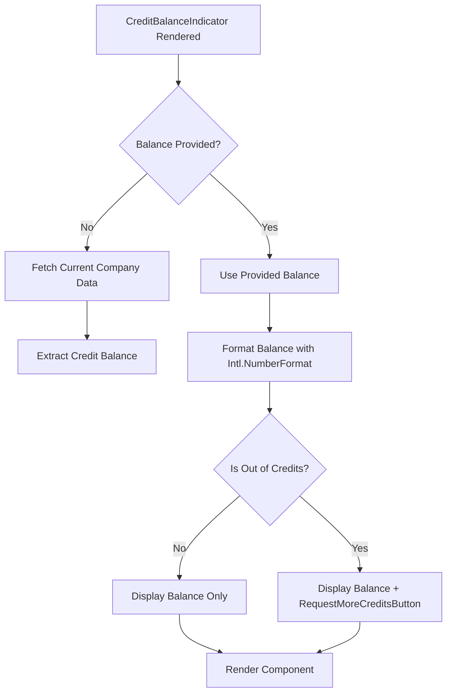
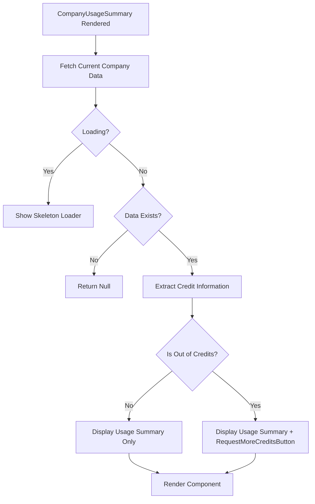
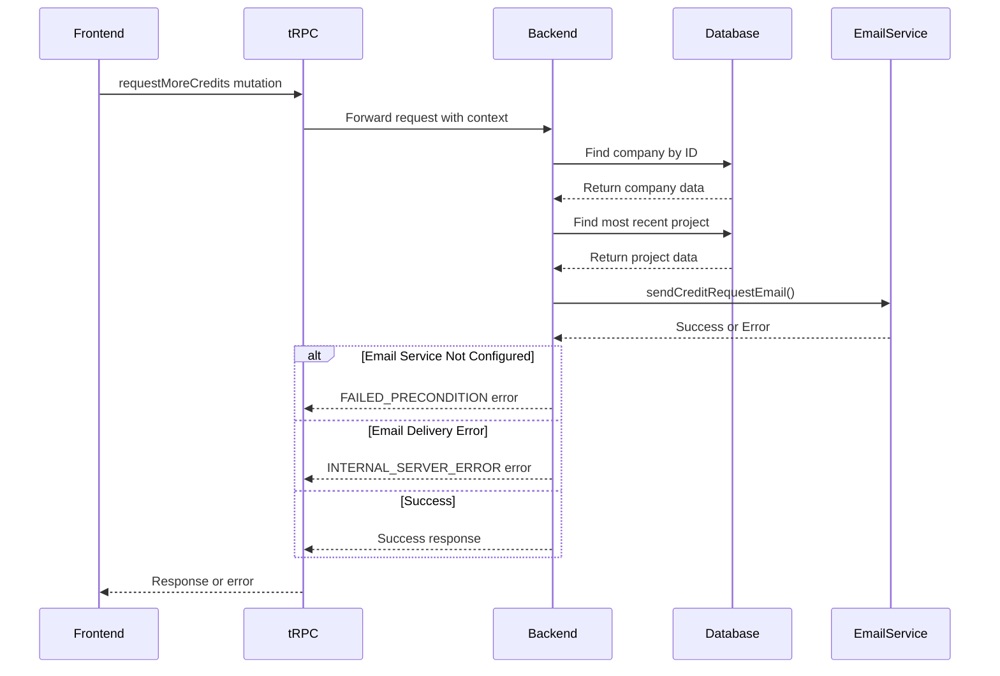
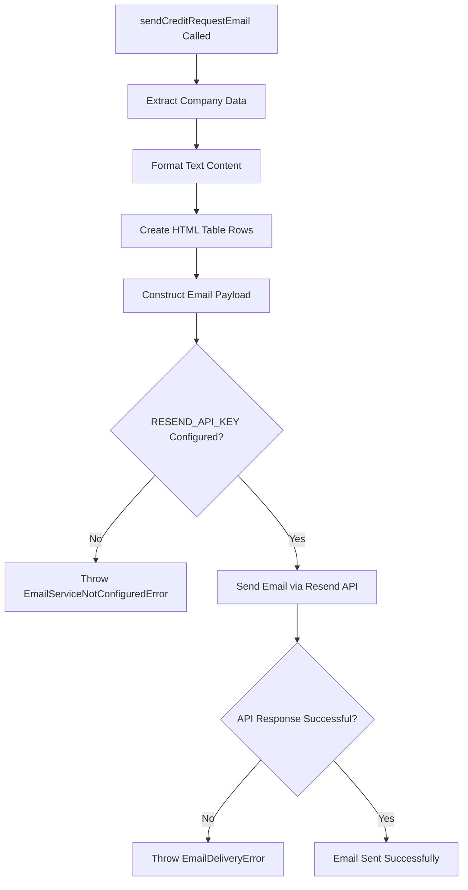
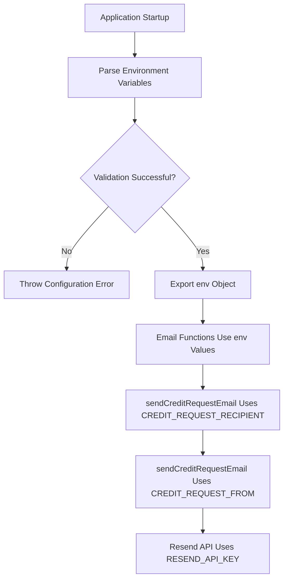
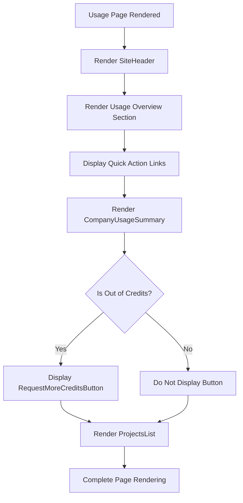

# Request More Credits

<cite>
**Referenced Files in This Document**   
- [request-more-credits-button.tsx](file://src/components/request-more-credits-button.tsx)
- [credit-balance-indicator.tsx](file://src/components/credit-balance-indicator.tsx)
- [company-usage.tsx](file://src/modules/home/ui/components/company-usage.tsx)
- [procedures.ts](file://src/modules/companies/server/procedures.ts)
- [email.ts](file://src/lib/email.ts)
- [env.ts](file://src/lib/env.ts)
- [usage/page.tsx](file://src/app/usage/page.tsx)
</cite>

## Table of Contents
1. [Introduction](#introduction)
2. [Request More Credits Button Component](#request-more-credits-button-component)
3. [Credit Balance Indicator Integration](#credit-balance-indicator-integration)
4. [Company Usage Summary Component](#company-usage-summary-component)
5. [Backend Implementation](#backend-implementation)
6. [Email Notification System](#email-notification-system)
7. [Environment Configuration](#environment-configuration)
8. [Usage Page Integration](#usage-page-integration)
9. [Conclusion](#conclusion)

## Introduction
This document provides a comprehensive analysis of the "Request More Credits" functionality in the QAI application. The system allows companies to request additional credits when their balance is depleted, triggering an email notification to administrators for review and potential credit allocation. The implementation spans frontend components, backend API routes, email services, and database interactions.

## Request More Credits Button Component

The `RequestMoreCreditsButton` component is a client-side React component that enables users to request additional credits when their balance is depleted. The button handles the mutation request through tRPC and provides visual feedback during the request process.

The component uses React Query's `useMutation` hook to manage the asynchronous request to the backend. It displays different states: loading (with spinner), success (with confirmation message), and the default state with the "Request more credits" text. The button is disabled when the request is pending or has already been successfully submitted.

```mermaid
flowchart TD
A[User Clicks Button] --> B{Is Button Disabled?}
B --> |Yes| C[Prevent Default Action]
B --> |No| D[Execute onClick Handler]
D --> E{Event Prevented?}
E --> |Yes| F[Stop Processing]
E --> |No| G[Trigger Mutation]
G --> H[Send Request to Backend]
H --> I{Success?}
I --> |Yes| J[Show Success Toast]
I --> |No| K[Show Error Toast]
J --> L[Button Shows "Request sent"]
K --> M[Button Returns to Initial State]
```

**Diagram sources**
- [request-more-credits-button.tsx](file://src/components/request-more-credits-button.tsx#L0-L75)

**Section sources**
- [request-more-credits-button.tsx](file://src/components/request-more-credits-button.tsx#L0-L75)

## Credit Balance Indicator Integration

The `CreditBalanceIndicator` component displays the current credit balance for a company and conditionally renders the "Request More Credits" button when the balance is depleted. This component is used in various parts of the application to provide consistent credit balance visualization.

The component supports two variants: "card" and "inline". In both variants, when the credit balance is zero or negative, the `RequestMoreCreditsButton` is displayed, allowing users to initiate the credit request process. The component uses React Query to fetch the current company data and memoizes the formatted balance for performance optimization.



**Diagram sources**
- [credit-balance-indicator.tsx](file://src/components/credit-balance-indicator.tsx#L0-L92)

**Section sources**
- [credit-balance-indicator.tsx](file://src/components/credit-balance-indicator.tsx#L0-L92)

## Company Usage Summary Component

The `CompanyUsageSummary` component on the usage page provides a comprehensive overview of a company's activity and credit usage. When the company has exhausted its credits, this component displays the "Request More Credits" button, providing another entry point for credit requests.

This component fetches the current company data including credit balance, total credits spent, projects created, and last activity information. It formats this data into a user-friendly display and includes the request button when appropriate. The component also handles loading states with skeleton placeholders.



**Diagram sources**
- [company-usage.tsx](file://src/modules/home/ui/components/company-usage.tsx#L0-L77)

**Section sources**
- [company-usage.tsx](file://src/modules/home/ui/components/company-usage.tsx#L0-L77)

## Backend Implementation

The backend implementation of the credit request functionality is handled through tRPC procedures in the `companiesRouter`. The `requestMoreCredits` mutation is the core of this functionality, responsible for processing credit requests from companies.

When a request is received, the backend retrieves the company's information and recent project activity, then attempts to send a notification email to administrators. The implementation includes error handling for cases where the email service is not configured or email delivery fails.



**Diagram sources**
- [procedures.ts](file://src/modules/companies/server/procedures.ts#L44-L98)

**Section sources**
- [procedures.ts](file://src/modules/companies/server/procedures.ts#L44-L98)

## Email Notification System

The email notification system is responsible for alerting administrators when a company requests additional credits. The `sendCreditRequestEmail` function formats a detailed email containing relevant company information to assist administrators in their decision-making process.

The email includes comprehensive information about the requesting company: name, ID, code label, current credit balance, total credits granted and spent, number of projects created, last active date, join date, and the timestamp of the request. This information helps administrators evaluate the request based on the company's usage patterns and history.



**Diagram sources**
- [email.ts](file://src/lib/email.ts#L75-L118)

**Section sources**
- [email.ts](file://src/lib/email.ts#L75-L118)

## Environment Configuration

The credit request system relies on environment variables for email configuration, which are validated and parsed using Zod. These configuration values determine the email addresses used for sending and receiving credit request notifications.

The system uses Resend as the email service provider, with the API key stored in the `RESEND_API_KEY` environment variable. The `CREDIT_REQUEST_RECIPIENT` and `CREDIT_REQUEST_FROM` variables define the destination and sender addresses for credit request emails, respectively. If the API key is not configured, the system will throw an error when attempting to send emails.



**Diagram sources**
- [env.ts](file://src/lib/env.ts#L0-L32)

**Section sources**
- [env.ts](file://src/lib/env.ts#L0-L32)

## Usage Page Integration

The "Request More Credits" functionality is integrated into the usage page, which serves as a central hub for monitoring credit usage and company performance. The usage page combines the `CompanyUsageSummary` component with project statistics and quick action links.

The page is designed to provide a comprehensive overview of a company's activity while also offering pathways to request more credits, invite collaborators to earn rewards, and access documentation. This strategic placement ensures that users can easily request additional credits when needed, without having to navigate away from their usage analytics.



**Section sources**
- [usage/page.tsx](file://src/app/usage/page.tsx#L0-L107)

## Conclusion
The "Request More Credits" functionality in the QAI application provides a seamless process for companies to request additional credits when their balance is depleted. The system integrates frontend components, backend API routes, and email notifications to create a complete workflow that connects users with administrators.

Key aspects of the implementation include:
- A user-friendly button component that provides visual feedback during the request process
- Multiple integration points throughout the application where the request button appears when credits are depleted
- A backend system that collects relevant company data and sends detailed notifications to administrators
- An email notification system that provides administrators with comprehensive information to evaluate credit requests
- Environment configuration that ensures secure and reliable email delivery

This functionality supports the application's credit-based usage model by providing a clear pathway for companies to continue using the service when their initial allocation is exhausted, while also giving administrators the information they need to make informed decisions about credit allocation.