# Component Library

<cite>
**Referenced Files in This Document**   
- [button.tsx](file://src/components/ui/button.tsx)
- [card.tsx](file://src/components/ui/card.tsx)
- [dialog.tsx](file://src/components/ui/dialog.tsx)
- [input.tsx](file://src/components/ui/input.tsx)
- [form.tsx](file://src/components/ui/form.tsx)
- [project-form.tsx](file://src/modules/home/ui/components/project-form.tsx)
- [message-card.tsx](file://src/modules/projects/ui/components/message-card.tsx)
- [messages-container.tsx](file://src/modules/projects/ui/components/messages-container.tsx)
- [project-view.tsx](file://src/modules/projects/ui/views/project-view.tsx)
- [use-mobile.ts](file://src/hooks/use-mobile.ts)
- [components.json](file://components.json)
- [globals.css](file://src/app/globals.css)
- [constants.ts](file://src/modules/home/constants.ts)
- [utils.ts](file://src/lib/utils.ts)
- [client.tsx](file://src/trpc/client.tsx)
</cite>

## Table of Contents
1. [Introduction](#introduction)
2. [Design System Principles](#design-system-principles)
3. [Shadcn UI Primitive Components](#shadcn-ui-primitive-components)
4. [Composite Components](#composite-components)
5. [State Management and tRPC Integration](#state-management-and-trpc-integration)
6. [Accessibility and Responsive Design](#accessibility-and-responsive-design)
7. [Customization and Theming](#customization-and-theming)
8. [Conclusion](#conclusion)

## Introduction
The QAI platform's UI component library is built on Shadcn UI primitives with custom composite components for domain-specific functionality. The library follows a modular architecture with consistent styling via Tailwind CSS and theme management using next-themes. This documentation covers the foundational components, composite components, design system principles, and integration patterns used throughout the application.

## Design System Principles

The QAI platform's design system is built on consistent styling principles using Tailwind CSS and theme management with next-themes. The system uses CSS variables defined in globals.css to maintain visual consistency across light and dark modes.

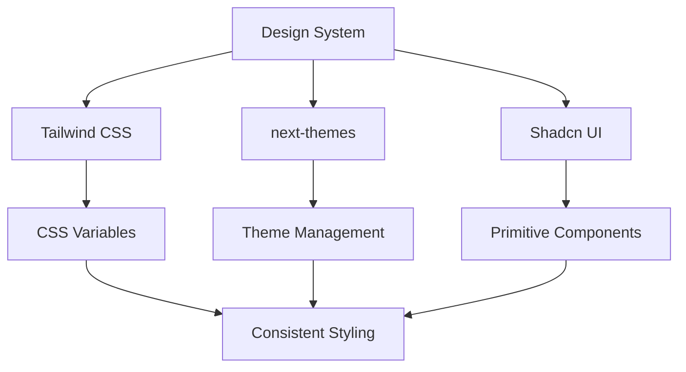

**Diagram sources**
- [globals.css](file://src/app/globals.css#L1-L130)
- [components.json](file://components.json#L1-L23)

**Section sources**
- [globals.css](file://src/app/globals.css#L1-L130)
- [components.json](file://components.json#L1-L23)

## Shadcn UI Primitive Components

The foundation of the component library consists of Shadcn UI primitive components that provide consistent styling and behavior across the application. These components are extended with custom variants and accessibility features.

### Button Component
The Button component supports multiple variants (default, destructive, outline, secondary, ghost, link, tertiary) and sizes (default, sm, lg, icon, icon-sm, icon-lg). It uses class-variance-authority (CVA) for variant management and includes focus states, disabled states, and accessibility attributes.

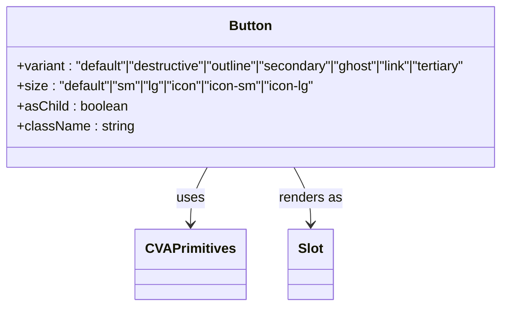

**Diagram sources**
- [button.tsx](file://src/components/ui/button.tsx#L1-L62)

**Section sources**
- [button.tsx](file://src/components/ui/button.tsx#L1-L62)

### Card Component
The Card component provides a container with header, title, description, content, footer, and action sections. It supports consistent spacing and layout patterns for information display.

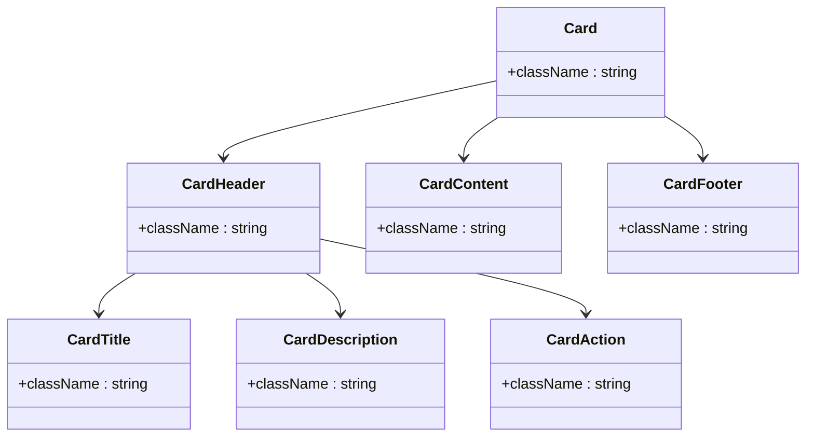

**Diagram sources**
- [card.tsx](file://src/components/ui/card.tsx#L1-L93)

**Section sources**
- [card.tsx](file://src/components/ui/card.tsx#L1-L93)

### Dialog Component
The Dialog component provides modal functionality with overlay, content, header, footer, title, and description elements. It uses Radix UI primitives for accessible modal behavior.

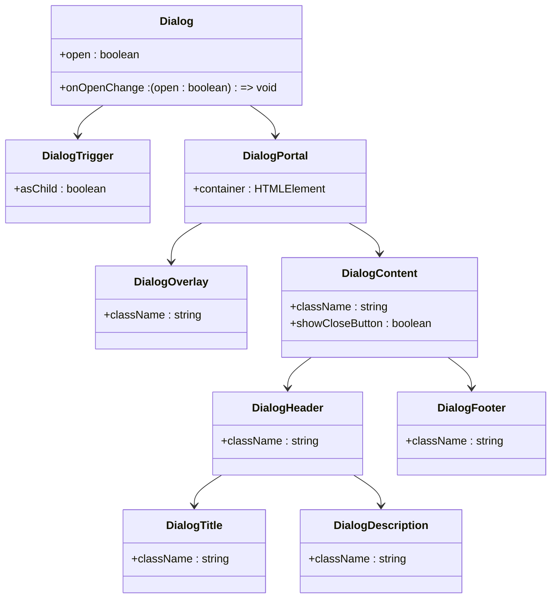

**Diagram sources**
- [dialog.tsx](file://src/components/ui/dialog.tsx#L1-L144)

**Section sources**
- [dialog.tsx](file://src/components/ui/dialog.tsx#L1-L144)

### Input and Form Components
The Input component provides styled text inputs with validation states, while the Form components integrate with react-hook-form for form state management, validation, and error handling.

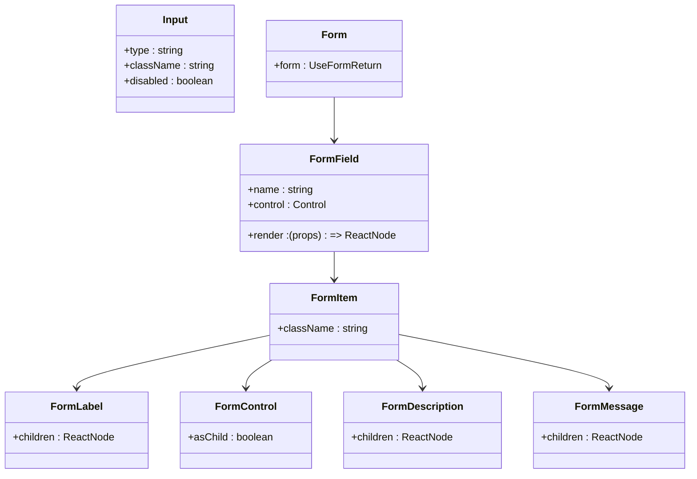

**Diagram sources**
- [input.tsx](file://src/components/ui/input.tsx#L1-L22)
- [form.tsx](file://src/components/ui/form.tsx#L1-L168)

**Section sources**
- [input.tsx](file://src/components/ui/input.tsx#L1-L22)
- [form.tsx](file://src/components/ui/form.tsx#L1-L168)

## Composite Components

### ProjectForm Component
The ProjectForm component handles prompt input and submission for creating new projects. It integrates with react-hook-form for validation and tRPC for API communication.

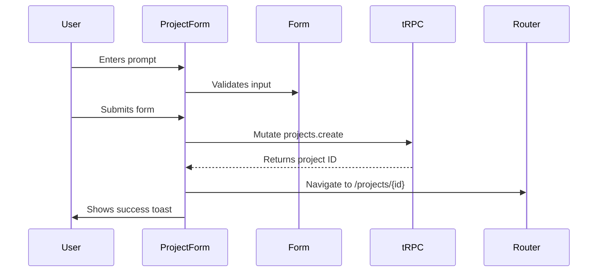

**Diagram sources**
- [project-form.tsx](file://src/modules/home/ui/components/project-form.tsx#L1-L143)
- [constants.ts](file://src/modules/home/constants.ts#L1-L50)

**Section sources**
- [project-form.tsx](file://src/modules/home/ui/components/project-form.tsx#L1-L143)

### MessageCard Component
The MessageCard component displays AI and user messages with different styling based on role. It renders assistant messages with metadata and fragment previews, while user messages use a simpler layout.

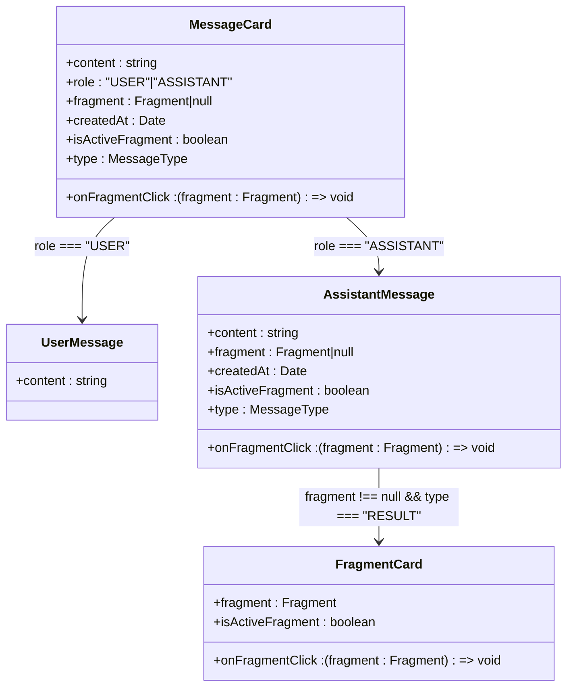

**Diagram sources**
- [message-card.tsx](file://src/modules/projects/ui/components/message-card.tsx#L1-L149)

**Section sources**
- [message-card.tsx](file://src/modules/projects/ui/components/message-card.tsx#L1-L149)

### MessagesContainer Component
The MessagesContainer orchestrates the rendering of message lists and handles automatic scrolling and fragment activation based on message updates.

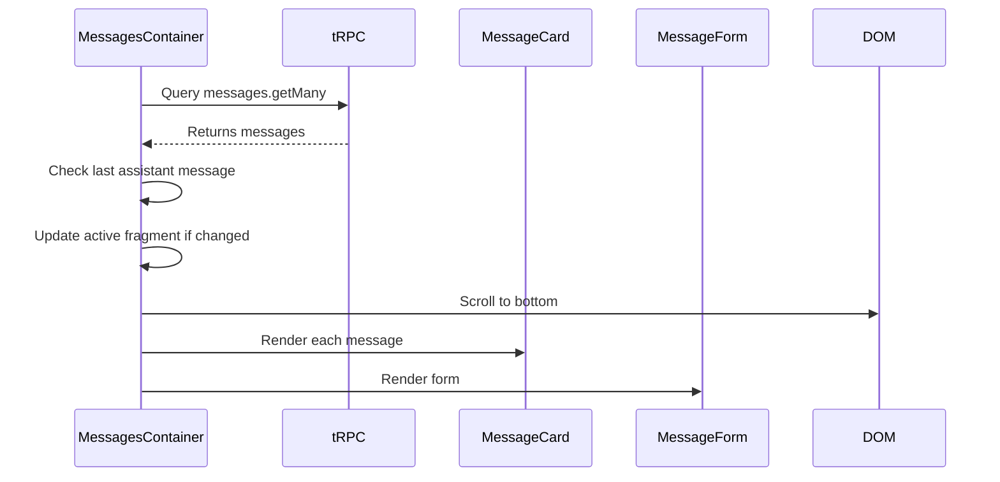

**Diagram sources**
- [messages-container.tsx](file://src/modules/projects/ui/components/messages-container.tsx#L1-L76)

**Section sources**
- [messages-container.tsx](file://src/modules/projects/ui/components/messages-container.tsx#L1-L76)

### ProjectView Component
The ProjectView component serves as the main project interface with resizable panels for messages and preview/code views.

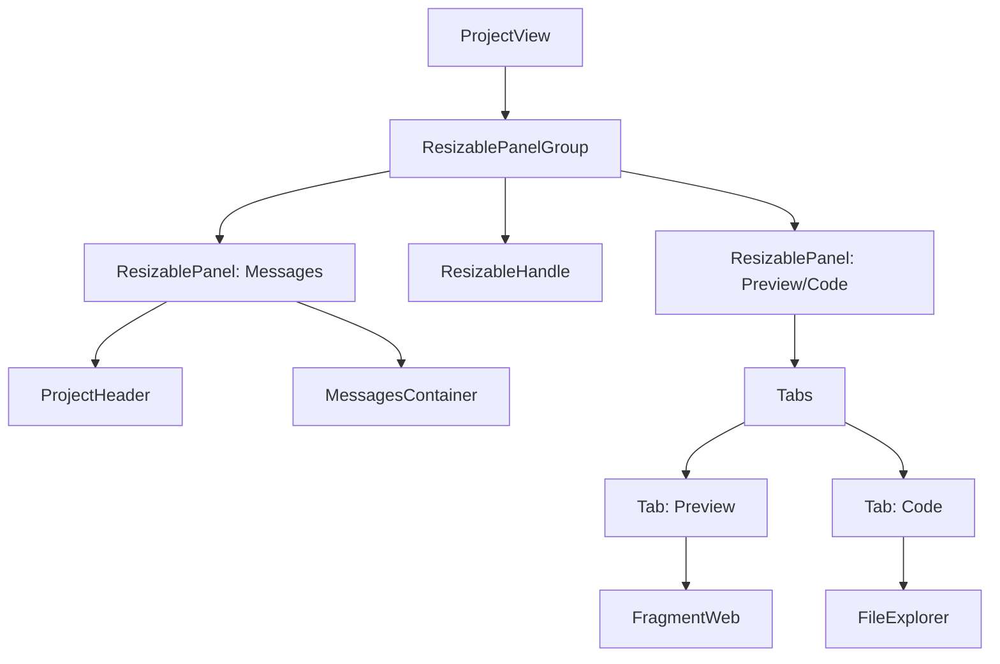

**Diagram sources**
- [project-view.tsx](file://src/modules/projects/ui/views/project-view.tsx#L1-L91)

**Section sources**
- [project-view.tsx](file://src/modules/projects/ui/views/project-view.tsx#L1-L91)

## State Management and tRPC Integration

The component library integrates with tRPC for type-safe API communication and React Query for data fetching and mutation state management.

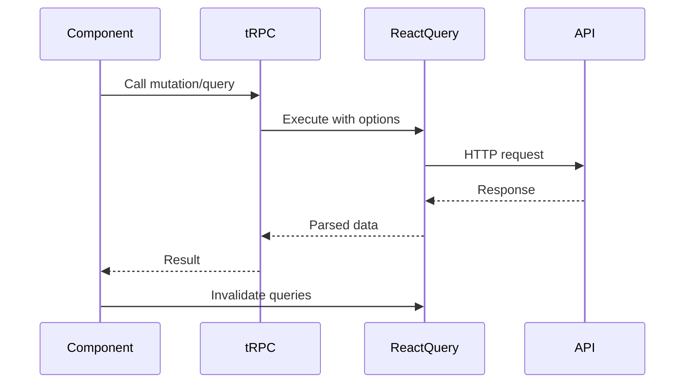

**Diagram sources**
- [client.tsx](file://src/trpc/client.tsx#L1-L60)
- [project-form.tsx](file://src/modules/home/ui/components/project-form.tsx#L1-L143)

**Section sources**
- [client.tsx](file://src/trpc/client.tsx#L1-L60)

## Accessibility and Responsive Design

### Accessibility Features
The component library includes comprehensive accessibility features:
- Proper ARIA attributes and roles
- Keyboard navigation support
- Screen reader optimizations
- Focus management
- Semantic HTML structure
- Color contrast compliance

### Responsive Behavior
The use-mobile hook provides responsive behavior detection based on screen width breakpoints.

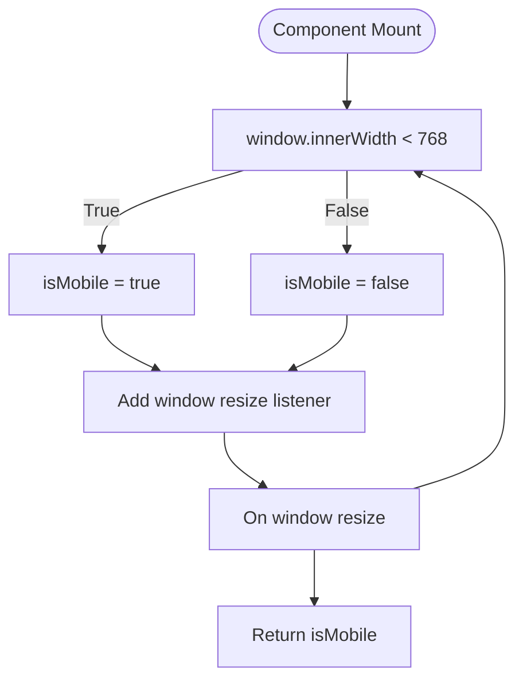

**Diagram sources**
- [use-mobile.ts](file://src/hooks/use-mobile.ts#L1-L20)

**Section sources**
- [use-mobile.ts](file://src/hooks/use-mobile.ts#L1-L20)

## Customization and Theming

### Theme Configuration
The components.json file configures the component library with the New York style, Tailwind CSS integration, and path aliases.

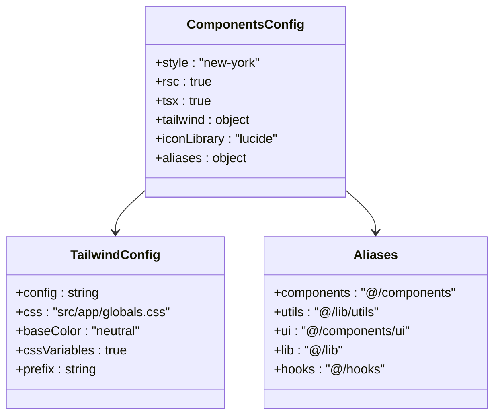

**Diagram sources**
- [components.json](file://components.json#L1-L23)
- [globals.css](file://src/app/globals.css#L1-L130)

**Section sources**
- [components.json](file://components.json#L1-L23)

### Customization Patterns
Developers can extend components using:
- Props-based customization
- Class composition with cn utility
- Component composition with asChild pattern
- Theme variable overrides
- Custom variants in CVA configurations

## Conclusion
The QAI platform's component library provides a robust foundation for building consistent, accessible, and responsive user interfaces. By combining Shadcn UI primitives with custom composite components, the library enables rapid development of domain-specific features while maintaining design consistency. The integration with tRPC, React Query, and Tailwind CSS provides a type-safe, performant, and customizable development experience.