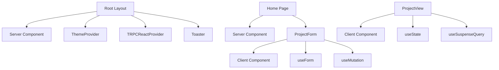
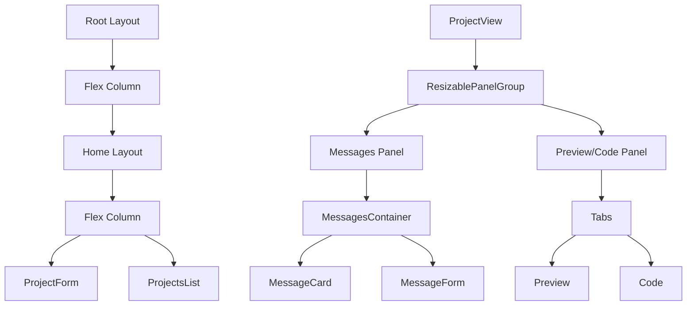
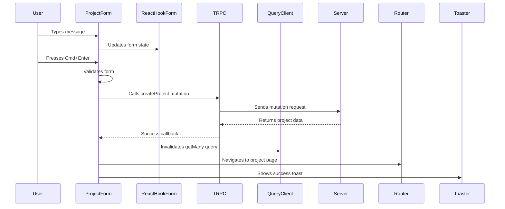

# Frontend Architecture

<cite>
**Referenced Files in This Document**   
- [layout.tsx](file://src/app/layout.tsx)
- [globals.css](file://src/app/globals.css)
- [button.tsx](file://src/components/ui/button.tsx)
- [form.tsx](file://src/components/ui/form.tsx)
- [project-form.tsx](file://src/modules/home/ui/components/project-form.tsx)
- [messages-container.tsx](file://src/modules/projects/ui/components/messages-container.tsx)
- [project-view.tsx](file://src/modules/projects/ui/views/project-view.tsx)
- [client.tsx](file://src/trpc/client.tsx)
- [use-mobile.ts](file://src/hooks/use-mobile.ts)
- [dialog.tsx](file://src/components/ui/dialog.tsx)
- [components.json](file://components.json)
- [package.json](file://package.json)
</cite>

## Table of Contents
1. [Introduction](#introduction)
2. [Next.js App Router Structure](#nextjs-app-router-structure)
3. [React Server Components and Client-Side Boundaries](#react-server-components-and-client-side-boundaries)
4. [UI Component Hierarchy](#ui-component-hierarchy)
5. [Layout System and Responsive Design](#layout-system-and-responsive-design)
6. [Theme Management with next-themes](#theme-management-with-next-themes)
7. [Component Composition Patterns](#component-composition-patterns)
8. [Data Flow and State Management](#data-flow-and-state-management)
9. [Accessibility and Error Handling](#accessibility-and-error-handling)
10. [Performance Optimization Techniques](#performance-optimization-techniques)

## Introduction
The QAI platform frontend is built on Next.js 15 with the App Router architecture, leveraging React Server Components (RSC) for optimal performance. The UI layer combines Shadcn UI primitives with custom composite components to create a cohesive user experience. The architecture emphasizes clear separation between server and client components, efficient data fetching through tRPC and React Query, and responsive design using Tailwind CSS. This documentation details the frontend architecture, focusing on component organization, data flow, and UI patterns.

## Next.js App Router Structure
The application follows a feature-based routing structure with distinct layout hierarchies. The root layout in `src/app/layout.tsx` provides global providers including TRPC, theme, and toast notifications. The `(home)` route group contains the landing page and associated components, while dynamic routes like `projects/[projectId]` handle project-specific views. Each route segment can define its own layout, enabling nested UI structures with shared navigation and headers.

**Section sources**
- [layout.tsx](file://src/app/layout.tsx#L1-L43)
- [page.tsx](file://src/app/(home)/page.tsx#L1-L34)

## React Server Components and Client-Side Boundaries
The architecture strategically separates server and client components. Server components, such as the root layout and page wrappers, handle initial rendering and data fetching. Client components, marked with `"use client"`, manage interactivity and state. Key interactive components like `ProjectForm`, `MessagesContainer`, and `ProjectView` are client components that leverage React hooks for state management. The TRPC client provider enables seamless data fetching from client components while maintaining type safety.

**Diagram sources**
- [layout.tsx](file://src/app/layout.tsx#L1-L43)
- [project-form.tsx](file://src/modules/home/ui/components/project-form.tsx#L1-L143)
- [project-view.tsx](file://src/modules/projects/ui/views/project-view.tsx#L1-L91)

## UI Component Hierarchy
The UI system follows a layered architecture with Shadcn UI primitives forming the foundation. Custom composite components build upon these primitives to create domain-specific interfaces. The component hierarchy includes:

- **Primitive Components**: Atomic UI elements from `src/components/ui/` (Button, Form, Input, etc.)
- **Composite Components**: Domain-specific components in `src/modules/*/ui/components/`
- **View Components**: Page-level compositions in `src/modules/*/ui/views/`

Key composite components include `ProjectForm` for project creation, `MessagesContainer` for chat interfaces, and `ProjectView` for project visualization.

**Section sources**
- [button.tsx](file://src/components/ui/button.tsx#L1-L62)
- [form.tsx](file://src/components/ui/form.tsx#L1-L168)
- [project-form.tsx](file://src/modules/home/ui/components/project-form.tsx#L1-L143)
- [messages-container.tsx](file://src/modules/projects/ui/components/messages-container.tsx#L1-L76)

## Layout System and Responsive Design
The layout system uses a combination of CSS Grid, Flexbox, and Resizable components to create adaptive interfaces. The main application layout employs a horizontal resizable panel group in `ProjectView`, allowing users to adjust the width of the messages panel and code preview. Responsive design is implemented using Tailwind CSS breakpoints and the `useIsMobile` hook for conditional rendering on smaller screens.

**Diagram sources**
- [layout.tsx](file://src/app/layout.tsx#L1-L43)
- [project-view.tsx](file://src/modules/projects/ui/views/project-view.tsx#L1-L91)
- [messages-container.tsx](file://src/modules/projects/ui/components/messages-container.tsx#L1-L76)

## Theme Management with next-themes
Theme management is implemented using `next-themes`, providing seamless dark/light mode switching. The `ThemeProvider` in the root layout wraps the entire application, using CSS variables defined in `globals.css`. The theme system supports system preference detection with `defaultTheme="system"` and prevents layout shifts during hydration with `suppressHydrationWarning`. Custom color variables follow the OKLCH color space for perceptual uniformity.

**Section sources**
- [layout.tsx](file://src/app/layout.tsx#L1-L43)
- [globals.css](file://src/app/globals.css#L1-L130)

## Component Composition Patterns
The architecture employs several composition patterns to enhance reusability and maintainability:

### ProjectForm Composition
The `ProjectForm` component orchestrates form state, validation, and submission through React Hook Form and Zod. It integrates with tRPC mutations for data persistence and uses React Query for cache invalidation. The component handles keyboard interactions (Cmd+Enter submission) and provides template suggestions through button interactions.

**Diagram sources**
- [project-form.tsx](file://src/modules/home/ui/components/project-form.tsx#L1-L143)

### MessagesContainer Composition
The `MessagesContainer` component manages message display, auto-scrolling, and fragment activation. It uses `useSuspenseQuery` for data fetching and `useEffect` hooks for side effects like scrolling to the bottom and activating fragments. The component conditionally renders loading states and integrates with the fragment system for code preview synchronization.

**Section sources**
- [messages-container.tsx](file://src/modules/projects/ui/components/messages-container.tsx#L1-L76)

## Data Flow and State Management
The data flow follows a unidirectional pattern from user interaction to server mutation. User actions trigger tRPC mutations through the TRPC client, with React Query handling caching and synchronization. The `useTRPC` hook provides access to the tRPC client throughout the component tree. Form state is managed by React Hook Form, while local UI state uses React's `useState` and `useRef` hooks.

```mermaid
flowchart LR
A[User Interaction] --> B[Event Handler]
B --> C[Form Validation]
C --> D[tRPC Mutation]
D --> E[React Query Mutation]
E --> F[Server Request]
F --> G[Database]
G --> H[Server Response]
H --> I[QueryClient Invalidation]
I --> J[UI Update]
J --> K[Router Navigation]
```

**Diagram sources**
- [client.tsx](file://src/trpc/client.tsx#L1-L60)
- [project-form.tsx](file://src/modules/home/ui/components/project-form.tsx#L1-L143)

## Accessibility and Error Handling
The UI layer implements several accessibility features and error handling strategies:

- **Accessibility**: Components use proper ARIA attributes, semantic HTML, and keyboard navigation support. The `useIsMobile` hook enables adaptive interfaces for touch devices.
- **Error Boundaries**: While not explicitly shown, the architecture relies on React Query's error handling and tRPC's type-safe error responses.
- **Form Validation**: Client-side validation with Zod provides immediate feedback, with error messages displayed through the FormMessage component.

**Section sources**
- [use-mobile.ts](file://src/hooks/use-mobile.ts#L1-L20)
- [form.tsx](file://src/components/ui/form.tsx#L1-L168)
- [dialog.tsx](file://src/components/ui/dialog.tsx#L1-L144)

## Performance Optimization Techniques
The frontend employs several performance optimizations:

- **Code Splitting**: Next.js automatic code splitting by route
- **Suspense Boundaries**: Used in `ProjectView` for loading states
- **Memoization**: React Query caching and deduplication
- **Efficient Re-renders**: Proper use of React.memo and useCallback where needed
- **Font Optimization**: Next.js font optimization with Geist fonts
- **Image Optimization**: Next.js Image component for logo and assets

The configuration in `components.json` enables RSC support and proper aliasing, while `package.json` specifies dependencies that support tree-shaking and modern bundling.

**Section sources**
- [components.json](file://components.json#L1-L23)
- [package.json](file://package.json#L1-L92)
- [next.config.ts](file://next.config.ts#L1-L8)