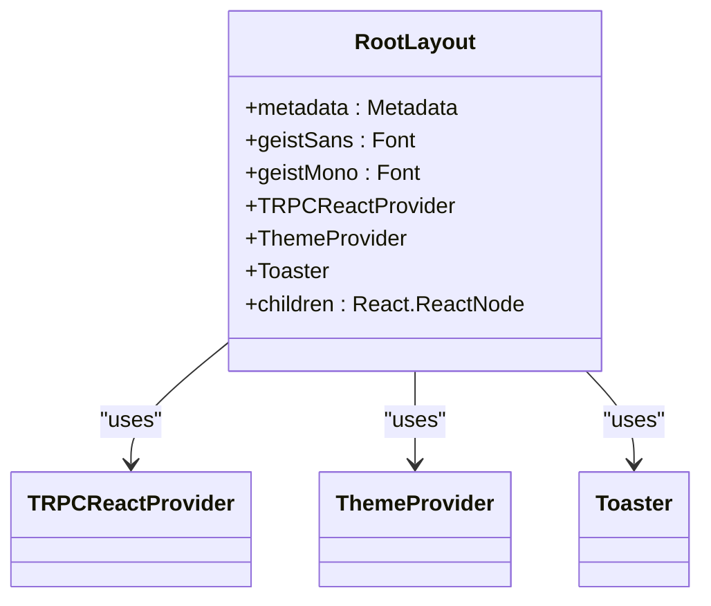
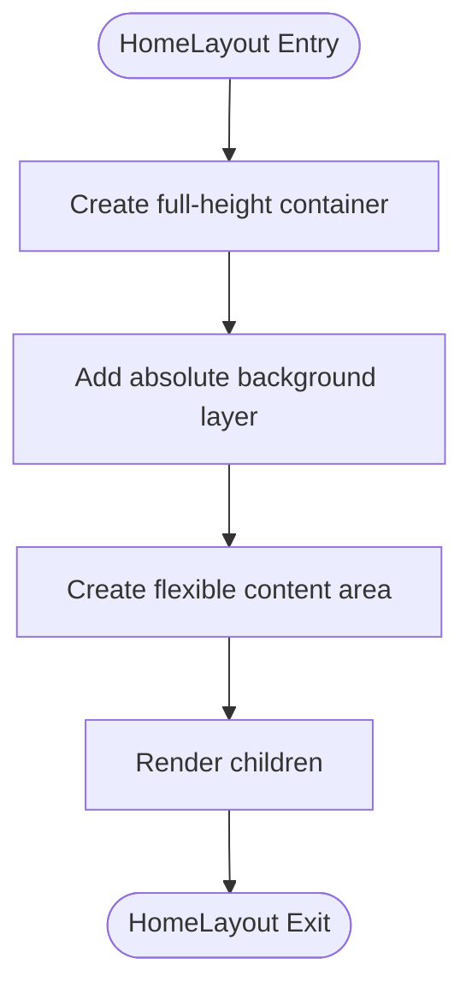
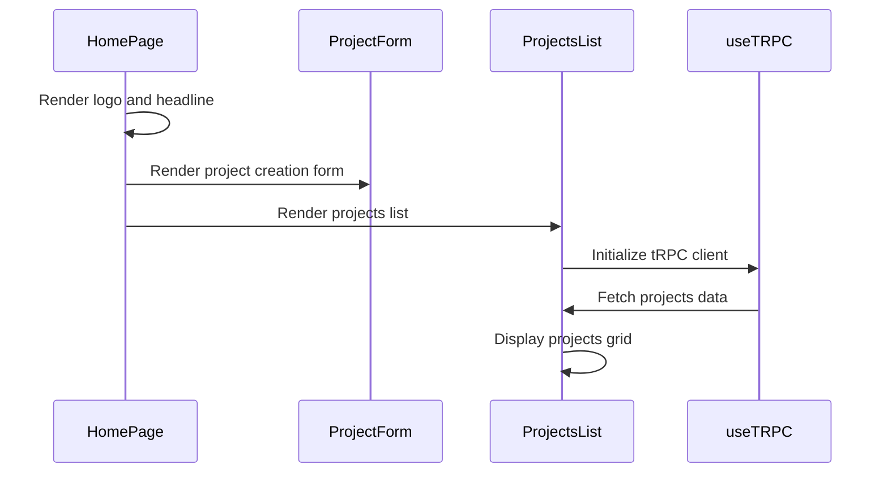
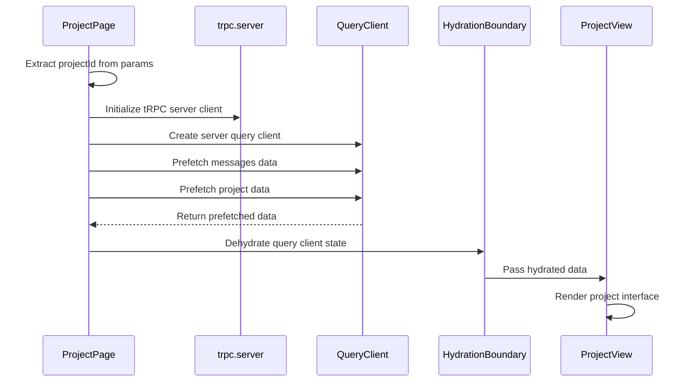
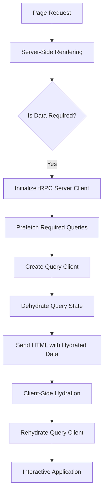
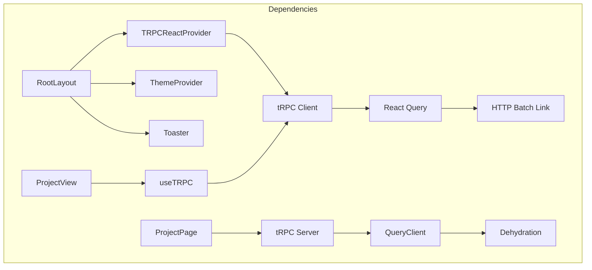

# Routing

<cite>
**Referenced Files in This Document**   
- [layout.tsx](file://src/app/layout.tsx)
- [globals.css](file://src/app/globals.css)
- [(home)/layout.tsx](file://src/app/(home)/layout.tsx)
- [(home)/page.tsx](file://src/app/(home)/page.tsx)
- [projects/[projectId]/page.tsx](file://src/app/projects/[projectId]/page.tsx)
- [client.tsx](file://src/trpc/client.tsx)
- [server.tsx](file://src/trpc/server.tsx)
- [init.ts](file://src/trpc/init.ts)
- [_app.ts](file://src/trpc/routers/_app.ts)
- [projects-list.tsx](file://src/modules/home/ui/components/projects-list.tsx)
- [project-view.tsx](file://src/modules/projects/ui/views/project-view.tsx)
- [project-header.tsx](file://src/modules/projects/ui/components/project-header.tsx)
- [procedures.ts](file://src/modules/projects/server/procedures.ts)
- [route.ts](file://src/app/api/trpc/[trpc]/route.ts)
- [next.config.ts](file://next.config.ts)
</cite>

## Table of Contents
1. [Introduction](#introduction)
2. [Project Structure](#project-structure)
3. [Core Components](#core-components)
4. [Architecture Overview](#architecture-overview)
5. [Detailed Component Analysis](#detailed-component-analysis)
6. [Dependency Analysis](#dependency-analysis)
7. [Performance Considerations](#performance-considerations)
8. [Troubleshooting Guide](#troubleshooting-guide)
9. [Conclusion](#conclusion)

## Introduction
This document provides comprehensive architectural documentation for the routing system in the QAI application, which is built using Next.js App Router. It explains the layout and page structure, including root and segmented layouts, dynamic routing, data loading patterns, and client-side navigation. The document also covers SEO considerations, dynamic metadata, and accessibility implications of the routing design.

## Project Structure
The QAI application follows a modular structure with a clear separation of concerns. The routing system is centered in the `src/app` directory, which leverages Next.js App Router conventions. The application uses segmented routes, dynamic parameters, and nested layouts to provide a seamless user experience.

```mermaid
graph TB
subgraph "App Router Structure"
RootLayout[src/app/layout.tsx]
HomeLayout[src/app/(home)/layout.tsx]
HomePage[src/app/(home)/page.tsx]
ProjectPage[src/app/projects/[projectId]/page.tsx]
APIRoute[src/app/api/trpc/[trpc]/route.ts]
end
RootLayout --> HomeLayout
HomeLayout --> HomePage
RootLayout --> ProjectPage
RootLayout --> APIRoute
```

**Diagram sources**
- [layout.tsx](file://src/app/layout.tsx)
- [(home)/layout.tsx](file://src/app/(home)/layout.tsx)
- [(home)/page.tsx](file://src/app/(home)/page.tsx)
- [projects/[projectId]/page.tsx](file://src/app/projects/[projectId]/page.tsx)
- [route.ts](file://src/app/api/trpc/[trpc]/route.ts)

**Section sources**
- [layout.tsx](file://src/app/layout.tsx)
- [(home)/layout.tsx](file://src/app/(home)/layout.tsx)

## Core Components
The routing system in QAI is built around several core components that work together to provide a robust navigation experience. These include layout components, page components, and data loading utilities that leverage React Server Components and tRPC for efficient data fetching.

**Section sources**
- [layout.tsx](file://src/app/layout.tsx)
- [(home)/page.tsx](file://src/app/(home)/page.tsx)
- [projects/[projectId]/page.tsx](file://src/app/projects/[projectId]/page.tsx)

## Architecture Overview
The QAI application uses Next.js App Router to implement a hierarchical routing system with shared layouts and route-specific content. The architecture leverages React Server Components for initial data fetching and hydration, providing fast initial loads and efficient data loading patterns.

```mermaid
graph TD
A[Client Request] --> B{Route Match}
B --> |/| C[Home Layout]
B --> |/projects/[id]| D[Project Page]
C --> E[Render Home Content]
D --> F[Fetch Project Data]
F --> G[Hydrate with tRPC]
G --> H[Render Project View]
H --> I[Client-Side Navigation]
I --> J{URL Change}
J --> |Yes| K[Trigger tRPC Refetch]
J --> |No| L[Update UI State]
```

**Diagram sources**
- [layout.tsx](file://src/app/layout.tsx)
- [projects/[projectId]/page.tsx](file://src/app/projects/[projectId]/page.tsx)
- [client.tsx](file://src/trpc/client.tsx)
- [server.tsx](file://src/trpc/server.tsx)

## Detailed Component Analysis

### Root Layout Analysis
The root layout component provides the global structure and shared UI elements for the entire application. It wraps all pages with essential providers and sets up the base styling and metadata.



**Diagram sources**
- [layout.tsx](file://src/app/layout.tsx)

**Section sources**
- [layout.tsx](file://src/app/layout.tsx)

### Home Layout and Page Analysis
The home layout and page components implement a segmented route structure that provides a dedicated UI for the application's homepage. The layout defines the visual structure while the page component renders the specific content.

#### Home Layout Structure


**Diagram sources**
- [(home)/layout.tsx](file://src/app/(home)/layout.tsx)

#### Home Page Content Flow


**Diagram sources**
- [(home)/page.tsx](file://src/app/(home)/page.tsx)
- [projects-list.tsx](file://src/modules/home/ui/components/projects-list.tsx)

**Section sources**
- [(home)/layout.tsx](file://src/app/(home)/layout.tsx)
- [(home)/page.tsx](file://src/app/(home)/page.tsx)
- [projects-list.tsx](file://src/modules/home/ui/components/projects-list.tsx)

### Dynamic Route Analysis
The project detail page implements dynamic routing using Next.js bracket syntax for route parameters. This allows the application to handle project-specific URLs and load data based on the project ID.

#### Dynamic Route Data Flow


**Diagram sources**
- [projects/[projectId]/page.tsx](file://src/app/projects/[projectId]/page.tsx)
- [server.tsx](file://src/trpc/server.tsx)
- [project-view.tsx](file://src/modules/projects/ui/views/project-view.tsx)

**Section sources**
- [projects/[projectId]/page.tsx](file://src/app/projects/[projectId]/page.tsx)
- [server.tsx](file://src/trpc/server.tsx)
- [project-view.tsx](file://src/modules/projects/ui/views/project-view.tsx)

### Data Loading and Hydration Analysis
The QAI application uses React Server Components and tRPC to implement efficient data loading and hydration patterns. This approach minimizes client-side JavaScript and enables fast initial page loads.

#### Server-Side Data Loading Process


**Diagram sources**
- [projects/[projectId]/page.tsx](file://src/app/projects/[projectId]/page.tsx)
- [server.tsx](file://src/trpc/server.tsx)
- [client.tsx](file://src/trpc/client.tsx)

**Section sources**
- [projects/[projectId]/page.tsx](file://src/app/projects/[projectId]/page.tsx)
- [server.tsx](file://src/trpc/server.tsx)
- [client.tsx](file://src/trpc/client.tsx)

## Dependency Analysis
The routing system in QAI has a well-defined dependency structure that ensures separation of concerns while enabling efficient data flow between components.



**Diagram sources**
- [layout.tsx](file://src/app/layout.tsx)
- [client.tsx](file://src/trpc/client.tsx)
- [server.tsx](file://src/trpc/server.tsx)
- [projects/[projectId]/page.tsx](file://src/app/projects/[projectId]/page.tsx)
- [project-view.tsx](file://src/modules/projects/ui/views/project-view.tsx)

**Section sources**
- [client.tsx](file://src/trpc/client.tsx)
- [server.tsx](file://src/trpc/server.tsx)
- [query-client.ts](file://src/trpc/query-client.ts)

## Performance Considerations
The routing system in QAI is designed with performance in mind, leveraging server-side rendering, data prefetching, and efficient hydration to provide a fast and responsive user experience.

The use of React Server Components allows for initial data fetching on the server, reducing the amount of JavaScript sent to the client. The tRPC integration with React Query enables intelligent caching and background refetching, minimizing redundant network requests.

When navigating between routes, the application uses client-side routing provided by Next.js, which enables fast transitions without full page reloads. URL changes trigger tRPC queries to fetch updated data, ensuring the UI remains current with the application state.

## Troubleshooting Guide
When working with the routing system in QAI, developers may encounter issues related to data loading, hydration, or client-server synchronization.

Common issues include:
- Prefetching failures in server components
- Hydration mismatches between server and client
- tRPC query errors during data fetching
- Dynamic parameter extraction issues

The application uses proper error handling through tRPC's TRPCError and React's Suspense boundaries to gracefully handle loading states and errors.

**Section sources**
- [projects/[projectId]/page.tsx](file://src/app/projects/[projectId]/page.tsx)
- [procedures.ts](file://src/modules/projects/server/procedures.ts)
- [client.tsx](file://src/trpc/client.tsx)

## Conclusion
The routing system in the QAI application effectively leverages Next.js App Router to create a robust and scalable navigation architecture. By combining server-side rendering, dynamic routing, and efficient data loading patterns, the application provides a fast and responsive user experience.

The use of segmented layouts, nested routing, and React Server Components enables code reuse while maintaining route-specific functionality. The integration with tRPC and React Query provides a type-safe and efficient approach to data fetching and state management.

This architecture supports SEO through server-rendered content and allows for dynamic metadata generation. The client-side navigation system ensures smooth transitions between routes while maintaining application state through tRPC's query caching and refetching mechanisms.