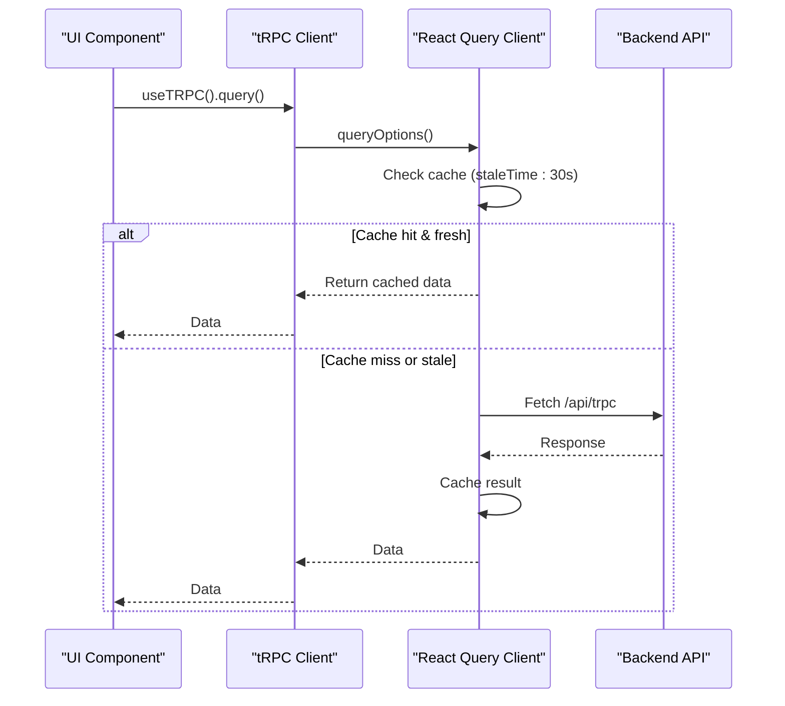
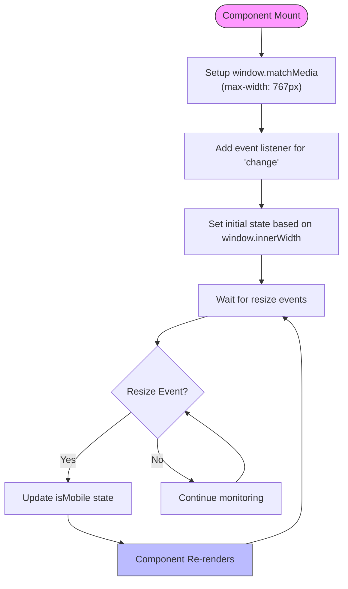
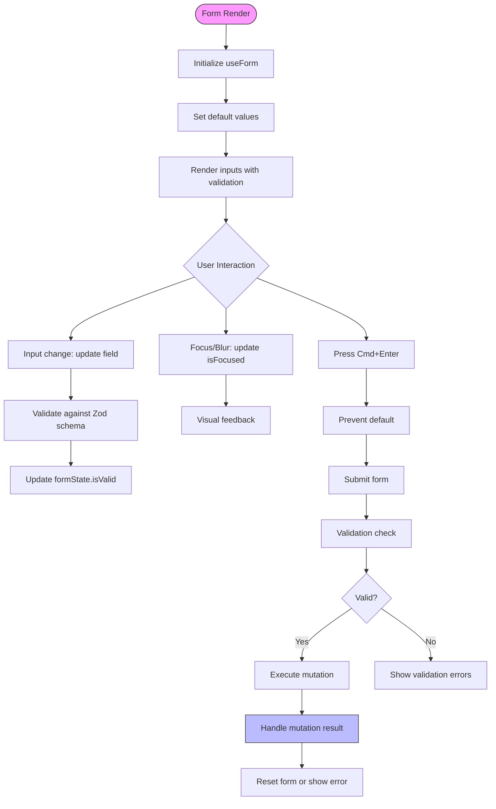
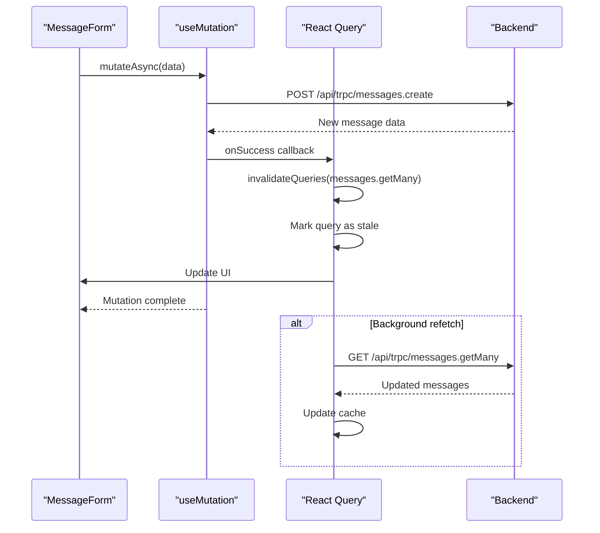

# State Management

<cite>
**Referenced Files in This Document**   
- [src/trpc/client.tsx](file://src/trpc/client.tsx)
- [src/app/client.tsx](file://src/app/client.tsx)
- [src/trpc/query-client.ts](file://src/trpc/query-client.ts)
- [src/hooks/use-mobile.ts](file://src/hooks/use-mobile.ts)
- [src/modules/home/ui/components/project-form.tsx](file://src/modules/home/ui/components/project-form.tsx)
- [src/modules/projects/ui/components/message-form.tsx](file://src/modules/projects/ui/components/message-form.tsx)
- [src/modules/projects/ui/views/project-view.tsx](file://src/modules/projects/ui/views/project-view.tsx)
- [src/trpc/routers/_app.ts](file://src/trpc/routers/_app.ts)
- [src/modules/projects/server/procedures.ts](file://src/modules/projects/server/procedures.ts)
- [src/modules/messages/server/procedures.ts](file://src/modules/messages/server/procedures.ts)
- [src/app/layout.tsx](file://src/app/layout.tsx)
</cite>

## Table of Contents
1. [Introduction](#introduction)
2. [Server State Management with tRPC and React Query](#server-state-management-with-trpc-and-react-query)
3. [Client-Side State Patterns](#client-side-state-patterns)
4. [Form State Management](#form-state-management)
5. [Optimistic Updates and Mutation Handling](#optimistic-updates-and-mutation-handling)
6. [Performance Considerations](#performance-considerations)
7. [Error Handling and Common Issues](#error-handling-and-common-issues)
8. [Conclusion](#conclusion)

## Introduction
The QAI frontend implements a comprehensive state management architecture that combines server state management via tRPC and React Query with client-side React hooks. This document details how these systems work together to manage data fetching, mutations, caching, and UI state across the application. The integration enables efficient synchronization between frontend components and backend services while maintaining responsive user interfaces.

**Section sources**
- [src/app/layout.tsx](file://src/app/layout.tsx#L1-L43)

## Server State Management with tRPC and React Query

The application uses tRPC in conjunction with React Query to manage server state. The integration is initialized in `src/trpc/client.tsx`, where the `TRPCReactProvider` wraps the application and provides both the tRPC client and React Query's `QueryClient`. This setup enables type-safe API calls with automatic serialization using SuperJSON, which supports complex data types like dates and BigInts.

The `makeQueryClient` function in `src/trpc/query-client.ts` configures React Query with a 30-second stale time for queries, meaning data is considered fresh for 30 seconds before being marked as stale and eligible for refetching. The configuration also includes custom serialization and deserialization using SuperJSON, which is essential for handling non-JSON-serializable data types during hydration and dehyration.

The tRPC client is configured with an `httpBatchLink` that batches multiple requests into a single HTTP call, improving network efficiency. The URL for API requests is dynamically determined based on the environment, with special handling for Vercel deployments and local development.

**Diagram sources**
- [src/trpc/client.tsx](file://src/trpc/client.tsx#L1-L59)
- [src/trpc/query-client.ts](file://src/trpc/query-client.ts#L1-L22)

**Section sources**
- [src/trpc/client.tsx](file://src/trpc/client.tsx#L1-L59)
- [src/trpc/query-client.ts](file://src/trpc/query-client.ts#L1-L22)
- [src/app/client.tsx](file://src/app/client.tsx#L1-L10)

## Client-Side State Patterns

The application employs React's built-in hooks (`useState`, `useEffect`, `useReducer`) for managing client-side state. A custom hook `useIsMobile` in `src/hooks/use-mobile.ts` demonstrates a pattern for responsive design by tracking screen width and determining mobile state based on a 768px breakpoint.

The `useIsMobile` hook uses `useState` to store the mobile state and `useEffect` to set up a resize event listener via `window.matchMedia`. This ensures the component re-renders when the viewport crosses the mobile breakpoint. The hook returns a boolean indicating whether the current viewport is mobile-sized, enabling responsive UI adaptations throughout the application.

**Diagram sources**
- [src/hooks/use-mobile.ts](file://src/hooks/use-mobile.ts#L1-L20)

**Section sources**
- [src/hooks/use-mobile.ts](file://src/hooks/use-mobile.ts#L1-L20)
- [src/modules/projects/ui/views/project-view.tsx](file://src/modules/projects/ui/views/project-view.tsx#L1-L91)

## Form State Management

Form state is managed using `react-hook-form` combined with React Query mutations. The `ProjectForm` and `MessageForm` components demonstrate this pattern, using `useForm` to handle form state, validation, and submission. Both forms use Zod for schema validation, ensuring type safety and proper input validation.

In `src/modules/home/ui/components/project-form.tsx`, the form state is managed with `useForm`, which handles input values, validation status, and form submission. The form includes features like auto-focus detection, keyboard shortcuts (Cmd+Enter to submit), and template buttons that pre-fill the input field. The component uses `useState` to track focus state and submission status, coordinating with the form's validation state to disable the submit button when appropriate.

**Diagram sources**
- [src/modules/home/ui/components/project-form.tsx](file://src/modules/home/ui/components/project-form.tsx#L1-L143)
- [src/modules/projects/ui/components/message-form.tsx](file://src/modules/projects/ui/components/message-form.tsx#L1-L122)

**Section sources**
- [src/modules/home/ui/components/project-form.tsx](file://src/modules/home/ui/components/project-form.tsx#L1-L143)
- [src/modules/projects/ui/components/message-form.tsx](file://src/modules/projects/ui/components/message-form.tsx#L1-L122)

## Optimistic Updates and Mutation Handling

The application implements mutation handling through React Query's `useMutation` hook, integrated with tRPC procedures. In both `ProjectForm` and `MessageForm`, mutations are created using `trpc.projects.create.mutationOptions` and `trpc.messages.create.mutationOptions` respectively. These mutations handle form submissions and trigger appropriate side effects.

After a successful mutation, the application invalidates relevant queries using `queryClient.invalidateQueries`, which triggers refetching of the affected data. For example, after creating a new project, the `projects.getMany` query is invalidated, ensuring the project list displays the updated data. This approach provides a balance between immediate feedback and data consistency.

The mutation configuration includes error handling that displays user-friendly toast notifications using the `sonner` library. This pattern ensures users are informed of both success and failure states without disrupting the application flow.

**Diagram sources**
- [src/modules/home/ui/components/project-form.tsx](file://src/modules/home/ui/components/project-form.tsx#L1-L143)
- [src/modules/projects/ui/components/message-form.tsx](file://src/modules/projects/ui/components/message-form.tsx#L1-L122)
- [src/modules/projects/server/procedures.ts](file://src/modules/projects/server/procedures.ts#L1-L72)
- [src/modules/messages/server/procedures.ts](file://src/modules/messages/server/procedures.ts#L1-L55)

**Section sources**
- [src/modules/home/ui/components/project-form.tsx](file://src/modules/home/ui/components/project-form.tsx#L1-L143)
- [src/modules/projects/ui/components/message-form.tsx](file://src/modules/projects/ui/components/message-form.tsx#L1-L122)

## Performance Considerations

The state management architecture incorporates several performance optimizations. The React Query client is configured with a 30-second stale time, reducing unnecessary network requests while ensuring data remains reasonably fresh. Query deduplication is automatically handled by React Query, preventing duplicate requests for the same query key.

The tRPC client uses `httpBatchLink` to batch multiple requests into a single HTTP call, minimizing network overhead. This is particularly beneficial during page initialization when multiple queries might be triggered simultaneously.

Suspense boundaries are used in components like `ProjectView` to handle loading states gracefully. The `Suspense` component wraps potentially slow operations like data fetching, displaying fallback content while data loads. This prevents blank screens and provides immediate feedback to users.

The query client is carefully instantiated to avoid recreation during React suspensions. In `src/trpc/client.tsx`, the `getQueryClient` function ensures a single client instance is reused in the browser, preventing memory leaks and maintaining cache consistency across component re-renders.

**Section sources**
- [src/trpc/client.tsx](file://src/trpc/client.tsx#L1-L59)
- [src/trpc/query-client.ts](file://src/trpc/query-client.ts#L1-L22)
- [src/modules/projects/ui/views/project-view.tsx](file://src/modules/projects/ui/views/project-view.tsx#L1-L91)

## Error Handling and Common Issues

The application addresses common state management issues through several patterns. Stale data is managed through React Query's caching and invalidation mechanisms. When data might be outdated, `invalidateQueries` triggers refetching, ensuring users see current information.

Loading states are handled through React Query's built-in status indicators like `isPending`, which components use to disable buttons and show loading spinners during mutations. This prevents race conditions caused by multiple rapid submissions.

Race conditions in data fetching are mitigated by React Query's built-in deduplication and cancellation mechanisms. When multiple identical queries are made simultaneously, only one network request is sent, and subsequent requests receive the same result.

Error handling is centralized in mutation callbacks, with user-facing messages displayed via toast notifications. The architecture separates error concerns from UI logic, keeping components focused on presentation while ensuring consistent error reporting across the application.

**Section sources**
- [src/modules/home/ui/components/project-form.tsx](file://src/modules/home/ui/components/project-form.tsx#L1-L143)
- [src/modules/projects/ui/components/message-form.tsx](file://src/modules/projects/ui/components/message-form.tsx#L1-L122)
- [src/modules/projects/server/procedures.ts](file://src/modules/projects/server/procedures.ts#L1-L72)

## Conclusion
The QAI frontend's state management architecture effectively combines tRPC and React Query for server state with React hooks for client state. This hybrid approach provides type safety, efficient data fetching, and responsive UIs. The integration patterns demonstrated—particularly the careful initialization of the query client, use of batching, and proper invalidation strategies—represent best practices for modern React applications. The architecture balances performance optimizations with user experience considerations, creating a robust foundation for the application's interactive features.