# Guided Onboarding Tours

<cite>
**Referenced Files in This Document**   
- [build-onboarding.tsx](file://src/modules/home/ui/components/build-onboarding.tsx)
- [projects-onboarding.tsx](file://src/modules/home/ui/components/projects-onboarding.tsx)
- [project-onboarding.tsx](file://src/modules/projects/ui/components/project-onboarding.tsx)
- [procedures.ts](file://src/modules/companies/server/procedures.ts)
- [migration.sql](file://prisma/migrations/20251101000934_onboarding/migration.sql)
- [migration.sql](file://prisma/migrations/20251101002002_project_view_onboarding/migration.sql)
- [page.tsx](file://src/app/build/page.tsx)
- [page.tsx](file://src/app/projects/page.tsx)
- [page.tsx](file://src/app/projects/[projectId]/page.tsx)
</cite>

## Table of Contents
1. [Introduction](#introduction)
2. [Onboarding System Architecture](#onboarding-system-architecture)
3. [Core Onboarding Components](#core-onboarding-components)
4. [Onboarding State Management](#onboarding-state-management)
5. [User Experience Flow](#user-experience-flow)
6. [Implementation Details](#implementation-details)
7. [Integration Points](#integration-points)
8. [Conclusion](#conclusion)

## Introduction
The Guided Onboarding Tours system provides interactive walkthroughs to help users understand key features of the QAI platform. The system consists of three distinct onboarding experiences: Build Onboarding, Projects Overview Onboarding, and Project View Onboarding. Each tour is designed to guide users through specific workflows and features relevant to their current context within the application.

**Section sources**
- [build-onboarding.tsx](file://src/modules/home/ui/components/build-onboarding.tsx)
- [projects-onboarding.tsx](file://src/modules/home/ui/components/projects-onboarding.tsx)
- [project-onboarding.tsx](file://src/modules/projects/ui/components/project-onboarding.tsx)

## Onboarding System Architecture

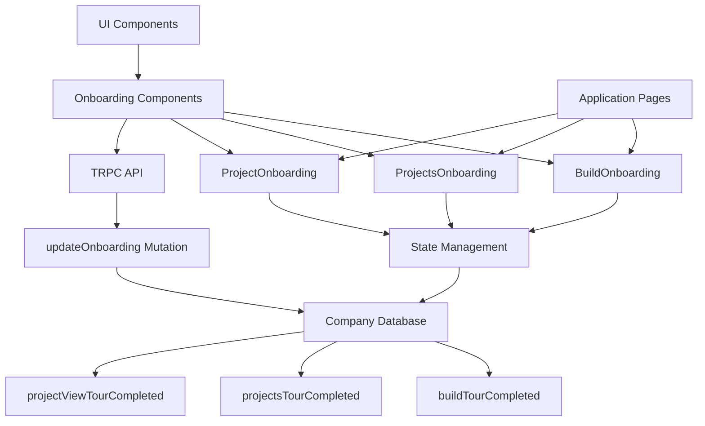

**Diagram sources**
- [build-onboarding.tsx](file://src/modules/home/ui/components/build-onboarding.tsx)
- [projects-onboarding.tsx](file://src/modules/home/ui/components/projects-onboarding.tsx)
- [project-onboarding.tsx](file://src/modules/projects/ui/components/project-onboarding.tsx)
- [procedures.ts](file://src/modules/companies/server/procedures.ts)

## Core Onboarding Components

### Build Onboarding
The Build Onboarding component guides users through the initial build process with a 4-step tour that covers creating prompts, tracking credits, and using templates.

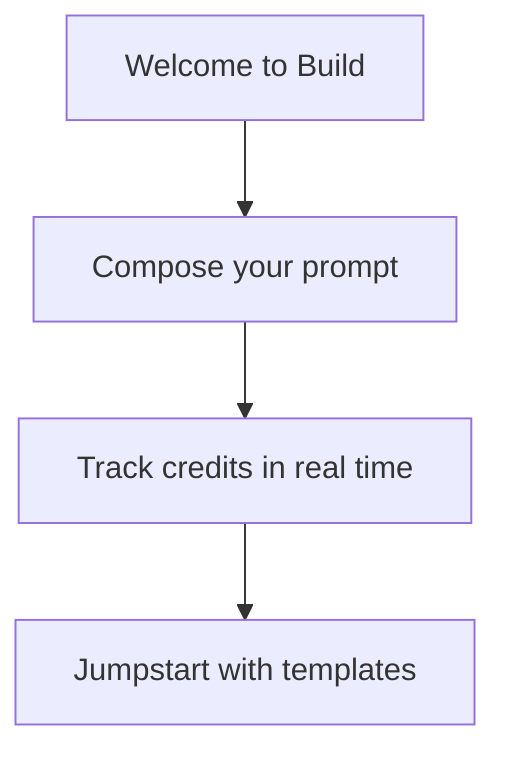

**Diagram sources**
- [build-onboarding.tsx](file://src/modules/home/ui/components/build-onboarding.tsx)

### Projects Overview Onboarding
The Projects Overview Onboarding provides a contextual tour of the projects dashboard, with dynamic steps that adapt based on whether the user has existing projects.

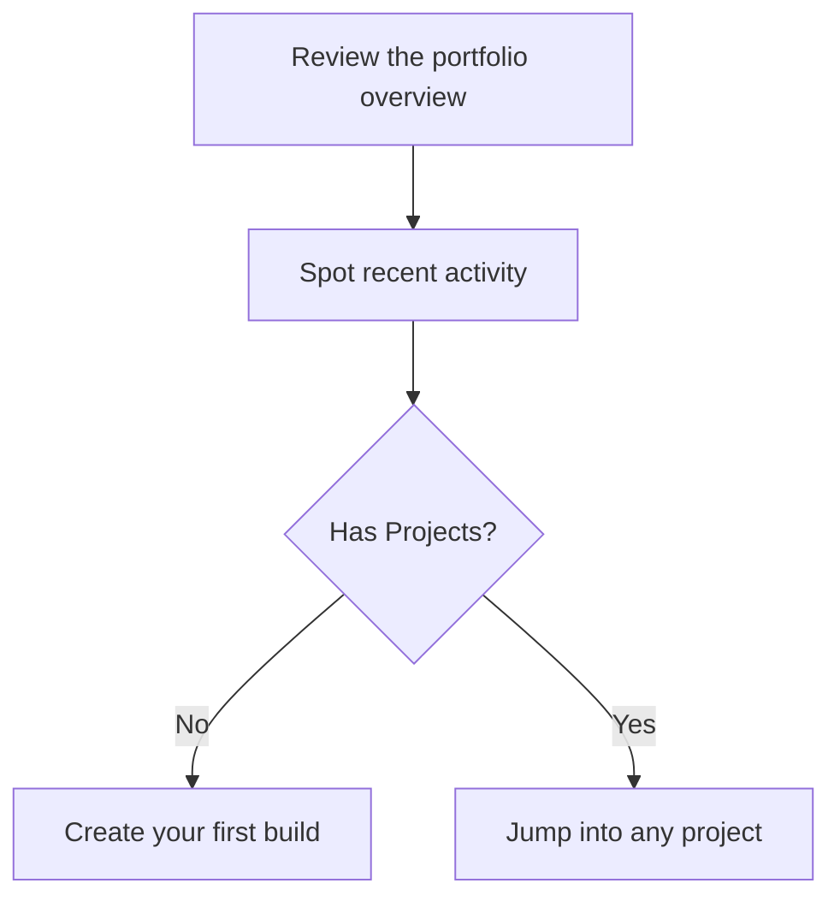

**Diagram sources**
- [projects-onboarding.tsx](file://src/modules/home/ui/components/projects-onboarding.tsx)

### Project View Onboarding
The Project View Onboarding guides users through the project-specific interface, focusing on conversation history, code preview, and collaboration features.

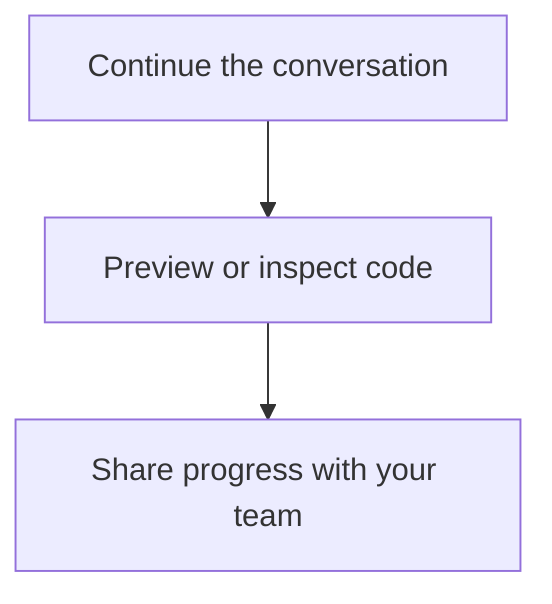

**Diagram sources**
- [project-onboarding.tsx](file://src/modules/projects/ui/components/project-onboarding.tsx)

**Section sources**
- [build-onboarding.tsx](file://src/modules/home/ui/components/build-onboarding.tsx)
- [projects-onboarding.tsx](file://src/modules/home/ui/components/projects-onboarding.tsx)
- [project-onboarding.tsx](file://src/modules/projects/ui/components/project-onboarding.tsx)

## Onboarding State Management

### Database Schema
The onboarding state is persisted in the Company table with three boolean fields that track completion status for each tour.

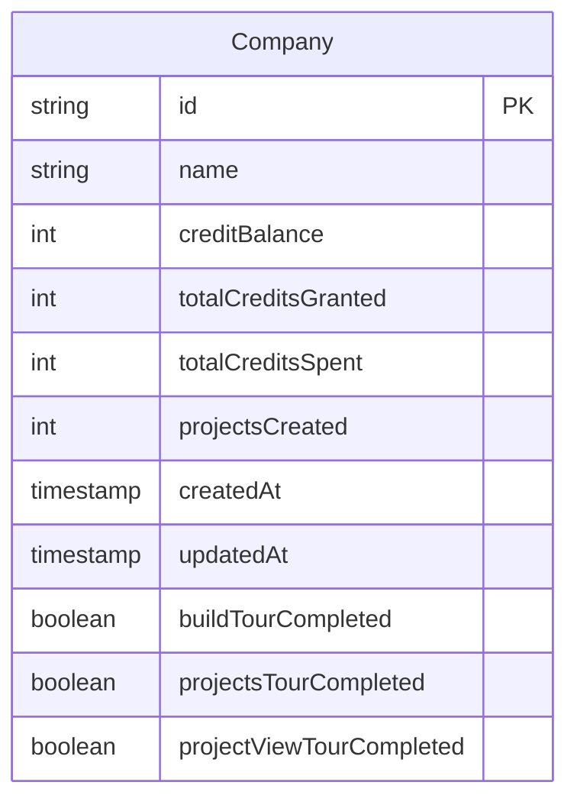

**Diagram sources**
- [migration.sql](file://prisma/migrations/20251101000934_onboarding/migration.sql)
- [migration.sql](file://prisma/migrations/20251101002002_project_view_onboarding/migration.sql)

### State Update Mechanism
The system uses a centralized update mechanism through the TRPC API to modify onboarding completion status.

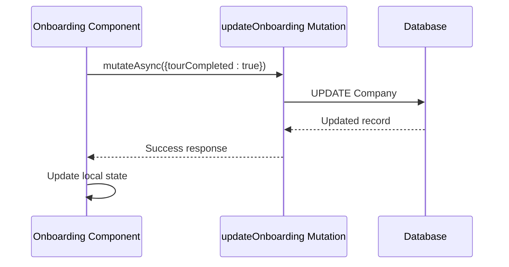

**Diagram sources**
- [procedures.ts](file://src/modules/companies/server/procedures.ts)
- [build-onboarding.tsx](file://src/modules/home/ui/components/build-onboarding.tsx)

**Section sources**
- [procedures.ts](file://src/modules/companies/server/procedures.ts)
- [migration.sql](file://prisma/migrations/20251101000934_onboarding/migration.sql)
- [migration.sql](file://prisma/migrations/20251101002002_project_view_onboarding/migration.sql)

## User Experience Flow

### Tour Lifecycle
The onboarding tours follow a consistent lifecycle pattern across all components:

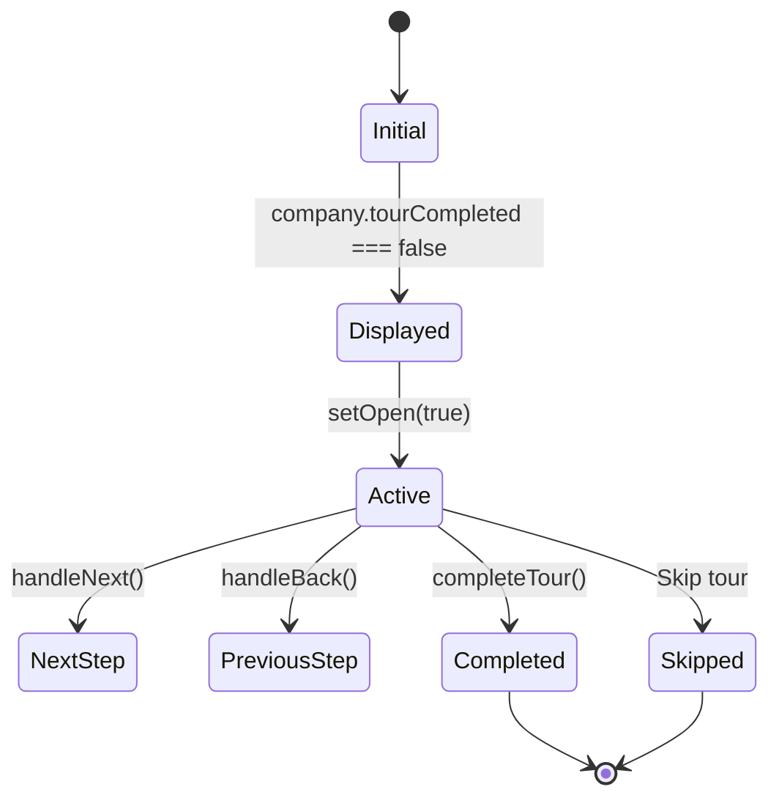

**Diagram sources**
- [build-onboarding.tsx](file://src/modules/home/ui/components/build-onboarding.tsx)
- [projects-onboarding.tsx](file://src/modules/home/ui/components/projects-onboarding.tsx)
- [project-onboarding.tsx](file://src/modules/projects/ui/components/project-onboarding.tsx)

### Navigation Controls
All onboarding components provide consistent navigation controls:

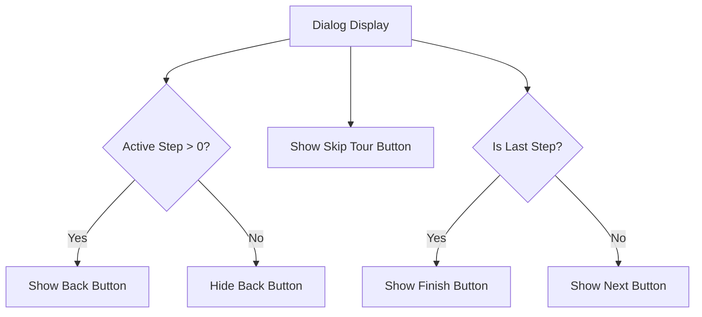

**Diagram sources**
- [build-onboarding.tsx](file://src/modules/home/ui/components/build-onboarding.tsx)
- [projects-onboarding.tsx](file://src/modules/home/ui/components/projects-onboarding.tsx)
- [project-onboarding.tsx](file://src/modules/projects/ui/components/project-onboarding.tsx)

**Section sources**
- [build-onboarding.tsx](file://src/modules/home/ui/components/build-onboarding.tsx#L136-L176)
- [projects-onboarding.tsx](file://src/modules/home/ui/components/projects-onboarding.tsx#L145-L185)
- [project-onboarding.tsx](file://src/modules/projects/ui/components/project-onboarding.tsx#L131-L171)

## Implementation Details

### Component Structure
Each onboarding component follows the same React pattern using hooks for state management and side effects.

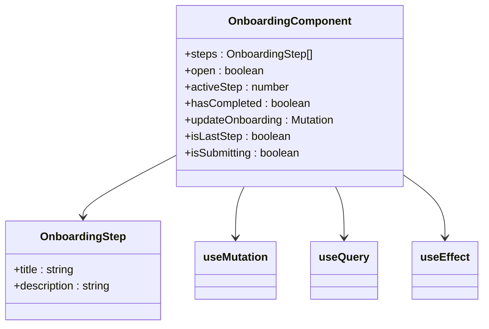

**Diagram sources**
- [build-onboarding.tsx](file://src/modules/home/ui/components/build-onboarding.tsx)
- [projects-onboarding.tsx](file://src/modules/home/ui/components/projects-onboarding.tsx)
- [project-onboarding.tsx](file://src/modules/projects/ui/components/project-onboarding.tsx)

### Error Handling
The system includes robust error handling for the onboarding completion process.

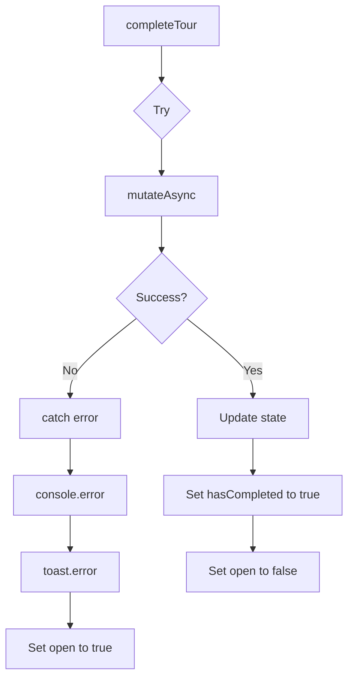

**Diagram sources**
- [build-onboarding.tsx](file://src/modules/home/ui/components/build-onboarding.tsx#L66-L113)
- [projects-onboarding.tsx](file://src/modules/home/ui/components/projects-onboarding.tsx#L83-L122)
- [project-onboarding.tsx](file://src/modules/projects/ui/components/project-onboarding.tsx#L69-L108)

**Section sources**
- [build-onboarding.tsx](file://src/modules/home/ui/components/build-onboarding.tsx)
- [projects-onboarding.tsx](file://src/modules/home/ui/components/projects-onboarding.tsx)
- [project-onboarding.tsx](file://src/modules/projects/ui/components/project-onboarding.tsx)

## Integration Points

### Application Pages
The onboarding components are integrated into specific application pages based on user context.

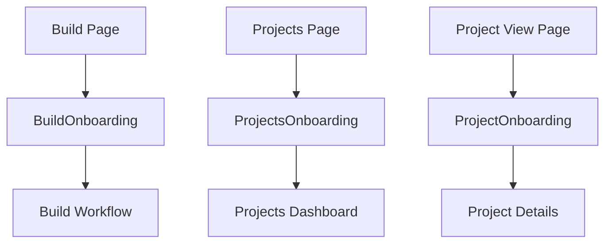

**Diagram sources**
- [page.tsx](file://src/app/build/page.tsx)
- [page.tsx](file://src/app/projects/page.tsx)
- [page.tsx](file://src/app/projects/[projectId]/page.tsx)

### Data Flow
The complete data flow for onboarding state management:

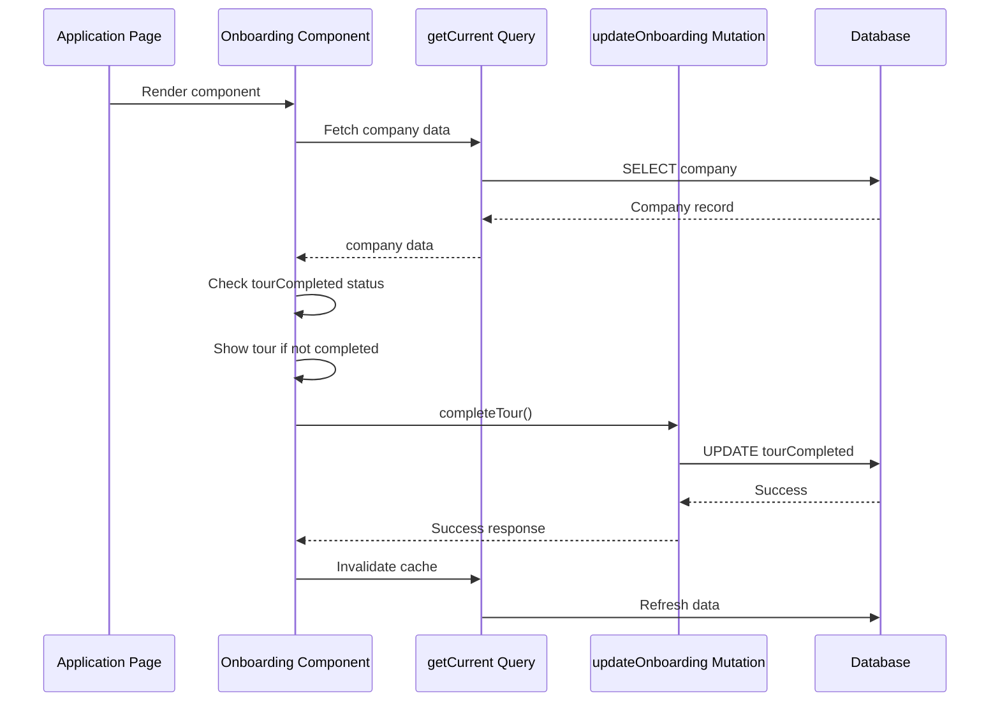

**Diagram sources**
- [page.tsx](file://src/app/build/page.tsx)
- [page.tsx](file://src/app/projects/page.tsx)
- [page.tsx](file://src/app/projects/[projectId]/page.tsx)
- [procedures.ts](file://src/modules/companies/server/procedures.ts)

**Section sources**
- [page.tsx](file://src/app/build/page.tsx)
- [page.tsx](file://src/app/projects/page.tsx)
- [page.tsx](file://src/app/projects/[projectId]/page.tsx)

## Conclusion
The Guided Onboarding Tours system provides a comprehensive user onboarding experience across three key areas of the QAI platform. The system is well-structured with consistent patterns across components, proper state management, and seamless integration with the backend database. Each tour is contextually relevant to the user's current location in the application, providing targeted guidance that enhances user understanding and engagement with the platform's features.

The implementation follows modern React patterns with proper separation of concerns, error handling, and state management. The database schema is designed to efficiently track user progress through the onboarding process, and the TRPC API provides a reliable interface for updating completion status. This cohesive system ensures that new users receive appropriate guidance while maintaining a clean and intuitive user experience.