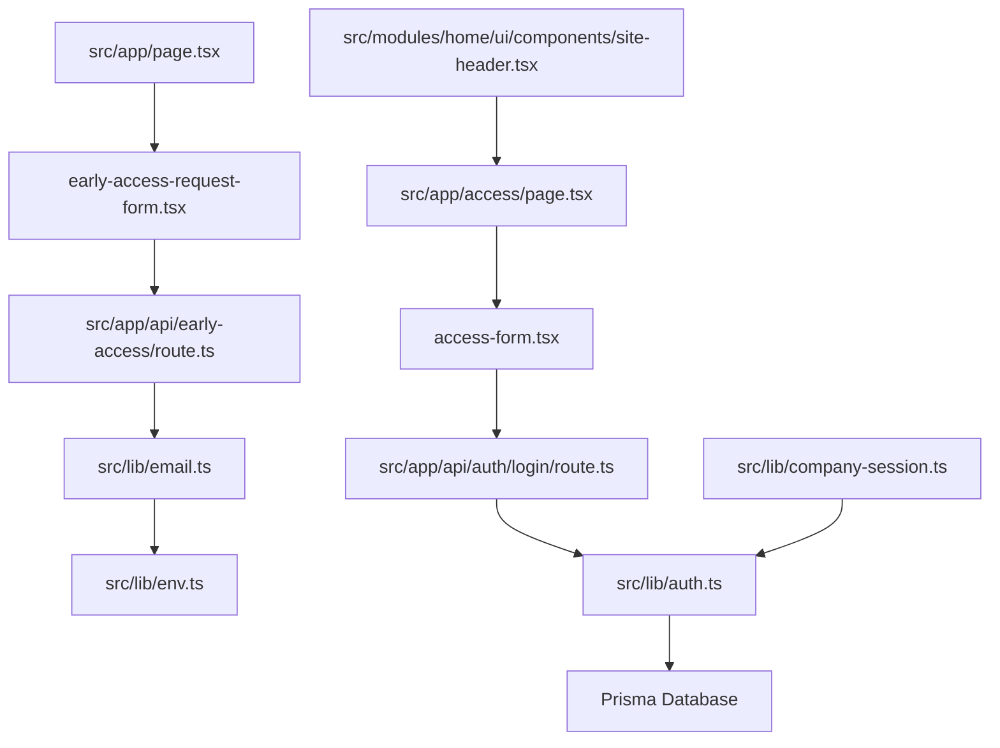
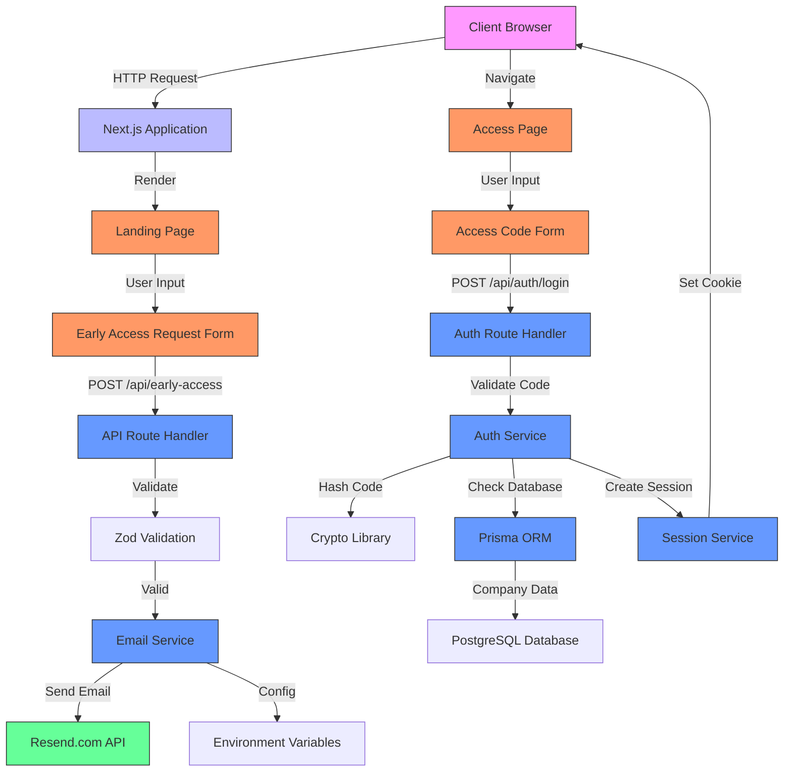
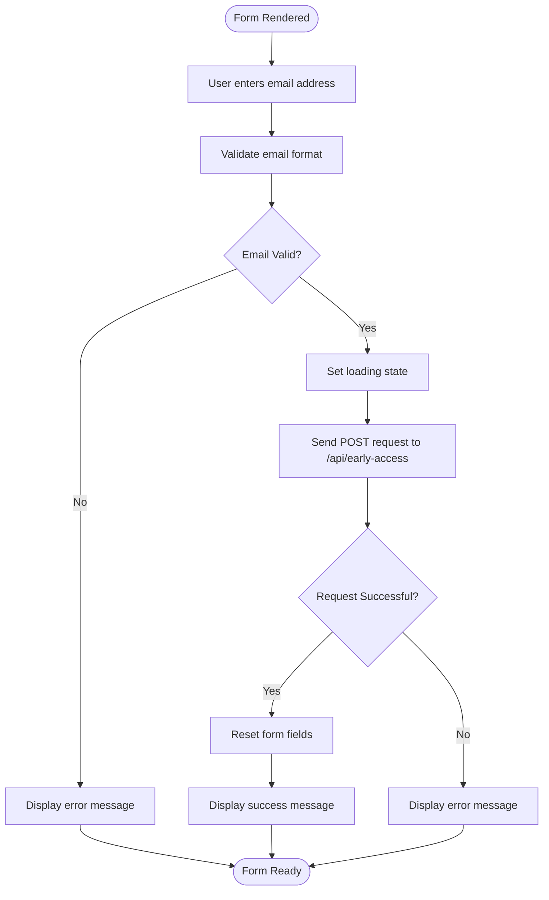
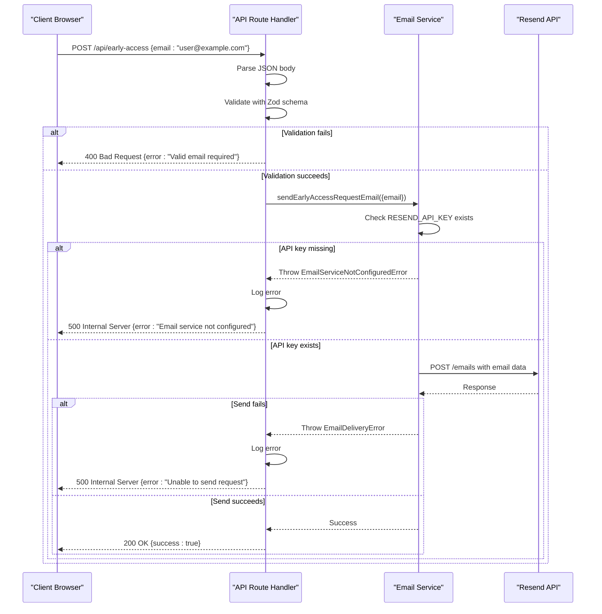
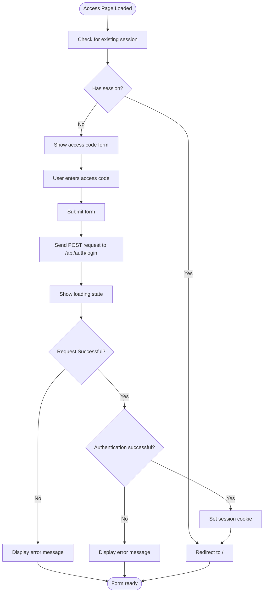
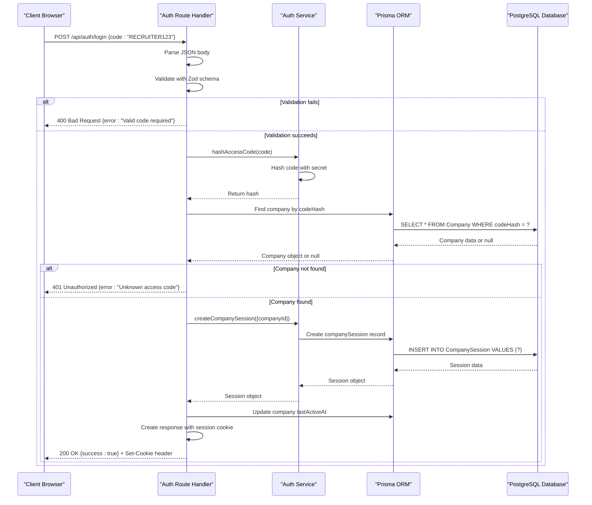
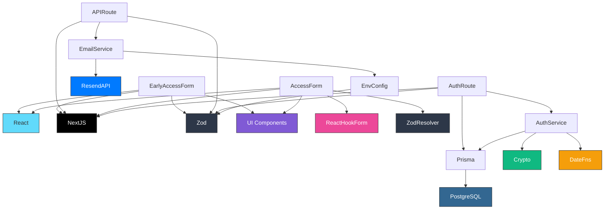

# Landing Page Early Access

<cite>
**Referenced Files in This Document**   
- [page.tsx](file://src/app/page.tsx)
- [early-access-request-form.tsx](file://src/modules/home/ui/components/early-access-request-form.tsx)
- [route.ts](file://src/app/api/early-access/route.ts)
- [email.ts](file://src/lib/email.ts)
- [env.ts](file://src/lib/env.ts)
- [access/page.tsx](file://src/app/access/page.tsx)
- [access-form.tsx](file://src/modules/auth/ui/access-form.tsx)
- [auth/login/route.ts](file://src/app/api/auth/login/route.ts)
- [company-session.ts](file://src/lib/company-session.ts)
- [auth.ts](file://src/lib/auth.ts)
- [site-header.tsx](file://src/modules/home/ui/components/site-header.tsx)
</cite>

## Table of Contents
1. [Introduction](#introduction)
2. [Project Structure](#project-structure)
3. [Core Components](#core-components)
4. [Architecture Overview](#architecture-overview)
5. [Detailed Component Analysis](#detailed-component-analysis)
6. [Dependency Analysis](#dependency-analysis)
7. [Performance Considerations](#performance-considerations)
8. [Troubleshooting Guide](#troubleshooting-guide)
9. [Conclusion](#conclusion)

## Introduction
This document provides comprehensive documentation for the Landing Page Early Access system in the QAI application. The system enables potential users to request early access to the platform through a form on the landing page, which triggers an email notification to the team. Approved users can then enter the platform using a recruiter code. The documentation covers the complete flow from the user interface to backend processing and authentication.

## Project Structure
The early access functionality is organized across several key directories in the application:

- `src/app/page.tsx`: Main landing page with early access request form
- `src/modules/home/ui/components/early-access-request-form.tsx`: Client-side form component for requesting access
- `src/app/api/early-access/route.ts`: API endpoint for handling early access requests
- `src/lib/email.ts`: Email service for sending notifications
- `src/app/access/page.tsx`: Access page where users enter their recruiter code
- `src/modules/auth/ui/access-form.tsx`: Form component for code submission
- `src/app/api/auth/login/route.ts`: Authentication endpoint for code verification

**Diagram sources**
- [page.tsx](file://src/app/page.tsx)
- [early-access-request-form.tsx](file://src/modules/home/ui/components/early-access-request-form.tsx)
- [route.ts](file://src/app/api/early-access/route.ts)
- [email.ts](file://src/lib/email.ts)
- [env.ts](file://src/lib/env.ts)
- [access/page.tsx](file://src/app/access/page.tsx)
- [access-form.tsx](file://src/modules/auth/ui/access-form.tsx)
- [auth/login/route.ts](file://src/app/api/auth/login/route.ts)
- [auth.ts](file://src/lib/auth.ts)
- [company-session.ts](file://src/lib/company-session.ts)
- [site-header.tsx](file://src/modules/home/ui/components/site-header.tsx)

**Section sources**
- [page.tsx](file://src/app/page.tsx)
- [early-access-request-form.tsx](file://src/modules/home/ui/components/early-access-request-form.tsx)
- [route.ts](file://src/app/api/early-access/route.ts)
- [email.ts](file://src/lib/email.ts)
- [env.ts](file://src/lib/env.ts)

## Core Components
The early access system consists of two main components: the request system for new users and the access system for approved users. The request system allows visitors to submit their email address through a form on the landing page, which triggers an email notification to the team. The access system allows users with a recruiter code to authenticate and enter the platform. Both systems are integrated with the application's authentication and session management infrastructure.

**Section sources**
- [page.tsx](file://src/app/page.tsx)
- [early-access-request-form.tsx](file://src/modules/home/ui/components/early-access-request-form.tsx)
- [access/page.tsx](file://src/app/access/page.tsx)
- [access-form.tsx](file://src/modules/auth/ui/access-form.tsx)

## Architecture Overview
The early access system follows a client-server architecture with clear separation between frontend components and backend services. The system is built on Next.js with React components on the client side and API routes on the server side. The architecture includes form validation, email notification, authentication, and session management layers.

**Diagram sources**
- [page.tsx](file://src/app/page.tsx)
- [early-access-request-form.tsx](file://src/modules/home/ui/components/early-access-request-form.tsx)
- [route.ts](file://src/app/api/early-access/route.ts)
- [email.ts](file://src/lib/email.ts)
- [env.ts](file://src/lib/env.ts)
- [access/page.tsx](file://src/app/access/page.tsx)
- [access-form.tsx](file://src/modules/auth/ui/access-form.tsx)
- [auth/login/route.ts](file://src/app/api/auth/login/route.ts)
- [auth.ts](file://src/lib/auth.ts)

## Detailed Component Analysis

### Early Access Request System
The early access request system allows potential users to submit their email address to request access to the platform. When a user submits the form, the data is validated and sent to an API endpoint that triggers an email notification to the team.

#### Early Access Request Form
The client-side form component handles user input, validation, and submission. It provides feedback states for loading, success, and error conditions.

**Diagram sources**
- [early-access-request-form.tsx](file://src/modules/home/ui/components/early-access-request-form.tsx)

**Section sources**
- [early-access-request-form.tsx](file://src/modules/home/ui/components/early-access-request-form.tsx)
- [page.tsx](file://src/app/page.tsx)

#### Early Access API Route
The API route handler validates the incoming request, processes the email submission, and sends a notification through the email service.

**Diagram sources**
- [route.ts](file://src/app/api/early-access/route.ts)
- [email.ts](file://src/lib/email.ts)

### Access Code Authentication System
The access code system allows approved users to enter the platform using a recruiter code. The system verifies the code, creates a session, and redirects the user to the main application.

#### Access Code Form
The client-side form component for code submission handles user input, form validation, and authentication requests.

**Diagram sources**
- [access/page.tsx](file://src/app/access/page.tsx)
- [access-form.tsx](file://src/modules/auth/ui/access-form.tsx)

**Section sources**
- [access/page.tsx](file://src/app/access/page.tsx)
- [access-form.tsx](file://src/modules/auth/ui/access-form.tsx)
- [auth/login/route.ts](file://src/app/api/auth/login/route.ts)

#### Authentication API Route
The authentication route handler verifies the access code, creates a session, and sets the session cookie.

**Diagram sources**
- [auth/login/route.ts](file://src/app/api/auth/login/route.ts)
- [auth.ts](file://src/lib/auth.ts)

## Dependency Analysis
The early access system has several key dependencies that enable its functionality:

**Diagram sources**
- [package.json](file://package.json)
- [early-access-request-form.tsx](file://src/modules/home/ui/components/early-access-request-form.tsx)
- [route.ts](file://src/app/api/early-access/route.ts)
- [email.ts](file://src/lib/email.ts)
- [access-form.tsx](file://src/modules/auth/ui/access-form.tsx)
- [auth/login/route.ts](file://src/app/api/auth/login/route.ts)
- [auth.ts](file://src/lib/auth.ts)
- [env.ts](file://src/lib/env.ts)

**Section sources**
- [package.json](file://package.json)
- [early-access-request-form.tsx](file://src/modules/home/ui/components/early-access-request-form.tsx)
- [route.ts](file://src/app/api/early-access/route.ts)
- [email.ts](file://src/lib/email.ts)
- [access-form.tsx](file://src/modules/auth/ui/access-form.tsx)
- [auth/login/route.ts](file://src/app/api/auth/login/route.ts)
- [auth.ts](file://src/lib/auth.ts)
- [env.ts](file://src/lib/env.ts)

## Performance Considerations
The early access system is designed with performance in mind, using efficient validation, minimal database queries, and proper error handling. The client-side forms use React state management to provide immediate feedback without unnecessary re-renders. The API routes are optimized for quick response times with minimal processing overhead. Email notifications are handled asynchronously to prevent blocking the main request flow. The authentication system uses hashed codes for fast database lookups and creates sessions with appropriate expiration times to balance security and performance.

## Troubleshooting Guide
Common issues with the early access system and their solutions:

1. **Form submission fails silently**: Check browser console for JavaScript errors and ensure all required fields are filled correctly.

2. **Email not received after submission**: Verify that the RESEND_API_KEY environment variable is set and valid. Check the server logs for email service errors.

3. **Access code not accepted**: Ensure the code is entered correctly (case-sensitive). Verify that the code exists in the database and hasn't expired.

4. **Session not persisting after login**: Check that the SESSION_COOKIE_NAME is correctly configured and that the browser accepts cookies.

5. **Validation errors not displaying**: Ensure the form components are properly integrated with the validation library and error states are correctly managed.

**Section sources**
- [early-access-request-form.tsx](file://src/modules/home/ui/components/early-access-request-form.tsx)
- [route.ts](file://src/app/api/early-access/route.ts)
- [email.ts](file://src/lib/email.ts)
- [access-form.tsx](file://src/modules/auth/ui/access-form.tsx)
- [auth/login/route.ts](file://src/app/api/auth/login/route.ts)
- [auth.ts](file://src/lib/auth.ts)

## Conclusion
The Landing Page Early Access system provides a robust mechanism for managing user access to the QAI platform. The system combines a user-friendly interface with secure authentication and notification processes. The architecture is well-structured with clear separation of concerns between components, making it maintainable and extensible. The implementation follows best practices for form validation, error handling, and security, ensuring a reliable experience for both potential users and the platform team.