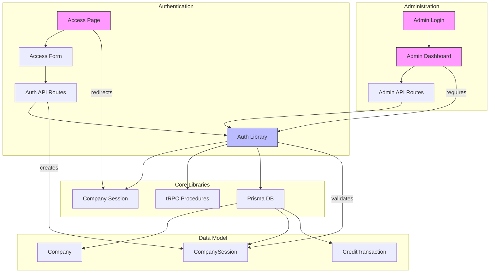
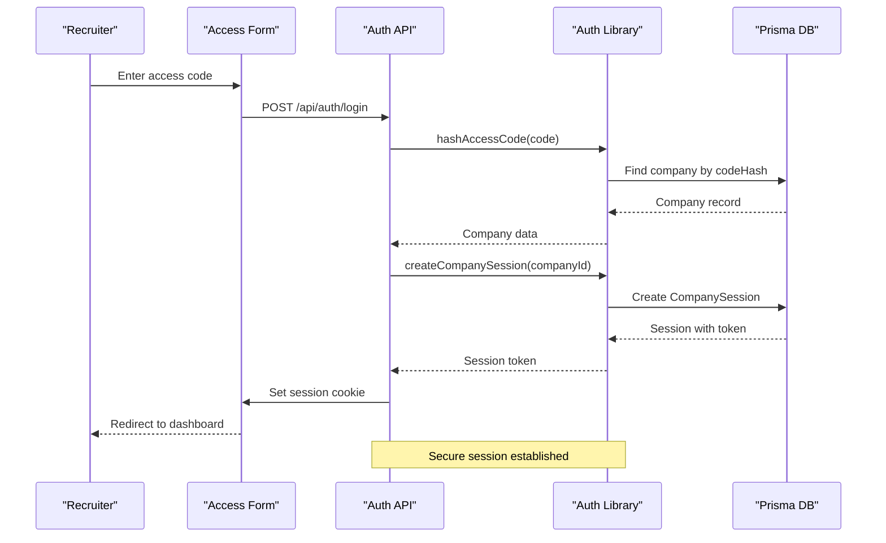
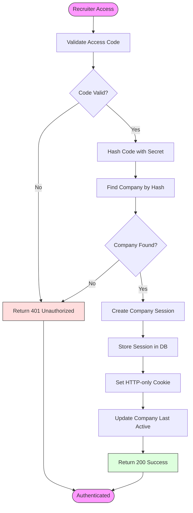
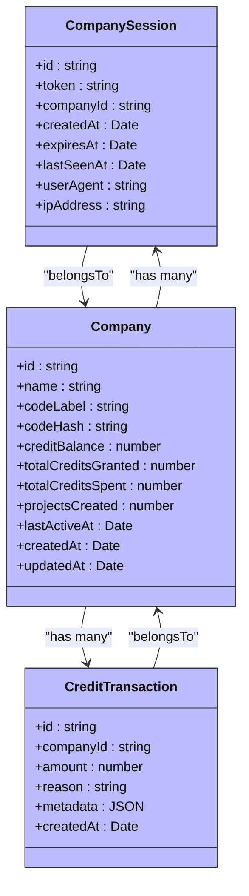
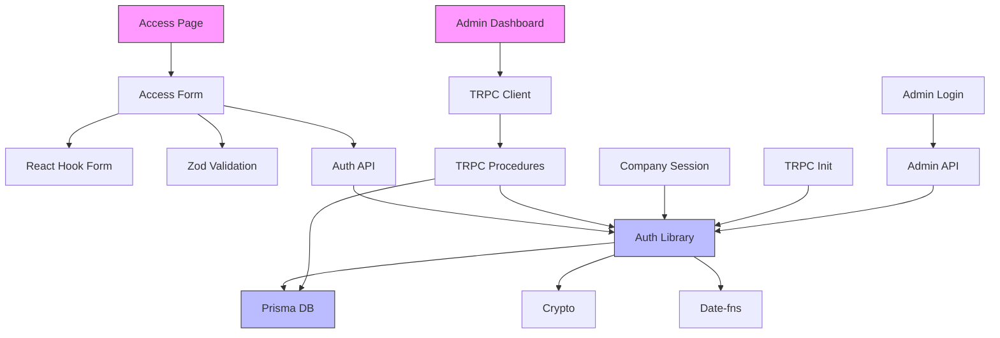

# Recruiter Access Control

<cite>
**Referenced Files in This Document**   
- [auth.ts](file://src/lib/auth.ts)
- [company-session.ts](file://src/lib/company-session.ts)
- [access-form.tsx](file://src/modules/auth/ui/access-form.tsx)
- [page.tsx](file://src/app/access/page.tsx)
- [route.ts](file://src/app/api/auth/login/route.ts)
- [route.ts](file://src/app/api/auth/logout/route.ts)
- [admin-login-form.tsx](file://src/modules/admin/ui/admin-login-form.tsx)
- [admin-dashboard.tsx](file://src/modules/admin/ui/admin-dashboard.tsx)
- [init.ts](file://src/trpc/init.ts)
- [migration.sql](file://prisma/migrations/20251030113918_codes_2/migration.sql)
</cite>

## Table of Contents
1. [Introduction](#introduction)
2. [Project Structure](#project-structure)
3. [Core Components](#core-components)
4. [Architecture Overview](#architecture-overview)
5. [Detailed Component Analysis](#detailed-component-analysis)
6. [Dependency Analysis](#dependency-analysis)
7. [Performance Considerations](#performance-considerations)
8. [Troubleshooting Guide](#troubleshooting-guide)
9. [Conclusion](#conclusion)

## Introduction
This document provides a comprehensive analysis of the recruiter access control system in the QAI platform. The system implements a private preview access model where recruiters gain entry through unique access codes. The architecture combines secure authentication, session management, and administrative controls to manage recruiter access and monitor usage. The system is built with Next.js, tRPC, and Prisma, following a modular structure that separates concerns between authentication, company management, and administrative functions.

## Project Structure
The project follows a Next.js App Router structure with a clear separation of concerns. The authentication system is organized across multiple directories: authentication UI components in `src/modules/auth/ui/`, API routes in `src/app/api/auth/`, and core authentication logic in `src/lib/auth.ts`. Administrative functionality is similarly structured with dedicated components, API routes, and tRPC procedures. The Prisma schema defines the data model for companies, sessions, and credits, enabling the access control system to track usage and enforce limits.



**Diagram sources**
- [page.tsx](file://src/app/access/page.tsx)
- [access-form.tsx](file://src/modules/auth/ui/access-form.tsx)
- [route.ts](file://src/app/api/auth/login/route.ts)
- [auth.ts](file://src/lib/auth.ts)
- [migration.sql](file://prisma/migrations/20251030113918_codes_2/migration.sql)

**Section sources**
- [page.tsx](file://src/app/access/page.tsx)
- [access-form.tsx](file://src/modules/auth/ui/access-form.tsx)
- [route.ts](file://src/app/api/auth/login/route.ts)
- [auth.ts](file://src/lib/auth.ts)

## Core Components
The recruiter access control system consists of several core components that work together to manage access. The system is built around a code-based authentication model where recruiters enter a unique access code to gain entry to the platform. This code is hashed and compared against stored values in the database. Upon successful authentication, a secure session is created and stored as an HTTP-only cookie. The system also implements a credit-based usage tracking mechanism that limits how much each company can use the platform. Administrative controls allow authorized personnel to create new access codes, grant additional credits, and monitor company activity.

**Section sources**
- [auth.ts](file://src/lib/auth.ts)
- [access-form.tsx](file://src/modules/auth/ui/access-form.tsx)
- [route.ts](file://src/app/api/auth/login/route.ts)

## Architecture Overview
The recruiter access control architecture follows a layered approach with clear separation between presentation, business logic, and data access layers. Authentication requests flow from the client-side access form through API routes to the authentication library, which interacts with the database to validate credentials and create sessions. The tRPC framework provides a type-safe API layer that enforces access control at the procedure level, ensuring that only authenticated companies can access protected resources. Administrative functions are similarly protected but require a separate admin authentication mechanism. The system uses Prisma for database access and implements transactional integrity for credit management operations.



**Diagram sources**
- [access-form.tsx](file://src/modules/auth/ui/access-form.tsx)
- [route.ts](file://src/app/api/auth/login/route.ts)
- [auth.ts](file://src/lib/auth.ts)
- [migration.sql](file://prisma/migrations/20251030113918_codes_2/migration.sql)

## Detailed Component Analysis

### Authentication Flow Analysis
The authentication flow begins with the recruiter accessing the `/access` page, which displays an access form for entering their recruiter code. When submitted, the form sends a POST request to the `/api/auth/login` endpoint with the provided code. The server hashes the code using a secret salt and queries the database for a matching company record. If found, a new company session is created with a random token stored in an HTTP-only cookie. The session includes metadata such as IP address and user agent for security purposes. Subsequent requests include this cookie, which is validated on each request to maintain the authenticated state.



**Diagram sources**
- [page.tsx](file://src/app/access/page.tsx)
- [access-form.tsx](file://src/modules/auth/ui/access-form.tsx)
- [route.ts](file://src/app/api/auth/login/route.ts)
- [auth.ts](file://src/lib/auth.ts)

**Section sources**
- [page.tsx](file://src/app/access/page.tsx)
- [access-form.tsx](file://src/modules/auth/ui/access-form.tsx)
- [route.ts](file://src/app/api/auth/login/route.ts)

### Session Management Analysis
The session management system provides secure, stateful authentication for recruiters while maintaining privacy and security. Sessions are stored in the database with a random token, expiration date, and metadata including IP address and user agent. The session token is stored in an HTTP-only, secure cookie to prevent client-side access and cross-site scripting attacks. Each request to protected routes validates the session by looking up the token in the database and checking expiration. Active sessions are "touched" on each request to update their last seen timestamp, which helps track company activity. Sessions can be invalidated through the logout endpoint, which removes the session from the database and clears the cookie.



**Diagram sources**
- [auth.ts](file://src/lib/auth.ts)
- [migration.sql](file://prisma/migrations/20251030113918_codes_2/migration.sql)
- [company-session.ts](file://src/lib/company-session.ts)

**Section sources**
- [auth.ts](file://src/lib/auth.ts)
- [company-session.ts](file://src/lib/company-session.ts)

### Administrative Access Analysis
The administrative access system provides a separate authentication mechanism for platform administrators to manage recruiter codes and monitor usage. Admins authenticate using a shared secret rather than access codes, with the secret hashed and compared against an environment variable. Successful authentication sets a separate admin cookie that grants access to the admin dashboard. The dashboard provides functionality to create new recruiter codes, grant additional credits to companies, and view detailed activity metrics. All admin actions are protected by tRPC middleware that verifies admin status before allowing access to sensitive operations.

```mermaid
sequenceDiagram
participant Admin as "Administrator"
participant LoginForm as "Login Form"
participant AdminAPI as "Admin API"
participant AuthLib as "Auth Library"
Admin->>LoginForm : Enter admin secret
LoginForm->>AdminAPI : POST /api/admin/login
AdminAPI->>AuthLib : getAdminCookieValue()
AuthLib-->>AdminAPI : Hashed secret
AdminAPI->>AdminAPI : Compare with input
AdminAPI -->|Valid| SetAdminCookie["Set admin cookie"]
AdminAPI -->|Invalid| ReturnError["Return 401"]
SetAdminCookie ->> LoginForm : Set HTTP-only cookie
LoginForm-->>Admin : Redirect to dashboard
Note over AdminAPI,AuthLib : Admin authentication complete
```

**Diagram sources**
- [admin-login-form.tsx](file://src/modules/admin/ui/admin-login-form.tsx)
- [route.ts](file://src/app/api/admin/login/route.ts)
- [auth.ts](file://src/lib/auth.ts)

**Section sources**
- [admin-login-form.tsx](file://src/modules/admin/ui/admin-login-form.tsx)
- [route.ts](file://src/app/api/admin/login/route.ts)

## Dependency Analysis
The recruiter access control system has a well-defined dependency structure that ensures separation of concerns while maintaining necessary connections between components. The authentication system depends on the Prisma database client for persistent storage of company and session data. The tRPC framework serves as the central integration point, connecting API routes with business logic procedures that enforce access control. Environment variables provide configuration for security secrets and system parameters. The system uses several third-party libraries for validation (zod), form handling (react-hook-form), and UI components (shadcn/ui), but these are isolated to specific layers and do not create tight coupling.



**Diagram sources**
- [auth.ts](file://src/lib/auth.ts)
- [init.ts](file://src/trpc/init.ts)
- [access-form.tsx](file://src/modules/auth/ui/access-form.tsx)
- [admin-dashboard.tsx](file://src/modules/admin/ui/admin-dashboard.tsx)

**Section sources**
- [auth.ts](file://src/lib/auth.ts)
- [init.ts](file://src/trpc/init.ts)

## Performance Considerations
The access control system is designed with performance in mind, particularly for the authentication flow which is critical to the user experience. Session validation is optimized through database indexing on the token field, ensuring fast lookups. The use of HTTP-only cookies eliminates the need for repeated code entry and reduces database queries after initial authentication. The system implements caching for session lookups through Next.js React cache, reducing redundant database queries during a single request. Database operations are batched where possible, such as updating both the session touch time and company last active time in a single transaction. The credit management system uses database transactions to ensure data consistency while minimizing lock time.

## Troubleshooting Guide
Common issues with the recruiter access control system typically involve authentication failures, session expiration, or credit limitations. Authentication failures may occur due to incorrect access codes, expired codes, or server-side issues with the hashing mechanism. Session-related issues can stem from cookie configuration problems, such as incorrect secure flags in development environments. Credit-related errors occur when companies exceed their allocated credits, requiring administrative intervention to grant additional access. Monitoring database connectivity and ensuring proper environment variable configuration are essential for maintaining system reliability. The system provides clear error messages to help diagnose issues, and administrators can use the dashboard to view company activity and troubleshoot access problems.

**Section sources**
- [auth.ts](file://src/lib/auth.ts)
- [route.ts](file://src/app/api/auth/login/route.ts)
- [admin-dashboard.tsx](file://src/modules/admin/ui/admin-dashboard.tsx)

## Conclusion
The recruiter access control system in the QAI platform provides a secure, scalable solution for managing private preview access. By combining code-based authentication with session management and credit tracking, the system enables controlled access while providing valuable usage insights. The architecture follows modern web development best practices with clear separation of concerns, type safety, and secure authentication patterns. Administrative controls allow for flexible management of recruiter codes and usage limits, supporting the platform's growth and expansion. The system is well-positioned to handle increasing numbers of recruiters while maintaining security and performance.