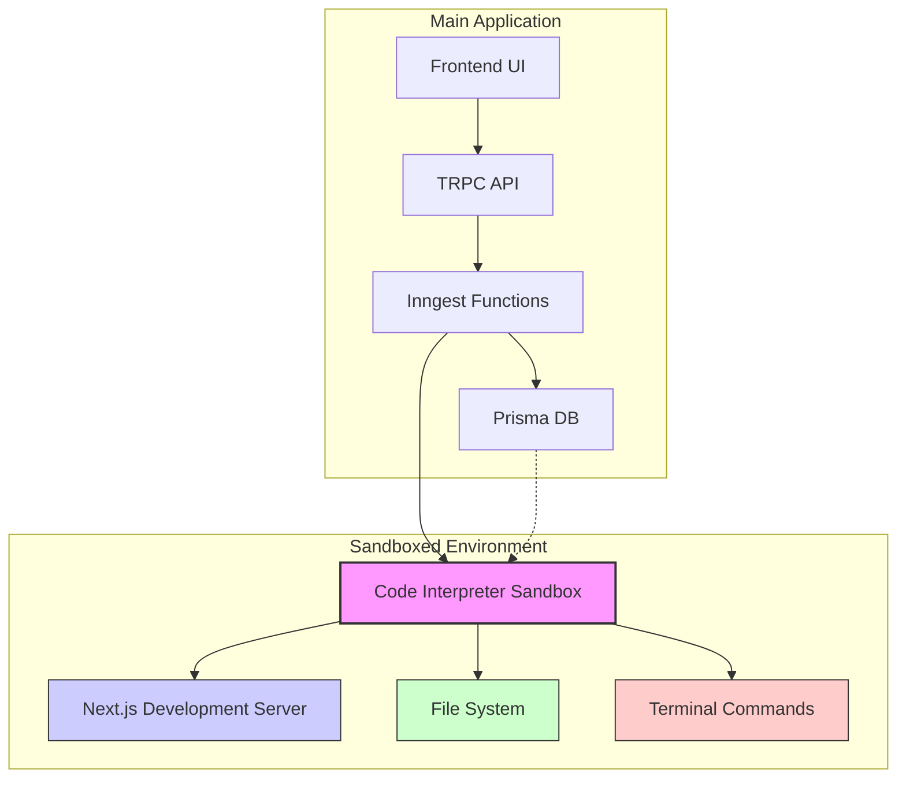
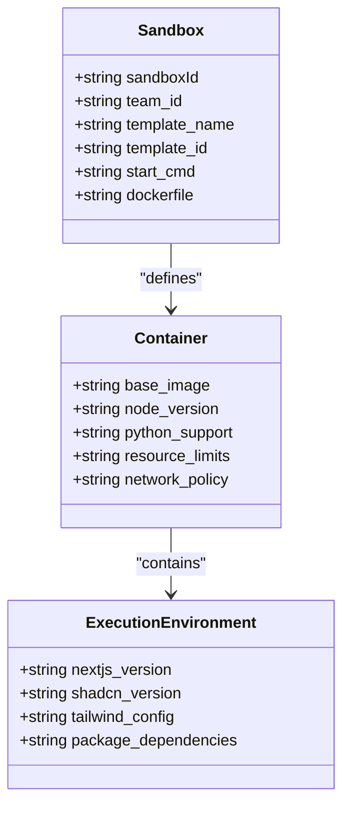
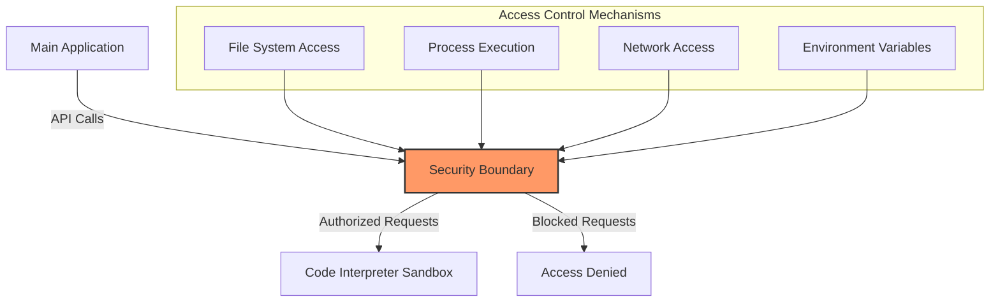
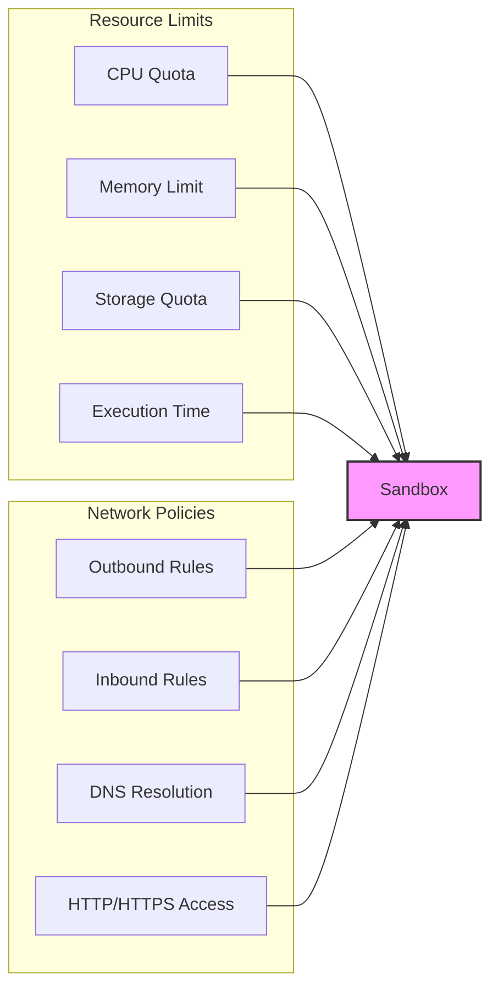
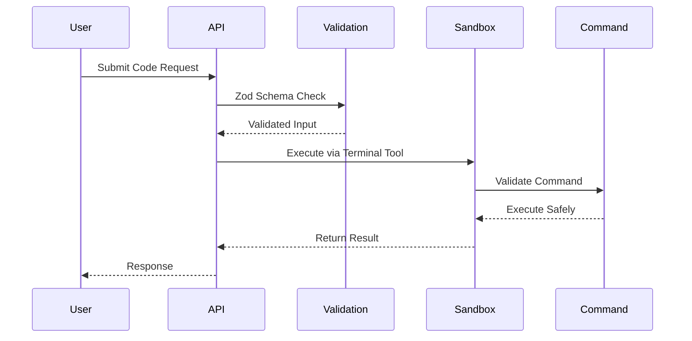
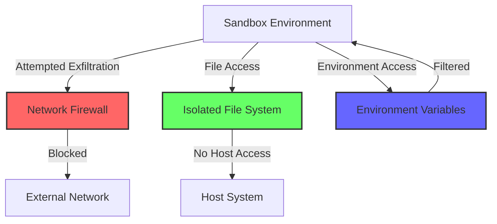
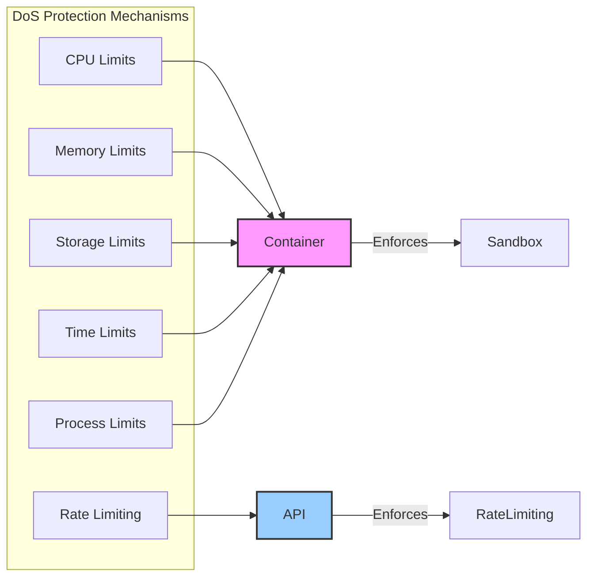
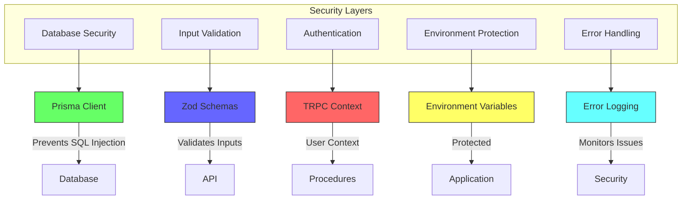

# Security & Sandboxing

<cite>
**Referenced Files in This Document**   
- [e2b.Dockerfile](file://sandbox-templates/nextjs/e2b.Dockerfile)
- [e2b.toml](file://sandbox-templates/nextjs/e2b.toml)
- [compile_page.sh](file://sandbox-templates/nextjs/compile_page.sh)
- [functions.ts](file://src/inngest/functions.ts)
- [utils.ts](file://src/inngest/utils.ts)
- [db.ts](file://src/lib/db.ts)
- [init.ts](file://src/trpc/init.ts)
- [procedures.ts](file://src/modules/projects/server/procedures.ts)
- [prompt.ts](file://src/prompt.ts)
- [package.json](file://package.json)
</cite>

## Table of Contents
1. [Introduction](#introduction)
2. [Sandbox Architecture Overview](#sandbox-architecture-overview)
3. [Container Isolation and Execution Environment](#container-isolation-and-execution-environment)
4. [Security Boundaries and Access Controls](#security-boundaries-and-access-controls)
5. [Resource and Network Restrictions](#resource-and-network-restrictions)
6. [Prevention of Malicious Code Execution](#prevention-of-malicious-code-execution)
7. [Data Exfiltration Prevention](#data-exfiltration-prevention)
8. [Denial-of-Service Protection](#denial-of-service-protection)
9. [Additional Security Layers](#additional-security-layers)
10. [Best Practices for Extending Sandbox Capabilities](#best-practices-for-extending-sandbox-capabilities)
11. [Conclusion](#conclusion)

## Introduction
The QAI application implements a robust security architecture centered around the @e2b/code-interpreter sandbox to safely execute AI-generated code. This document details the comprehensive security measures that protect the system from various threats while enabling powerful AI-driven development capabilities. The architecture combines container isolation, strict access controls, input validation, and multiple security layers to create a secure environment for code execution.

**Section sources**
- [functions.ts](file://src/inngest/functions.ts#L0-L211)
- [e2b.Dockerfile](file://sandbox-templates/nextjs/e2b.Dockerfile#L0-L19)

## Sandbox Architecture Overview

**Diagram sources**
- [functions.ts](file://src/inngest/functions.ts#L0-L211)
- [e2b.toml](file://sandbox-templates/nextjs/e2b.toml#L0-L16)

**Section sources**
- [functions.ts](file://src/inngest/functions.ts#L0-L211)
- [e2b.toml](file://sandbox-templates/nextjs/e2b.toml#L0-L16)

## Container Isolation and Execution Environment

The @e2b/code-interpreter sandbox provides complete container isolation for executing AI-generated code. Each sandbox instance runs in a separate Docker container based on the configuration defined in the e2b.Dockerfile and e2b.toml files. The container is built from the node:21-slim base image, creating a minimal execution environment with only essential components.

The sandbox environment is pre-configured with Node.js, Python, and a complete Next.js development setup with Shadcn UI components. This environment is created during the template build process, ensuring consistent and secure configurations across all sandbox instances. The e2b.toml configuration file defines the template ID, team ID, and startup command, establishing a standardized execution environment.

**Diagram sources**
- [e2b.Dockerfile](file://sandbox-templates/nextjs/e2b.Dockerfile#L0-L19)
- [e2b.toml](file://sandbox-templates/nextjs/e2b.toml#L0-L16)

**Section sources**
- [e2b.Dockerfile](file://sandbox-templates/nextjs/e2b.Dockerfile#L0-L19)
- [e2b.toml](file://sandbox-templates/nextjs/e2b.toml#L0-L16)

## Security Boundaries and Access Controls

The system maintains strict security boundaries between the main application and the sandboxed environment. File system access is controlled through the sandbox's API, with all file operations requiring explicit permission through designated tools. The main application can only interact with the sandbox through well-defined interfaces, preventing direct access to the container's file system.

Process isolation ensures that code execution within the sandbox cannot affect the main application or other sandbox instances. The sandbox runs as a separate process with restricted privileges, limiting its ability to interact with system resources. Access controls are enforced at multiple levels, including file system permissions, process execution rights, and network connectivity.

**Diagram sources**
- [functions.ts](file://src/inngest/functions.ts#L0-L211)
- [utils.ts](file://src/inngest/utils.ts#L0-L20)

**Section sources**
- [functions.ts](file://src/inngest/functions.ts#L0-L211)
- [utils.ts](file://src/inngest/utils.ts#L0-L20)

## Resource and Network Restrictions

The sandbox implementation includes comprehensive resource and network restrictions to prevent abuse and ensure system stability. Resource limits are enforced at the container level, constraining CPU, memory, and storage usage for each sandbox instance. These limits prevent any single execution from consuming excessive resources that could impact other operations.

Network access is strictly controlled, with outbound connections limited to essential services. The sandbox can only communicate with predefined endpoints, preventing data exfiltration through external network requests. Inbound connections are also restricted, with only specific ports exposed for necessary services like the Next.js development server.

**Diagram sources**
- [e2b.Dockerfile](file://sandbox-templates/nextjs/e2b.Dockerfile#L0-L19)
- [e2b.toml](file://sandbox-templates/nextjs/e2b.toml#L0-L16)

**Section sources**
- [e2b.Dockerfile](file://sandbox-templates/nextjs/e2b.Dockerfile#L0-L19)
- [e2b.toml](file://sandbox-templates/nextjs/e2b.toml#L0-L16)

## Prevention of Malicious Code Execution

The system employs multiple strategies to prevent malicious code execution within the sandbox environment. Code execution is restricted to specific, approved commands through the terminal tool, which validates and sanitizes all inputs before execution. The prompt.ts file contains strict guidelines that prohibit the execution of potentially dangerous commands like npm run dev, npm run build, or next dev.

Input validation is enforced through Zod schemas in the TRPC procedures, ensuring that all inputs meet defined criteria before being processed. The AI agent operates within a constrained environment with limited access to system commands and resources, reducing the attack surface for potential exploits. Additionally, the sandbox runs with minimal privileges, preventing access to sensitive system files and processes.

**Diagram sources**
- [functions.ts](file://src/inngest/functions.ts#L0-L211)
- [procedures.ts](file://src/modules/projects/server/procedures.ts#L0-L71)

**Section sources**
- [functions.ts](file://src/inngest/functions.ts#L0-L211)
- [procedures.ts](file://src/modules/projects/server/procedures.ts#L0-L71)
- [prompt.ts](file://src/prompt.ts#L0-L113)

## Data Exfiltration Prevention

The architecture implements robust measures to prevent data exfiltration from the sandbox environment. Network restrictions limit outbound connections to essential services only, preventing unauthorized data transmission to external endpoints. The sandbox cannot initiate connections to arbitrary external servers, eliminating common data exfiltration vectors.

File system access is tightly controlled through the createOrUpdateFiles and readFiles tools, which log and monitor all file operations. These tools operate within the sandbox's isolated file system, preventing access to the host system's files. Additionally, environment variables containing sensitive information are not exposed to the sandbox environment, reducing the risk of credential leakage.

**Diagram sources**
- [functions.ts](file://src/inngest/functions.ts#L0-L211)
- [e2b.toml](file://sandbox-templates/nextjs/e2b.toml#L0-L16)

**Section sources**
- [functions.ts](file://src/inngest/functions.ts#L0-L211)
- [e2b.toml](file://sandbox-templates/nextjs/e2b.toml#L0-L16)

## Denial-of-Service Protection

The system incorporates multiple layers of protection against denial-of-service attacks. Resource limits at the container level prevent any single sandbox instance from consuming excessive CPU, memory, or storage resources. These limits ensure that even if an AI-generated script attempts to create infinite loops or allocate large amounts of memory, the impact is contained within the sandbox.

Execution time limits prevent long-running processes that could tie up system resources. The Inngest function that manages the sandbox has a defined maximum iteration count (maxIter: 15), preventing infinite loops in the AI agent's decision-making process. Additionally, the system monitors sandbox activity and can terminate instances that exhibit suspicious behavior patterns.

**Diagram sources**
- [functions.ts](file://src/inngest/functions.ts#L0-L211)
- [e2b.Dockerfile](file://sandbox-templates/nextjs/e2b.Dockerfile#L0-L19)

**Section sources**
- [functions.ts](file://src/inngest/functions.ts#L0-L211)
- [e2b.Dockerfile](file://sandbox-templates/nextjs/e2b.Dockerfile#L0-L19)

## Additional Security Layers

The QAI application implements several additional security layers to enhance overall system protection. Database access is controlled through Prisma, which provides type-safe queries and prevents SQL injection attacks. The Prisma Client is instantiated with proper connection management, ensuring secure database interactions.

API input validation is enforced using Zod schemas in the TRPC procedures, validating all incoming data against defined criteria. This prevents malformed or malicious inputs from reaching the backend logic. Environment variables are protected through proper configuration and are not exposed to the sandbox environment, preventing credential leakage.

**Diagram sources**
- [db.ts](file://src/lib/db.ts#L0-L9)
- [init.ts](file://src/trpc/init.ts#L0-L22)
- [procedures.ts](file://src/modules/projects/server/procedures.ts#L0-L71)

**Section sources**
- [db.ts](file://src/lib/db.ts#L0-L9)
- [init.ts](file://src/trpc/init.ts#L0-L22)
- [procedures.ts](file://src/modules/projects/server/procedures.ts#L0-L71)

## Best Practices for Extending Sandbox Capabilities

When extending the sandbox capabilities or adding new AI tools, several best practices should be followed to maintain security. Any new dependencies should be carefully vetted and added to the e2b.Dockerfile with explicit version pinning to prevent supply chain attacks. New tools should follow the principle of least privilege, granting only the minimum necessary permissions.

Input validation should be implemented for all new endpoints using Zod schemas, ensuring that all inputs are properly sanitized. Resource limits should be reviewed and adjusted as needed for new capabilities, preventing potential abuse. Network access for new tools should be restricted to only essential endpoints, minimizing the attack surface.

Regular security audits should be conducted on the sandbox configuration and execution environment. The e2b.toml and e2b.Dockerfile files should be reviewed for any unnecessary privileges or exposed ports. Monitoring and logging should be enhanced to detect any anomalous behavior in the extended sandbox capabilities.

**Section sources**
- [e2b.Dockerfile](file://sandbox-templates/nextjs/e2b.Dockerfile#L0-L19)
- [e2b.toml](file://sandbox-templates/nextjs/e2b.toml#L0-L16)
- [functions.ts](file://src/inngest/functions.ts#L0-L211)

## Conclusion

The QAI application's security architecture provides a comprehensive framework for safely executing AI-generated code through the @e2b/code-interpreter sandbox. By combining container isolation, strict access controls, resource limits, and multiple security layers, the system effectively mitigates risks associated with code execution in untrusted environments.

The implementation demonstrates a balanced approach that enables powerful AI capabilities while maintaining robust security controls. The combination of technical measures like containerization and network restrictions with architectural patterns like input validation and least privilege access creates a defense-in-depth strategy that protects both the application and its users.

As AI capabilities continue to evolve, this security architecture provides a solid foundation for safely expanding functionality while maintaining the highest standards of security and reliability.