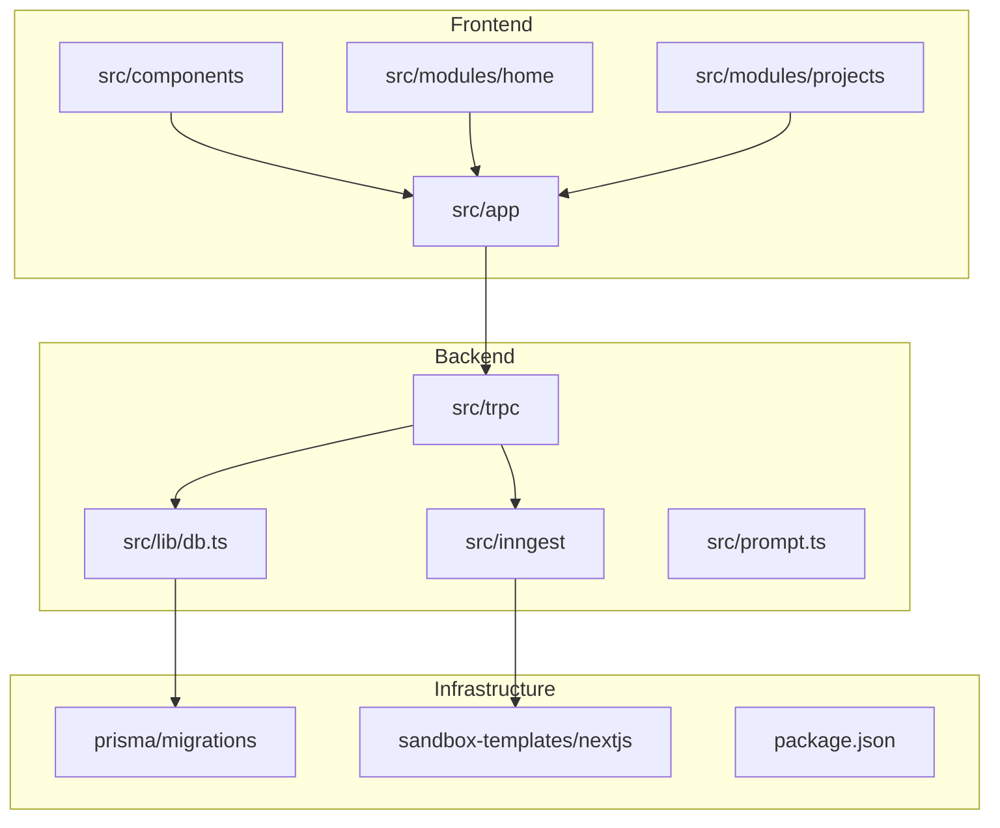
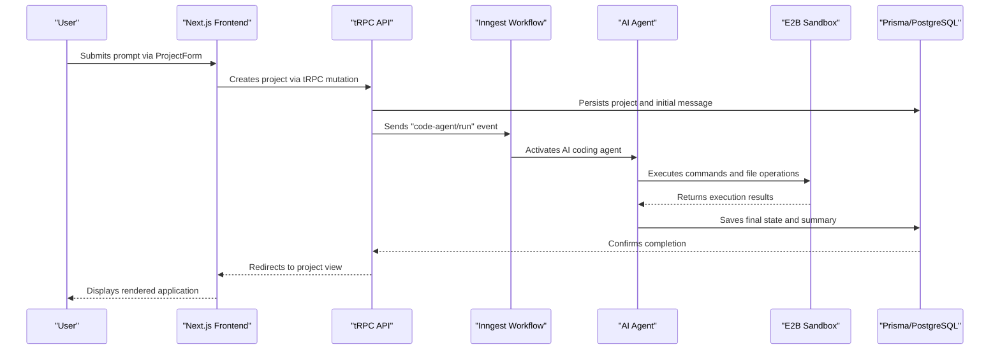
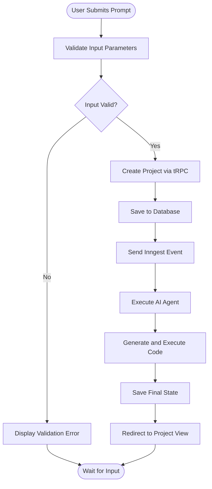
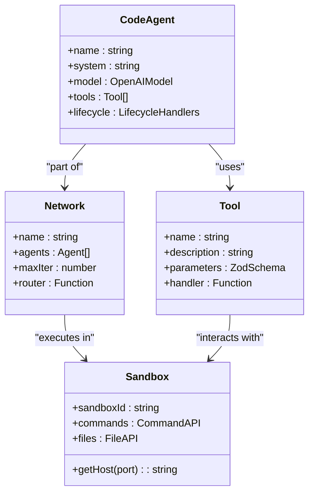
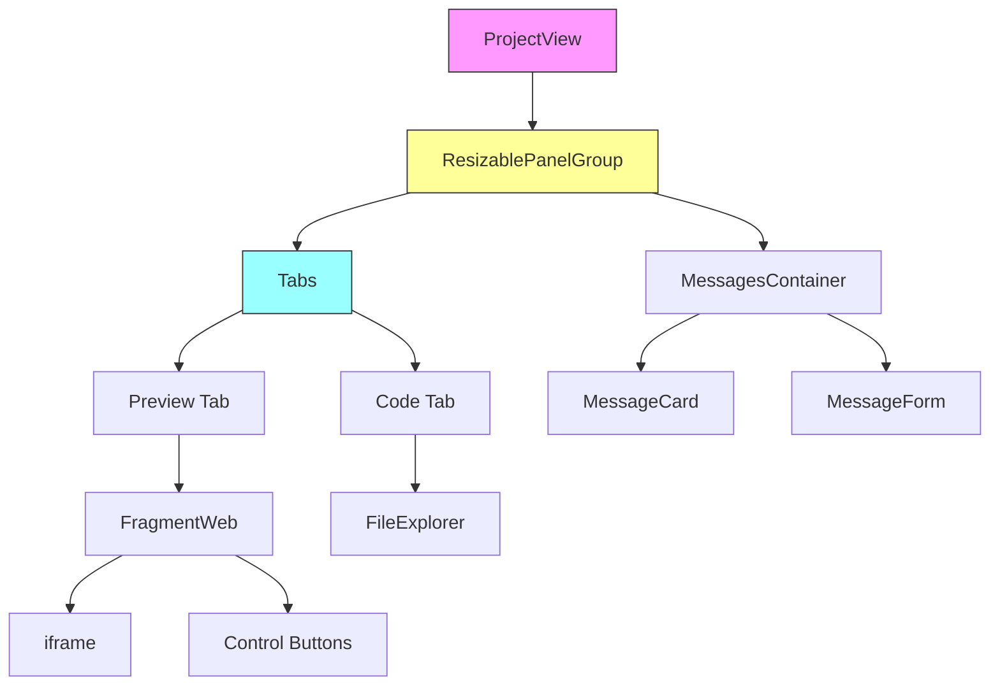
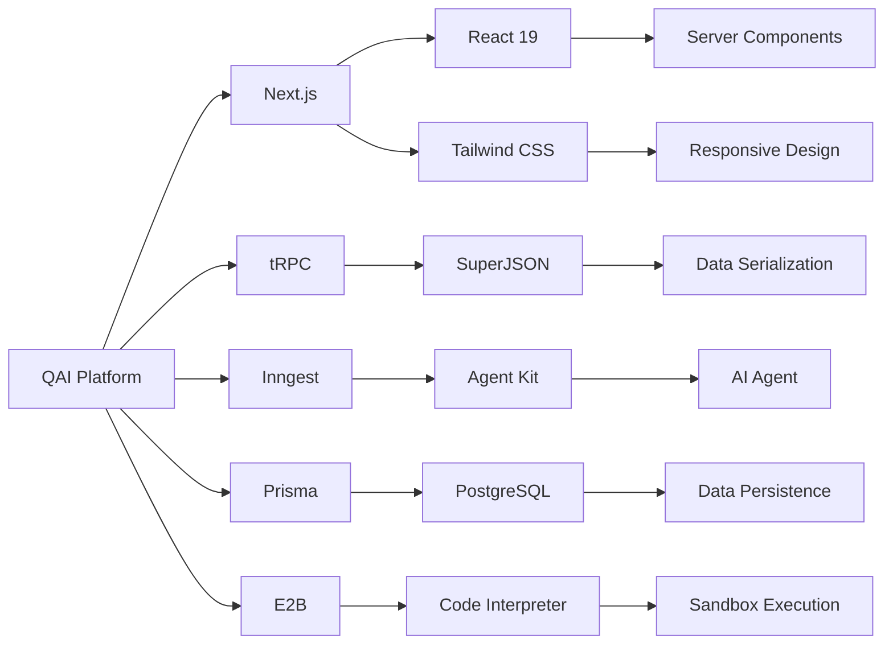

# System Overview

<cite>
**Referenced Files in This Document**   
- [page.tsx](file://src/app/(home)/page.tsx)
- [project-form.tsx](file://src/modules/home/ui/components/project-form.tsx)
- [projects-router.ts](file://src/modules/projects/server/procedures.ts)
- [messages-router.ts](file://src/modules/messages/server/procedures.ts)
- [functions.ts](file://src/inngest/functions.ts)
- [prompt.ts](file://src/prompt.ts)
- [db.ts](file://src/lib/db.ts)
- [init.ts](file://src/trpc/init.ts)
- [project-view.tsx](file://src/modules/projects/ui/views/project-view.tsx)
- [fragment-web.tsx](file://src/modules/projects/ui/components/fragment-web.tsx)
- [prisma/migrations](file://prisma/migrations)
</cite>

## Table of Contents
1. [Introduction](#introduction)
2. [Project Structure](#project-structure)
3. [Core Components](#core-components)
4. [Architecture Overview](#architecture-overview)
5. [Detailed Component Analysis](#detailed-component-analysis)
6. [Dependency Analysis](#dependency-analysis)
7. [Performance Considerations](#performance-considerations)
8. [Troubleshooting Guide](#troubleshooting-guide)
9. [Conclusion](#conclusion)

## Introduction

The QAI platform is an AI-powered application generation system that enables users to create full-stack applications through natural language prompts. By combining Next.js for frontend rendering, tRPC for type-safe API communication, Inngest for event orchestration, and Prisma for database management, QAI provides a seamless development experience. Users interact with the system via a simple interface where they describe their desired application, and the platform automatically generates, executes, and persists the resulting code in a secure sandbox environment powered by E2B. The system supports real-time AI interaction, automatic UI rendering from generated code, and persistent project storage with modular feature architecture.

## Project Structure

The QAI platform follows a modular Next.js 15 application structure with clear separation between frontend components, backend logic, and infrastructure configuration. The core application resides in the `src/` directory, organized into feature-based modules including `home`, `projects`, and `messages`. The system leverages tRPC for type-safe server-client communication, Inngest for workflow orchestration, and Prisma for database operations with PostgreSQL. Sandbox execution templates are maintained separately to ensure isolated and secure code execution environments.

**Diagram sources**
- [page.tsx](file://src/app/(home)/page.tsx#L1-L34)
- [db.ts](file://src/lib/db.ts#L1-L10)
- [functions.ts](file://src/inngest/functions.ts#L1-L212)

**Section sources**
- [page.tsx](file://src/app/(home)/page.tsx#L1-L34)
- [package.json](file://package.json#L1-L92)

## Core Components

The QAI platform's core functionality revolves around transforming natural language prompts into fully functional applications through an orchestrated workflow. The system begins with user input on the homepage, processes it through AI-driven code generation, executes the code in a secure sandbox, and persists the results for ongoing development. Key differentiators include real-time message-based AI interaction, automatic UI rendering from generated code, and a modular architecture that supports iterative development. The integration between frontend (Next.js), backend logic (tRPC), event orchestration (Inngest), and database (Prisma) creates a cohesive system for AI-powered application development.

**Section sources**
- [project-form.tsx](file://src/modules/home/ui/components/project-form.tsx#L1-L143)
- [functions.ts](file://src/inngest/functions.ts#L1-L212)
- [prompt.ts](file://src/prompt.ts#L1-L114)

## Architecture Overview

The QAI platform architecture follows a clean separation of concerns between user interface, business logic, data persistence, and execution environment. When a user submits a prompt, the request flows from the Next.js frontend through tRPC to create a project, which triggers an Inngest event that activates the AI agent. This agent operates within a predefined sandbox environment, generating and executing code while communicating results back to the database. The rendered application becomes immediately accessible through an iframe, allowing users to interact with their creation in real time.

**Diagram sources**
- [project-form.tsx](file://src/modules/home/ui/components/project-form.tsx#L1-L143)
- [procedures.ts](file://src/modules/projects/server/procedures.ts#L1-L72)
- [functions.ts](file://src/inngest/functions.ts#L1-L212)

## Detailed Component Analysis

### Project Creation Flow
The project creation process begins with the ProjectForm component on the homepage, which serves as the primary entry point for user interaction. When a user submits a prompt, the form validates the input and sends it to the tRPC backend through a mutation. This triggers project creation in the database and initiates the AI generation workflow via Inngest.

**Diagram sources**
- [project-form.tsx](file://src/modules/home/ui/components/project-form.tsx#L1-L143)
- [procedures.ts](file://src/modules/projects/server/procedures.ts#L1-L72)

**Section sources**
- [project-form.tsx](file://src/modules/home/ui/components/project-form.tsx#L1-L143)
- [procedures.ts](file://src/modules/projects/server/procedures.ts#L1-L72)

### AI Agent Execution
The AI agent operates within a constrained environment defined by the system prompt, which enforces strict rules for code generation, package management, and file operations. The agent uses specialized tools for terminal commands, file creation/updates, and file reading, all executed within the E2B sandbox. The agent's behavior is governed by a network that determines when the task is complete based on the presence of a task summary and generated files.

**Diagram sources**
- [functions.ts](file://src/inngest/functions.ts#L1-L212)
- [prompt.ts](file://src/prompt.ts#L1-L114)
- [utils.ts](file://src/inngest/utils.ts#L1-L21)

**Section sources**
- [functions.ts](file://src/inngest/functions.ts#L1-L212)
- [prompt.ts](file://src/prompt.ts#L1-L114)

### Project Visualization
Once a project is created and processed, users can view their application through the ProjectView component, which provides a split-pane interface showing both the rendered application and its underlying code. The interface includes tabs for preview and code viewing, with the ability to refresh the sandbox and copy the sandbox URL for external access.

**Diagram sources**
- [project-view.tsx](file://src/modules/projects/ui/views/project-view.tsx#L1-L91)
- [fragment-web.tsx](file://src/modules/projects/ui/components/fragment-web.tsx#L1-L75)

**Section sources**
- [project-view.tsx](file://src/modules/projects/ui/views/project-view.tsx#L1-L91)
- [fragment-web.tsx](file://src/modules/projects/ui/components/fragment-web.tsx#L1-L75)

## Dependency Analysis

The QAI platform relies on a carefully curated set of dependencies that enable its AI-powered application generation capabilities. The system uses tRPC for end-to-end typesafety between frontend and backend, Inngest for reliable event-driven workflows, Prisma for database abstraction, and E2B for secure code execution. The frontend leverages Next.js 15 with React 19, Tailwind CSS for styling, and Shadcn UI components for consistent UI elements.

**Diagram sources**
- [package.json](file://package.json#L1-L92)
- [init.ts](file://src/trpc/init.ts#L1-L23)

**Section sources**
- [package.json](file://package.json#L1-L92)
- [init.ts](file://src/trpc/init.ts#L1-L23)

## Performance Considerations

The QAI platform is designed with performance and scalability in mind. The use of React Server Components in Next.js 15 reduces client-side JavaScript payload, while tRPC's integration with React Query enables efficient data fetching and caching. The Inngest event system ensures reliable processing of AI generation tasks without blocking the main application flow. Database operations are optimized through Prisma's query engine, and the E2B sandbox provides isolated execution environments that prevent resource contention between projects.

## Troubleshooting Guide

When encountering issues with the QAI platform, users should first verify their internet connection and ensure they are using a supported browser. For failed project generation, checking the prompt clarity and specificity can help improve results. Developers troubleshooting the system should monitor the Inngest dashboard for failed function executions and verify database connectivity through Prisma Studio. Common issues include sandbox timeouts for complex generation tasks and rate limiting from the underlying AI provider.

**Section sources**
- [functions.ts](file://src/inngest/functions.ts#L1-L212)
- [procedures.ts](file://src/modules/projects/server/procedures.ts#L1-L72)
- [db.ts](file://src/lib/db.ts#L1-L10)

## Conclusion

The QAI platform represents a significant advancement in AI-powered application development, enabling users to create full-stack applications through natural language interaction. By integrating Next.js, tRPC, Inngest, Prisma, and E2B technologies, the system provides a seamless experience from prompt submission to rendered output. The architecture supports iterative development with persistent project storage, real-time feedback, and secure code execution. As AI capabilities continue to evolve, the platform is well-positioned to incorporate new features and improve the developer experience.