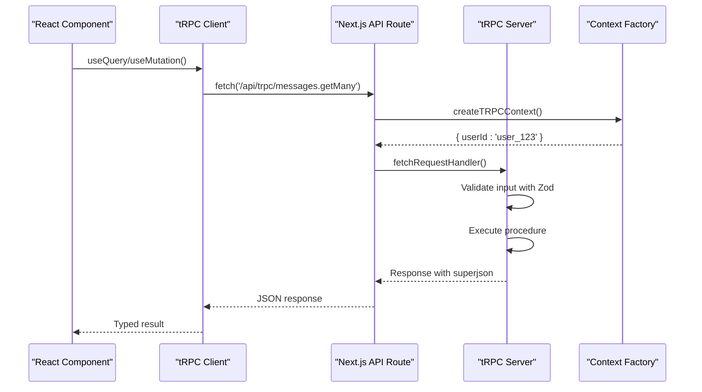
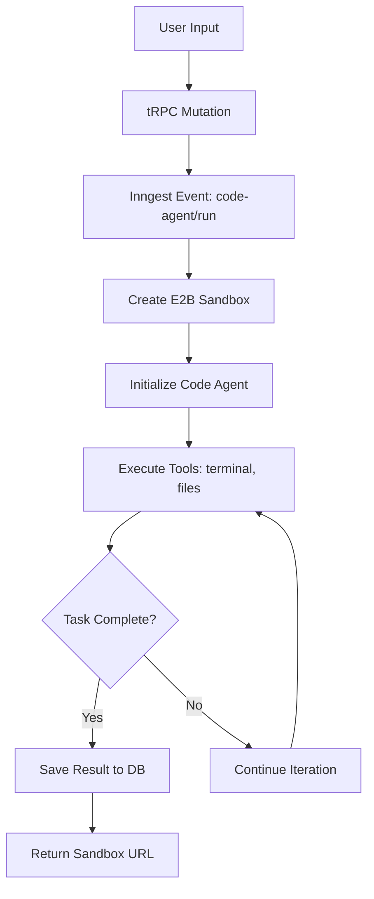
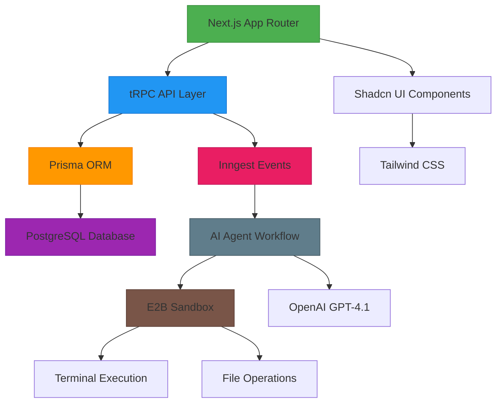

# Technology Stack

<cite>
**Referenced Files in This Document**  
- [package.json](file://package.json)
- [next.config.ts](file://next.config.ts)
- [tsconfig.json](file://tsconfig.json)
- [components.json](file://components.json)
- [src/trpc/init.ts](file://src/trpc/init.ts)
- [src/trpc/routers/_app.ts](file://src/trpc/routers/_app.ts)
- [src/app/api/trpc/[trpc]/route.ts](file://src/app/api/trpc/[trpc]/route.ts)
- [src/inngest/client.ts](file://src/inngest/client.ts)
- [src/app/api/inngest/route.ts](file://src/app/api/inngest/route.ts)
- [src/inngest/functions.ts](file://src/inngest/functions.ts)
- [src/inngest/utils.ts](file://src/inngest/utils.ts)
- [src/lib/db.ts](file://src/lib/db.ts)
- [src/modules/projects/server/procedures.ts](file://src/modules/projects/server/procedures.ts)
- [src/prompt.ts](file://src/prompt.ts)
- [sandbox-templates/nextjs/e2b.toml](file://sandbox-templates/nextjs/e2b.toml)
</cite>

## Table of Contents
1. [Introduction](#introduction)
2. [Core Frameworks](#core-frameworks)
   - [Next.js](#nextjs)
   - [tRPC](#trpc)
   - [Prisma](#prisma)
   - [Inngest](#inngest)
   - [@e2b/code-interpreter](#e2bcode-interpreter)
3. [Supporting Libraries](#supporting-libraries)
   - [OpenAI](#openai)
   - [Zod](#zod)
   - [Shadcn UI / Radix UI](#shadcn-ui--radix-ui)
   - [Tailwind CSS](#tailwind-css)
4. [Configuration and Tooling](#configuration-and-tooling)
   - [next.config.ts](#nextconfigts)
   - [tsconfig.json](#tsconfigjson)
   - [package.json Scripts](#packagejson-scripts)
5. [Integration Architecture](#integration-architecture)
6. [Conclusion](#conclusion)

## Introduction
The QAI platform leverages a modern full-stack technology stack designed for type safety, developer productivity, and secure AI-driven development. This document details the core frameworks, supporting libraries, and configuration patterns that enable seamless integration between frontend, backend, database, and AI agent orchestration. The architecture emphasizes end-to-end type safety, modular component design, and secure code execution through sandboxing.

## Core Frameworks

### Next.js
Next.js serves as the foundation of the QAI platform, providing full-stack React rendering, file-based routing, and server-side capabilities. The application uses the App Router pattern with React Server Components, enabling efficient data fetching and progressive enhancement. The `app` directory structure supports dynamic routing (e.g., `/projects/[projectId]`) and API routes under `/api`.

The platform leverages Next.js 15.5.5 with Turbopack for development, as evidenced by the `dev` and `build` scripts in `package.json`. This configuration enables fast hot reloading and optimized builds. The framework integrates seamlessly with tRPC for type-safe API endpoints and Inngest for event-driven workflows.

**Section sources**
- [package.json](file://package.json#L25-L27)
- [src/app/layout.tsx](file://src/app/layout.tsx)
- [src/app/page.tsx](file://src/app/(home)/page.tsx)

### tRPC
tRPC enables end-to-end type-safe APIs between the frontend and backend without the need for manual API documentation or client generation. The implementation follows a modular router pattern, with `appRouter` composed from individual routers like `messagesRouter` and `projectsRouter`.

The tRPC setup uses `superjson` as a data transformer, allowing serialization of complex types like dates and BigInts across the network. The context is cached using React's `cache` function for optimal performance in server components. Procedures are defined with Zod input validation, ensuring runtime type safety.

API endpoints are exposed via a single route `/api/trpc/[trpc]` using Next.js route handlers, which forward requests to the tRPC server adapter. This pattern eliminates the need for Express or other backend servers.

**Diagram sources**
- [src/trpc/init.ts](file://src/trpc/init.ts#L1-L22)
- [src/app/api/trpc/[trpc]/route.ts](file://src/app/api/trpc/[trpc]/route.ts#L1-L11)
- [src/trpc/routers/_app.ts](file://src/trpc/routers/_app.ts#L1-L9)

**Section sources**
- [src/trpc/init.ts](file://src/trpc/init.ts#L1-L22)
- [src/trpc/routers/_app.ts](file://src/trpc/routers/_app.ts#L1-L9)
- [src/app/api/trpc/[trpc]/route.ts](file://src/app/api/trpc/[trpc]/route.ts#L1-L11)

### Prisma
Prisma acts as the database ORM and migration system, providing type-safe database access and schema management. The `prisma` client is instantiated globally with a singleton pattern to prevent multiple connections in development. The schema includes models for `Project`, `Message`, and `MessageFragment`, with relationships managed through foreign keys.

Migrations are version-controlled under `prisma/migrations/`, with each migration containing SQL files for schema changes. The Prisma Client is imported from a generated directory and used throughout server procedures for CRUD operations. The `seed` script in `package.json` allows for database seeding during development.

**Section sources**
- [src/lib/db.ts](file://src/lib/db.ts#L1-L9)
- [prisma/migrations/](file://prisma/migrations/)
- [package.json](file://package.json#L10-L11)

### Inngest
Inngest orchestrates AI agent workflows through event-driven functions. The platform defines a `codeAgentFunction` that listens for `code-agent/run` events and executes a multi-step coding workflow in a sandboxed environment. The function uses Inngest steps to manage asynchronous operations like sandbox creation and result persistence.

The agent is configured with tools for terminal execution, file operations, and network state management. It integrates with OpenAI's GPT-4.1 model through the `@inngest/agent-kit`, enabling autonomous code generation and modification. The lifecycle hook `onResponse` captures task summaries for storage.

Event routing is handled through a network router that determines agent execution flow based on state conditions. Results are persisted to the database via Prisma, with sandbox URLs stored for interactive preview.

**Diagram sources**
- [src/inngest/functions.ts](file://src/inngest/functions.ts#L1-L211)
- [src/inngest/client.ts](file://src/inngest/client.ts#L1-L3)
- [src/app/api/inngest/route.ts](file://src/app/api/inngest/route.ts#L1-L11)

**Section sources**
- [src/inngest/functions.ts](file://src/inngest/functions.ts#L1-L211)
- [src/inngest/client.ts](file://src/inngest/client.ts#L1-L3)
- [src/app/api/inngest/route.ts](file://src/app/api/inngest/route.ts#L1-L11)

### @e2b/code-interpreter
The `@e2b/code-interpreter` library provides secure code sandboxing for AI-generated code execution. Sandboxes are created from a preconfigured template (`qai-nextjs-t4`) defined in `e2b.toml`, which specifies the Dockerfile and startup command. Each sandbox runs a complete Next.js development environment isolated from the host system.

The integration allows AI agents to execute terminal commands, read/write files, and run applications in a secure environment. Sandboxes are connected via their ID, with file operations streamed to and from the container. The `getSandbox` utility manages connections, while the `createOrUpdateFiles` tool writes content directly to the filesystem.

This approach enables safe execution of AI-generated code without risking the host environment, while providing realistic development feedback through live URLs.

**Section sources**
- [src/inngest/functions.ts](file://src/inngest/functions.ts#L1-L211)
- [sandbox-templates/nextjs/e2b.toml](file://sandbox-templates/nextjs/e2b.toml#L1-L17)
- [src/inngest/utils.ts](file://src/inngest/utils.ts#L1-L20)

## Supporting Libraries

### OpenAI
OpenAI's models are integrated through the `@inngest/agent-kit` library, which abstracts the API calls and response handling. The code agent uses GPT-4.1 with a temperature of 0.1 for deterministic output, optimized for code generation tasks. The system prompt (`PROMPT`) provides detailed instructions for the AI, including file system rules, tool usage, and output formatting requirements.

The agent receives context from the database (project messages) and generates code that adheres to the platform's constraints, such as using Tailwind CSS for styling and Shadcn UI components for interface elements.

**Section sources**
- [src/inngest/functions.ts](file://src/inngest/functions.ts#L1-L211)
- [src/prompt.ts](file://src/prompt.ts#L1-L113)

### Zod
Zod is used for input validation in tRPC procedures, ensuring type safety at runtime. Each procedure defines a Zod schema for its input, with validation messages for user feedback. The `projectsRouter.create` mutation validates that the input value is between 1 and 1000 characters, while the `getOne` query ensures a project ID is provided.

Zod schemas are also used in Inngest tool definitions to validate parameters for terminal commands and file operations. This end-to-end validation prevents invalid data from reaching the database or execution environment.

**Section sources**
- [src/modules/projects/server/procedures.ts](file://src/modules/projects/server/procedures.ts#L1-L71)
- [src/inngest/functions.ts](file://src/inngest/functions.ts#L1-L211)

### Shadcn UI / Radix UI
The UI components are built using Shadcn UI, which is based on Radix UI primitives for accessibility and composability. The `components.json` configuration specifies the "new-york" style and enables React Server Components. Components are aliased through `@/components/ui` and use Lucide icons.

The library provides accessible, unstyled components that are styled with Tailwind CSS classes. This separation of concerns allows for consistent theming and easy customization. Components like `Button`, `Dialog`, and `Form` are used throughout the application with variant-based styling.

**Section sources**
- [components.json](file://components.json#L1-L22)
- [src/components/ui/](file://src/components/ui/)

### Tailwind CSS
Tailwind CSS provides utility-first styling across the application, with PostCSS integration for advanced features. The configuration is managed through `postcss.config.mjs`, and global styles are defined in `src/app/globals.css`. The `tailwind-merge` and `clsx` libraries enable conditional class composition.

The design system uses the `cva` (Class Variant Authority) library for component variants, allowing consistent styling across buttons, inputs, and other interactive elements. Animations are enhanced with `tw-animate-css` for smooth transitions.

**Section sources**
- [postcss.config.mjs](file://postcss.config.mjs)
- [src/app/globals.css](file://src/app/globals.css)
- [package.json](file://package.json#L70-L71)

## Configuration and Tooling

### next.config.ts
The Next.js configuration is minimal, following the convention of zero-configuration where possible. The file exports a default `NextConfig` object without additional options, relying on Next.js 15's built-in features for routing, bundling, and optimization. This simplicity reduces configuration surface area and improves maintainability.

**Section sources**
- [next.config.ts](file://next.config.ts#L1-L7)

### tsconfig.json
The TypeScript configuration enables strict type checking with `strict: true` and module resolution for modern JavaScript features. The `paths` option creates an `@/*` alias for `src/*`, improving import readability. The `incremental` flag optimizes compilation speed, while `noEmit: true` defers to Next.js for output generation.

The configuration supports React Server Components with `jsx: "preserve"` and includes type checking for environment files and generated types.

**Section sources**
- [tsconfig.json](file://tsconfig.json#L1-L27)

### package.json Scripts
The npm scripts streamline development workflows:
- `dev`: Starts Next.js development server with Turbopack for fast compilation
- `build`: Compiles the application for production with Turbopack
- `start`: Runs the production server
- `lint`: Executes ESLint for code quality checks

The `prisma` field defines a seed script for database initialization, while dependencies are locked via `package-lock.json` for reproducible builds.

**Section sources**
- [package.json](file://package.json#L3-L9)

## Integration Architecture
The QAI platform's technologies work together to create a cohesive development experience:
- **Type Safety**: tRPC + Zod + TypeScript provide end-to-end type safety from API to UI
- **Developer Productivity**: Next.js App Router + React Server Components + Turbopack enable fast iteration
- **Secure AI Execution**: Inngest orchestrates AI workflows in E2B sandboxes, isolating code execution
- **Consistent UI**: Shadcn UI + Tailwind CSS ensure design consistency with minimal CSS
- **Data Management**: Prisma provides type-safe database access with migration versioning

The architecture follows a clean separation of concerns, with tRPC routers handling business logic, Inngest managing async workflows, and Prisma abstracting database operations. This modularity allows for independent evolution of components while maintaining system integrity.

**Diagram sources**
- [src/app/api/trpc/[trpc]/route.ts](file://src/app/api/trpc/[trpc]/route.ts)
- [src/lib/db.ts](file://src/lib/db.ts)
- [src/inngest/functions.ts](file://src/inngest/functions.ts)
- [src/components/ui/](file://src/components/ui/)

## Conclusion
The QAI platform combines modern full-stack frameworks with AI orchestration and secure sandboxing to create a powerful development environment. The integration of Next.js, tRPC, Prisma, Inngest, and E2B provides a robust foundation for AI-driven coding, with strong typing, efficient workflows, and safe execution. Supporting libraries like Zod, Shadcn UI, and Tailwind CSS enhance developer experience while maintaining code quality and consistency. This technology stack enables rapid iteration on AI features while ensuring reliability and security.